# JOCTV Agent V3.1架构

> **版本：** V3.1  
> **日期：** 2026-07-28  
> **项目定位：** 酒店 IPTV AI Gateway / 客房智能语音助手  
> **当前阶段：** 单设备、单活跃会话、完整业务链路验证  
> **当前交互模式：** 本地KWS + Ducking辅助半双工  
> **当前AEC状态：** `USE_AEC=0`，尚未具备完整、可验证的AEC参考回采链路  
> **核心原则：** ASR每次真实识别，TTS每次真实合成；Router、工具、知识和文本模板可以配置，但不缓存ASR识别结果和TTS音频结果。

> **🔴 修订：2026-07-30（P0 音频链路验收失败 — EMERGENCY RECOVERY）**
> 真机验收结果：启动欢迎词播放中途停止；KWS 唤醒寒暄未稳定本地播放；长句仍丢字断续；标点 Segment 协议未正确落地；客户端流控未证明生效。
> **状态定级（覆盖此前任何"完成"声明）：**
> - `P0_AUDIO_ACCEPTANCE = FAILED`（长句无丢字 / AudioTrack 完整播放 / 终端流控 未通过）
> - `P1_LOCAL_PROMPT_ACCEPTANCE = FAILED`（欢迎词 / Wake Prompt 完全本地播放 未通过）
> - P2–P4：保留代码，**暂停扩展与"验收完成"声明**。
> **根因（Codex 2026-07-30 独立核实）**：:8767 TTS 合成有效 RTF≈1.29（>1，慢于实时）+ 串行分段重启 + Gateway 固定 SEND_DELAY_MS 节流 → 客户端在供给曲线落后于播放曲线时过早启播 → 预缓冲耗尽 → AudioTrack underrun → 丢字。**非分段粒度问题**（实测逗号切分 7 段反而更差）。20 处代码偏离架构（见 Codex 报告）。
> **P0 止损（Codex #1，立即）**：RTF≥1 的长句改"整条预合成完成、核对 PCM 完整后再启播"（牺牲首声换不丢字），待 Worker 有效 P95 RTF<0.9 再恢复真流水线。
>
> **音频链路硬约束（本节优先级最高，覆盖冲突处）：**
> 1. 启动欢迎词必须是 APK 本地固定资源（local PCM/WAV），不依赖 Gateway/WebSocket/GPU TTS/网络/Server Session/运行时 TTS 流。
> 2. 唤醒寒暄必须是 APK 本地固定资源；KWS_ACCEPTED→本地播对应语言 Wake Prompt（同时建 Gateway 会话）→播完→LISTENING。
> 3. 一个 reply_text = 一个 tts_id = 一个 Main AudioTrack = 多个标点 Segment = 每 Segment 多个 20ms PCM Frame。
> 4. Segment 之间禁止 stop/flush/release Main AudioTrack；Segment N 播放时必须预取 Segment N+1。
> 5. 客户端通过队列水位(queue_ms/credit_ms)和 Credit 控制服务端发送；禁止用固定 sleep 冒充流控。
> 6. tts_end 只代表 Server 发送完成；playback_complete 只能在 AudioTrack 真实播放完后发送（且需核对 received/written_bytes、underrun、seq_gap，任一异常不得发正常 complete）。
> 7. written_bytes 必须是 AudioTrack.write 真实返回累计，不得用输入 buffer 长度伪造。
> **标点切分规则**：中文 ，。！？；： / 英文 , . ! ? ; : 各结束一个 Segment（标点归该段）；排除小数点 / URL / 英文缩写 / 日期 / 版本号 / IP / 数字内部符号；**禁止按字符数/Token/固定长度硬切**；normalize(join(segments))==normalize(reply_text)。
> **本轮纪律**：只动候选（server :8774 + 候选 APK），不覆盖正式 APK/不切正式 Gateway/TTS、不宣布丢字或 P0/P1 解决；听感项标 USER_TEST_REQUIRED；最终态只能写 CANDIDATE_READY_FOR_USER_TEST。

> 修订：2026-07-29  
> 修订内容：唤醒确认语、TTS长句内容完整性、设施多轮知识问答与知识缺失降级。

> 修订：2026-07-29（二）  
> 修订内容：TTS播放完整性（自适应缓冲+partial write+chunk序号+四点字节核对）、长句语义分句与流水线合成、唤醒确认语缩短加速。

> 修订：2026-07-29（三）  
> 修订内容：新增语义句段TTS流水线、Audio Segment Protocol V2、Android句段队列、播放背压、重传和中断机制。

> 修订：2026-07-29（四）
> 修正：根据成熟实时语音框架，Segment 为逻辑管理单元，20ms Frame 为传输与中断边界；一回复一 tts_id 一 AudioTrack；SHORT/NORMAL/SAFE 自适应启播；取消固定句间静音和当前阶段应用层重传；打断在 Frame 边界立即停止。

> 修订：2026-07-29（五）P0-P3 统一工程修订（NIGHTLY-ARCHITECTURE-IMPLEMENTATION-AND-REVIEW）
> 修订范围（10 项）：
> 1. 标点主导的语义句段（强/弱/不切边界）+ SpeechTextFormatter + SemanticSegmenter + SemanticSegmentValidator + join==原文；
> 2. Audio Segment 协议（一 reply_text 一 tts_id 一 AudioTrack 多 Segment × 20ms Frame，不重传，错误→ERROR）；
> 3. 自适应播放 SHORT/NORMAL/SAFE + 可调配置项 + 默认最多 1 PLAYING / 1 READY / 1 RECEIVING；
> 4. 中英文 KWS 本地提示（LocalPromptManager / LocalPromptPlayer + Local Prompt Assets，非 Cache）；
> 5. Session 创建时机（KWS_ACCEPTED→创建 Session→Wake Ack→LISTENING + provisional_session + 不写 LLM 历史）；
> 6. Processing Ack（Local Prompt Bank zh/en general/query/service/action + LatencyPredictor + PlaybackArbiter + 触发/跳过条件）；
> 7. 端到端性能真实事件打点（KWS→SESSION→WAKE_ACK→LISTENING→VAD→ASR→ROUTE→PROCESSING_ACK→TOOL→LLM→REPLY→TTS_FIRST_PCM→CLIENT→PLAYBACK→FOLLOWUP）+ P50/P90/P95/P99 + 目标值；
> 8. P2 规划（Semantic Router + Function Calling + Capability Registry V2 + Hotel Knowledge V2 + 多语言运行时）；
> 9. P3 规划（全链路 Trace + 自动评测框架 + 多房间并发与资源模型 + 酒店房间隔离 + 安全权限隐私 + 部署回滚 Feature Flag + 稳定性故障注入）；
> 10. 同步检查：本次新增与（四）版本 §20.7 / §21.5–§21.8 已对齐，不冲突（Segment 逻辑边界、20ms Frame 传输边界、一 tts_id 一 AudioTrack、不重传、SHORT/NORMAL/SAFE 自适应启播、Frame 边界打断均保持一致）。

---

## 目录

1. 项目目标  
2. V3.1核心设计原则  
3. 总体系统架构  
4. 完整语音交互流程  
5. 当前无AEC的能力边界  
6. KWS本地唤醒  
7. 历史唤醒词录音和训练数据  
8. Ring Buffer、VAD与麦克风健康  
9. ASR实时识别  
10. 多轮会话与上下文管理  
11. Router与能力注册表  
12. RCU客房控制  
13. IPTV UI和电视控制  
14. 酒店服务请求  
15. 酒店知识与自定义信息  
16. 周边服务与周边旅游  
17. 外部实时查询  
18. 通用LLM与娱乐能力  
19. AI安全防火墙  
20. TTS实时合成  
21. 播放协议与零静默闭环  
22. 酒店AI运营中心  
23. 设备与连接管理  
24. 实时会话管理  
25. 对话记录与数据结构  
26. 使用分析与酒店报表  
27. 未解决问题中心  
28. 能力增长闭环  
29. 酒店AI知识包  
30. 权限、隐私与审计  
31. 当前实施优先级  
32. V3.1验收标准  
33. 标点主导的语义句段规则（2026-07-29 五 新增）  
34. 中英文 KWS 本地提示（2026-07-29 五 新增）  
35. Session 创建时机与 Processing Ack（2026-07-29 五 新增）  
36. 端到端性能与真实事件打点（2026-07-29 五 新增）  
37. P2 / P3 章节规划（2026-07-29 五 新增）  
38. 最终结论（原 §33，2026-07-29 五 调整至文末）
39. 凌晨任务架构修订：延迟分类、音频完整性、后台发布与版本、Session分类、用户安全、知识两级版本、Definition of Done（2026-07-30 四 新增）

---

## 1. 项目目标

JOCTV Agent V3.1不是固定命令播放器，也不是依赖预生成语音的演示系统。

目标是建立一套完整、可泛化、可运营的酒店客房AI能力：

```text
用户自然语言
→ 实时语音识别
→ 理解意图和上下文
→ 路由到正确系统
→ 获取真实执行结果或知识答案
→ 形成最终回复文本
→ 实时语音合成
→ 客户端播放
→ 记录结果
→ 分析未解决问题
→ 持续增加能力
```

系统需要支持：

- 客房本地唤醒；
- 自然语言识别；
- 多轮上下文；
- RCU客房控制；
- IPTV UI和电视控制；
- 酒店服务请求；
- 酒店设施与政策查询；
- 周边服务和旅游；
- 天气等实时查询；
- 通用LLM问答；
- 儿童故事和互动娱乐；
- 安全防火墙；
- 设备管理；
- 会话管理；
- 使用统计；
- 未解决问题分析；
- 酒店知识发布和版本回滚。

当前阶段优先证明：

1. 完整业务链路可用；
2. 用户表达不依赖固定句式；
3. ASR和TTS不依赖业务结果Cache；
4. 工具执行结果真实可信；
5. 不出现静默、卡死和旧会话污染；
6. 系统能够通过真实使用数据持续增长能力。

### 1.1 当前实现基线

> 以下为 2026-07-28 的实现现状，用于区分“当前已部署能力”和“V3.1 目标架构”，不代表所有目标项均已闭环。

| 模块 | 当前状态 |
| --- | --- |
| KWS 误唤醒修复 | 已验证 |
| WakewordMatcher | 已部署 |
| KWS Score 双门控 | 已部署 |
| 电话人声误唤醒 | 已修复 |
| VAD `speech_started` 门控 | 已部署 |
| ASR 前有效帧门控 | 已部署 |
| `session_epoch` | 已部署 |
| `utterance_id` | 已部署 |
| Stale ASR/TTS 检查 | 已部署 |
| Playback 协议 | 已部署，仍需完成正式 ACK 切换 |
| CV1 INT8 消融 | 已定位 LLM INT8 导致的部分发音异常 |
| A6R_PC | 已部署，但真机仍出现两个音色 |
| 当前 TTS Cache | 仍存在，`cache_size=87` |
| 麦克风恢复 | 仍需完善 |
| Router 完整能力 | 仍需扩展 |
| 未解决问题运营闭环 | 尚未建设 |

### 1.2 当前 TTS 遗留问题

A6R_PC 主要解决 LLM 动态 INT8 导致的部分 Speech Token 异常，以及“灯”等特定字的发音问题；但真机仍出现两个音色，且日志仍显示 `cache_size=87`，因此不能判定音色一致性问题已经解决。

可能原因包括：

1. 一条回复命中旧 Cache，另一条由 A6R_PC 实时生成；
2. 不同 Cache 音频来自不同历史模型配置；
3. 部分请求仍进入旧 Worker；
4. Speaker 配置或 Fallback 路径不一致。

V3.1 目标路线不再依赖 A6R_PC 和旧音频 Cache，所有最终回复文本均进入统一的实时 TTS 主链。

---

## 2. V3.1核心设计原则

### 2.1 ASR不缓存识别结果

禁止建立：

```text
某句话或某段音频
→ 历史识别文本
```

每次客人说话，都必须由ASR根据本次PCM实时识别。

原因：

- 客人表达无法预先穷举；
- 可能包含生僻词；
- 可能包含酒店、餐厅、景点和频道名称；
- 可能包含人名、房型和临时活动；
- 不能只支持提前录入的固定命令；
- 不能因为某个表达没进Cache就识别不了。

---

### 2.2 TTS不缓存文本到PCM音频

禁止建立：

```text
回复文本
→ 查询历史PCM
→ 命中直接播放
→ 未命中才实时合成
```

所有最终回复文本，每次都必须进入TTS实时合成。

原因：

- 无法预知全部回复内容；
- Cache hit和Cache miss可能进入不同模型；
- 旧Cache可能来自INT8、FP32或不同speaker；
- 会出现同一助手的两个音色；
- 模型升级后可能错误复用旧音频；
- Cache miss路径可能没有得到充分验证；
- 不能因为一段文字未被缓存就没有声音。

#### 2.2.1 瞬时 PCM Buffer 不属于音频 Cache（2026-07-29 三 追加）

为支持 §20.7 语义句段流水线和 §21 Audio Segment Protocol V2 的连续播放，TTS 链路允许在内存中保留一个**瞬时 PCM Buffer**，仅用于把刚刚合成出来、尚未写完 AudioTrack 的 PCM 暂存一下，等下游消费。它和被禁止的"文本→PCM Cache"完全不是一回事。

边界写死，避免变成事实上的音频 Cache：

| 维度 | 规则 |
|---|---|
| 生命周期 | 仅在当前 `tts_id` 活跃期间存在；`tts_id` 进入终态（`playback_complete` / `playback_interrupted` / `tts_error` / `timeout`）后立即整体释放 |
| 作用域 | 仅承载**本次合成**的 PCM；禁止跨 `tts_id` 复用、禁止跨 `session_epoch` 复用、禁止跨设备复用 |
| 落盘 | 永不落盘；不写文件、不写 SQLite、不写 SharedPreferences、不写 SD 卡 |
| 命中查询 | 不存在"文本命中 PCM"的查询路径；不存在 hash→PCM 的反查表；不存在 LRU 淘汰逻辑 |
| 容量 | 受单个 `tts_id` 回复长度上限约束；不允许为"未来可能的回复"预分配大块 PCM |
| TTL | 即使终态未及时回收，也必须有 TTL 兜底回收（建议 ≤ 60s），防止异常路径泄漏 |
| 可观测 | 必须可观测当前未释放的瞬时 Buffer 数量、所属 `tts_id`、字节数；回收后必须打 `PCM_BUFFER_RELEASED` 日志 |

判定标准：**只要存在"输入文本→查表→返回历史 PCM"的路径，就算 Cache**。瞬时 Buffer 不允许有这条路径，它只是字节管道，不是 KV 存储。

**（2026-07-29 四 修正补充）** 跨 Segment 复用同一 `tts_id` 上下文不构成 Cache：

- §20.7 语义句段流水线中，同一 `reply_text` 切出的多个 Segment **共用一个 `tts_id`、一次模型实例、一个 speaker 上下文**，这是"一次回复内部的流式合成连续性"，不是"文本命中历史 PCM"。
- Segment 只是逻辑切分单元；跨 Segment 不存在"段 N 命中段 N-1 的 PCM"的反查路径。
- 一旦 `tts_id` 进入终态，整条回复的全部瞬时 Buffer（含所有 Segment）立即释放，不保留任何可供下次回复复用的字节。

---

### 2.3 允许保留的缓存和配置

禁止的是**业务结果Cache**，不是所有运行时优化。

| 内容 | 是否允许 | 说明 |
|---|---:|---|
| ASR识别结果Cache | 否 | 每次必须实时识别 |
| TTS文本到PCM Cache | 否 | 每次必须实时合成 |
| ASR模型权重常驻 | 是 | 避免重复加载 |
| TTS模型权重常驻 | 是 | 避免重复加载 |
| NPU编译Cache | 是 | 属于模型运行优化 |
| ROCm Kernel Cache和预热 | 是 | 降低首次延迟 |
| Tokenizer资源 | 是 | 模型运行依赖 |
| ASR热词 | 是 | 提升酒店专有词识别 |
| ASR上下文偏置 | 是 | 提升当前酒店词汇概率 |
| Router规则 | 是 | 业务路由配置 |
| 工具Schema | 是 | 定义系统能力 |
| 酒店知识 | 是 | 酒店实际信息 |
| RAG索引 | 是 | 知识检索能力 |
| 固定回复文本模板 | 是 | 固定文本，不固定音频 |
| 会话内上下文 | 是 | 仅在当前会话短期有效 |

---

### 2.4 固定的是业务规则和文本，不是音频

例如RCU开灯成功后，可以固定回复文本：

```text
好的，已经为您打开灯光。
```

但每次仍然执行：

```text
回复文本
→ TTS实时合成
→ 新PCM
→ 播放
```

不能固定为：

```text
light_on_success.wav
```

酒店早餐、健身房、游泳池等内容也可以固定为结构化数据或文本，但最终音频必须实时生成。

---

### 2.5 LLM负责理解和表达，工具负责事实和执行

```text
LLM：
理解自然语言
理解上下文
提取参数
选择工具
组织回复

工具：
控制设备
创建工单
查询酒店数据
查询实时天气
查询航班、高铁、股票等实时信息
```

LLM不能：

- 凭记忆猜天气；
- 猜股票价格；
- 猜航班状态；
- 猜酒店营业时间；
- 未经白名单直接执行设备命令；
- 在工具未返回成功前声称“已经完成”。

---

## 3. 总体系统架构

### 3.1 系统分层与外部关系

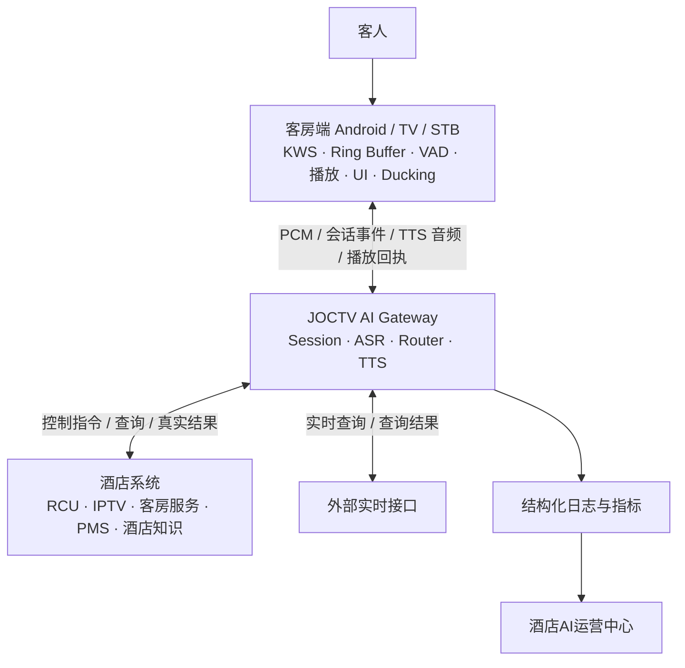

### 3.2 AI Gateway 语音主链与结果闭环

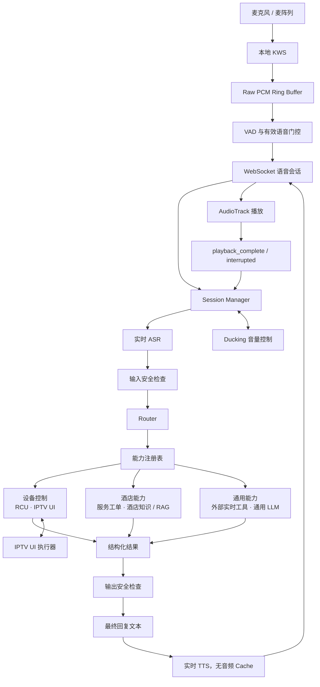

---

## 4. 完整语音交互流程

### 4.1 标准流程

图中的“业务工具”包括 RCU、IPTV、酒店服务、酒店知识和外部实时工具。

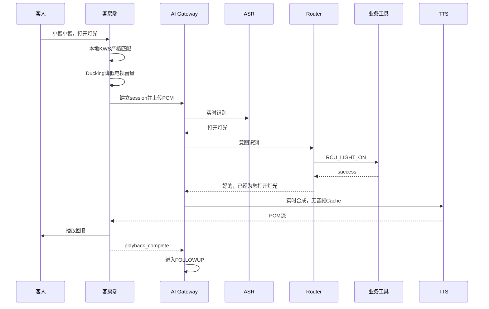

**（2026-07-29 五 追加）完整事件编排（含 Wake Ack / Processing Ack）：**

上述 mermaid 只画了"Wake+Command 一句话"的最简路径。完整编排必须包含本地提示环节，对齐 §35（Session 创建时机与 Processing Ack）和 §36（端到端真实事件打点）：

```text
IDLE
→ KWS_ACCEPTED
→ 创建 session_id / session_epoch（§35.1，必须在 Wake Ack 播放前）
→ 播放本地 Wake Ack（§34 Local Prompt Assets，非业务 Cache）
→ LISTENING（声学尾音等待后开放收音）
→ VAD_END → ASR_FINAL → ROUTE_DECISION
→ [可选] 播放 Processing Ack（§35.4–§35.8，由 LatencyPredictor 决定是否触发）
→ TOOL / LLM / KNOWLEDGE
→ REPLY_TEXT → TTS → PLAYBACK（由 PlaybackArbiter 调度，禁止与 Local Prompt 重叠）
→ playback_complete
→ FOLLOWUP（只能由 Main TTS 的 playback_complete 触发，Local Prompt 完成不触发）
```

- Wake-only（只说"小智小智"）→ 播 Wake Ack → LISTENING。
- Wake+Command（"小智小智，打开灯光"）→ 跳过 Wake Ack → 完整 PCM 送 ASR（对齐 §6.7）。
- Processing Ack 只在预计正式首声 > `PROCESSING_ACK_TRIGGER_MS`（默认 700ms）时触发，每轮最多 1 次。

---

### 4.2 会话状态

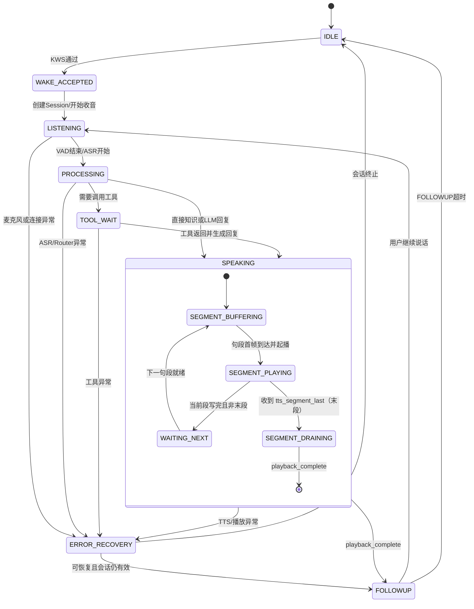

**句段子状态说明（2026-07-29 四 修正）：**

`SPEAKING` 仍是顶层状态，**不把每个 Segment 提升为顶层状态**。Segment 只是 `SPEAKING` 内部的逻辑管理单元，用于驱动"句 0 播放期间生成句 1"的流水线。该细化只在 `SPEAKING` 期间生效，不改变 `SPEAKING` 在主状态机里的终态契约（仍只能由 `playback_complete` / `playback_interrupted` / `tts_error` / `timeout` 退出）。

| 子状态 | 含义 | 进入条件 | 退出条件 |
|---|---|---|---|
| `SEGMENT_BUFFERING` | 正在接收并缓冲当前句段 PCM（20ms Frame 逐帧入队），AudioTrack 尚未/已暂停写入当前段 | `tts_segment_start` 到达，或上一段进入 `WAITING_NEXT` 后下一段就绪 | 当前段累积达到 SHORT/NORMAL/SAFE 自适应启播阈值且 AudioTrack 可写 → `SEGMENT_PLAYING` |
| `SEGMENT_PLAYING` | 当前句段正在 AudioTrack 连续播放（20ms Frame 边界逐帧写入），并行接收后续段 Frame | 当前段首帧开始写 AudioTrack | 当前段全部 Frame 写完：非末段 → `WAITING_NEXT`；末段（收到 `tts_segment_last`）→ `SEGMENT_DRAINING` |
| `WAITING_NEXT` | 当前段已写完 AudioTrack，等待下一段 Frame 到达（流水线衔接窗口） | 当前段最后一帧写完且还有后续段 | 下一段 `tts_segment_start` 或首 Frame 到达 → `SEGMENT_BUFFERING` |
| `SEGMENT_DRAINING` | 最后一句段在 AudioTrack 中 drain，等待 `onComplete` | 最后一段的 `tts_segment_last` 已发且全部 Frame 已写 | AudioTrack 自然播完 → `playback_complete` |

---

### 4.3 ID和代际控制

每一层必须携带：

```text
hotel_id
room_id
device_sn
session_id
session_epoch
utterance_id
asr_task_id
tool_call_id
tts_id
```

作用：

- 防止旧ASR结果污染新会话；
- 防止旧工具结果触发新TTS；
- 防止旧TTS在新会话播放；
- 防止客户端接收过期PCM；
- 支持后台完整追踪每一轮交互。

---

## 5. 当前无AEC的能力边界

### 5.1 AEC解决什么问题

AEC用于从麦克风采集信号中消除本机扬声器播放的声音。

当前麦克风可能同时采集：

```text
客人语音
+ 电视节目声
+ IPTV声音
+ TTS回复声
+ 系统提示音
+ 房间环境噪声
```

AEC需要：

```text
麦克风输入 MIC
+
实际播放参考信号 REF
+
时间同步和延迟校准
→ 消除本机播放回声
```

当前尚未具备完整、稳定、可验证的REF回采链路，因此：

```text
USE_AEC=0
```

---

### 5.2 当前不能可靠实现的功能

#### 5.2.1 真正全双工

当前不能稳定支持：

```text
AI一边说话
+
用户同时说话
+
系统准确区分并识别用户
```

AI的TTS会重新进入麦克风，可能被当成用户语音。

---

#### 5.2.2 完整Barge-in

暂时不能稳定支持：

```text
AI：早餐在二楼……
用户：停一下，帮我开灯
```

因为系统可能无法区分：

- 用户的“停一下”；
- TTS自身语音；
- 电视节目对白。

当前保留：

```text
playback_interrupted
tts_id
session_epoch
```

等协议，但不把完整Barge-in作为当前验收功能。

---

#### 5.2.3 TTS播放期间持续ASR

当前不应在SPEAKING状态持续开放正常ASR。

否则可能出现：

- ASR识别自己的TTS；
- 形成自问自答；
- Router误执行；
- 重复回复；
- 状态机循环。

---

#### 5.2.4 TTS播放期间重新唤醒

AI说话期间用户再次说“小智小智”，当前不能保证：

- 唤醒词未被TTS覆盖；
- KWS不是被TTS自身触发；
- 后续命令没有丢失；
- 音频可以正确分离。

因此当前：

```text
SPEAKING状态暂停普通KWS
```

---

#### 5.2.5 电视大音量下的绝对稳定监听

没有AEC时，电视声音会影响：

- KWS召回；
- KWS误唤醒；
- VAD；
- ASR；
- 多轮上下文。

当前可以通过Ducking、严格Matcher和Score门控改善，但不能承诺在所有电视节目和音量下均完全可靠。

---

#### 5.2.6 用户与TTS尾音重叠

例如：

```text
AI：健身房在五楼。
用户在“五楼”还没播放完时：几点关门？
```

可能导致ASR输入：

```text
五楼尾音 + 几点关门
```

因此FOLLOWUP必须在：

```text
playback_complete
→ 声学尾音等待
→ 开放VAD
```

之后开始。

---

### 5.3 当前正式交互模式

V3.1 当前正式定义为：

> **正式交互模式：Ducking 辅助的半双工语音交互**

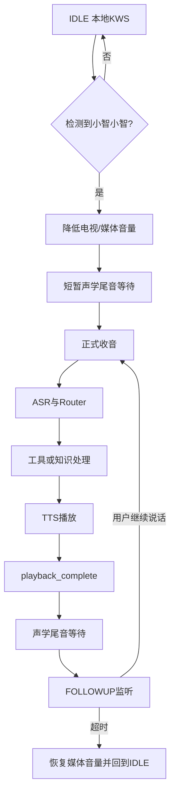

---

### 5.4 无AEC仍可实现的功能

当前仍可以完成：

- IDLE状态本地KWS；
- 唤醒后Ducking；
- 唤醒后单轮控制；
- playback_complete后的多轮FOLLOWUP；
- RCU控制；
- IPTV UI控制；
- 酒店服务；
- 酒店知识；
- 周边查询；
- 外部接口查询；
- LLM问答；
- TTS完整播放；
- 状态恢复；
- 使用记录和统计。

无AEC不影响完整单路业务链路，但限制播放过程中的自然插话能力。

---

### 5.5 未来AEC正式启用条件

只有满足以下条件，才能将AEC标记为正式可用：

1. 能获取最终实际播放PCM作为REF；
2. REF包含TTS、IPTV、VOD和系统提示音；
3. REF与MIC保持时间同步；
4. 支持固定延迟和动态漂移校准；
5. 真机测试可稳定消除本机播放声；
6. TTS播放时ASR不再识别自身声音；
7. 大音量电视条件下完成测试；
8. Barge-in真实测试通过；
9. 不明显损伤用户语音；
10. 不降低KWS召回率；
11. 不引入持续爆音、断音或音频卡顿。

优先级：

```text
硬件或Audio HAL AEC
> 系统级播放回采AEC
> 应用层已知PCM AEC
> 无AEC时Ducking和半双工
```

---

## 6. KWS本地唤醒

### 6.1 KWS定位

KWS只负责判断用户是否说出：

```text
小智小智
```

KWS不负责：

- 完整语音识别；
- 命令理解；
- Intent判断；
- RCU执行；
- IPTV控制；
- 酒店知识问答；
- 替代ASR。

正确流程：

```text
KWS
→ ASR
→ Router
→ 参数和权限校验
→ 工具或知识
```

禁止：

```text
KWS检测到“打开灯”
→ 直接执行RCU
```

---

### 6.2 隐私原则

未唤醒时：

- KWS仅在端侧本地运行；
- 不持续上传客房环境音频；
- 不创建ASR请求；
- 不保存长期环境录音；
- 只维护有限长度的本地Ring Buffer。

唤醒后才允许：

- 创建`session_id`；
- 增加`session_epoch`；
- 上传当前交互PCM；
- 启动ASR；
- 进入业务流程。

---

### 6.3 当前KWS方案

采用：

```text
WakewordMatcher
+ CTC Score门控
+ 状态门控
+ 麦克风有效性门控
```

必须同时满足：

1. KWS模型输出有效候选；
2. WakewordMatcher严格匹配；
3. CTC Score达到阈值；
4. 当前状态允许唤醒；
5. 麦克风PCM有效；
6. 不是重复唤醒；
7. 不处于禁止唤醒的播放状态。

禁止使用：

```text
contains("小智")
只匹配一个“小智”
字符串子串匹配
宽松近音匹配
无Score校验直接唤醒
```

---

### 6.4 当前验证基线

| 测试项目 | 当前结果 |
|---|---:|
| KWS相关测试 | 36/36通过 |
| 真实“小智小智”唤醒 | 20/20成功 |
| 旧Incident中的假唤醒 | 11次降为0 |
| 电话人声场景假唤醒 | 0 |
| 宽松Substring误触发 | 已关闭 |

这些结果作为V3.1当前KWS基线。

---

### 6.5 KWS状态门控

| 当前状态 | KWS行为 |
|---|---|
| IDLE | 正常运行 |
| WAKE_ACCEPTED | 禁止重复唤醒 |
| LISTENING | 暂停KWS，已经正式收音 |
| PROCESSING | 暂停 |
| TOOL_WAIT | 暂停 |
| SPEAKING | 当前阶段暂停 |
| FOLLOWUP | 不需要再次唤醒，直接收音 |
| ERROR_RECOVERY | 根据恢复结果决定 |
| DISCONNECTED | 可本地检测，但不能创建服务端会话 |

---

### 6.6 唤醒后流程

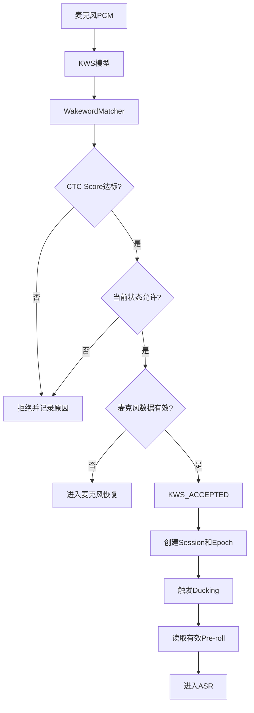

---

### 6.7 唤醒确认语

- KWS 只产生唤醒事件，不播放固定语音；禁止 KWS 内置旧模型"我在，请讲。"WAV。
- 默认唤醒确认文本 = "我在，有什么可以帮您？"（可按酒店品牌配置）。
- 语气要求：积极/专业/耐心/服务意识/不敷衍/音色与正式 TTS 一致。
- 唤醒确认语生成原则：KWS_ACCEPTED → 判断是否含完整命令 → 生成 `wake_ack` 文本 → 当前正式 TTS 实时合成 → 播放完成 → 开放 LISTENING；禁止 KWS APK 内置旧 WAV / 旧 TTS 音频 / 不同 speaker / Cache 读唤醒语。
- Wake-only vs Wake+Command 分流：
  - Wake-only → Ducking → TTS 实时合成确认语 → `playback_complete` → LISTENING；
  - Wake+Command → 跳过 `wake_ack` → 完整 PCM 送 ASR → 执行命令（不能在已说完整命令后还播确认语）。
- 配置项：
  - `WAKE_ACK_ENABLED=1`
  - `WAKE_ACK_TEXT=我在，有什么可以帮您？`
  - `WAKE_ACK_TTS_DYNAMIC=1`
  - `WAKE_ACK_SKIP_WHEN_COMMAND_PRESENT=1`
- 确认语必须使用：当前正式 TTS 模型 / speaker / 文本前端 / 采样率 / 流式发送 / Playback ACK 协议。
- 唤醒确认语加速（2026-07-29 二 追加）：
  - 默认文案改为"您好，需要什么帮助？"（比"我在，有什么可以帮您？"更短、更积极，不漫不经心）；原默认文案保留为兜底，可在配置中切换。
  - 新增独立配置项 `WAKE_ACK_SPEED=1.12`（默认）：**只对 Wake ACK 短句生效**，不应用于正式长句 TTS，避免长句加速导致发音异常。
  - A/B 候选档位：`WAKE_ACK_SPEED=1.08 / 1.12 / 1.15`，按酒店实际体验选用；切换档位必须同步回归唤醒后 LISTENING 是否被提前打断。
  - Wake ACK 短句合成采用 `stream=False`（非流式整包合成），保证 `speed` 参数真正生效；同时仍走：当前正式 TTS 模型 / 固定 speaker / GPU FP32 主路径 / comboAB 文本前端 / 无音频 Cache / Playback ACK 协议。
  - Wake-only 仍播确认语、Wake+Command 仍跳过确认语（含完整命令时不重复播确认语），保持 §6.7 既有分流不变。

---

### 6.8 KWS事件日志

```json
{
  "type": "wake_event",
  "hotel_id": "hotel_001",
  "room_id": "1208",
  "device_sn": "STB-001208",
  "timestamp": "2026-07-28T10:30:00+08:00",
  "state": "IDLE",
  "candidate_text": "小智小智",
  "matcher": "strict",
  "ctc_score": 2.13,
  "threshold": 2.0,
  "accepted": true,
  "reject_reason": null,
  "audio_rms": 1260,
  "ring_ms": 3000
}
```

统一拒绝原因：

```text
LOW_SCORE
MATCHER_FAILED
STATE_NOT_ALLOWED
DUPLICATE_WAKE
MIC_INVALID
MIC_ZERO_STREAM
PLAYBACK_BLOCKED
RING_INVALID
AUDIO_LEVEL_TOO_LOW
INTERNAL_ERROR
```

---

## 7. 历史唤醒词录音和训练数据

### 7.1 之前训练的“小智小智”声波仍然有用

以前录制或用于训练的“小智小智”音频仍然有价值，但用途不是作为运行时语音Cache。

这些音频可以用于：

- KWS模型训练；
- KWS微调；
- 阈值调整；
- 回归测试；
- 远场测试；
- 不同说话人测试；
- 电视背景声测试；
- 漏唤醒分析；
- 误唤醒分析。

---

### 7.2 不应使用单条波形直接匹配

不建议：

```text
当前PCM
→ 与一条固定“小智小智”波形逐点比较
→ 相似就唤醒
```

原因：

同一个人每次说“小智小智”，原始波形都会变化：

- 语速；
- 音高；
- 音量；
- 距离；
- 方向；
- 房间混响；
- 麦克风型号；
- 电视背景声；
- 网络和录音增益。

运行时应使用：

```text
PCM
→ 声学特征
→ KWS模型
→ Token或关键词概率
→ 严格Matcher
→ Score门控
```

---

### 7.3 KWS数据集建议结构

```text
kws_dataset/
├── positive/
│   ├── clean/
│   ├── near_field/
│   ├── far_field/
│   ├── low_volume/
│   ├── tv_background/
│   ├── male/
│   ├── female/
│   └── different_rooms/
│
├── hard_negative/
│   ├── 小志小志/
│   ├── 小鸡小鸡/
│   ├── 小知识/
│   ├── 晓之以理/
│   ├── 电视相似对白/
│   └── 电话相似对白/
│
└── incidents/
    ├── false_wake/
    ├── missed_wake/
    ├── mic_dead_stream/
    └── playback_contamination/
```

---

### 7.4 数据价值排序

最有价值的数据：

1. 真实酒店房间录音；
2. 真实远场唤醒；
3. 历史误唤醒Incident；
4. 历史漏唤醒Incident；
5. 电视和电话Hard Negative；
6. 不同说话人正样本；
7. 不同距离和音量样本。

每次修改KWS后都要验证：

```text
真实唤醒召回不能下降
+
历史误唤醒不能复发
```

---

## 8. Ring Buffer、VAD与麦克风健康

### 8.1 Ring Buffer

端侧维护：

```text
约3秒 raw PCM Ring Buffer
```

作用：

- 保留唤醒词之前的音频；
- 支持“小智小智打开电视”一口气说完；
- 避免唤醒后才开始录音导致命令句首丢失；
- 支持Incident诊断。

Ring应保存原始PCM。

归一化电平可用于：

- VAD；
- speech_started；
- 音量门控；
- 麦克风健康。

但ASR主输入应尽量使用未被过度处理的原始PCM。

---

### 8.2 VAD门控

VAD不能仅依赖单帧RMS。

建议组合：

```text
归一化音频电平
+ 连续有效帧
+ speech_started
+ 最小语音时长
+ 最大静音时长
+ 会话状态
```

当前已使用的思想包括：

- normalized audio level；
- minimum valid frames；
- speech_started；
- ASR前有效帧门控。

---

### 8.3 麦克风健康

必须持续监测：

```text
rms
peak
zero_frame_ratio
channel_activity
last_nonzero_timestamp
AudioRecord state
USB audio device state
frame_count
read_error_count
```

如果连续出现：

```text
rms=0
ch0=0
ch1=0
```

应自动恢复：

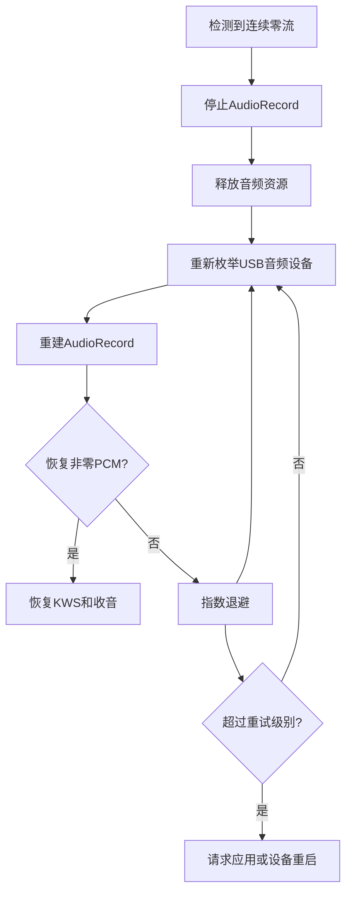

禁止：

```text
永久suppressed=true
→ 从此不再尝试恢复
```

---

## 9. ASR实时识别

### 9.1 核心原则

```text
每段有效PCM
→ 当前ASR模型实时推理
→ 返回本次识别文本
```

禁止：

- 固定命令直接映射固定文本；
- 只识别预设句式；
- 使用历史识别结果替代模型；
- 因为某个词没录入就不进入ASR；
- 把Router规则错误地当成ASR识别。

---

### 9.2 当前路线

当前阶段保持当前稳定ASR主路径不变。

目标语义：

```text
ASR_PRIMARY=当前稳定NPU ASR
ASR_RESULT_CACHE=off
ASR_MODEL_WARMUP=on
ASR_HOTWORDS=on
ASR_CONTEXT_BIAS=on
```

需要通过真实请求日志确认：

```text
model_id
provider
device
latency
session_id
utterance_id
status
```

如果实际请求稳定进入NPU，则冻结ASR，不在当前阶段继续更换模型。

---

### 9.3 酒店专有词

后台需要允许酒店录入：

- 酒店名称；
- 品牌名称；
- 餐厅名称；
- 周边景点；
- 频道名称；
- 房型名称；
- 设施名称；
- 商场；
- 交通枢纽；
- 服务名称；
- 常见英文缩写；
- 本地地名。

这些内容可以发布为：

- ASR热词；
- Context Bias；
- 自定义词典；
- Router实体词典；
- 频道别名；
- TTS发音词典。

热词不是ASR结果Cache。

---

### 9.4 ASR结果结构

```json
{
  "type": "asr_final",
  "hotel_id": "hotel_001",
  "room_id": "1208",
  "device_sn": "STB-001208",
  "session_id": "session_uuid",
  "session_epoch": 17,
  "utterance_id": "utterance_uuid",
  "raw_text": "小智小智健身房在哪里",
  "normalized_text": "健身房在哪里",
  "model_id": "paraformer",
  "provider": "npu",
  "device": "NPU",
  "latency_ms": {
    "endpoint": 600,
    "inference": 260,
    "total": 860
  },
  "status": "success"
}
```

---

### 9.5 ASR失败不能静默

ASR为空、无有效语音或识别失败时，生成明确回复文本：

```text
抱歉，我没有听清，请再说一次。
```

该文本继续进入实时TTS。

---

## 10. 多轮会话与上下文管理

### 10.1 为什么“几点关门”能知道指的是健身房

第一轮：

```text
用户：健身房在哪里？
```

Router识别为：

```json
{
  "domain": "hotel_knowledge",
  "intent": "FACILITY_LOCATION_QUERY",
  "entity": {
    "type": "facility",
    "id": "fitness_center",
    "name": "健身房"
  }
}
```

AI回答：

```text
健身房在五楼。
```

同时将当前会话焦点保存为：

```json
{
  "active_domain": "hotel_knowledge",
  "active_topic": "facility",
  "active_entities": [
    {
      "type": "facility",
      "id": "fitness_center",
      "display_name": "健身房"
    }
  ],
  "last_intent": "FACILITY_LOCATION_QUERY"
}
```

第二轮：

```text
用户：几点关门？
```

当前句子缺少主体。

Router读取当前会话上下文：

```text
active_entity = fitness_center
```

补全为：

```text
健身房几点关门？
```

再查询酒店知识：

```text
健身房营业至晚上十一点。
```

---

### 10.2 多轮上下文流程图

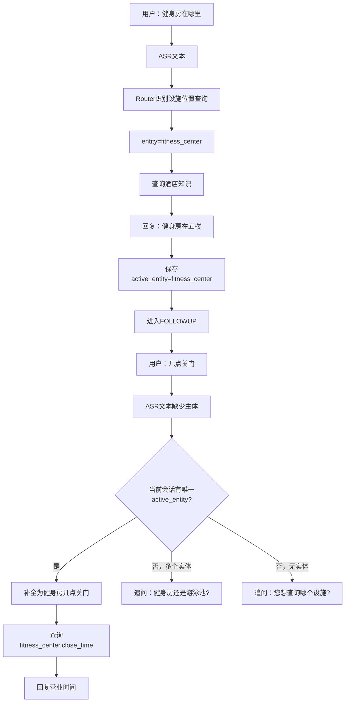

---

### 10.3 不能只把聊天全文交给LLM

推荐：

```text
最近几轮对话文本
+
结构化Dialogue State
```

结构化状态比单纯聊天历史更稳定。

```json
{
  "session_id": "uuid",
  "session_epoch": 17,
  "room_id": "1208",

  "recent_turns": [
    {
      "role": "user",
      "text": "健身房在哪里？"
    },
    {
      "role": "assistant",
      "text": "健身房在五楼。"
    }
  ],

  "dialogue_state": {
    "active_domain": "hotel_knowledge",
    "active_topic": "facility",
    "active_entities": [
      {
        "type": "facility",
        "id": "fitness_center",
        "display_name": "健身房"
      }
    ],
    "last_intent": "FACILITY_LOCATION_QUERY",
    "pending_intent": null,
    "pending_slots": [],
    "last_tool": "hotel_knowledge_query",
    "expires_at": "2026-07-28T12:00:10+08:00"
  }
}
```

---

### 10.4 上下文补全规则

```text
当前句缺少主体
+ active_entity只有一个
→ 自动补全

当前句缺少主体
+ active_entity有多个
→ 追问澄清

当前句缺少主体
+ 没有active_entity
→ 追问主体

当前句出现明确新主体
→ 替换active_entity

当前句切换到新业务域
→ 更新active_domain
```

---

### 10.5 多实体歧义

例如：

```text
用户：健身房和游泳池分别在哪里？
AI：健身房在五楼，游泳池在六楼。
用户：几点关门？
```

当前有两个实体：

```text
fitness_center
swimming_pool
```

不能擅自选择，应追问：

```text
请问您想查询健身房还是游泳池的营业时间？
```

---

### 10.6 服务场景的歧义

例如：

```text
用户：帮我送水和毛巾。
AI：好的，请问需要多少？
用户：三份。
```

“三份”可能指：

- 三瓶水；
- 三条毛巾；
- 两者各三份。

必须追问：

```text
请问是三瓶水、三条毛巾，还是两种都需要三份？
```

---

### 10.7 上下文生命周期

上下文只在当前活跃会话内有效：

```text
唤醒
→ 建立Session
→ 多轮FOLLOWUP
→ FOLLOWUP超时
→ 结束Session
→ 清空active_entity
→ 回到IDLE
```

不建议跨会话长期保留话题。

原因：

- 防止上一位客人污染下一位客人；
- 防止几分钟前的话题错误影响新请求；
- 降低隐私风险；
- 减少错误指代。

重新唤醒后用户直接说：

```text
几点关门？
```

应追问：

```text
请问您想查询哪个设施的营业时间？
```

---

### 10.8 Pending Intent与槽位

例如：

```text
用户：我要水。
AI：请问需要几瓶？
用户：三瓶。
```

第一轮保存：

```json
{
  "pending_intent": "ROOM_SERVICE_WATER",
  "pending_slots": ["quantity"],
  "collected_slots": {}
}
```

第二轮：

```json
{
  "pending_intent": "ROOM_SERVICE_WATER",
  "pending_slots": [],
  "collected_slots": {
    "quantity": 3
  }
}
```

随后创建工单。

---

### 10.9 设施属性多轮查询

- 多轮不能只支持位置和营业时间；`active_entity=fitness_center` 时后续可问：有没有教练 / 需要预约吗 / 收费吗 / 有哪些器械 / 有跑步机吗 / 儿童可以去吗 / 运动鞋 / 毛巾 / 饮用水 / 洗澡 / 怎么预约 / 联系电话。
- 识别为通用设施属性查询：

```json
{
  "domain": "hotel_knowledge",
  "intent": "FACILITY_ATTRIBUTE_QUERY",
  "entity": "fitness_center",
  "attribute": "coach_service"
}
```

不为每个问法建独立 intent。
- 处理顺序：当前句缺主体 → `active_entity` 补全；识别属性 → 查设施结构化知识；属性存在 → 基于真实数据回答；属性不存在 → 说明资料未提供 + 联系前台 / 人工确认。
- 示例（健身房在哪 → 五楼）：

```text
有没有教练？
→（有）健身房提供私人教练服务，需要提前预约，需要我帮您联系前台吗？
→（无）目前没有驻场教练，健身房可自行使用。
→（资料缺）我明白您想了解教练服务，但资料暂未提供，可联系前台确认。
```

- 禁止在已理解实体和属性时回"我暂时没听懂您的需求"。
- "没理解"与"没资料"必须区分：

| 类型 | 含义 | 回复方向 |
|---|---|---|
| `UNDERSTANDING_FAILED` | 没听懂 | 换种说法再问 |
| `KNOWLEDGE_MISSING` | 理解了但资料缺 | 可联系前台确认 |
| `CAPABILITY_UNSUPPORTED` | 暂不支持语音办理 | 联系前台 |
| `TOOL_FAILED` | 系统没完成 | 稍后再试 |

四类回复必须不同，不能同一兜底。

---

## 11. Router与能力注册表

### 11.1 Router职责

Router负责：

```text
理解用户意图
→ 判断业务域
→ 识别实体
→ 补全上下文
→ 收集必要参数
→ 选择工具
→ 校验权限
→ 调用能力
→ 等待结果
→ 生成最终回复文本
```

Router不是简单关键词表，也不是ASR Cache。

---

### 11.2 路由顺序

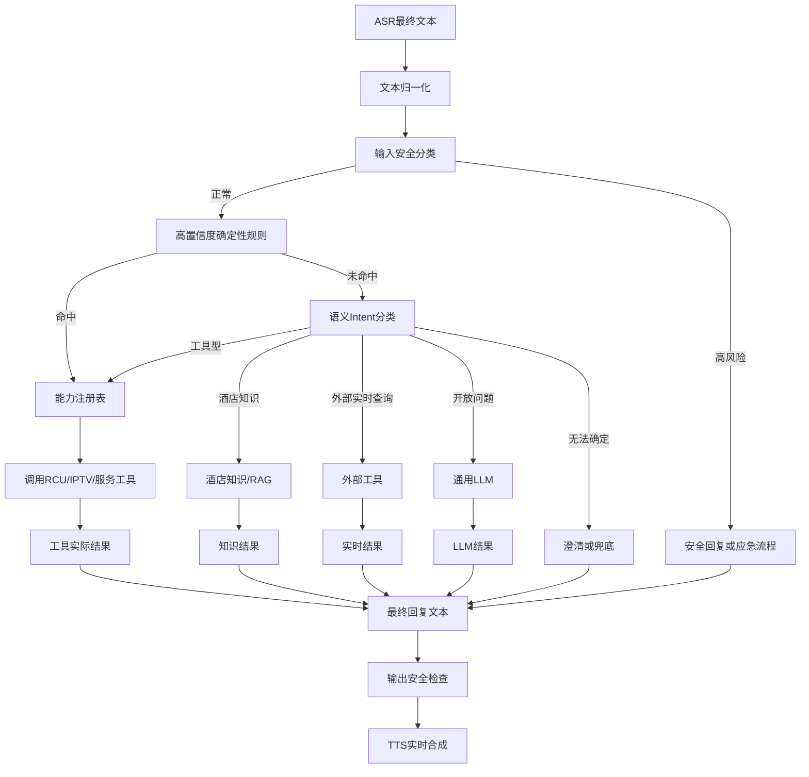

---

### 11.3 三层Router

#### 第一层：确定性规则

适用于明确控制：

```text
打开电视
关闭灯光
空调调到二十四度
打开窗帘
播放中央一台
```

#### 第二层：语义Router

适用于自然表达：

```text
房间有点暗
声音太大了
我有点冷
阳光太刺眼
```

映射为：

```text
LIGHT_ON或LIGHT_BRIGHTER
TV_VOLUME_DOWN
AC_TEMPERATURE_UP
CURTAIN_CLOSE
```

#### 第三层：知识和LLM

适用于：

- 酒店信息；
- 周边服务；
- 旅游建议；
- 翻译；
- 聊天；
- 故事；
- 普通知识。

---

### 11.4 能力域

1. `rcu`：客房控制；
2. `iptv_ui`：电视和IPTV UI；
3. `room_service`：酒店服务请求；
4. `hotel_knowledge`：酒店设施与政策；
5. `local_service`：周边生活服务；
6. `tourism`：周边旅游；
7. `realtime_external`：天气、股票、航班、高铁；
8. `general_llm`：通用问答；
9. `entertainment`：儿童故事和互动；
10. `safety`：安全与应急。

---

### 11.5 能力注册表示例

```json
{
  "intent_id": "RCU_LIGHT_ON",
  "domain": "rcu",
  "target": "rcu_gateway",
  "tool": "set_light_state",

  "required_slots": [
    "hotel_id",
    "room_id"
  ],

  "arguments": {
    "state": "on"
  },

  "confirmation": "none",
  "timeout_ms": 3000,

  "success_template": "好的，已经为您打开灯光。",
  "failure_template": "抱歉，灯光暂时没有响应。",
  "timeout_template": "灯光设备暂时没有响应，请稍后再试。",

  "fallback": "front_desk",
  "enabled": true
}
```

---

### 11.6 Router不得返回空回复

统一规则：

```text
明确规则命中
→ 调用能力

规则未命中
→ 语义Router

语义Router无法确定
→ LLM Function Call或知识检索

仍无法处理
→ 生成明确兜底文本
```

兜底：

```text
我暂时没有理解您的需求，您可以换一种说法。
```

禁止：

```text
reply_text=""
```

---

## 12. RCU客房控制

包括：

- 灯光；
- 空调；
- 窗帘；
- 场景模式；
- 请勿打扰；
- 清理房间；
- 部分酒店的电视电源和音量。

流程：

```text
用户表达
→ Router识别
→ 参数校验
→ RCU下发
→ 等待真实反馈
→ 根据反馈生成文本
→ TTS
```

成功：

```text
好的，已经为您打开灯光。
```

失败：

```text
抱歉，灯光暂时没有响应。
```

超时：

```text
灯光设备暂时没有响应，请稍后再试。
```

禁止在RCU返回前说：

```text
已经帮您打开了。
```

---

## 13. IPTV UI和电视控制

包括：

- 开关电视；
- 频道切换；
- 音量；
- 静音；
- 播放和暂停；
- 打开电影；
- 打开应用；
- 打开投屏；
- 返回首页；
- 打开点餐页面。

不同酒店实际执行端可能不同：

| 功能 | 可能执行端 |
|---|---|
| 电视开关 | RCU、TV SDK或IPTV UI |
| 电视音量 | RCU、TV SDK或IPTV UI |
| 频道切换 | IPTV UI |
| 点播播放 | IPTV UI |
| 应用打开 | IPTV UI |
| 窗帘 | RCU |

后台必须允许按酒店和设备型号配置。

---

## 14. 酒店服务请求

### 14.1 服务目录

- 送水；
- 毛巾；
- 枕头；
- 被子；
- 清洁；
- 维修；
- 客房送餐；
- 叫醒服务；
- 行李服务；
- 延迟退房；
- 联系前台。

---

### 14.2 槽位补全

用户：

```text
我要水。
```

酒店可配置：

#### 需要追问数量

```text
请问需要几瓶水？
```

#### 使用默认数量

```text
默认两瓶
→ 直接创建工单
```

用户：

```text
我饿了。
```

需要澄清：

```text
您想查看客房送餐菜单，还是了解酒店餐厅？
```

用户：

```text
我要枕头。
```

如果存在多个类型：

```text
请问需要普通枕头、乳胶枕，还是荞麦枕？
```

---

### 14.3 工单反馈

创建成功：

```text
好的，已为您申请三瓶矿泉水。
```

创建失败：

```text
抱歉，服务申请暂时没有提交成功，我可以帮您联系前台。
```

工具超时：

```text
服务系统暂时没有响应，我可以帮您联系前台。
```

---

## 15. 酒店知识与自定义信息

### 15.1 酒店录入内容

后台允许录入：

- 酒店名称；
- 品牌；
- 地址；
- 电话；
- 入住时间；
- 退房时间；
- 早餐；
- 餐厅；
- 健身房；
- 游泳池；
- 洗衣房；
- 停车场；
- Wi-Fi；
- 发票政策；
- 客房服务；
- 房型；
- 设施；
- 周边服务；
- 周边旅游；
- 交通；
- 酒店活动；
- 专有词和标准读法。

---

### 15.2 知识来源优先级

```text
结构化酒店数据
→ 酒店FAQ
→ 酒店RAG文档
→ 通用LLM
```

酒店事实不得由LLM随意编造。

LLM可以负责：

- 理解用户问法；
- 处理指代；
- 组织简短回复；
- 多语言表达。

---

### 15.3 设施知识结构

设施不只存名称 / 位置 / 营业时间；统一结构：

```json
{
  "facility_id": "fitness_center",
  "display_name": "健身房",
  "aliases": ["健身室", "Gym"],
  "location": { "floor": "5F", "area": "东侧" },
  "business_hours": { "open": "06:00", "close": "22:00", "open_24_hours": false },
  "access": {
    "guest_only": true,
    "room_card_required": true,
    "reservation_required": false
  },
  "services": {
    "coach_available": true,
    "coach_reservation_required": true,
    "coach_fee_required": false,
    "towels_available": true,
    "drinking_water_available": true,
    "shower_available": true
  },
  "equipment": ["跑步机", "椭圆机", "动感单车", "哑铃区"],
  "policies": {
    "minimum_age": 16,
    "children_allowed": false,
    "sports_shoes_required": true
  },
  "contact": { "department": "前台", "extension": "0" },
  "last_updated_at": "2026-07-29",
  "verified_by_hotel": true
}
```

- 至少为以下设施建统一结构：健身房 / 游泳池 / 餐厅 / 早餐厅 / SPA / 洗衣房 / 停车场 / 儿童乐园 / 行政酒廊 / 商务中心。
- 回答生成原则：
  - 酒店事实来自结构化数据；
  - LLM 负责理解自然表达 / 识别属性 / 结合 `active_entity` / 将结构化数据组织为自然、耐心的回答 / 主动提供下一步帮助；
  - 示例 `coach_available=true` + `reservation_required=true` → "健身房提供私人教练服务，需要提前预约。需要我帮您联系前台了解预约方式吗？"；
  - 不得让 LLM 编造未录入的设施 / 收费 / 时间 / 人员 / 服务。

---

## 16. 周边服务与周边旅游

### 16.1 周边服务

- 医院；
- 药店；
- 餐厅；
- 商场；
- 便利店；
- ATM；
- 地铁站；
- 充电站；
- 儿童设施。

### 16.2 周边旅游

- 景点；
- 博物馆；
- 公园；
- 夜游；
- 演出；
- 一日游；
- 酒店推荐路线。

第一阶段优先使用酒店人工审核内容。

```json
{
  "name": "上海博物馆",
  "category": "景点",
  "distance_text": "约三公里",
  "transport_text": "乘坐地铁约二十分钟",
  "description": "适合对历史和艺术感兴趣的客人",
  "approved_by_hotel": true
}
```

---

## 17. 外部实时查询

### 17.1 天气

天气必须走实时接口：

```text
用户问题
→ 提取地点和时间
→ 天气API
→ 结构化数据
→ 生成回复文本
→ TTS
```

LLM不能凭记忆回答实时天气。

---

### 17.2 股票

股票价格必须走行情接口。

没有接口时：

```text
抱歉，我目前还不能查询实时股票行情。
```

不能猜价格。

---

### 17.3 航班和高铁

需要专用接口查询：

- 航班号；
- 车次；
- 出发地；
- 目的地；
- 日期；
- 实时状态；
- 数据更新时间。

未接入时：

```text
抱歉，我目前不能查询实时航班信息。您可以通过航空公司官方渠道查询，我也可以帮您联系前台。
```

高铁同理。

---

### 17.4 统一原则

```text
工具可用
→ 调用工具并返回实时结果

工具不可用
→ 明确说明暂不支持
→ 提供替代渠道
→ 可选联系前台
```

---

## 18. 通用LLM与娱乐能力

### 18.1 LLM适用范围

- 普通知识；
- 翻译；
- 简单解释；
- 行程建议；
- 聊天；
- 故事；
- 猜谜语；
- 脑筋急转弯；
- 文案；
- 已有酒店资料总结。

---

### 18.2 儿童故事

可支持：

- 动物故事；
- 冒险故事；
- 公主故事；
- 睡前故事；
- 地方文化故事；
- 互动故事。

儿童模式要求：

- 无色情；
- 无露骨暴力；
- 无危险模仿；
- 不过度恐怖；
- 时长可控；
- 正向结尾。

---

### 18.3 唱歌和音乐

CosyVoice是TTS，不是完整歌声合成模型。

有授权音乐服务：

```text
用户：播放一首儿歌
→ IPTV UI打开授权音乐或视频
```

没有音乐服务：

- 可生成原创短儿歌；
- 可有节奏地朗读；
- 可朗读原创童谣；
- 不宣称是原唱；
- 不输出受版权保护歌曲的完整歌词。

---

## 19. AI安全防火墙

### 19.1 两层安全

```text
输入安全分类
→ Router / 工具 / LLM
→ 输出安全检查
```

---

### 19.2 违法和危险行为

包括：

- 武器；
- 爆炸物；
- 毒品；
- 诈骗；
- 洗钱；
- 黑客入侵；
- 盗号；
- 恶意攻击；
- 逃避执法；
- 伤害他人的具体方法。

回复：

```text
抱歉，我不能帮助提供违法或危险行为的操作方法。可以为您提供合法、安全的替代建议。
```

---

### 19.3 色情和露骨内容

回复：

```text
抱歉，这类内容不适合提供。您可以换一个话题。
```

涉及未成年人时最高级别阻断。

---

### 19.4 辱骂和攻击

用户辱骂助手：

```text
我理解您现在可能有些不满意。您可以告诉我具体需要解决什么问题。
```

要求攻击个人或群体：

```text
我不能帮助侮辱、威胁或攻击他人。可以帮助您更理性地表达意见。
```

---

### 19.5 自伤和紧急事件

例如：

```text
我不想活了。
我想跳下去。
我吃了很多药。
```

进入应急流程：

```text
安全识别
→ 简短支持性回复
→ 询问是否存在立即危险
→ 建议联系紧急服务
→ 根据酒店策略通知前台或值班经理
```

示例：

```text
我很担心您的安全。请先远离可能伤害自己的物品。我可以立即帮您联系酒店前台或紧急服务。
```

---

### 19.6 隐私和越权

禁止提供：

- 其他客人身份；
- 其他房间入住信息；
- 电话；
- 身份证；
- 账单；
- 服务记录；
- 系统密码；
- 酒店内部密钥；
- 未授权设备控制。

回复：

```text
抱歉，我不能提供其他客人或酒店内部的隐私信息。
```

---

### 19.7 工具安全

LLM只能调用白名单工具。

必须由服务端校验：

```text
tool_name
hotel_id
room_id
device_id
arguments
permission
session_epoch
idempotency_key
```

禁止LLM直接执行：

- Shell命令；
- SQL；
- 任意HTTP地址；
- 未注册RCU命令；
- 未注册IPTV操作。

---

## 20. TTS实时合成

### 20.1 核心原则

```text
最终回复文本
→ 每次进入TTS
→ 每次实时生成PCM
```

禁止读取和写入文本到PCM的业务Cache。

---

### 20.2 V3.1目标路线

```text
TTS模型：CosyVoice V1
主设备：ROCm GPU
主精度：FP32
并发：1
音频Cache：关闭
备用路径：CPU FP32
```

目标语义：

```text
TTS_AUDIO_CACHE=off
TTS_READ_CACHE=off
TTS_WRITE_CACHE=off
TTS_PRIMARY=cosyvoice_v1_rocm_fp32
TTS_FALLBACK=cosyvoice_v1_cpu_fp32
TTS_CONCURRENCY=1
```

---

### 20.3 模型常驻和预热

关闭音频Cache不等于每次重新加载模型。

Worker启动：

```text
加载模型
→ 固定speaker
→ 初始化ROCm
→ 预热3次
→ 检查PCM非空
→ READY
```

Gateway只有在Worker READY后才能发送正式请求。

---

### 20.4 音色一致性

必须固定：

- model_id；
- revision；
- 权重SHA；
- speaker；
- speaker embedding；
- dtype；
- speed；
- sample rate；
- 文本前端；
- 推理参数；
- 随机种子策略。

禁止：

- 部分请求进入旧INT8 Worker；
- fallback使用不同speaker；
- 旧Cache和实时音频混播；
- GPU和CPU返回完全不同的声音；
- 不同模型共享音频结果。

---

### 20.5 文本规范化

| 原文本 | 推荐送入TTS |
|---|---|
| 1208房 | 一二零八房 |
| 24℃ | 二十四度 |
| 3瓶水 | 三瓶水 |
| 07:00 | 早上七点 |
| 10:30 | 上午十点半 |
| Wi-Fi | 无线网络或酒店指定读法 |

还应支持：

- 多音字；
- 酒店品牌；
- 餐厅名称；
- 房型名称；
- 英文缩写；
- 日期；
- 时间；
- 金额；
- 房号；
- 电话号码；
- 航班号和车次。

---

### 20.6 TTS 内容完整性与长句丢字防护

- 验收口径：最终回复文本 = 用户实际听到的语义内容。
- 禁止：句首丢 / 句中丢字 / 句尾截断 / 单 chunk 丢 / chunk 顺序错 / 长句部分未合成 / PCM 生成但 Gateway 未转发 / Gateway 转发但客户端未写 AudioTrack。
- 完整性追踪字段：

```text
tts_id / session_id / session_epoch
reply_text / reply_text_sha256
segment_count
chunk_count_generated / chunk_count_forwarded / chunk_count_received
pcm_bytes_generated / pcm_bytes_forwarded / pcm_bytes_received / pcm_bytes_written
samples_generated / samples_written
first_pcm_ms / tts_end_received / playback_complete
```

- 流式 chunk 带：`tts_id` / `segment_index` / `chunk_index` / `pcm_offset` / `pcm_bytes` / `is_first` / `is_last`。
- 客户端 + Gateway 检测：`chunk_index` 不连续 / PCM 字节不一致 / `is_last` 缺失 / `tts_end` 提前 / AudioTrack 写入不足 → 异常不得返回 `playback_complete`。
- 三点录音对比：
  - A. Worker 原始 WAV
  - B. Gateway 转发 PCM 重组
  - C. 客户端收到 PCM 重组

| 对比 | 结论 |
|---|---|
| A 丢 | 模型 / 分段 / 流式问题 |
| A 完 B 丢 | Worker-Gateway 协议问题 |
| B 完 C 丢 | WS / 客户端问题 |
| C 完播放丢 | AudioTrack / 路由 / 终止问题 |

- optimA 完整性验证：`token_min_hop_len` 降后 chunk 数增，启用前必须验证 chunk 连续 / 边界无缺字无重复无爆音 / 最后 chunk 完整 / `tts_end` 不早于最后 PCM / `playback_complete` 不早于 AudioTrack drain；丢字来自边界则提 `token_overlap_len` 20→30 / hop 25→35/40 / 检查 overlap 拼接 / 不丢短尾 chunk / 检查 finalize / 检查 Gateway 过滤；不得为 TTFA 牺牲内容。
- 长句语义分段：按句号 / 问号 / 分号 / 自然停顿分段，每段 10-30 汉字，同 `tts_id` + `segment_index` 保序，禁止固定字数截断；每段保持顺序 / 不漏 / 不重 / 不改事实 / 无不自然停顿。
- 自动化完整性测试：≥100 条长句（20-80 字，覆盖酒店介绍 / 周边交通 / 打车路线 / 景点 / 多数字 / 中英混合 / 多标点 / 2-4 句）；验收 Worker 输出完整率 100% / Gateway 转发字节一致 100% / 客户端接收一致 100% / chunk 序号连续 100% / 句尾完整 100% / 明显丢字 0 / 永久阻塞 0；可用 ASR 回识别作回归信号但不能只靠 ASR，最终人工抽听。

#### 20.6.1 自适应播放缓冲（2026-07-29 二 追加）

短句与长句对延迟和完整性的诉求不同，禁止一刀切加固定 1s 缓冲：

- AudioTrack 缓冲区容量：`bufferSize = max(minBufferSize × 6, 1s 等效 PCM 字节数)`；既保证短句快速起播，又给长句留够 underrun 余量。
- 启播缓存三档（累积 PCM 达到对应档位才允许 `playback.start()`）：
  - **Fast**：300-400ms —— 短控制回复（"好的，已经为您打开灯光。"）。
  - **Normal**：500-600ms —— 普通回答（1-2 句，rtf ≤ 1）。
  - **Safe**：700-900ms —— 长句 / 多句 / 实测 `rtf > 1` 的不稳定回复。
- 水位控制：
  - low watermark < 250ms：暂缓起播或暂缓继续写入判断，等待累积；
  - high watermark > 800ms：正常起播/写入；
  - 起播后若短暂回落到 low watermark，记录 `underrun_count`，但不立即 `stop()`。
- 选档依据：reply_text 字数 / 预估段数 / 当前 Worker 实测 rtf；默认走 Normal，仅当明确命中长句或 rtf>1 才升 Safe，明确短控制句走 Fast。

#### 20.6.2 AudioTrack partial write（重点，2026-07-29 二 追加）

AudioTrack.write 不保证一次写满请求的全部字节，单次 `write` 默认只写入部分即返回，会导致句尾/句中丢字。客户端必须循环写满：

```text
offset = 0
while offset < data.length:
    written = audioTrack.write(data, offset, len - offset, WRITE_BLOCKING)
    if written < 0:
        记录 write_error 并按错误码处理
        break
    offset += written
```

禁止：
- 一次 `write(data, 0, len)` 后默认写完，不检查返回值；
- 只写返回的字节数，剩余字节丢弃；
- 用 `WRITE_NON_BLOCKING` 但不补偿未写部分。

完整性记录字段（每条 tts_id 汇总）：

```text
expected_bytes          // 应写 = 客户端接收 PCM 字节
written_bytes           // AudioTrack 实际写入字节（累加 written）
partial_write_count     // 单次 write 返回 < 请求字节数 的次数
write_error             // write 返回负数或异常的次数/码
underrun_count          // AudioTrack underrun 次数
buffered_ms             // 当前缓冲毫秒
```

#### 20.6.3 chunk 序号协议（2026-07-29 二 追加）

每个流式 chunk 必须携带：

```text
tts_id
segment_index          // 同一 tts_id 内分段序号，长句分句流水线用
chunk_index            // 同一 segment 内 PCM chunk 连续序号
pcm_offset             // 本 chunk 在该 tts_id 全量 PCM 中的字节偏移
pcm_bytes              // 本 chunk PCM 字节数
is_last_chunk          // 是否该 tts_id 的最后一个 chunk
```

客户端 + Gateway 校验规则：

- `chunk_index` 在同一 `segment_index` 内必须连续递增，不连续 → 报 `PCM_CHUNK_GAP`；
- `pcm_offset` 必须等于前一 chunk 的 `pcm_offset + pcm_bytes`，错位 → 报 `PCM_CHUNK_GAP`；
- 每个 `tts_id` 必须存在 `is_last_chunk=true` 的 chunk，且该 chunk 之后不应再收到同 `tts_id` 的 PCM；
- `tts_end` 不得早于最后一个 PCM chunk 的写入完成；
- 任一校验失败不得返回正常的 `playback_complete`，必须走 `tts_error` / 异常 ACK 路径并落日志。

#### 20.6.4 四点字节核对（2026-07-29 二 追加）

完整性以字节对齐为准，最终核对四个字节计数：

```text
worker_pcm_bytes          // Worker 实际生成 PCM 字节
gateway_forwarded_bytes   // Gateway 实际转发给客户端的字节
client_received_bytes     // 客户端收到的 PCM 字节
audiotrack_written_bytes  // AudioTrack.write 累加成功写入字节
```

要求：

- 四者必须一致（允许因采样率/声道前端归一化导致的固定换算差异，但换算系数必须显式记录）；
- 任一环节不一致，不得返回正常的 `playback_complete`；
- 任何环节不一致都不得只记 info 日志了事，必须升级为 `tts_error` 并进入未解决问题中心。

三点录音比对（诊断模式）：

- **A. Worker 端**：Worker 合成完成后落盘原始 WAV；
- **B. Gateway 端**：Gateway 转发 PCM 重组为 WAV；
- **C. Client 端**：客户端收到的 PCM 重组为 WAV；

对比结论矩阵：

| 对比 | 结论 |
|---|---|
| A ≠ B | Worker-Gateway 协议或转发丢 chunk |
| B ≠ C | WebSocket / 客户端接收丢包或过滤 |
| C ≠ AudioTrack 写入 | partial write 未循环写满 / 客户端 bug |
| A = B = C ≠ 写入 | AudioTrack underrun / 路由 / 终止 |
| 四者一致但听感异常 | 播放设备、采样率、声道路由问题 |

---

### 20.7 长句语义分段与流水线合成（2026-07-29 二 新增）

长句一次性整包合成会显著拉长首字时间，且一旦中途失败整句重做代价高。V3.1 采用语义分句 + 流水线合成，在不破坏内容完整性的前提下降低 TTFA、提升可打断性。

#### 20.7.1 分句触发条件

满足以下任一即触发语义分句：

- 回复文本 > 20-24 汉字；
- 含多个句号 / 问号 / 分号 / 自然停顿标点（即天然可分多句）；
- 按当前 Worker rtf 估算合成时长 > 5s。

不满足的短句直接走单段整包合成（不强制分句，避免无谓 overhead）。

#### 20.7.2 分句规则

- 按自然标点切分：句号 / 问号 / 分号 / 逗号处的自然停顿；
- 每段目标长度 12-24 汉字；不机械按固定字数硬切（禁止把"健身房在五楼"切成"健身房在" + "五楼"）；
- 段内不得断词、断数字、断专有名词（"1208房"不得切成"120" + "8房"）；
- 同一回复共用一个 `tts_id`，每段 `segment_index` 从 0 递增；
- 全段拼接必须能还原原文，禁止改写、省略、合并、重排事实。

#### 20.7.3 流水线合成

```text
Gateway 生成完整 reply_text
→ 语义分句为 segment_0 / segment_1 / segment_2 ...
→ Worker 合成 segment_0，stream 出 PCM chunk
→ Gateway 转发 segment_0 的 chunk 给客户端
→ 客户端起播 segment_0（自适应缓冲按 Safe 档）
→ 并行：Worker 合成 segment_1
→ segment_1 chunk 转发 → 客户端追加写入 AudioTrack
→ ...
→ 最后一段 is_last_chunk=true
→ 全部写入完成 → playback_complete
```

要点：

- 第一段必须短而有用（直接回答核心信息），不要用大量寒暄占满第一段；
- 段与段之间允许自然停顿，但不允许静默卡死；下一段首字 PCM 应在上一段播放结束前到达客户端缓冲；
- 不遗漏任何一段、不重复任何一段；
- 最后一段不得因为流式 finalize 异常被丢弃（必须显式校验 `is_last_chunk` 存在）；
- 全部段播完才允许返回 `playback_complete`；任意一段失败按 §21.4 失败恢复处理；
- chunk 协议字段（`tts_id` / `segment_index` / `chunk_index` / `pcm_offset` / `pcm_bytes` / `is_last_chunk`）必须完整，客户端据此按段顺序播放、跨段不串序。

#### 20.7.4 与 §20.6 完整性的关系

分句流水线不放松完整性要求，反而要求更严：

- 四点字节核对（worker_pcm_bytes / gateway_forwarded_bytes / client_received_bytes / audiotrack_written_bytes）按整条 `tts_id` 聚合，不按单段；
- 任一段 chunk_index / pcm_offset 错位都报 `PCM_CHUNK_GAP`，整条 tts 不允许正常 complete；
- 分句不得成为"丢字"的合理借口：分句只改播放时序，不改播放内容。

#### 20.7.5 SemanticSegmentValidator 严格规范（2026-07-29 四 修正重写）

> 修正说明：本节取代 2026-07-29（三）的 `SemanticSegmenter` 描述。原 `SemanticSegmenter` 把 Segment 当作独立业务 TTS 会话，不符合"一 reply_text 一 tts_id 一模型一 speaker 上下文"的成熟实时语音框架原则，已重写。

§20.7.2 的分句规则在本节细化为可实现的 `SemanticSegmentValidator`（语义句段校验器）。它只做**切分校验**，不做独立 TTS 会话管理——所有 Segment 共用同一 `tts_id` 的同一模型实例、同一 speaker、同一推理上下文（见 §20.7.7）。

**核心约束：**

1. **目标长度**：单段 10–25 汉字；首段优先短而有信息量（直接答核心信息），不超过 18 字。
2. **join 还原原文**：所有 segment 用空字符串拼接必须严格等于 `reply_text` 原文。任何空格、标点、字符的增删改写都判定为分句失败，必须回退整包合成。
3. **切分点优先级**：句号 > 问号 > 叹号 > 分号 > 逗号 > 自然停顿。同一段内禁止断词、断数字、断专有名词（"1208房"不可断；"健身房在五楼"不可切成"健身房在"+"五楼"）。
4. **病句/拆数字/实体否定/异常检测**：切分后任一段若出现下列可疑形态，Validator 必须报 `SEGMENT_SPLIT_SUSPICIOUS`，并回退到整包合成（不接受"看上去能播"的侥幸切分）：
   - 主语缺失到歧义（"在五楼"独立成段而前段无主语）
   - 数字孤立（"1208"单独成段或与所属名词断开）
   - 专有名词被拆（酒店名/品牌名/景点名中途切断）
   - 否定词与被否定对象分到不同段（"不提供"+"早餐服务"）
   - 标点悬挂（句号单独成段、问号与疑问句主体分离）
5. **回退路径**：校验失败不阻塞 TTS，必须 fallback 到 §20.6 整包合成；fallback 路径必须有日志，便于运营复盘为何分句被跳过。

**不变量（必须可测）：**

```text
assert: "".join(segments) == reply_text
assert: all(10 <= hanzi_count(s) <= 25 for s in segments[1:])  # 首段允许 ≤18
assert: no_segment_breaks_number_or_proper_noun(segments)
assert: no_segment_isolates_negation(segments)                 # 否定不与对象分离
assert: segment_index == range(0, len(segments))
```

#### 20.7.6 SHORT/NORMAL/SAFE 自适应启播（2026-07-29 四 修正重写）

> 修正说明：本节取代 2026-07-29（三）的"动态 Lookahead（SHORT/NORMAL/SAFE）"描述。原描述把 SHORT/NORMAL/SAFE 当作 Lookahead 提前合成段数档位，不符合成熟实时语音框架。修正后：SHORT/NORMAL/SAFE 是**启播（playback.start 触发）阈值档位**，与"提前合成几段"解耦。

流水线的核心仍是"句 0 播放期间生成句 1"，**不等全部合成完再发**。但启播时机由 SHORT/NORMAL/SAFE 自适应决定，提前合成的段数只是流水线副产物。

**启播档位（决定何时调用 `playback.start()`）：**

| 启播档位 | 触发条件（基于近 N 次 TTS RTF + 当前 reply_text 字数） | 启播阈值（累积 PCM 达到） | 适用场景 |
|---|---|---|---|
| `SHORT` | RTF ≤ 0.6 且 reply_text ≤ 18 字 | 200–300ms | 短控制回复（"好的，已经为您打开灯光。"）；优先低延迟起播 |
| `NORMAL` | 0.6 < RTF ≤ 0.95 或 18 < reply_text ≤ 40 字 | 400–600ms | 普通回答（1–2 句，rtf ≤ 1） |
| `SAFE` | RTF > 0.95 或 reply_text > 40 字 或 样本不足 或 刚发生过 underrun | 700–900ms | 长句 / 多句 / 实测 rtf > 1 的不稳定回复 |

规则：

- 启播档位由 Gateway 按 `tts_id` 维度评估，单次回复内不变；档位切换必须有日志。
- 起播后由 §20.6.1 水位控制（low watermark < 250ms 暂缓写入判断、high watermark > 800ms 正常写入）。
- 一旦发生 `AudioTrack underrun`，立即强制升到 `SAFE`，并在该 `session_id` 内禁用降档（同会话内只能升不能降）。
- 提前合成段数不与启播档位绑定：Worker 只要有空闲就继续合成后续 Segment 填充瞬时 Buffer，客户端用不完就停在队列上限（见 §21.6 队列上限 2 READY / 8s），不追求"必须合成几段"。
- 自适应启播不放松 §20.7.5 的 join 还原和 §20.7.4 的四点字节核对；任何完整性失败优先于速度。

#### 20.7.7 跨句上下文与 native_continuous_context（2026-07-29 四 修正重写）

> 修正说明：本节取代 2026-07-29（三）的"与 §21.5 Protocol V2 关系"描述。修正后明确：Segment 非独立业务 TTS 会话，整条 reply_text 共用一次模型推理上下文。

**核心原则：一 reply_text 一 tts_id 一模型一 speaker 上下文。**

```text
reply_text
→ SemanticSegmentValidator 切分为 segment_0 / segment_1 / segment_2 ...
→ 共用同一 tts_id / 同一 Worker / 同一 speaker / 同一推理上下文
→ 按 segment_index 顺序流式合成
→ 每段独立 stream 出 PCM Frame
→ 全部 Frame 拼接还原 reply_text 对应的完整 PCM
```

**native_continuous_context 能力分级：**

| Worker 能力 | 行为 |
|---|---|
| 支持 `native_continuous_context`（推荐） | 整条 reply_text 一次性进入模型推理，Segment 只是输出流式切分点；句间韵律、语调、停顿由模型自然生成，不人为插入静音 |
| 不支持 `native_continuous_context` | 降级为按 Segment 顺序独立调用，但**强制共用同一 tts_id / speaker / 推理参数 / seed 策略**；Segment 衔接处不补固定静音（见 §21.6 不补 gap 原则）；若衔接处出现明显音色/语速跳变，按 §32.7 验收项判定缺陷 |

**与 §21.5 Audio Segment Protocol V2 的关系：**

`SemanticSegmentValidator` 切出的每一段 segment，对应 §21.5 Protocol V2 的一个 `(tts_id, segment_index)` 单元；每段在协议层发 `tts_segment_start` → 多个 20ms binary frame → `tts_segment_end`。整条回复用 `tts_start(segment_count, reply_text_sha256)` / `tts_end` 包裹。

协议只负责**传输完整性**，不负责**TTS 优化**：

- 句段协议解决"传输+播放+衔接"的完整性（丢字、丢段、串序、underrun、打断）。
- TTS 合成本身的速度、音质、音色一致性仍是 §20 的问题，协议层不替代 TTS 优化。
- 严禁把"协议层完整性校验"当作"TTS 可以糊弄"的借口；首版必须以"一次合成对、一次传对"为目标，协议校验失败应作为异常上报，不作为常态依赖。

---

## 21. 播放协议与零静默闭环

### 21.1 播放流程

```text
reply_text
→ tts_request
→ tts_start
→ first_pcm
→ PCM frames
→ tts_end
→ AudioTrack开始播放
→ AudioTrack drain
→ playback_complete
```

定义：

- `tts_start`：开始本次TTS；
- `tts_end`：服务端发送PCM完成；
- `playback_complete`：客户端实际播放完成；
- `playback_interrupted`：被取消或打断；
- `tts_error`：合成或发送失败。

---

### 21.2 每个tts_id唯一终态

每个`tts_id`最终必须且只能进入：

```text
playback_complete
playback_interrupted
tts_error
timeout
```

不能重复终态，也不能没有终态。

---

### 21.3 全链路追踪

```text
ASR_FINAL
→ ROUTE_DECISION
→ TOOL_REQUEST
→ TOOL_RESULT
→ REPLY_TEXT
→ TTS_REQUEST
→ TTS_SYNTH_START
→ TTS_FIRST_PCM
→ TTS_SYNTH_COMPLETE
→ TTS_SEND_COMPLETE
→ PLAYBACK_START
→ PLAYBACK_COMPLETE
```

出现“没有声音”时，根据缺失阶段定位：

| 最后阶段 | 可能问题 |
|---|---|
| 无REPLY_TEXT | Router或工具没有生成文本 |
| 有REPLY_TEXT，无TTS_SYNTH | TTS请求未发出 |
| TTS失败 | Worker、模型、OOM或超时 |
| 有PCM，无SEND_COMPLETE | WebSocket发送异常 |
| 已发送，无PLAYBACK_START | 客户端或stale校验 |
| 已PLAYBACK_START，无完成 | AudioTrack、状态或ACK |
| 已完成但用户没听到 | 音量、音频路由或硬件 |

---

### 21.4 失败恢复

```text
GPU FP32失败
→ CPU FP32重试一次

CPU FP32也失败
→ tts_error
→ 退出SPEAKING
→ 恢复媒体音量
→ 取消timer
→ 清理当前tts_id
→ FOLLOWUP或IDLE
```

禁止永久卡在SPEAKING。

---

### 21.5 JOCTV Audio Segment Protocol V2（2026-07-29 四 修正重写）

> 修正说明：本节取代 2026-07-29（三）的 §21.5 描述。修正要点：Segment 是**逻辑管理边界**（驱动流水线、完整性校验、代际隔离），20ms Frame 是**传输与中断边界**；**不在 TCP/WebSocket 之上重复实现应用层可靠传输**，传输层已有 TCP/WebSocket 保证字节流有序不丢，应用层只做完整性校验和异常上报。

V1（§21.1 的 `tts_start → PCM frames → tts_end`）把整条回复当成一维字节流，无法表达"句 0 播放期间句 1 还在传"的状态。V2 在 V1 之上引入两层边界：

- **Segment（逻辑管理边界）**：驱动流水线衔接、按段做完整性对账、代际隔离的最小单元；本身不参与传输层可靠性。
- **Frame（20ms 传输与中断边界）**：PCM 按 20ms（882 bytes @ 22050Hz / 16bit / mono）切片，每帧带 `global_frame_index` 和 `pts_samples`，是 binary 消息的最小单元；中断（打断）在 Frame 边界立即停止。

**消息总览：**

```text
tts_start
  ├── tts_segment_start   (segment_index=0)
  │     ├── binary frame  (20ms ×N)
  │     └── tts_segment_end
  ├── tts_segment_start   (segment_index=1)
  │     ├── binary frame  (20ms ×N)
  │     └── tts_segment_end
  └── ...
  └── tts_end
```

**关键消息字段（摘要）：**

| 消息 | 关键字段 | 说明 |
|---|---|---|
| `tts_start` | `tts_id` / `segment_count` / `reply_text_sha256` / `session_epoch` | 必须先声明本次回复共有多少段、原文 SHA256；客户端据此预分配句段队列、校验最终拼接 |
| `tts_segment_start` | `tts_id` / `segment_index` / `samples_total`（可空） | 声明本段开始；可与 §4.2 `SEGMENT_BUFFERING` 子状态对齐 |
| `binary frame` | `magic` / `protocol_version=2` / `flags` / `tts_id_hash` / `session_epoch` / `segment_index` / `frame_index` / `global_frame_index` / `pts_samples` / `payload_length=882` / `payload_crc32` | **20ms 一帧（882 bytes）**；`global_frame_index` 在整条 `tts_id` 内**单调递增、跨段不重置**，是丢帧检测的主键；`pts_samples` 是本帧在整条回复中的采样偏移；`flags` 携带 `SEGMENT_FIRST` / `SEGMENT_LAST` / `TTS_LAST` |
| `tts_segment_end` | `tts_id` / `segment_index` / `segment_pcm_bytes` / `segment_frame_count` | 声明本段 PCM 结束；客户端据此做"段内字节对账" |
| `tts_end` | `tts_id` / `total_pcm_bytes` / `total_frame_count` | 声明整条 TTS 发送结束；客户端据此做"全链路字节对账" |

**完整性校验硬约束（仅校验，不触发应用层重传）：**

1. `global_frame_index` 在整条 `tts_id` 内连续、单调递增，**不因换段而跳号或重置**；任何跳号都判定为 `PCM_FRAME_GAP` 异常并上报未解决问题中心。
2. 每帧 `payload_crc32` 必须由客户端校验；不符判定为 `CRC_FAILED` 异常并上报。
3. `tts_start.reply_text_sha256` 用于在客户端把所有 segment 拼接后做最终还原校验，对齐 §20.7.5 "join == 原文"。
4. V2 仍保留 V1 的 `tts_start → tts_end` 总壳，老客户端按 V1 解析也能播；V2 字段以"可选扩展"形式叠加，不破坏 V1（兼容性见规范文档第 10 节）。

**不在 TCP 上重复实现应用层可靠传输（2026-07-29 四 明确）：**

- 协议承载在 WebSocket / TCP 之上，传输层已保证字节流有序不丢；**V3.1 当前版本不在应用层重复实现 Segment 级重传机制**（即不实现 `segment_retransmit_request` / 整段重发 / frame range 重传）。
- 完整性校验失败（`PCM_FRAME_GAP` / `CRC_FAILED` / `SEGMENT_BYTE_MISMATCH`）按下列方式处理：
  - **不**发应用层重传请求；
  - **直接上报异常**到未解决问题中心 + 日志 + `tts_error`；
  - 触发 §21.4 失败恢复（GPU FP32 失败 → CPU FP32 重试一次 → 仍失败则 `tts_error` 退出 SPEAKING）；
  - 对用户表现为"这条回复没播好"，不表现为"反复重传拉长延迟"。
- 把 Segment 应用层重传列为 **Future / P2**：只有在传输层证明不可靠（如改用 UDP/QUIC/WebRTC datachannel）或大规模生产数据显示丢帧率不可接受时，才考虑引入应用层重传，且必须限定"每段最多重传 1 次、只重传 frame range、二次失败整条失败"。

> **兼容原则**：V2 是 V1 的严格超集。Server 端必须支持 V1/V2 双发判定（按客户端在 `hello` / `session_init` 阶段上报的 `protocol_version` 决定），客户端未升级时回退到 V1，但失去句段级完整性能力。

---

### 21.6 Android 队列单 AudioTrack（2026-07-29 四 修正重写）

> 修正说明：本节取代 2026-07-29（三）的 §21.6 描述。修正要点：(1) 一 tts_id 一 AudioTrack / Segment 间不 flush；(2) 启播由 SHORT/NORMAL/SAFE 自适应决定；(3) 队列上限 2 READY / 8s；(4) partial write 循环写满；(5) **不补固定句间静音（不补 gap）**。

客户端拿到 Protocol V2 后，必须保证句段在 AudioTrack 上**连续**播放，不能因为换段而出现 stop/flush/release 再重建 AudioTrack 的"接缝静默"。本节定义 Android 端实现规范。

**核心原则：一个 `tts_id` 一个 AudioTrack，Segment 之间不 flush。**

| 维度 | 规则 |
|---|---|
| AudioTrack 生命周期 | 与 `tts_id` 绑定，`tts_start` 时创建（或从单例池取出并复用底层流），`playback_complete` / `playback_interrupted` / `tts_error` 后才允许 release；**Segment 切换禁止 `stop()` / `flush()` / `release()`** |
| 写入 | 所有 Segment 的 PCM（20ms Frame）顺序写入**同一** AudioTrack；`write()` 返回值必须真实校验（partial write 必须循环写满，对齐 §20.6.2） |
| 起播 | 由 §20.7.6 SHORT/NORMAL/SAFE 自适应启播阈值决定，不在每个 Segment 起点重新评估 |
| 结束 | 最后一段才 `drain()`；非末段不允许 drain，避免提前阻塞 |

**句段队列状态机（与 §4.2 子状态对齐）：**

```text
DECLARED
  ↓ tts_segment_start 到达
RECEIVING
  ↓ 本段所有 binary frame 收齐且 CRC 通过
VERIFYING
  ↓ 与 tts_segment_end 段内字节对账通过
READY
  ↓ 轮到本段写入 AudioTrack
PLAYING
  ↓ AudioTrack write 写满本段全部 PCM
PLAYED
```

规则：

- 每段独立走该状态机；多段在队列里并存，但 AudioTrack 写入严格按 `segment_index` 串行。
- `VERIFYING` 不通过的段不进入 `READY`，直接按 §21.5 完整性异常处理（上报 + `tts_error`，**不重传**）。
- `PLAYED` 段的 PCM Buffer 立即释放（对齐 §2.2.1 瞬时 Buffer 终态释放）。

**队列上限（背压触发阈值，2026-07-29 四 明确）：**

| 维度 | 上限 | 超限动作 |
|---|---|---|
| `ready_segment_count` | ≤ 2 | 超过 2 个 READY 段时上报 `tts_flow_control(reason=READY_BACKLOG)`，服务端暂停下发下一段 `tts_segment_start` |
| `queued_pcm_ms` | ≤ 8000ms | 超过 8s 时上报 `tts_flow_control(reason=QUEUE_BACKLOG)`，服务端暂停下发；已开始的段不取消 |
| 恢复 | `ready ≤ 1` 且 `queued ≤ 3s` | 上报 `tts_flow_control(reason=RESUME)`，服务端恢复下发 |

- 背压只暂停下发，不允许丢已合成的 PCM；Worker 瞬时 Buffer 在 `tts_id` 终态前保留（对齐 §2.2.1）。
- 背压期间 Worker 可继续合成填满瞬时 Buffer 或暂停合成，由 Gateway 决策；暂停合成必须有日志，恢复后从原 `segment_index` 继续。

**不补固定句间静音（2026-07-29 四 明确）：**

- **Segment 拼接处不人为补零、不补固定 120ms / 60ms 停顿**。句间韵律、停顿由 TTS 模型在合成时自然生成（对齐 §20.7.7 native_continuous_context）。
- 如 TTS 模型不支持 native_continuous_context、降级为按段独立合成，衔接处也**不补固定静音**；允许的衔接处理仅限：基于 PCM 能量检测段尾→段首的静音时长，**只截断**过长的机械停顿（> 300ms 截断到 300ms），**不补足**过短停顿。
- 禁止"逗号 60-100ms / 句号 120-180ms 补零"这类固定补 gap 行为（这是 2026-07-29 三 旧设计的错误，已废除）。
- 客户端本地补零不得污染协议字节对账：任何本地 PCM 处理（截断/不补）不计入 `payload_length` / `payload_crc32`。

---

### 21.7 打断 / 取消 / 代际隔离（2026-07-29 四 修正重写）

> 修正说明：本节取代 2026-07-29（三）的 §21.7 描述。修正要点：**打断在 Frame 边界立即停止，不等整句播完**；淡出 30-50ms；清后续所有 Segment；stale 帧拒绝。

打断场景下，必须做到"用户一开口，TTS 在当前 20ms Frame 边界立刻闭嘴，不等整句/整段播完，且旧帧绝不污染新会话"。

**触发路径：**

```text
用户唤醒 / 用户开口 / 客户端取消 / 服务端取消
→ 客户端发 playback_interrupted
→ 等当前正在写的 20ms Frame 写完（最多 20ms 延迟）
→ 取消当前 Segment 的后续 Frame 写入（不等整段/整句播完）
→ 取消队列里所有后续 Segment（READY/RECEIVING/VERIFYING 全部丢弃，PCM Buffer 立即释放）
→ 30–50 ms fade-out 平滑收尾（避免硬切爆音）
→ session_epoch++ （旧 tts_id 帧不再被接受）
→ AudioTrack 在新 tts_id 到来前保持空闲，不 release
```

**硬约束：**

1. **Frame 边界立即停止**：打断触发后，最多等待当前正在写的 20ms Frame 写完即停止后续写入，**不等整句播完、不等整段播完**；从打断触发到停止写入的延迟 ≤ 20ms + fade-out（30-50ms），总计 ≤ 70ms。
2. **fade-out 时长 30–50ms**：硬切会产生"咔哒"爆音；fade 必须在 50ms 内完成，不允许把 fade 拖到 200ms+ 让用户觉得"还没闭嘴"。
3. **session_epoch 隔离**：`playback_interrupted` 触发后，`session_epoch` 自增；旧 `tts_id` 的后续 binary frame 因 `session_epoch` 不匹配被客户端直接丢弃，且打 `STALE_FRAME_DROPPED` 日志。
4. **队列清理必须完整**：不允许只取消"正在播的那段"而漏掉"已 READY 等待的后续段"；后续段的 PCM Buffer 立即释放（对齐 §2.2.1）。
5. **AudioTrack 不 release**：打断只停止写入和 fade-out，AudioTrack 实例保留到新 `tts_id` 来或会话超时；避免下一次起播因重建 AudioTrack 拉长 TTFA。
6. **代际污染 = 0** 是硬验收项（见 §32.7）；任何旧帧被播出来都属于 P0 缺陷。

---

### 21.8 轻量背压与队列水位（2026-07-29 四 修正重写）

> 修正说明：本节取代 2026-07-29（三）的 §21.8 描述。修正要点：**当前版本不描述 Segment 应用层重传**（已在 §21.5 明确废除）；本节只保留轻量背压与队列水位。原"重传"相关内容标为 Future / P2。

流水线和句段队列引入了"客户端来不及消费"的可能，必须有显式的背压机制，否则 Worker 越合成越快、客户端越积越多，最终 OOM 或丢字。

**背压（客户端 → 服务端）：**

| 指标 | 阈值 | 客户端动作 |
|---|---|---|
| `ready_segment_count` | > 2 | 上报 `tts_flow_control(reason=READY_BACKLOG, ready=N)`，服务端暂停下发下一段 `tts_segment_start` |
| `queued_pcm_ms` | > 8000ms | 上报 `tts_flow_control(reason=QUEUE_BACKLOG, ms=...)`，服务端暂停下发；同时**不取消**已开始的段 |
| 恢复 | `ready_segment_count ≤ 1` 且 `queued_pcm_ms ≤ 3000ms` | 上报 `tts_flow_control(reason=RESUME)`，服务端恢复下发 |

规则：

- 背压**只暂停下发**，不允许丢已合成的 PCM；Worker 端的瞬时 Buffer 在 `tts_id` 终态前必须保留（对齐 §2.2.1）。
- 背压期间 Worker 可以选择**继续合成**（填满瞬时 Buffer）或**暂停合成**（省资源），由 Gateway 决策；但暂停合成必须有日志，且恢复后必须从原 `segment_index` 继续。
- 背压上报频率必须有去抖（建议每 500ms 最多 1 次），防止 ready 数在阈值附近抖动导致 flow control 消息风暴。

**Segment 应用层重传（Future / P2，当前版本不实现）：**

- 当前版本**不实现** Segment 应用层重传（`segment_retransmit_request` / frame range 重传 / 整段重发）。
- 完整性校验失败的处置见 §21.5：上报异常 + `tts_error` + §21.4 失败恢复，不重传。
- 只有在未来传输层切换为不可靠协议（UDP/QUIC/WebRTC datachannel）或生产数据证明 TCP/WebSocket 丢帧率不可接受时，才考虑引入应用层重传，且必须满足：每段最多重传 1 次、只重传 frame range、二次失败整条失败、重传期间该段不进入 `PLAYING`。

---

## 22. 酒店AI运营中心

- 后台总名称：**酒店 AI 运营中心**
- 核心配置模块：**酒店知识与能力中心**
- 发布产物：**酒店 AI 知识包**

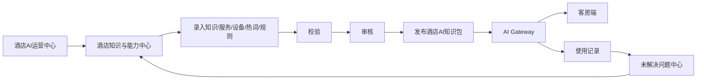

### 22.1 后台栏目

建议一级栏目：

1. 运行总览；
2. 设备与连接；
3. 实时会话；
4. 对话记录；
5. 使用分析；
6. 未解决问题；
7. 能力运营；
8. 酒店知识；
9. 客房服务；
10. RCU 与 IPTV 能力；
11. 外部工具；
12. 安全策略；
13. 发布管理；
14. 系统与权限。

---

## 23. 设备与连接管理

### 23.1 管理对象

#### 客房终端

- 机顶盒；
- 电视；
- 麦克风；
- Android Agent；
- IPTV UI；
- RCU控制组件；
- 数字人客户端。

#### 服务端

- AI Gateway；
- ASR Worker；
- TTS Worker；
- LLM；
- RAG；
- 向量数据库；
- RCU网关；
- IPTV平台；
- PMS；
- 服务工单系统；
- 外部接口。

---

### 23.2 连接字段

| 字段 | 示例 |
|---|---|
| 酒店 | 上海某酒店 |
| 房间 | 1208 |
| 设备类型 | IPTV机顶盒 |
| SN | STB-001208 |
| IP | 172.31.12.108 |
| 在线状态 | 在线 |
| WebSocket | connected |
| 最近心跳 | 10秒前 |
| 当前状态 | IDLE |
| App版本 | 3.1.0 |
| 知识包版本 | 20260728-03 |
| 麦克风状态 | 正常 |
| ASR | Paraformer NPU |
| TTS | CosyVoice GPU FP32 |
| 最近错误 | 无 |
| 上线时间 | 2026-07-28 10:30 |

---

### 23.3 后台操作

#### 低风险

- 刷新状态；
- 重新同步配置；
- 重新下发知识包；
- 请求重新建立WebSocket；
- 请求重新初始化麦克风；
- 重新加载音频设备。

#### 中风险

- 结束当前对话；
- 强制回到IDLE；
- 断开当前连接；
- 重启Android Agent；
- 重启ASR Worker；
- 重启TTS Worker；
- 切换备用服务。

#### 高风险

- 禁用设备；
- 解绑房间；
- 删除设备注册；
- 删除历史记录。

区别：

| 操作 | 含义 |
|---|---|
| 结束会话 | 结束当前语音交互 |
| 断开连接 | 断开当前WebSocket，允许重连 |
| 禁用设备 | 拒绝后续重连 |
| 删除设备 | 删除注册关系，需要重新绑定 |

---

## 24. 实时会话管理

### 24.1 会话字段

```text
hotel_id
room_id
device_sn
session_id
session_epoch
state
started_at
last_activity_at
utterance_id
asr_task_id
tool_call_id
tts_id
asr_status
route_result
tool_status
tts_status
playback_status
active_entity
pending_intent
```

---

### 24.2 后台操作

- 查看实时链路；
- 结束会话；
- 强制回到IDLE；
- 取消工具请求；
- 停止TTS；
- 重新进入监听；
- 关闭FOLLOWUP；
- 请求终端重新连接。

后台不直接修改用户的对话文本。

---

## 25. 对话记录与数据结构

### 25.1 每轮记录

```json
{
  "hotel_id": "hotel_001",
  "room_id": "1208",
  "device_sn": "STB-001208",

  "session_id": "session_uuid",
  "session_epoch": 17,
  "utterance_id": "utterance_uuid",

  "started_at": "2026-07-28T10:31:22+08:00",

  "asr": {
    "raw_text": "小智小智房间有点暗",
    "normalized_text": "房间有点暗",
    "model": "paraformer",
    "provider": "npu",
    "latency_ms": 278,
    "status": "success"
  },

  "context": {
    "active_domain": "rcu",
    "active_entity": "room_light",
    "pending_intent": null,
    "resolved_reference": null
  },

  "route": {
    "domain": "rcu",
    "intent": "LIGHT_BRIGHTER",
    "confidence": 0.93,
    "matched_by": "semantic_router"
  },

  "tool": {
    "name": "rcu_light_control",
    "arguments": {
      "action": "brighter"
    },
    "status": "success",
    "latency_ms": 412
  },

  "reply": {
    "text": "好的，已经为您调亮灯光。",
    "source": "tool_result_template"
  },

  "tts": {
    "model": "cosyvoice-v1",
    "device": "gpu",
    "dtype": "fp32",
    "cache": false,
    "first_pcm_ms": 680,
    "status": "playback_complete"
  },

  "result": {
    "success": true,
    "failure_stage": null
  }
}
```

---

### 25.2 后台应能回答

- 客人说了什么；
- ASR识别成什么；
- 当前会话上下文是什么；
- Router判断了什么；
- 调用了哪个工具；
- 工具是否成功；
- 最终回复是什么；
- TTS是否生成；
- 客户端是否播放；
- 总耗时；
- 失败在哪一层。

---

### 25.3 原始音频保存

默认：

```text
不长期保存客房原始音频
```

默认只保存：

- ASR文本；
- Intent；
- 上下文；
- 工具结果；
- 回复文本；
- 性能数据；
- 错误码。

诊断模式可短期保存：

- 误唤醒；
- 漏唤醒；
- ASR空结果；
- 麦克风死流；
- 播放污染。

必须设置：

- 保存期限；
- 权限；
- 审计；
- 自动删除；
- 匿名化。

---

## 26. 使用分析与酒店报表

### 26.1 运行总览

- 在线房间数；
- 设备在线率；
- 今日会话数；
- 使用过AI的房间数；
- 总交互轮数；
- 完成率；
- 平均响应时间；
- 无声失败数；
- 工具成功率；
- 麦克风异常数；
- 未解决问题数。

---

### 26.2 使用率指标

| 指标 | 说明 |
|---|---|
| 使用房间数 | 当日有有效会话的房间 |
| 在线房间使用率 | 使用房间数 ÷ 在线房间数 |
| 入住房间使用率 | 使用房间数 ÷ 入住房间数 |
| 平均会话数 | 每个使用房间平均会话数 |
| 平均轮数 | 每次会话平均交互轮数 |
| 重复使用率 | 同一房间多次使用比例 |
| 高峰时段 | 使用最集中的时间 |

只有接入PMS后才能准确计算入住房间使用率。

---

### 26.3 能力分布

示例：

```text
RCU控制：35%
IPTV控制：22%
酒店服务：18%
酒店知识：12%
周边旅游：6%
天气查询：4%
普通问答：3%
```

可进一步查看：

- 开灯次数；
- 空调调温次数；
- 窗帘次数；
- 切频道次数；
- 送水次数；
- 毛巾次数；
- 问早餐次数；
- 问健身房次数；
- 周边餐厅查询次数。

---

### 26.4 酒店价值报表

```text
AI创建客房服务工单：326次
送水：128次
毛巾：72次
枕头：31次
清洁：48次
维修：47次

成功执行设备控制：2846次
成功回答酒店知识：1382次
```

“减少前台电话”必须有明确估算规则，不能把所有AI请求都直接算作减少电话。

---

## 27. 未解决问题中心

### 27.1 失败分类

- KWS漏唤醒；
- KWS误唤醒；
- 麦克风异常；
- ASR未识别；
- ASR识别错误；
- Router未命中；
- Intent错误；
- 上下文指代错误；
- 参数缺失；
- 能力未注册；
- 酒店知识缺失；
- 外部接口未接入；
- 工具执行失败；
- 工具超时；
- TTS失败；
- 客户端未播放；
- 安全策略拦截；
- 状态机异常。

---

### 27.2 问题示例

| 客人问题 | 当前结果 | 原因 |
|---|---|---|
| 最近的儿童医院在哪里 | 无法回答 | 周边知识缺失 |
| 帮我订明天去杭州的高铁 | 暂不支持 | 未接高铁接口 |
| 把床头左边阅读灯调暗 | 失败 | RCU缺少灯具分区 |
| 我要乳胶枕 | 只识别为枕头 | 服务目录缺少类型 |
| 播放凤凰卫视 | 频道未找到 | 频道别名缺失 |
| 几点关门 | 错误理解 | 会话上下文丢失 |

---

### 27.3 自动聚类

```text
早餐在哪
早餐餐厅在几楼
在哪里吃早餐
```

聚为：

```text
早餐地点类
```

每个问题簇显示：

- 出现次数；
- 涉及房间数；
- 涉及酒店数；
- 最近时间；
- 当前成功率；
- 失败原因；
- 负责人；
- 计划版本；
- 处理状态。

---

## 28. 能力增长闭环

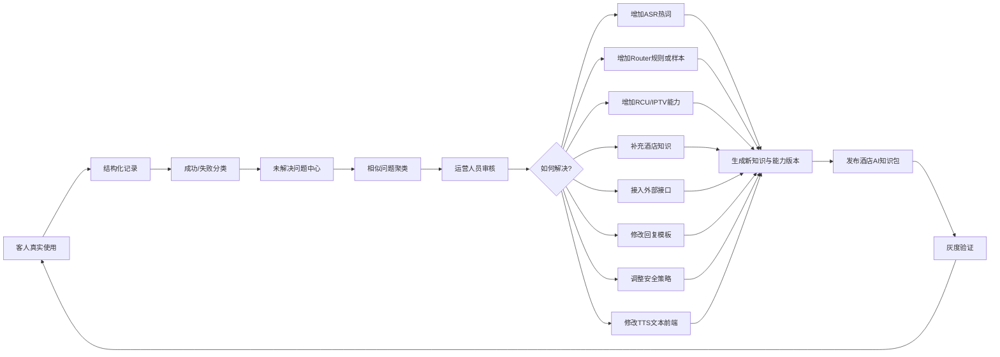

问题与解决方法：

| 问题 | 解决方法 |
|---|---|
| 酒店名称识别错 | 增加ASR热词 |
| 频道名称识别不到 | 增加频道别名 |
| Router不理解表达 | 增加Intent样本 |
| 上下文指代错误 | 修改Dialogue State规则 |
| RCU没有能力 | 增加设备能力映射 |
| 酒店信息缺失 | 补充知识 |
| 天气无法查询 | 接天气接口 |
| 航班无法查询 | 接航班接口或明确不支持 |
| 回复不合适 | 修改文本模板 |
| TTS读音错误 | 调整文本规范化或发音词典 |
| 安全误拦截 | 调整安全规则 |

优先级参考：

```text
出现频率
× 业务价值
× 失败严重程度
× 覆盖酒店数量
```

安全类问题优先级不受出现频率限制。

---

## 29. 酒店AI知识包

### 29.1 内容

酒店AI知识包包括：

- 酒店基本资料；
- 设施和营业时间；
- 服务项目；
- RCU能力；
- IPTV能力；
- Intent规则；
- 工具Schema；
- ASR热词；
- 频道别名；
- 酒店专有词；
- TTS发音词典；
- FAQ；
- 周边服务；
- 周边旅游；
- 回复文本模板；
- 安全策略；
- 外部工具配置。

不包括：

- ASR识别结果Cache；
- TTS PCM音频Cache；
- 客人历史原始音频。

---

### 29.2 发布流程

> **口径注脚（2026-07-30 追加）：** 本节为高层概览。实际发布流程以 **§39.3** 为准——必须经 Immutable Release Package → Validation → Runtime Shadow Load → Runtime ACK（golden_queries 全命中）→ Atomic Activate，**DB status=published ≠ Runtime 已应用**。实现时不得按本节旧流程跳过 Shadow/ACK。

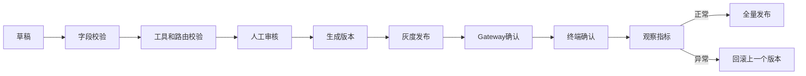

---

### 29.3 版本示例

> **口径注脚（2026-07-30 追加）：** 本节为单条发布版本的记录字段。每个酒店的版本状态机（desired_release_version / active_runtime_version / last_good_version 等 7 字段）以 **§39.4** 为准。

```text
hotel_001-ai-package-20260728-03
```

记录：

```text
version
hotel_id
created_at
published_at
operator
schema_version
content_hash
previous_version
rollback_status
```

---

## 30. 权限、隐私与审计

### 30.1 角色

- 酒店管理员；
- 酒店运营人员；
- 酒店工程人员；
- 集团管理员；
- JOCTV平台运营；
- JOCTV研发；
- 只读审计人员。

---

### 30.2 数据权限

酒店管理员只能查看本酒店数据。

集团管理员可查看旗下酒店汇总。

平台运营跨酒店查看时应尽量：

- 匿名化房间；
- 去除客人身份；
- 对敏感文本脱敏；
- 只查看问题聚类和统计。

---

### 30.3 审计日志

所有后台操作记录：

```text
operator
timestamp
hotel_id
room_id
device_id
operation
old_value
new_value
result
source_ip
request_id
```

重点审计：

- 结束会话；
- 断开连接；
- 禁用设备；
- 删除设备；
- 修改安全规则；
- 修改Router；
- 发布知识包；
- 删除对话记录；
- 查看诊断音频。

---

## 31. 当前实施优先级

### P0：完整链路稳定

1. 关闭全部TTS文本到PCM Cache；
2. 切换CosyVoice GPU FP32；
3. 保留CPU FP32 fallback；
4. 保证Router永远生成非空回复；
5. 工具返回后再生成成功回复；
6. 正式启用playback ACK；
7. 每个`tts_id`唯一终态；
8. 麦克风死流持续自动恢复；
9. 保留session epoch和stale校验；
10. 完成单设备自由交互验证；
11. 唤醒确认语必须使用当前正式 TTS 动态合成，并支持 Wake-only 与 Wake+Command 分流；
12. TTS 长句必须保证文本、PCM、传输和播放内容完整，明显丢字为 0；
13. 建立 Worker、Gateway、客户端三点 PCM 完整性对比和 chunk 序号检测。
14. 落地 §21.5 Audio Segment Protocol V2：一 reply_text 一 `tts_id`、Segment 逻辑边界 + 20ms Frame 传输边界（`global_frame_index` / `pts_samples` / 882 bytes / `payload_crc32` / `flags`），客户端按段做完整性校验，**不在 TCP 之上做应用层重传**；
15. 落地 §21.6 Android 队列单 AudioTrack：**一 `tts_id` 一 AudioTrack**，Segment 之间禁止 stop/flush/release；SHORT/NORMAL/SAFE 自适应启播（按 RTF + 字数选档，underrun 强制升 SAFE 且本会话禁用降档）；队列上限 2 READY / 8s；句段状态机（DECLARED→RECEIVING→VERIFYING→READY→PLAYING→PLAYED）；
16. AudioTrack `write()` 返回值真实校验：partial write 必须循环写满，禁止假设一次写满；**默认不强制句间静音**（不补固定 60-180ms gap，由 TTS 模型 native_continuous_context 自然生成韵律）；
17. 长句句中 underrun = 0：按 §20.7.6 SHORT/NORMAL/SAFE 自适应启播调度，一旦发生过 underrun 立即强制升到 SAFE 档且本会话禁用降档；Frame 序号字节完整（`global_frame_index` 连续 / `payload_crc32` 全通过 / 四点字节对账一致）；
18. 打断/代际隔离（§21.7）：`playback_interrupted` 在 **20ms Frame 边界立即停止**（不等整句/整段播完）、fade-out 30–50ms、`session_epoch` 隔离旧帧、后续 segment 队列完整清理；打断后旧 Frame 污染 = 0；**不做 TCP 应用层重传**（完整性异常直接上报 + `tts_error` + §21.4 失败恢复）；
19. （2026-07-29 五 追加）**标点主导的语义句段（§33）**：禁止按固定字数硬切；落地 `SpeechTextFormatter` + `SemanticSegmenter` + `SemanticSegmentValidator`；强边界（。！？；/.!?;）切分、弱边界（，：/,:）候选、不切边界（顿号/小数点/电话/日期/URL/缩写/房间号/酒店名/数字量词/否定词）；`normalize(join(segments)) == normalize(reply_text)` 必须成立；
20. （2026-07-29 五 追加）**中英文 KWS 本地提示（§34）**：`KwsEngine` / `LocalPromptManager` / `LocalPromptPlayer` 职责分离；Local Prompt Assets（Wake Ack / Processing Ack）使用当前正式 GPU FP32 TTS 预生成、版本化、SHA-256 校验；音色必须与 Main TTS 一致；模型/speaker 更新后整体重新生成；**不是业务 TTS Cache**；
21. （2026-07-29 五 追加）**Session 创建时机（§35.1–§35.3）**：`KWS_ACCEPTED → 创建 session_id/session_epoch → 播放 Wake Ack → LISTENING`；Session 必须在本地寒暄播放前创建；Gateway 未连接时用 `provisional_session_id` 不阻塞本地提示；**本地寒暄不写入 LLM 对话历史**；
22. （2026-07-29 五 追加）**Processing Ack（§35.4–§35.8）**：Local Prompt Bank（zh/en × general/query/service/action）；`LatencyPredictor` 预测首声延迟；`PlaybackArbiter` 统一调度 Local Prompt 与 Main TTS，**禁止重叠**；FOLLOWUP 只能由 Main TTS 的 `playback_complete` 触发，Local Prompt 完成不触发 FOLLOWUP；
23. （2026-07-29 五 追加）**端到端真实事件打点（§36）**：按 §36.1 的 20 个真实事件打点（`TTS_FIRST_PCM_BINARY` 是 binary frame，非 `tts_start` JSON；`PLAYBACK_START` 是 AudioTrack 实际起播）；统计 P50/P90/P95/P99 + 离群原因；性能目标见 §36.4。

---

### P0+：（2026-07-29 五 追加）NIGHTLY 工程专项

> 以下条目对应《29号晚上工作.md》§5（P0 今晚实施）的架构落地点，由 §33–§37 承载。

1. **丢字和卡顿定位**：每个 `tts_id` 记录 `worker_pcm_bytes / gateway_forwarded_bytes / client_received_bytes / AudioTrack 真实 written_bytes / playback_head_samples / expected_samples / getUnderrunCount before|after|delta / partial_write_count / minimum_queue_ms / AudioTrack 创建次数 / stop|flush|release 调用次数和位置 / Segment 切换时间 / 实际句间 gap`；`written_bytes` 必须累加 `AudioTrack.write` 实际返回值，禁止用 `written_bytes += input.length` 伪造完整写入；保存 A（Worker WAV）/ B（Gateway 重组）/ C（Client 接收重组）/ D（明日会议屏扬声器实录音）四点诊断。
2. **标点分句 500 条测试**：覆盖中文强标点 / 英文强标点 / 多逗号 / 小数 / 时间 / 日期 / 电话号码 / 房间号 / 酒店名称 / 中英文 / URL / 无标点长文本 / 81 字外滩 / 欢迎词 / 健身房介绍；验收 `join mismatch=0 / broken number=0 / broken entity=0 / broken negation=0 / 空 Segment=0 / 机械按字数切分=0 / 明显病句=0`。
3. **AudioTrack 和 Segment 播放修复**：核实一个 reply_text 一个 tts_id、一个 tts_id 一个 AudioTrack、Segment 间不 stop/flush/release、partial write 循环写满、队列短暂断流不丢后续 Frame、`playback_complete` 在真实 drain 之后、Segment 完成不独立启动 FOLLOWUP、本地 Prompt 与 Main TTS 不重叠；故障注入 RTF 0.7/0.9/1.0/1.2/1.5 + Frame 延迟/重复 + stale tts_id/epoch + tts_end 提前 + 客户端断开 + partial write + Buffer 低水位。
4. **本地中英文 Wake Prompt 资源生成**：使用当前正式 TTS 生成 zh/en × A/B 候选；每条输出 WAV + 原始文本 + speaker + 模型版本 + dtype + sample rate + speed + duration + sha256 + voice_version；生成 `local_prompt_manifest.json`；USER_TEST_REQUIRED 最终选择明日试听。
5. **唤醒时 Session 创建测试**：中文唤醒 / 英文唤醒 / 重复唤醒 / 断网唤醒 / Gateway 重连 / Prompt 播放期间取消 / Prompt 播放期间 Session 失效 / 旧 Prompt ACK / IDLE 后 Session 清理；确保 Wake Prompt 不写入 LLM 历史、每次唤醒 Session 唯一、stale Prompt 不污染下一 Session。
6. **端到端速度深挖**：TTS 检查 15 项（speaker embedding 重复计算 / tokenizer 重复初始化 / 文本前端重复初始化 / 模型组件重复加载 / GPU workspace 重复分配 / 临时 tensor 反复创建 / CPU-GPU copy / 不必要同步 / MIOpen 算法搜索 / MIOpen 缓存持久化 / 日志同步写盘 / WebSocket 阻塞 GPU 推理 / PCM 转换重复复制 / Worker 频繁重启 / 电源降频）；启动预热（中英文短句 + 10-20 字 + 20-40 字 + 数字 + 中英文 + 当前 Wake Prompt），预热 PCM 丢弃，不作为业务 Cache；独立 Worker 实验 A-H（FP32 基线 / Vocoder BF16 / FP16 / Flow 8 步 / Flow 7 步 / 组合 / 不同 hop / CPU 线程），不切生产、生成 WAV、输出 TTFA/RTF、标记 USER_TEST_REQUIRED。

---

### P1：多轮上下文和能力

1. Dialogue State；
2. active_entity；
3. pending_intent；
4. pending_slots；
5. 多实体歧义澄清；
6. RCU/IPTV能力注册表；
7. 酒店服务目录；
8. 酒店知识结构化；
9. 建立通用 `FACILITY_ATTRIBUTE_QUERY`，不能只支持位置和营业时间；
10. 酒店设施知识扩展到教练、预约、费用、器械、儿童规则、毛巾、饮水和联系方式；
11. 区分"没有听懂"、"酒店资料缺失"、"能力不支持"、"工具失败"，分别生成合理回复。

---

### P2：运营后台 + 语义运行时（2026-07-29 五 扩展）

**运营后台（原 P2）：**

1. 设备与连接；
2. 实时会话；
3. 对话记录；
4. 使用分析；
5. 未解决问题中心；
6. ASR热词后台；
7. Router规则后台；
8. 发布和回滚。

**语义运行时（§37 详细架构，2026-07-29 五 追加）：**

9. Semantic Router（§37.2）：规则层仍是最高优先级，分层路由顺序 Safety → 确定性规则 → Semantic Router → LLM Function Calling → 知识/LLM → 澄清 → 不支持；返回 top1/top2/margin/decision_reason；1000 条评测集；
10. LLM Function Calling（§37.3）：统一工具 Schema；不得绕过 Registry / 调用不存在工具 / 补造酒店事实 / 扩大权限 / 工具返回前宣称成功；
11. Capability Registry V2（§37.4）：扩展 intent / aliases / domain / type / slots / permission / confirmation / timeout / idempotency / supported / enabled / dependency / scope / language / templates / fallback / handoff / metrics_tags；启动时自动检查 11 类配置错误；
12. Hotel Knowledge V2（§37.5）：结构化实体模型（Hotel/Facility/Restaurant/Service/Policy/Room/Device/POI/Transportation/Contact/Schedule/Pricing/Reservation）；每条事实含 entity_id/attribute/value/source/verified/valid_from-to/confidence/fallback_policy；LLM 不得编造；
13. 多语言运行时（§37.6）：locale 贯穿 wake_language → asr → session → router → reply → local_prompt → tts；中英文功能对齐矩阵。

---

### P3：外部工具与娱乐 + 生产化（2026-07-29 五 扩展）

**外部工具与娱乐（原 P3）：**

1. 天气；
2. 地图和周边；
3. 航班；
4. 高铁；
5. 股票；
6. 儿童故事；
7. 游戏和猜谜；
8. 安全策略完善。

**生产化（§37.7–§37.13 详细架构，2026-07-29 五 追加）：**

9. 全链路 Trace（§37.7）：trace_id 贯穿 KWS → Session → Prompt → ASR → Router → Tool/Knowledge/LLM → Reply → TTS → Client → Playback → FOLLOWUP；支持按房间/设备/Session/Intent/错误类型/延迟/语言检索聚合；
10. 自动评测框架（§37.8）：ASR / Router / Dialogue / Tool / TTS / E2E 离线 Evaluation Harness；
11. 多房间并发与资源模型（§37.9）：1/2/4/8 路并发测试；per-room queue + global scheduler + priority + deadline + cancellation + fairness；
12. 酒店和房间隔离（§37.10）：hotel_id / room_id / device_id 强制隔离；A 酒店知识不进 B 酒店，A 房间工具不执行到 B 房间；
13. 安全权限隐私（§37.11）：Tool 权限 / 高风险确认 / 房门支付类限制 / 隐私脱敏 / 音频保留策略 / Trace 保留周期 / 数据来源审计 / 安全回复 / 人工转接；
14. 部署回滚 Feature Flag（§37.12）：所有新能力 Flag 化（PUNCTUATION_SEGMENT_V31 / LOCAL_PROMPT_V31 / BILINGUAL_WAKE_PROMPT_V31 / SESSION_ON_WAKE_V31 / PROCESSING_ACK_V31 / PLAYBACK_ARBITER_V31 / AUDIO_SEGMENT_V2 / ADAPTIVE_PLAYBACK_V31 / SEMANTIC_ROUTER_V31 / FUNCTION_CALLING_V31 / KNOWLEDGE_V2 / TRACE_V31）；enable/disable/verify/rollback/health-check；Flag off 零影响；
15. 稳定性故障注入（§37.13）：2-4 小时连续测试；故障注入（ASR 超时 / Router 异常 / Tool 超时 / LLM 错误 / TTS 空 PCM / TTS 慢 / WebSocket 断开 / Client 不 ACK / stale ACK / Session timeout / 队列满 / Worker 重启 / NPU 异常 / JSON 损坏 / Registry 缺项 / Knowledge 缺失）；验收进程崩溃=0 / 永久卡死=0 / orphan tts_id=0 / stale 污染=0 / 无原因静默=0 / 未恢复 Ducking=0 / 内存增长=0 / FD 泄漏=0。

---

### P4：完整 AEC 与全双工（原生产化的硬件侧）

1. 多房间并发容量（§37.9 承载）；
2. 100 房容量测试；
3. 24 小时稳定性（§37.13 承载）；
4. 多节点与容灾；
5. 完整 AEC（参考回采链路、真机 Barge-in 验收，见 §5.5）；
6. Barge-in；
7. 真正全双工；
8. 多租户；
9. NVIDIA 生产硬件迁移评估。

---

## 32. V3.1验收标准

### 32.1 当前单路验收

| 项目 | 目标 |
|---|---:|
| 单活跃会话 | 1 |
| 连续验证 | 2至4小时 |
| 自由交互 | 至少200轮 |
| 进程崩溃 | 0 |
| 永久状态卡死 | 0 |
| 静默无回复 | 0 |
| 错误工具执行 | 0 |
| ASR结果Cache | 0 |
| TTS音频Cache | 0 |
| 两种音色混播 | 0 |
| 每个tts_id唯一终态 | 100% |
| stale会话污染 | 0 |
| 麦克风死流 | 可自动恢复 |
| 多轮上下文正确率 | 重点验证 |
| 多实体歧义 | 必须追问，不可猜测 |

---

### 32.2 KWS验收

| 项目 | 目标 |
|---|---:|
| 标准唤醒 | 20/20或更高 |
| 旧Incident假唤醒 | 0 |
| 电话Hard Negative | 0 |
| 重复创建Session | 0 |
| SPEAKING错误唤醒 | 0 |
| 唤醒后句首丢失 | 0 |
| 未唤醒上传持续音频 | 0 |
| KWS直接执行工具 | 0 |
| 每次唤醒有结构化日志 | 100% |

---

### 32.3 多轮上下文测试集

至少测试：

```text
健身房在哪里？
→ 几点关门？

游泳池在哪里？
→ 儿童可以去吗？

早餐几点开始？
→ 在几楼？

帮我送水。
→ 三瓶。

打开中央一台。
→ 声音小一点。

健身房和游泳池在哪里？
→ 几点关门？
```

最后一组必须追问：

```text
请问您想查询健身房还是游泳池的营业时间？
```

---

### 32.4 唤醒确认语验收

| 项目 | 目标 |
|---|---:|
| Wake-only 播新确认语 | 100% |
| Wake+Command 错误播确认语 | 0 |
| 音色与正式 TTS 不一致 | 0 |
| 旧 KWS 内置 WAV | 0 |
| 确认语后进 LISTENING | 100% |
| 确认语致命令句首丢 | 0 |

---

### 32.5 TTS 内容完整性验收

> **口径注脚（2026-07-30 追加）：** 下表"句首丢 / 句中丢字 / 句尾截断 / 丢字"等验收项，归因时必须按 **§39.2 音频完整性七分类**（TEXT_OMISSION / TTS_PRONUNCIATION_ERROR / PCM_BYTE_LOSS / CLIENT_WRITE_LOSS / AUDIOTRACK_UNDERRUN / SEGMENT_GAP / DEVICE_DSP_OUTPUT_LOSS）逐类定位，禁止笼统记为"丢字"。总目标"= 0"等价于七类各为 0。

| 项目 | 目标 |
|---|---:|
| 20-80 字长句样本 | ≥100 条 |
| Worker 原始 PCM 完整 | 100% |
| Gateway 转发字节一致 | 100% |
| 客户端接收一致 | 100% |
| chunk 序号缺失 | 0 |
| 句首丢 | 0 |
| 句中丢字 | 0 |
| 句尾截断 | 0 |
| 重复字 | 0 |
| chunk 边界爆音 | 0 |
| 丢字仍 `playback_complete` | 0 |
| AudioTrack underrun | 0 |
| chunk 缺失（`PCM_CHUNK_GAP`）| 0 |
| 字节不一致（`PCM_BYTE_MISMATCH`）| 0 |
| partial write 未循环写满 | 0 |
| `received_bytes != written_bytes` | 0 |
| 长句分句遗漏 / 重复 | 0 |

---

### 32.6 设施知识多轮验收

```text
健身房在哪？
→ 有没有教练？
→ 需要预约吗？
→ 收费吗？
→ 有哪些器械？
→ 几点关门？
```

- 全程保持 `active_entity=fitness_center`；
- 知识存在：基于事实回答；
- 知识不存在：说明缺失 + 人工确认；
- 禁止已理解实体属性时回"没听懂"。

---

### 32.7 句段流水线与 Audio Segment Protocol V2 验收（2026-07-29 四 修正重写）

> 修正说明：本节取代 2026-07-29（三）的 §32.7 验收项。修正要点：覆盖 4 纠正（自适应启播 / 不补 gap / 不重传 / Frame 边界打断）+ 一 tts_id 一 AudioTrack + 句间机械停顿 = 0 + AudioTrack 创建次数 = 1 + FOLLOWUP 重复 = 0。

针对 §20.7 语义句段流水线 + §21.5–§21.8 协议/队列/打断/背压的验收项。

**A. 真实长句样本（不使用合成简化用例）：**

| 项目 | 目标 |
|---|---:|
| 欢迎词长样本 × 10 次 | 丢字 = 0 |
| 唤醒词样本 × 20 次 | 丢字 = 0 |
| 外滩介绍 81 字样本 × 10 次 | 丢字 = 0 |
| 100 条真实长句（20–100 字，含数字/专有名词/逗号句号混合） | 全部完整 |
| 任一样本 `"".join(segments) == reply_text` | 100% |
| Segment 遗漏 / 重复 | 0 |

**B. 传输与播放完整性（不重传，异常即失败）：**

> **口径注脚（2026-07-30 追加）：** 表中"句中丢字 / 句尾截断"归因按 **§39.2 七分类**，禁止笼统记"丢字"；七类各为 0 才算通过。

| 项目 | 目标 |
|---|---:|
| Frame gap（`global_frame_index` 跳号 `PCM_FRAME_GAP`） | 0 |
| 单帧 CRC 失败（`CRC_FAILED`） | 0（出现即异常上报，不重传） |
| partial write（`write()` 返回 < 请求字节且未循环写满） | 0 |
| 长句句中 AudioTrack underrun | 0 |
| `received_bytes == written_bytes == worker_pcm_bytes` | 100% |
| segment 拼接顺序与原文一致 | 100% |
| 句中丢字 | 0 |
| 句尾截断 | 0 |
| 句间机械停顿（人为补零导致的 ≥ 60ms 机械静音） | 0 |
| Segment 音色 / 语速跳变（native_continuous_context 不支持时衔接处跳变） | 0 |
| 段间爆音（衔接处理产生可听 click） | 0 |
| Segment 应用层重传触发次数 | 0（当前版本不实现重传） |

**C. 打断与代际隔离（Frame 边界立即停止）：**

| 项目 | 目标 |
|---|---:|
| 打断触发到停止写入延迟 | ≤ 20ms（1 个 Frame） |
| 打断后 fade-out 时长 | 30–50ms |
| 打断总延迟（触发 → 完全静音） | < 100ms |
| 打断后后续 segment 被播放的帧数 | 0 |
| 打断后 stale 帧污染（旧 `session_epoch` 帧被播出） | 0 |
| 打断后 PCM Buffer 全部释放 | 100% |

**D. 背压与队列水位：**

| 项目 | 目标 |
|---|---:|
| `ready_segment_count > 2` 触发背压后服务端继续下发 | 0 |
| `queued_pcm_ms > 8000` 触发背压后服务端继续下发 | 0 |
| 背压恢复（`ready ≤ 1` 且 `queued ≤ 3s`）后服务端恢复下发 | 100% |
| 背压消息风暴（500ms 内 > 1 条 flow_control） | 0 |

**E. AudioTrack 与 FOLLOWUP 一致性（2026-07-29 四 新增）：**

| 项目 | 目标 |
|---|---:|
| 单次回复 AudioTrack 创建次数 | = 1（一 tts_id 一 AudioTrack，Segment 间不重建） |
| Segment 间 AudioTrack flush / stop / release 次数 | 0 |
| FOLLOWUP 阶段重复播放上一轮 TTS（旧 tts_id 污染） | 0 |
| 进入 FOLLOWUP 时旧 tts_id 的瞬时 Buffer 已释放 | 100% |

---

### 32.8 标点主导分句验收（§33，2026-07-29 五 新增）

| 项目 | 目标 |
|---|---:|
| 500 条文本测试样本 | 覆盖 15 类（中文强标点 / 英文强标点 / 多逗号 / 小数 / 时间 / 日期 / 电话 / 房间号 / 酒店名 / 中英文 / URL / 无标点长文本 / 81 字外滩 / 欢迎词 / 健身房介绍） |
| `join mismatch`（`join(segments) != reply_text`） | 0 |
| `broken number`（数字被拆分） | 0 |
| `broken entity`（专有名词被拆分） | 0 |
| `broken negation`（否定词与对象分离） | 0 |
| 空 Segment | 0 |
| 机械按字数切分（任一段恰好在 N 字处切且无标点） | 0 |
| 明显病句（主语缺失到歧义） | 0 |
| `SemanticSegmentValidator` 回退整包合成（校验失败时） | 必须有日志 |
| `normalize(join(segments)) == normalize(reply_text)` | 100% |
| 每个 Segment 可独立朗读 | 100% |

---

### 32.9 中英文 KWS 本地提示验收（§34，2026-07-29 五 新增）

| 项目 | 目标 |
|---|---:|
| 中文唤醒 → 中文 Wake Ack | 100% |
| 英文唤醒 → 英文 Wake Ack | 100% |
| 语言不匹配（中文唤醒播英文 Wake Ack） | 0 |
| Local Prompt Assets voice_version 与 Main TTS model_id 不一致 | 0 |
| Local Prompt Assets SHA-256 校验失败 | 0 |
| `KwsEngine` 内置 WAV 播放逻辑 | 0（职责分离） |
| `LocalPromptManager` 耦合播放逻辑 | 0（职责分离） |
| Local Prompt Asset 跨文本命中（文本相似度匹配） | 0 |
| Local Prompt Asset 数量 | ≤ 20 条 |
| 模型/speaker 更新后 Local Prompt Assets 整体重新生成 | 100% |
| `wake_ack_latency` P50（KWS_ACCEPTED → LOCAL_WAKE_ACK_START） | < 300ms |

---

### 32.10 Session 创建时机与 Processing Ack 验收（§35，2026-07-29 五 新增）

**A. Session 创建时机：**

| 项目 | 目标 |
|---|---:|
| Session 在 Wake Ack 播放前创建 | 100% |
| 每次唤醒 Session 唯一（session_id / session_epoch 唯一） | 100% |
| 本地寒暄（Wake Ack）写入 LLM 对话历史 | 0（只写 Trace 事件） |
| Gateway 未连接时 `provisional_session_id` 阻塞本地 Wake Ack | 0 |
| `provisional_session_id` TTL 超时后正确取消 | 100% |
| stale Prompt 污染下一 Session | 0 |
| 重复唤醒复用旧 Session | 0 |

**B. Processing Ack：**

| 项目 | 目标 |
|---|---:|
| 每轮 Processing Ack 播放次数 | ≤ 1 |
| 快速回复（< 700ms）仍播 Processing Ack | 0 |
| 澄清场景播 Processing Ack（"好的，请稍等"） | 0 |
| 不支持/安全拒绝场景播"当然可以/已完成" | 0 |
| 工具未成功前播"已完成" | 0 |
| Local Prompt（Processing Ack）与 Main TTS 重叠 | 0 |
| Local Prompt（Wake Ack）与 Main TTS 重叠 | 0 |
| Main TTS 在 Local Prompt 播放时到达被丢弃 | 0（必须进 READY 等待） |
| Local Prompt 完成触发 FOLLOWUP | 0（FOLLOWUP 只由 Main TTS playback_complete 触发） |
| `LatencyPredictor` 输出 `expected_first_response_ms` | 100%（每轮有预测） |
| `PROCESSING_ACK_COOLDOWN_TURNS` 内重复播放 | 0 |

---

### 32.11 端到端性能验收（§36，2026-07-29 五 新增）

| 项目 | 目标 |
|---|---:|
| 真实事件打点覆盖 20 个事件（§36.1） | 100% |
| `TTS_FIRST_PCM_BINARY` 用 `tts_start` JSON 冒充 | 0 |
| `PLAYBACK_START` 用 `CLIENT_FIRST_PCM` 冒充 | 0 |
| `PLAYBACK_COMPLETE` 用 `tts_end` JSON 冒充 | 0 |
| P50/P90/P95/P99 四个分位数全统计 | 100% |
| P99 以上样本标注离群原因 | 100% |
| `wake_ack_latency` P50（KWS_ACCEPTED → LOCAL_WAKE_ACK_START） | < 300ms |
| `asr_latency` P50（VAD_END → ASR_FINAL） | < 500ms |
| `asr_latency` P95 | < 1000ms |
| 规则层 `router_latency` P95 | < 30ms |
| 知识查询 `router_latency` P95 | < 50ms |
| 短控制：用户停说到确认或正式首声 P50 | < 1500ms |
| 短控制：最终正式首声 P50 | < 2000ms |
| 酒店回答：用户停说到任意合理反馈 P50 | < 1200ms |
| 酒店回答：正式首声 P50 | < 2300ms |
| 酒店回答：正式首声 P95 | < 3200ms |
| 长回答：正式首声 P50 | < 2300ms |
| 长回答：句中 underrun | 0 |
| 长回答：句中丢字 | 0 |

---

## 33. 标点主导的语义句段规则（2026-07-29 五 新增）

> 本节是 §20.7（长句语义分段与流水线合成）和 §20.7.5（SemanticSegmentValidator）的**输入侧规则总纲**。§20.7 讲"怎么合成和校验"，本节讲"按什么规则切"。两者共同构成 V3.1 的语义句段流水线，必须配套使用，不得只取其一。

### 33.1 总原则：禁止按固定字数硬切 TTS

```text
禁止：
按 20 字、25 字、22 字或任意固定字符数硬切 TTS

允许：
通过标点和自然语义生成可独立朗读的句段
```

最终原则（按优先级）：

1. **标点主导**：标点决定句段边界，字符数只用于发现异常超长句，不直接作为切割位置。
2. **强标点决定句段边界**：遇到强标点优先切分。
3. **弱标点只作为语义候选**：弱标点不强制切，只在句段过长时作为候选切分点。
4. **无标点长句先格式化**：先经过 `SpeechTextFormatter` 补充自然标点。
5. **仍然超长时语义分割器兜底**：`SemanticSegmenter` 按自然停顿兜底切分。
6. **任何切分必须保持语义完整**：不允许断词、断数字、断专有名词、断否定词。
7. **字符数只用于异常检测**：仅当单段超过阈值（建议 25–30 汉字）且无任何标点时，才触发兜底切分。

### 33.2 标点边界定义

**强边界（优先切分点）：**

| 语言 | 强边界标点 |
|---|---|
| 中文 | `。` `！` `？` `；` |
| 英文 | `.` `!` `?` `;` |

**弱边界（候选切分点，仅在强边界不存在或句段过长时使用）：**

| 语言 | 弱边界标点 |
|---|---|
| 中文 | `，` `：` |
| 英文 | `,` `:` |

**不切边界（遇到这些情况禁止切分，即使后面紧跟强/弱标点）：**

```text
、                （中文顿号）
小数点            （3.14、0.5、12.5）
电话号码内部      （138-0013-8000、021-12345678）
日期内部          （2026-07-29、7月28日）
URL               （https://、www.、.com、.cn）
英文缩写          （U.S.、Dr.、Mr.、No.、i.e.、e.g.）
房间号            （1208房、801号房）
酒店名称          （上海外滩 W 酒店、Ritz-Carlton）
数字与量词组合    （3瓶水、24度、5楼、三公里）
否定词与动作短语  （不提供、未开放、不能进入）
```

### 33.3 SpeechTextFormatter（文本前端格式化器）

`SpeechTextFormatter` 位于 Router/LLM 生成 `reply_text` 之后、`SemanticSegmenter` 切分之前，负责把 LLM 长回答改写成适合口语播放的文本。

**职责：**

1. 将 LLM 长回答改写成适合口语播放的短句结构（不改事实）。
2. 增加自然标点（LLM 有时输出无标点或标点缺失的长句）。
3. 保持事实、数字、时间、专有名词完全不变。
4. 不允许为分句删减内容（禁止"为了切分省略后半句"）。
5. 不允许改写业务语义（禁止把"不提供早餐"改成"提供早餐"）。

**边界：** `SpeechTextFormatter` 只做**标点补全和轻量口语化**，不做**内容改写**。输出仍必须满足 `normalize(join(segments)) == normalize(reply_text)` 的还原约束（轻量口语化允许在 normalize 后等价，但事实性内容不得变更）。

### 33.4 SemanticSegmenter（语义分割器）

`SemanticSegmenter` 接收 `SpeechTextFormatter` 的输出，按 §33.2 标点边界切分为多个 Segment。

**切分算法（按优先级）：**

```text
1. 扫描强边界（。！？；/.!/?;）→ 在强边界处切分
2. 若切分后任一段仍超过阈值（默认 25 汉字）→ 在该段内扫描弱边界（，：/, :）切分
3. 若仍超过阈值且无任何标点 → 按自然停顿（语义模型识别）兜底切分
4. 切分点不得落在 §33.2 的"不切边界"范围内
```

**输出：** `segment_0 / segment_1 / segment_2 / ...`，按原文顺序，`segment_index` 从 0 递增。

### 33.5 SemanticSegmentValidator（语义句段校验器）

`SemanticSegmentValidator` 对 `SemanticSegmenter` 的输出做**切分校验**，是 §20.7.5 的输入侧前置校验。校验失败必须回退到整包合成（§20.6），不阻塞 TTS。

**必须检查的异常形态：**

| 检查项 | 异常表现 | 判定 |
|---|---|---|
| join mismatch | `"".join(segments) != reply_text` | 切分失败，回退整包 |
| 空句段 | 任一 segment 为空字符串 | 切分失败，回退整包 |
| 病句 | 主语缺失到歧义（"在五楼"独立成段而前段无主语） | `SEGMENT_SPLIT_SUSPICIOUS`，回退整包 |
| 数字拆分 | "1208" 单独成段，或数字与所属名词断开（"120" + "8房"） | `SEGMENT_SPLIT_SUSPICIOUS`，回退整包 |
| 量词拆分 | "三" + "瓶水" | `SEGMENT_SPLIT_SUSPICIOUS`，回退整包 |
| 实体拆分 | 酒店名/品牌名/景点名中途切断 | `SEGMENT_SPLIT_SUSPICIOUS`，回退整包 |
| 否定词拆分 | "不提供" + "早餐服务" | `SEGMENT_SPLIT_SUSPICIOUS`，回退整包 |
| 中英文单词拆分 | "fit" + "ness_center" | `SEGMENT_SPLIT_SUSPICIOUS`，回退整包 |
| 句段过短 | 任一段 < 3 汉字（除非本身是独立短句如"好的。"） | 警告，合并到相邻段 |
| 句段异常超长 | 任一段 > 30 汉字且无标点 | 警告，尝试二次切分 |

### 33.6 join 还原约束（必要不充分条件）

**必须保证：**

```text
normalize(join(segments)) == normalize(reply_text)
```

其中 `normalize` 至少包括：去除首尾空白、统一全角/半角标点、统一中英文空格。

**重要：拼接相等只是必要条件，不是充分条件。**

即使 `join == reply_text`，仍必须验证：

1. 每个 Segment 可以**自然独立朗读**（不能是"健身" + "房在五楼"这种切法）。
2. 切分点不在 §33.2 的"不切边界"内。
3. 不出现 §33.5 列出的任何异常形态。

只有同时满足 `join == reply_text` + **每个 Segment 可独立朗读** + **切分点合法**，切分才算通过。

### 33.7 与 §20.7 / §21.5 的关系（对齐声明）

本节的切分规则与（四）版本的 §20.7 / §21.5 完全对齐，不冲突：

- 本节切出的每个 Segment，对应 §20.7 流水线的一个 `(tts_id, segment_index)` 单元。
- 所有 Segment 共用同一 `tts_id` / 同一 Worker / 同一 speaker / 同一推理上下文（§20.7.7）。
- 每段在协议层发 `tts_segment_start` → 多个 20ms binary frame → `tts_segment_end`（§21.5）。
- 本节只解决"按什么规则切"，不解决"怎么传、怎么播、怎么校验完整性"——后者由 §21.5 / §21.6 / §20.7.4 负责。

---

## 34. 中英文 KWS 本地提示（2026-07-29 五 新增）

> 本节是 §6.7（唤醒确认语）的多语言扩展和本地提示资源规范。§6.7 讲"唤醒确认语文案和实时 TTS 合成"，本节讲"中英文 KWS 本地提示的资源管理、播放组件和 Local Prompt Assets 规范"。

### 34.1 多语言唤醒提示原则

中英文唤醒词对应**相同语言**的本地提示。唤醒语言由 KWS 检测结果决定，本地提示语言必须与唤醒语言一致。

| 唤醒语言 | 推荐本地提示文案 |
|---|---|
| 中文（`小智小智`） | `您好，需要什么帮助？` |
| 英文（`Hi Xiaozhi` / 英文唤醒词） | `Hello, how can I help?` |

**人工试听候选（英文）：**

```text
A：Hello, how can I help?   （推荐）
B：How can I help?           （更短，人工试听后选用）
```

**禁止**只用生硬的单字提示：

```text
中文禁止：嗯？/ 哎 / 嗯
英文禁止：Yes? / Hmm? / Yeah?
```

### 34.2 代码结构（KWS 与播放解耦）

```text
KwsEngine
→ 只负责检测唤醒词，不播放任何音频

LocalPromptManager
→ 根据语言（zh/en）和场景（wake_ack / processing_ack）选择本地提示
→ 从 Local Prompt Assets 读取对应 PCM 资源
→ 不负责播放

LocalPromptPlayer
→ 播放本地 PCM
→ 管理 AudioTrack（与 Main TTS 共享 PlaybackArbiter 调度）
→ 不负责选择提示内容
```

**硬约束：**

- `KwsEngine` 不得内置任何 WAV / PCM 播放逻辑（禁止 KWS 模型推理类耦合播放）。
- `LocalPromptManager` 不得耦合播放逻辑（只负责"选哪个提示"）。
- `LocalPromptPlayer` 不得自行决定播放哪个提示（只负责"播放给它的 PCM"）。
- 允许这三个组件位于同一个 KWS APK 工程，但职责必须分离。

### 34.3 Local Prompt Assets（本地提示资源，非 Cache）

本地提示资源定义为 **Local Prompt Assets**，**不是历史业务 TTS Cache**。两者的本质区别：

| 维度 | Local Prompt Assets（允许） | 业务 TTS Cache（禁止） |
|---|---|---|
| 内容 | 固定的少量唤醒/确认/处理中提示语（< 20 条） | 任意业务回复文本对应的 PCM |
| 生成方式 | 当前正式 GPU FP32 TTS 离线预生成，版本化发布 | 运行时动态缓存任意文本的合成结果 |
| 命中查询 | 按 `(prompt_id, language, voice_version)` 精确匹配，无文本→PCM 反查 | 按文本 hash 反查历史 PCM |
| 跨文本命中 | 禁止（一条资源对应一条固定文本） | 允许（Cache 的本质） |
| 数量上限 | 严格受限（< 20 条），每条有 manifest | 无上限，LRU 淘汰 |
| 更新触发 | 模型/speaker 更新后整体重新生成 | 运行时动态写入 |

**Local Prompt Assets 必须满足：**

1. 使用当前正式 GPU FP32 TTS 生成（与 Main TTS 同模型同精度）。
2. 使用当前正式 speaker（与 Main TTS 同 speaker）。
3. 采样率一致（22050Hz / 16bit / mono，与 Main TTS 一致）。
4. 音色版本一致（`voice_version` 必须与 Main TTS 的 model_id + revision + speaker 对齐）。
5. 每条资源必须有 `voice_version` 字段。
6. 每条资源必须有 `SHA-256` 校验。
7. 每条资源必须有生成文本和生成日期。
8. 模型或 speaker 更新后，**所有 Local Prompt Assets 必须整体重新生成**，旧版本作废。
9. **不能动态缓存任意业务回答**（业务回复仍走实时 TTS，见 §2.2）。
10. **不能跨文本命中**（一条 Local Prompt Asset 对应一条固定文本，禁止文本相似度匹配）。

### 34.4 Local Prompt Assets Manifest 示例

```json
{
  "manifest_version": "1.0",
  "voice_version": "cosyvoice_v1_rocm_fp32_speaker_A_rev_20260729",
  "generated_at": "2026-07-29T20:00:00+08:00",
  "model": "cosyvoice-v1",
  "dtype": "fp32",
  "speaker": "speaker_A",
  "sample_rate": 22050,
  "assets": [
    {
      "prompt_id": "wake_ack_zh",
      "language": "zh-CN",
      "text": "您好，需要什么帮助？",
      "wav_path": "assets/wake_ack_zh.wav",
      "sha256": "abc123...",
      "duration_ms": 1820,
      "speed": 1.12
    },
    {
      "prompt_id": "wake_ack_en",
      "language": "en-US",
      "text": "Hello, how can I help?",
      "wav_path": "assets/wake_ack_en.wav",
      "sha256": "def456...",
      "duration_ms": 1650,
      "speed": 1.0
    }
  ]
}
```

### 34.5 与 §6.7 的关系（对齐声明）

本节与（二）版本的 §6.7 唤醒确认语完全对齐，不冲突：

- §6.7 规定"唤醒确认语必须使用当前正式 TTS 实时合成"——这是**默认路径**。
- 本节定义的 Local Prompt Assets 是**预生成路径**，用于本地提示（Wake Ack / Processing Ack），目的是降低首声延迟（KWS_ACCEPTED 到本地可听首声 P50 < 300ms，见 §36.4）。
- 两条路径**音色必须一致**（同模型、同 speaker、同 voice_version），否则按 §32.4 验收为缺陷。
- Local Prompt Assets 的 voice_version 与 Main TTS 的 model_id 不一致时，必须整体重新生成 Local Prompt Assets，禁止混播。

---

## 35. Session 创建时机与 Processing Ack（2026-07-29 五 新增）

> 本节是 §6.7（唤醒确认语）+ §24（实时会话管理）的运行时编排规范。§6.7 讲"唤醒确认语文案"，§24 讲"会话字段"，本节讲"什么时候创建 Session、什么时候播 Wake Ack、什么时候播 Processing Ack，以及 PlaybackArbiter 如何调度"。

### 35.1 Session 创建时机（KWS_ACCEPTED → 创建 Session → Wake Ack → LISTENING）

**正确流程：**

```text
IDLE
→ KWS_ACCEPTED
→ 创建 session_id / session_epoch（Session 必须在本地寒暄播放前创建）
→ 记录 wake_language 和 wakeword_id
→ 播放本地 Wake Ack（Local Prompt Assets，见 §35）
→ Wake Ack 完成
→ 声学尾音等待（短）
→ LISTENING
```

**核心约束：Session 必须在本地寒暄（Wake Ack）播放前创建。**

原因：

- **重复唤醒**：每次唤醒必须有唯一 Session 身份，防止重复唤醒复用旧 Session。
- **Session 隔离**：不同唤醒的对话上下文必须隔离。
- **网络重连**：WebSocket 重连后必须能恢复 Session 身份。
- **Prompt 取消**：Wake Ack 播放期间用户再次唤醒，必须能取消旧 Prompt，旧 Prompt 不能污染新 Session。
- **stale 事件**：stale ASR/TTS 事件必须有 Session 身份进行代际校验（§4.3 / §21.7）。
- **计时和 Trace**：端到端性能打点（§37）必须有 Session 身份才能聚合。

### 35.2 Gateway 未连接时的 provisional_session

如果唤醒发生时 Gateway 尚未连接（WebSocket 断开或冷启动）：

```text
1. APK 先创建 provisional_session_id（本地临时 Session）
2. 本地 Wake Ack 立即播放（不阻塞本地提示，见 §35）
3. 并行：尝试连接 Gateway
4. 连接成功后，将 provisional_session_id 绑定到服务器正式 session_id
5. 后续 ASR/Router/TTS 请求使用正式 session_id
```

**硬约束：**

- `provisional_session_id` 不阻塞本地 Wake Ack 播放。
- Gateway 连接成功前，不发送 ASR 请求（ASR 需要服务端）。
- `provisional_session_id` 必须有 TTL（建议 5s），超时未绑定则取消，本地提示播完后直接回 IDLE。

### 35.3 本地寒暄不写入 LLM 对话历史

**硬约束：** 本地寒暄（Wake Ack）记录为事件 `local_prompt / wake_ack`，但**不写入 LLM 对话历史**。

原因：

- Wake Ack 是固定提示语，不是助手对用户请求的实质回复。
- 写入 LLM 历史会污染下一轮 LLM 的上下文（LLM 会以为"我刚说过您好，需要什么帮助"）。
- LLM 历史只记录真实用户请求和真实助手回复。

**事件记录（写入 Trace，不写入 LLM 历史）：**

```json
{
  "type": "local_prompt",
  "subtype": "wake_ack",
  "session_id": "session_uuid",
  "session_epoch": 17,
  "language": "zh-CN",
  "prompt_id": "wake_ack_zh",
  "voice_version": "cosyvoice_v1_rocm_fp32_speaker_A_rev_20260729",
  "played_at": "2026-07-29T20:01:23.456+08:00",
  "duration_ms": 1820,
  "completion": "playback_complete"
}
```

### 35.4 Processing Acknowledgement（处理中确认语）

**新增能力：** Processing Acknowledgement / Latency Masking / Local Backchannel。

**作用：** 用户请求已经被理解，但正式工具、LLM 或 TTS 仍需要时间时，先播放一个很短的本地确认语，降低用户等待感。

**Local Prompt Bank（本地提示库）：**

| 语言 | 场景 | prompt_id | 文案 |
|---|---|---|---|
| zh-CN | 通用 | `processing_general_zh` | 好的，请稍等。 |
| zh-CN | 查询 | `processing_query_zh` | 好的，我来为您查询。 |
| zh-CN | 服务 | `processing_service_zh` | 好的，我来帮您安排。 |
| zh-CN | 设备操作 | `processing_action_zh` | 好的，正在为您处理。 |
| en-US | 通用 | `processing_general_en` | Sure, one moment please. |
| en-US | 查询 | `processing_query_en` | Sure, let me check that for you. |
| en-US | 服务 | `processing_service_en` | Certainly, I'll arrange that for you. |
| en-US | 设备操作 | `processing_action_en` | Certainly, I'm working on that. |

**禁止**所有请求统一播放 `好的` / `Yes`——必须按场景选择对应文案。

### 35.5 Processing Ack 触发条件

**播放条件（全部满足才触发）：**

1. `ASR_FINAL` 已得到。
2. Router 已有足够置信度（非澄清、非 Safety 拒绝）。
3. Intent 不是澄清（`clarification`）。
4. Intent 不是 Safety 拒绝（`safety`）。
5. 本轮尚未播放过 Processing Ack（每轮最多 1 次）。
6. 预计正式首声超过阈值（`PROCESSING_ACK_TRIGGER_MS`，默认 700ms）。
7. 正式 TTS 尚未 READY。

**跳过条件（任一满足即跳过）：**

- 简单控制快速回复（RCU 控制等预计 < 700ms 的请求）。
- 正式 TTS 已 READY。
- 预计首声 < 700ms。
- 多轮快速追问（连续轮次间隔 < 1.5s）。
- 需要澄清（Intent = `clarification`）。
- 不支持或安全拒绝（Intent = `unsupported` / `safety`）。
- 当前本地提示仍在播放（Wake Ack 还没播完）。

### 35.6 Processing Ack 配置项

```text
PROCESSING_ACK_ENABLED=1                 # 总开关
PROCESSING_ACK_TRIGGER_MS=700            # 预计首声超过此值才触发
PROCESSING_ACK_MAX_PER_TURN=1            # 每轮最多播放次数
PROCESSING_ACK_COOLDOWN_TURNS=2          # 连续轮次冷却（防止每轮都播）
```

### 35.7 LatencyPredictor（延迟预测器）

`LatencyPredictor` 负责预测正式 TTS 首声延迟，决定是否触发 Processing Ack。

**初始实现（不要求训练模型）：**

```text
expected_first_response_ms = base_latency
    + router_latency_estimate
    + tool_latency_estimate(intent, domain)
    + llm_latency_estimate
    + tts_first_pcm_estimate(recent_rtf, reply_text_length)
```

- 使用规则和滑动统计（最近 N 次请求的各阶段延迟）。
- 按 Intent / domain / tool 分桶统计。
- 初始可用保守默认值（如 LLM 800ms、Tool 1500ms、TTS_first_pcm 600ms）。
- 滑动窗口建议 20 次，超过后滚动更新。

**输出：** `expected_first_response_ms`，当超过 `PROCESSING_ACK_TRIGGER_MS` 才触发本地确认语。

### 35.8 PlaybackArbiter（播放仲裁器）

`PlaybackArbiter` 统一调度 Local Prompt（Wake Ack / Processing Ack）和 Main TTS，**禁止两者重叠**。

**调度规则：**

| 场景 | 仲裁动作 |
|---|---|
| Local Prompt 正在播放，Main TTS 首 PCM 到达 | Main TTS 进入 READY 状态（缓冲），等 Local Prompt 完成 |
| Local Prompt 完成 | Main TTS 立即接续播放（无缝衔接） |
| Main TTS 正在播放，新 Local Prompt 请求到达 | 新 Local Prompt 请求**拒绝**（不抢占 Main TTS），除非是打断级事件 |
| Local Prompt 和 Main TTS 同时请求播放 | Local Prompt 优先（Wake Ack / Processing Ack 先播），Main TTS 等 |
| FOLLOWUP 触发 | **只能在 Main TTS 整个 tts_id 完成后启动**；Local Prompt 完成不能触发 FOLLOWUP |

**硬约束：**

- 本地"好的，请稍等"与正式 TTS 重叠次数 = 0（验收项）。
- Local Prompt 完成不能触发 FOLLOWUP（FOLLOWUP 只能由 Main TTS 的 `playback_complete` 触发）。
- Main TTS 在 Local Prompt 播放时到达，必须进入 READY 等待，不得丢弃。

### 35.9 与 §6.7 / §21 的关系（对齐声明）

本节与（二）版本 §6.7 /（四）版本 §21 完全对齐，不冲突：

- §6.7 的 Wake Ack 默认走实时 TTS 合成——本节的 Local Prompt Assets 是**加速路径**（预生成 + 本地播放，降低首声延迟）。两者音色必须一致。
- §21.7 打断规则适用于 Main TTS；Local Prompt 的取消规则与 §21.7 对齐（用户打断时 Local Prompt 也要 fade-out 停止）。
- §21.6 一 tts_id 一 AudioTrack 适用于 Main TTS；Local Prompt 可以用独立 AudioTrack（短提示），但音色/采样率必须与 Main TTS 一致。

---

## 36. 端到端性能与真实事件打点（2026-07-29 五 新增）

> 本节是 §21.3（全链路追踪）的性能扩展。§21.3 讲"出现没声音时如何定位缺失阶段"，本节讲"端到端延迟必须按真实事件打点，统计 P50/P90/P95/P99，并给出目标值"。

### 36.1 真实事件打点（禁止用 JSON 占位当真实首 PCM）

端到端必须按**真实事件**打点，不能把协议层的 JSON 消息（如 `tts_start` JSON）当作真实首 PCM。

**完整事件序列：**

```text
KWS_ACCEPTED            # KWS 检测到唤醒词，本地确认通过
SESSION_CREATED         # session_id / session_epoch 创建完成
LOCAL_WAKE_ACK_START    # 本地 Wake Ack 开始播放（Local Prompt）
LOCAL_WAKE_ACK_COMPLETE # 本地 Wake Ack 播放完成
LISTENING_START         # 进入 LISTENING，开始正式收音
VAD_END                 # VAD 检测到用户停说
ASR_START               # ASR 请求发出
ASR_FINAL               # ASR 返回最终文本
ROUTE_START             # Router 开始处理
ROUTE_DECISION          # Router 返回 Intent / domain / tool 决策
PROCESSING_ACK_START    # Processing Ack 开始播放（如触发）
TOOL_START              # 工具调用发出
TOOL_RESULT             # 工具返回结果
LLM_START               # LLM 请求发出（如需要）
REPLY_TEXT              # 最终回复文本生成完成
TTS_REQUEST             # TTS 请求发出
TTS_FIRST_PCM_BINARY    # TTS 返回首个 20ms binary frame（不是 tts_start JSON）
CLIENT_FIRST_PCM        # 客户端收到首个 20ms binary frame
PLAYBACK_START          # AudioTrack 实际起播（写入首帧）
PLAYBACK_COMPLETE       # AudioTrack drain 完成，实际播放完成
FOLLOWUP_START          # 进入 FOLLOWUP 监听
```

**硬约束：**

- `TTS_FIRST_PCM_BINARY` 必须是真实的 binary frame 到达时间，**不能**用 `tts_start` JSON 的时间冒充。
- `PLAYBACK_START` 必须是 AudioTrack 实际起播时间（`playback.start()` 调用后），**不能**用 `CLIENT_FIRST_PCM` 冒充。
- `PLAYBACK_COMPLETE` 必须是 AudioTrack `drain()` 完成后的回调，**不能**用 `tts_end` JSON 冒充。

### 36.2 统计分位数

每个延迟指标必须分别统计：

- **P50**（中位数）
- **P90**
- **P95**
- **P99**
- **最大值**
- **离群原因**（P99 以上的样本必须标注离群原因，如冷启动 / NPU 重编译 / GPU 降频 / Worker 重启）

### 36.3 关键延迟指标定义

| 指标 | 起点事件 | 终点事件 | 含义 |
|---|---|---|---|
| `wake_ack_latency` | `KWS_ACCEPTED` | `LOCAL_WAKE_ACK_START` | 唤醒到本地提示可听 |
| `asr_latency` | `VAD_END` | `ASR_FINAL` | 用户停说到 ASR 文本 |
| `router_latency` | `ASR_FINAL` | `ROUTE_DECISION` | ASR 文本到路由决策 |
| `processing_ack_latency` | `ROUTE_DECISION` | `PROCESSING_ACK_START` | 路由到处理中确认语（如触发） |
| `tool_latency` | `TOOL_START` | `TOOL_RESULT` | 工具调用耗时 |
| `llm_latency` | `LLM_START` | `REPLY_TEXT` | LLM 生成回复文本 |
| `tts_first_pcm_latency` | `TTS_REQUEST` | `TTS_FIRST_PCM_BINARY` | TTS 首个真实 PCM frame |
| `client_first_pcm_latency` | `TTS_FIRST_PCM_BINARY` | `CLIENT_FIRST_PCM` | 网络传输延迟 |
| `playback_start_latency` | `CLIENT_FIRST_PCM` | `PLAYBACK_START` | 客户端缓冲到起播 |
| `e2e_first_audio_latency` | `VAD_END` | `PLAYBACK_START` | 用户停说到正式首声（端到端） |
| `e2e_wake_to_listen_latency` | `KWS_ACCEPTED` | `LISTENING_START` | 唤醒到开始收音 |

### 36.4 性能目标值

**Wake 本地提示：**

| 指标 | 目标 |
|---|---|
| `wake_ack_latency` P50 | < 300ms |

**ASR：**

| 指标 | 目标 |
|---|---|
| `asr_latency` P50 | < 500ms |
| `asr_latency` P95 | < 1000ms |

**Router：**

| 指标 | 目标 |
|---|---|
| 规则层 `router_latency` P95 | < 30ms |
| 知识查询 `router_latency` P95 | < 50ms |

**短控制（RCU 等快速回复）：**

| 指标 | 目标 |
|---|---|
| 用户停说到确认或正式首声 P50 | < 1500ms |
| 最终正式首声 P50 | < 2000ms |

**酒店回答（知识查询）：**

| 指标 | 目标 |
|---|---|
| 用户停说到任意合理反馈 P50 | < 1200ms |
| 正式回答首声 P50 | < 2300ms |
| 正式回答首声 P95 | < 3200ms |

**长回答：**

| 指标 | 目标 |
|---|---|
| 正式首声 P50 | < 2300ms |
| 句中 underrun | = 0 |
| 句中丢字 | = 0 |

### 36.5 离群原因分析

P99 以上的样本必须标注离群原因，至少覆盖：

- NPU 重编译（冷启动）
- 模型重载
- Buffer 分配
- VAD 尾部延迟
- Provider fallback（NPU → CPU）
- 电源降频
- 队列等待
- 同步 IO
- Worker 重启
- WebSocket 重连

### 36.6 与 §21.3 的关系（对齐声明）

本节与（一）版本 §21.3 全链路追踪完全对齐，不冲突：

- §21.3 定义了"ASR_FINAL → ROUTE_DECISION → ... → PLAYBACK_COMPLETE"的事件序列。
- 本节在此基础上**前置扩展**（加 KWS_ACCEPTED / SESSION_CREATED / LOCAL_WAKE_ACK）和**后置扩展**（加 FOLLOWUP_START）。
- §21.3 的 `TTS_FIRST_PCM` 在本节明确为 `TTS_FIRST_PCM_BINARY`（binary frame，非 JSON）。
- §21.3 用于"故障定位"，本节用于"性能统计"，两者事件 ID 必须一致。

---

## 37. P2 / P3 章节规划（2026-07-29 五 新增）

> 本节是 §31（当前实施优先级）的扩展规划。§31 列了 P0/P1/P2/P3/P4 的优先级条目，本节给出 P2/P3 的**详细架构规划**，作为后续 Batch 6-8 实现的输入。

### 37.1 P2 总目标：从规则路由升级为分层语义运行时

```text
确定性规则
→ Semantic Router
→ LLM Function Calling
→ Knowledge / LLM 回复
```

### 37.2 Semantic Router（§11 Router 扩展）

**实现 Semantic Router，但规则层仍是最高优先级。**

**完整路由顺序：**

1. Safety 和高风险规则（§19 安全防火墙）
2. 高置信确定性规则（§11.3 第一层）
3. Semantic Router（§11.3 第二层）
4. LLM Function Calling（§37.3）
5. 普通知识或 LLM（§11.3 第三层）
6. 澄清
7. 不支持

**Semantic Router 要求：**

每个 Intent 描述包括：

```text
Intent 描述
正样本
负样本
易混淆样本
Domain
query / action 类型
required slots
candidate tools
confidence
top-k
margin
ambiguity 标记
```

**不得只返回一个 Intent**，至少返回：

```text
top1
top2
top1_score
top2_score
margin
decision_reason
```

**决策策略：**

| 场景 | 策略 |
|---|---|
| 高置信且 margin 足够 | 直接路由 |
| 分数接近（margin 小） | 进入澄清或 LLM Function Calling |
| 动作 Intent 低置信 | 禁止直接执行（必须澄清或 LLM 确认） |

**评测集：** 至少 1000 条文本，覆盖中文 / 英文 / 口语 / 错别字 / ASR 常见误识别 / 酒店服务 / 设备控制 / 设施查询 / 普通问答 / 安全 / 不支持 / 查询执行对比 / 多轮缺主体。

**指标：**

- top1 accuracy
- top2 recall
- action false positive
- query mistaken as action
- clarification precision
- unsupported honesty

### 37.3 LLM Function Calling

**统一工具 Schema。** 每个 Tool 至少包括：

```text
name
description
domain
action_type（query / action）
arguments
required arguments
enum
permissions
confirmation policy
timeout
retry
idempotency
success result
failure result
unsupported result
examples
negative examples
```

**LLM Function Calling 硬约束：**

1. 不能绕过 Capability Registry（§37.4）。
2. 不能调用不存在工具。
3. 不能补造酒店事实（§15 / §37.5）。
4. 不能自行扩大权限。
5. **不能在工具返回前宣称成功**（对齐 §2.5 / §12）。
6. 缺槽位时追问。
7. 低置信动作时追问或拒绝。
8. 高风险动作需要确认。
9. Tool 结果结构化。
10. Tool 失败诚实回复。

**至少覆盖的能力域：**

```text
RCU
IPTV
HOTEL_SERVICE
HOTEL_KNOWLEDGE
POI
EXTERNAL
LLM
SAFETY
```

### 37.4 Capability Registry V2（§11 能力注册表扩展）

扩展现有 Registry，每个能力至少包括：

```text
intent
aliases
domain
type（query / action）
tool
required_slots
optional_slots
permission
confirmation
timeout
idempotency
supported
enabled
dependency
hotel_scope
device_scope
language
success_template
failure_template
knowledge_fallback
human_handoff
metrics_tags
```

**自动检查（CI / 启动时）：**

- Router Intent 没有 Registry → 报错
- Registry Tool 不存在 → 报错
- Tool 参数不匹配 → 报错
- Action 没有权限策略 → 报错
- Query 错误绑定 Action → 报错
- Disabled 能力仍可命中 → 报错
- Unsupported 能力仍可调用 → 报错
- 无失败回复 → 报错
- 无超时回复 → 报错
- 重复 Intent → 报错
- 冲突 Alias → 报错

### 37.5 Hotel Knowledge V2（§15 酒店知识扩展）

**结构化实体模型：**

```text
Hotel
Facility
Restaurant
Service
Policy
Room
Device
POI
Transportation
Contact
Schedule
Pricing
Reservation
```

**每条事实至少包括：**

```text
entity_id
attribute
value
unit
language
source
verified
valid_from
valid_to
updated_at
confidence
hotel_id
fallback_policy
```

**硬约束：**

- LLM 只能基于结构化事实组织语言。
- 不得编造时间 / 楼层 / 收费 / 教练 / 预约 / 电话 / 交通时间 / 酒店政策。
- 知识缺失时：明确说明资料缺失 + 提供前台确认或人工服务（对齐 §10.9 / §15.2）。

### 37.6 多语言运行时

**locale 贯穿链路：**

```text
wake_language
asr_language
session_language
router_language
reply_language
local_prompt_language
tts_language
```

**默认：**

```text
中文唤醒 → 中文 Session
英文唤醒 → 英文 Session
```

用户中途切换语言：按 ASR 和明确语言表达更新 Session 语言。

**硬约束：**

- Local Prompt、Router、知识模板、Main TTS 必须使用当前 Session 语言。
- 建立中英文功能对齐矩阵（每个 Intent / Tool / 知识项必须有 zh + en 两版）。

### 37.7 P3：全链路 Trace

**唯一关联 ID：**

```text
trace_id
session_id
session_epoch
utterance_id
asr_id
tool_call_id
tts_id
segment_index
```

**每轮可导出完整 Trace（对齐 §36.1 事件序列）：**

```text
KWS → Session → Prompt → ASR → Router → Tool/Knowledge/LLM
→ Reply → TTS → Client → Playback → FOLLOWUP
```

**Trace 必须支持按以下维度检索和聚合：**

- 房间
- 设备
- Session
- Intent
- 错误类型
- 延迟
- 语言

### 37.8 P3：自动评测框架

**离线 Evaluation Harness：**

| 评测域 | 指标 |
|---|---|
| ASR | 关键实体准确率 / 数字准确率 / Intent 可用率 / 动作安全率 |
| Router | top1 / top2 / false action / clarification / unsupported |
| Dialogue | active_entity / pending slots / Session 隔离 / 多轮完成率 |
| Tool | Schema 正确 / 参数正确 / 成功后回复 / 失败后回复 / 超时 |
| TTS | 合成成功 / PCM 完整 / TTFA / RTF / segment 连续 / 真机听感待人工 |
| E2E | 有终态 / 无空回复 / 无误执行 / 无 stale 污染 / 无孤立 tts_id / 无重复 FOLLOWUP |

### 37.9 P3：多房间并发与资源模型

虽然当前主要单路，P3 必须建立容量模型。

**并发测试：** 1 路 / 2 路 / 4 路 / 8 路。

**分别记录：**

- NPU ASR 延迟
- CPU Router
- GPU TTS TTFA
- RTF
- 内存
- FD
- Thread
- WebSocket
- 队列
- 超时
- 公平性

**必须防止：**

- 一个长 TTS 阻塞全部房间。
- 一个房间无限占队列。
- 旧 Session 占 GPU。
- 高优先级 Prompt 饿死其他请求。

**建立：** per-room queue / global scheduler / priority / deadline / cancellation / fairness。

### 37.10 P3：酒店和房间隔离

所有知识、设备和 Session 必须带：

```text
hotel_id
room_id
device_id
```

**禁止：**

- A 酒店知识进入 B 酒店。
- A 房间工具执行到 B 房间。
- 旧设备 Session 复用。
- 未绑定房间执行动作。

建立自动隔离测试（CI / 回归）。

### 37.11 P3：安全、权限和隐私

**建立：**

- Tool 权限
- 高风险确认
- 房门和支付类限制
- 用户隐私日志脱敏
- 音频保留策略
- Trace 保留周期
- 数据来源审计
- 安全回复
- 人工转接

**P3 阶段不执行真实高风险动作**，只完成逻辑、测试和审核。

### 37.12 P3：部署、回滚和 Feature Flag

**所有新能力必须有 Flag。** 至少：

```text
PUNCTUATION_SEGMENT_V31
LOCAL_PROMPT_V31
BILINGUAL_WAKE_PROMPT_V31
SESSION_ON_WAKE_V31
PROCESSING_ACK_V31
PLAYBACK_ARBITER_V31
AUDIO_SEGMENT_V2
ADAPTIVE_PLAYBACK_V31
SEMANTIC_ROUTER_V31
FUNCTION_CALLING_V31
KNOWLEDGE_V2
TRACE_V31
```

**每个 Flag 必须支持：**

```text
enable
disable
verify
rollback
health-check
```

**硬约束：**

- Flag off 时行为必须完全等同于未引入该能力（零影响）。
- 必须测试：全 off / 单 Flag / 组合 Flag / 回滚 / 重启 / 断线恢复。

### 37.13 P3：稳定性和故障注入

**可运行的不依赖人工的长时间测试：** 2-4 小时服务端连续测试。

**故障注入场景：**

- ASR 超时
- Router 异常
- Tool 超时
- LLM 错误
- TTS 空 PCM
- TTS 慢
- WebSocket 断开
- Client 不 ACK
- stale ACK
- Session timeout
- 队列满
- GPU Worker 重启
- NPU 异常
- JSON 损坏
- Registry 缺项
- Knowledge 缺失

**验收：**

- 进程崩溃 = 0
- 永久卡死 = 0
- orphan tts_id = 0
- stale 污染 = 0
- 无原因静默 = 0
- 未恢复 Ducking = 0
- 内存持续增长 = 0
- FD 泄漏 = 0

### 37.14 与 §31 优先级的关系（对齐声明）

本节的 P2/P3 规划与（一）版本 §31 完全对齐，不冲突：

- §31 列了 P2（运营后台）/ P3（外部工具与娱乐）/ P4（生产化）的条目。
- 本节给出 P2（Semantic Router / Function Calling / Registry V2 / Knowledge V2 / 多语言）和 P3（Trace / 评测 / 并发 / 隔离 / 安全 / 部署）的**详细架构**。
- §31 的 P4（多房间并发 / 100 房容量 / 24 小时稳定性 / 容灾 / 完整 AEC / Barge-in / 全双工 / 多租户）在本节 §37.9 / §37.12 / §37.13 展开。
- 本节不替代 §31，只扩展 P2/P3 的可实施细节。

---

## 38. 最终结论（原 §33，2026-07-29 五 调整位置至文末）

JOCTV Agent V3.1最终架构原则：

1. KWS在端侧本地运行；
2. KWS使用严格Matcher、CTC Score和状态双门控；
3. 历史唤醒词录音继续用于训练和回归，不作为运行时语音Cache；
4. 当前无AEC，采用Ducking辅助半双工；
5. 当前不承诺真正全双工和稳定Barge-in；
6. ASR每次对本次PCM实时识别；
7. ASR不缓存历史识别文本；
8. ASR允许模型常驻、NPU编译Cache、热词和上下文偏置；
9. 多轮对话依靠当前Session内的Dialogue State；
10. “几点关门”通过`active_entity=fitness_center`补全主体；
11. 多个候选实体时必须追问，不允许猜测；
12. Session结束或FOLLOWUP超时后清理上下文；
13. Router负责把请求路由到RCU、IPTV、酒店服务、知识、外部接口或LLM；
14. 工具必须返回真实结果后才生成成功回复；
15. LLM负责理解和表达，工具负责事实和执行；
16. TTS不允许文本到PCM业务Cache；
17. 所有回复每次都实时合成；
18. 固定的是回复文本和酒店知识，不是音频；
19. TTS主路径为CosyVoice V1 ROCm GPU FP32；
20. CPU FP32作为备用；
21. 每个`tts_id`必须有唯一终态；
22. 后台必须管理设备、连接、会话、记录、统计和未解决问题；
23. 酒店知识、ASR热词、Router规则和工具能力通过酒店AI知识包发布；
24. 系统通过真实用户问题持续增长能力；
25. 产品长期竞争力不只是语音模型，而是酒店知识、设备能力、运营数据和持续改进闭环；
26. （2026-07-29 五 追加）TTS 分句以标点主导，禁止固定字数硬切；一 reply_text 一 tts_id 一 AudioTrack；Segment 为逻辑边界，20ms Frame 为传输与中断边界；
27. （2026-07-29 五 追加）Session 在 KWS_ACCEPTED 后、Wake Ack 播放前创建；本地寒暄不写入 LLM 历史；Processing Ack 由 PlaybackArbiter 统一调度，禁止与 Main TTS 重叠；
28. （2026-07-29 五 追加）端到端性能按真实事件打点（KWS → SESSION → WAKE_ACK → LISTENING → VAD → ASR → ROUTE → PROCESSING_ACK → TOOL → LLM → REPLY → TTS_FIRST_PCM_BINARY → CLIENT → PLAYBACK → FOLLOWUP），统计 P50/P90/P95/P99；
29. （2026-07-29 五 追加）Local Prompt Assets（Wake Ack / Processing Ack）为允许的本地预生成资源，非业务 TTS Cache；音色必须与 Main TTS 一致，模型/speaker 更新后整体重新生成；
30. （2026-07-29 五 追加）P2 升级为分层语义运行时（规则 → Semantic Router → LLM Function Calling → Knowledge/LLM），P3 覆盖 Trace / 评测 / 并发 / 隔离 / 安全 / 部署 / 稳定性，所有新能力由 Feature Flag 隔离，可灰度可回滚。
31. （2026-07-30 四 追加）端到端延迟分五类（感知/正式首声/完整响应/Tool/Processing Ack），禁止用 Local Prompt 掩盖 Main TTS 性能；播放异常分七类（§39.2），禁止笼统叫"丢字"；后台发布必须经 Runtime Shadow Load → ACK → 原子切换，**DB published ≠ Runtime applied**；Session 分四类禁止混用；每个功能项用 L0-L8 九级成熟度标记，未满足 DoD 禁止说"完成"。详见 §39。

---

## 39. 凌晨任务架构修订（2026-07-30 四 新增）

> 本节是凌晨任务 `JOCTV-AGENT-V3.1-20260730-EARLY-MORNING-P0-P4-REAL-INTEGRATION-PERFORMANCE-ADMIN-AND-CODEX-LOOP` 的架构修订。
> 上一轮报告存在"标题偷跑、把候选当生产、把 DB 状态当运行时已应用、用 Local Prompt 掩盖 Main TTS 性能、把所有播放异常统一叫丢字"的问题。本节用八个定义把口径钉死，后续所有报告、代码、验收必须对照本节，不得再出现上述混淆。
> 本节是对 §29（知识包）/ §30（权限审计）/ §32（验收）/ §35（Session/Processing Ack）/ §36（性能打点）的**口径收紧与补全**，不冲突，有交叉引用处以本节为准。

### 39.1 端到端延迟五分类（感知延迟 ≠ 真实延迟）

> 详细的事件打点与 P50/P90/P95/P99 统计见 §36。本节只做**高层分类**，目的是禁止用 Local Prompt 的感知改善冒充 Main TTS 的真实优化。

**五类延迟必须分别定义、分别统计、分别报告，禁止合并：**

| # | 延迟类型 | 起点 | 终点 | 说明 |
|---|---|---|---|---|
| 1 | **感知反馈延迟** | `KWS_ACCEPTED` | `LOCAL_WAKE_ACK_START`（本地 Wake Prompt 首声） | 用户唤醒后"听到回应"的体感速度。走本地预生成资源（§34/§35），不走实时 TTS。 |
| 2 | **正式回答首声延迟** | `VAD_END` | `PLAYBACK_START`（Main TTS AudioTrack 真实起播） | 真实主回答速度。这是端到端优化的**唯一真实指标**。 |
| 3 | **完整响应耗时** | `VAD_END` | `PLAYBACK_COMPLETE`（Main TTS 整个 tts_id drain 完成） | 含全部 Segment 播放。用于评估长回答总时长和句中 underrun。 |
| 4 | **Tool 完成耗时** | `VAD_END` | `TOOL_RESULT` | 工具调用链路耗时，与 TTS 无关，单列。 |
| 5 | **Processing Ack 延迟** | `ROUTE_DECISION` | `PROCESSING_ACK_START` | Latency Masking，只降低等待感，**不计入正式 Main TTS 优化成果**。 |

**硬约束（写进验收）：**

- 禁止用"感知反馈延迟"的下降冒充"正式回答首声延迟"的下降。
- Processing Ack 只能写成"Latency Masking 成果"，不得写成"Main TTS 首声优化成果"。
- 报告 E2E 改善时，必须同时给出第 2 类（真实首声）的前后对比；只有第 1 类下降不算端到端优化。
- 目标值以 §36.4 / §32.5 为准：正式首声 短控制 P50 < 2000ms，酒店回答 P50 < 2300ms / P95 < 3200ms。

---

### 39.2 音频完整性七分类（取代单一"丢字"）

> "丢字"过去被笼统用于描述多种完全不同的故障，导致根因分析发散。本节把播放链路上的异常拆成七类互斥错误，每次异常必须先归类，再排查，再修复。

| # | 错误类型 | 发生阶段 | 定义 | 检测方式 |
|---|---|---|---|---|
| 1 | `TEXT_OMISSION` | 文本侧 | 回复文本本身缺字（LLM/模板/分句把字丢了） | 文本比对 reply_text vs 意图 |
| 2 | `TTS_PRONUNCIATION_ERROR` | 合成侧 | 文本完整，但 TTS 读错/吞音/含糊（模型或音素问题） | 听感 + 文本对齐 |
| 3 | `PCM_BYTE_LOSS` | 合成→传输 | Worker 产出的 PCM 字节缺失（binary frame 丢失） | A/B WAV SHA 比对（Worker WAV vs Gateway 重组 WAV） |
| 4 | `CLIENT_WRITE_LOSS` | 客户端写入 | PCM 收齐但 `AudioTrack.write` 未写全（partial write 未补写） | `writtenBytes` vs `expectedBytes` 核对 |
| 5 | `AUDIOTRACK_UNDERRUN` | 客户端播放 | 消费快于供给，队列空了断续 | `AudioTrack.getUnderrunCount()` 前后差值 |
| 6 | `SEGMENT_GAP` | 段间接续 | 段 i 播完、段 i+1 未到，产生静音空隙 | 段级时间戳 `actual_gap_ms`（§39 配合 Batch B） |
| 7 | `DEVICE_DSP_OUTPUT_LOSS` | 设备输出 | 前六项全对，但会议屏扬声器/DSP 实际丢了（硬件/通道问题） | 扬声器录音 D 点比对（需用户现场） |

**硬约束：**

- 禁止用"丢字"作为单一错误类型写进任何报告或 Trace。
- 每次播放异常必须先归到上述七类之一，未归类不得结案。
- 前三类是"供给侧"（文本/合成/传输），后四类是"消费侧"（写入/播放/接续/设备）。供给与消费必须分开排查。
- A/B/C 三点 WAV（Worker / Gateway 重组 / Android 接收重组）的 SHA 比对是区分 `PCM_BYTE_LOSS` 与 `CLIENT_WRITE_LOSS` 的依据；D 点（扬声器录音）需用户现场，凌晨只做 A/B/C。
- **`TEXT_OMISSION` 检测口径（H6 收紧）：** 比对对象是 `reply_text`（最终下发文本）与"期望文本"，期望文本来源分两类——(1) 规则/知识查询场景：模板或知识实体字段拼出的期望文本；(2) LLM 场景：LLM 流式输出的原文与经分句/拼接后的下发文本比对（检测分句/拼接环节是否丢字）。**禁止用 LLM 输出 vs LLM 输出自证一致。**
- **`TTS_PRONUNCIATION_ERROR` 检测口径：** 文本侧完整（排除 TEXT_OMISSION）且 PCM 字节完整（排除 PCM_BYTE_LOSS / CLIENT_WRITE_LOSS）但听感错/吞音/含糊，归此类。自动检测用"ASR 回识别 TTS 音频 vs 原文"的字符编辑距离作辅助信号（编辑距离 > 阈值且字节完整 → 疑似发音错），最终人工抽听确认。

---

### 39.3 后台实际发布模型（DB published ≠ Runtime applied）

> §29.2 给出了发布流程的 mermaid，但当前实现把"数据库 status=published"当成了"运行时已加载"，这是凌晨任务点名的核心错误之一。本节定义完整发布模型，**数据库状态变更不等于运行时已应用**。

**完整发布流转（9 步，每步必须可观测、可回滚）：**

```text
Draft Data
  → Review（人工审核）
  → Immutable Release Package（不可变发布包，content_sha256 锁定）
  → Validation（schema/必填/重复/冲突/格式/语言/来源/embedding/index 全量校验）
  → Runtime Shadow Load（候选 Runtime 加载，不影响 active）
  → Runtime ACK（Runtime 返回 load 成功确认，含测试查询结果）
  → Atomic Activate（原子切换 current 符号链接，fsync + rename）
  → Published（更新 active_runtime_version，写审计）
  → Rollback（可选，回到 last_good_version，保留被回滚版本不删除）
```

**硬约束：**

- "后台数据库 `status=published`" **不等于**"Runtime 已经加载并使用新知识"。两者必须分开标记。
- 发布成功的判定必须包含 **Runtime ACK**：候选 Runtime 真实执行测试查询返回正确结果，才算发布生效。
- 发布失败必须保持旧版本不变（active_release 不动），不得出现"发布失败但 DB 已 published"。
- 原子切换用临时链接 → fsync → rename，禁止直接覆盖 current 目录。
- 回滚不得修改历史版本内容，只改 current 指向。

**Runtime ACK 黄金查询集（golden_queries）——验收口径（H2 收紧）：**

Runtime ACK 的"测试查询返回正确"必须有客观集合，不得各自定义。每个 Immutable Release Package 必须在 `manifest.json` 携带 `golden_queries`：

- 至少 N≥10 条测试查询，每条含 `query`（用户问法）/ `expected_answer_pattern`（期望答案关键词或正则）/ `entity_id`（命中的知识实体）。
- 覆盖该发布包的全部主要实体类型（设施 / 服务 / 营业时间 / 位置等）。
- Runtime ACK = Shadow Runtime 真实执行全部 golden_queries，**全部命中**才算 ACK_OK；任一未命中 → ACK 失败，不得 Atomic Activate。
- 回滚验证复用同一 golden_queries（如"健身房在哪→9楼"是其中一条），回滚后必须重新全部命中旧版本期望答案。
- golden_queries 随发布包不可变（content_sha256 锁定），禁止发布后临时调整查询集来"凑通过"。

---

### 39.4 酒店版本管理（每个酒店 7 字段）

> §29.3 给出了版本记录字段，但缺少"期望版本 vs 运行时实际版本"的区分。本节定义每个酒店必须维护的 7 个版本字段，用于精确描述"想发布什么"和"实际跑的是什么"。

**每个酒店（hotel_id）必须维护：**

| 字段 | 含义 |
|---|---|
| `desired_release_version` | 后台期望发布的版本（已 submit/publish，期望 Runtime 加载） |
| `active_runtime_version` | Runtime 当前实际加载并使用的版本（Atomic Activate 后更新） |
| `last_good_version` | 上一个已验证可用的版本（回滚目标） |
| `runtime_apply_status` | Runtime 应用状态：`IDLE / LOADING / SHADOW / ACK_OK / APPLIED / FAILED / ROLLING_BACK` |
| `runtime_apply_error` | 应用失败时的错误信息（加载失败/校验失败/测试查询失败） |
| `runtime_applied_at` | Runtime 实际应用时间戳 |
| `desired_updated_at` | 期望版本变更时间戳 |

**硬约束：**

- `desired_release_version` 与 `active_runtime_version` 不相等时，发布 Job 必须处于非 `APPLIED` 状态，UI 必须明确显示"期望 vs 实际"差异。
- 回滚后 `active_runtime_version` 必须回退到 `last_good_version`，并通过真实查询验证。
- 禁止只更新 `desired_release_version` 就声称"已发布"。

**`runtime_apply_status` 状态迁移守卫（H3 收紧）：**

7 个状态的合法迁移（非法迁移必须拒绝并告警）：

| 当前状态 | 合法后继 | 触发条件 |
|---|---|---|
| `IDLE` | `LOADING` | 新发布 Job 进入 Shadow 加载 |
| `LOADING` | `SHADOW` | Release Package 加载成功 |
| `LOADING` | `FAILED` | 加载异常（OOM/校验失败/包损坏） |
| `SHADOW` | `ACK_OK` | golden_queries 全部命中 |
| `SHADOW` | `FAILED` | golden_queries 任一未命中 / 测试查询失败 |
| `ACK_OK` | `APPLIED` | 原子切换 current 完成 + active_runtime_version 更新 |
| `ACK_OK` | `FAILED` | 原子切换失败（rename/fsync 失败） |
| `APPLIED` | `IDLE` | 发布完成，回到稳态（last_good 更新为切换前版本） |
| `APPLIED` | `ROLLING_BACK` | 发布后监控触发回滚 |
| `FAILED` | `IDLE` | 人工确认或自动重试（保持旧 active 版本不变，FAILED 不是终态但必须人工/定时清理回 IDLE） |
| `ROLLING_BACK` | `IDLE` | 回滚原子切换完成（active_runtime_version=last_good **且 golden_queries 重新全部命中旧版本期望答案**，见 §39.3 H2） |
| `ROLLING_BACK` | `FAILED` | 回滚切换失败（告警，人工介入） |

**守卫硬约束：**

- `SHADOW` / `ACK_OK` 是中间态，不得长期停留（超时阈值建议 5min，超时转 FAILED）。
- `APPLIED` 是发布成功的唯一稳态判定，到达后即转 `IDLE`（active 已更新）。
- `FAILED` 不得直接 → `APPLIED`（必须重新从 `IDLE`→`LOADING` 走完整流程）。
- 并发发布：同一酒店同一时刻只允许一个非 `IDLE`/`APPLIED` 的活跃 Job（用 publish_job 锁或 DB 行锁保证）。
- **与 G2 发布 Job 状态机的关系：** 本表 `runtime_apply_status` 是"每酒店运行时版本状态"，其 `APPLIED` 对应任务§十一 G2 发布 Job 状态机的终态 `APPLIED`（同一概念，两个视角）。G2 的 12 态（DRAFT/.../ACTIVATING/APPLIED/...）覆盖 Job 全生命周期，本表的 7 态聚焦 Runtime 应用阶段，两者 `APPLIED` 语义一致，不得改名分歧。

---

### 39.5 Session 四分类（禁止混用）

> §24（实时会话管理）和 §35（Session 创建时机）定义的是**语音运行时会话**。凌晨任务发现后台把管理员登录 Session、发布 Job Session、语音会话混在一起，导致权限和状态错乱。本节把 Session 拆成四类，互不混用。

| Session 类型 | 作用域 | 存储 | 生命周期 |
|---|---|---|---|
| **AdminAuthSession** | 后台管理员登录态 | 持久化（SQLite `auth_sessions`，§39.6） | 登录创建，超时/登出/密码修改/禁用时撤销 |
| **VoiceRuntimeSession** | 一次语音交互会话（KWS→...→FOLLOWUP 结束） | Gateway 内存 + Trace | KWS_ACCEPTED 创建，§35.1，FOLLOWUP 超时/SESSION_CLOSING 销毁 |
| **PublishJobSession** | 一次知识/能力发布 Job 的执行态 | 后台 DB（`publish_jobs`） | submit 创建，APPLIED/FAILED/ROLLED_BACK 终态 |
| **StaffTakeoverSession** | 前台人工接管某语音会话的信令态 | 后台 DB（§39 配合 G5） | REQUESTED→...→RELEASED/FAILED |

**硬约束：**

- 四类 Session 的 ID 命名空间必须独立，禁止复用同一 session_id 表达不同含义。
- AdminAuthSession 必须持久化，服务重启后仍可验证（§39.6）。VoiceRuntimeSession 的 `session_epoch` 以 Gateway 为权威（§35.3 / §4.3），客户端不得自增代替。
- StaffTakeoverSession 只做信令和文本链路，不执行高风险设备动作（§15 G5）。

---

### 39.6 用户与安全（扩展 §30）

> §30 定义了角色和数据权限，但缺少完整的用户生命周期管理和认证安全。本节补全后台用户管理必须实现的 18 项能力与密码/Session 安全要求。

**用户管理 18 项能力（必须实现并测试）：**

1. 创建用户；2. 编辑姓名/邮箱/备注；3. 分配角色；4. 设置 `hotel_scope`；5. 启用用户；6. 禁用用户；7. 锁定用户；8. 解锁用户；9. 管理员重置密码；10. 用户自行修改密码；11. 首次登录强制改密；12. 管理员强制下次登录改密；13. 查看用户登录 Session；14. 撤销指定 Session；15. 删除用户采用**软删除**；16. 防止删除最后一个 `super_admin`；17. 防止用户提升自己的权限；18. 角色变更后旧 Session 权限立即刷新或失效。

**密码安全：**

- bcrypt 或 Argon2id 哈希存储，禁止明文。
- 最低长度 + 字母数字混合；密码历史至少 3 次（**存哈希比对，禁止明文存历史**）；不允许等于用户名。
- 登录失败 5 次临时锁定（**锁定时长 ≥ 15min**），登录成功清零失败计数；**IP 维度限流 ≥ 10 次/min**（防暴力破解）。
- 首次密码由环境变量或随机生成，**禁止在代码和报告中硬编码 `admin/changeme123`**；生产部署启动后必须改默认密码。
- Cookie 设置 `HttpOnly`、`SameSite`；HTTPS 环境下 `Secure=true`。
- 所有修改操作必须有 CSRF 保护。
- **找回/自助重置流程（本期 P1 延后）：** 本轮不含用户自助找回密码（邮件/短信令牌）。管理员重置（能力 9）是当前唯一重置路径。找回流程需"重置令牌单次使用 + 生命周期 ≤ 15min + 撤销机制"，列入 P1 后续，不得在未实现前声称密码体系完整。

**AdminAuthSession 持久化（§39.5）：**

- SQLite `auth_sessions` 表：`session_id_hash / user_id / created_at / expires_at / last_seen_at / ip_addr / user_agent / revoked_at / revoke_reason`。
- 服务重启后有效 Session 仍可验证。
- 禁用用户撤销全部 Session；修改密码撤销其他 Session；管理员可查看/撤销单个 Session。
- Session ID 不得明文落库（存哈希）。

**审计日志（扩展 §30.3）：**

- 至少 25 种事件（login_success/failure、logout、password_change/reset、user_create/update/enable/disable/lock/unlock、role_assign/remove、hotel_scope_change、knowledge_create/update/submit/publish/rollback、capability_publish、prompt_publish、feature_flag_change、session_takeover、permission_denied、system_error）。
- 每条含 `timestamp / actor_user_id / actor_username / actor_roles / hotel_scope / action / resource_type / resource_id / request_id / before / after / ip / user_agent / result / error_code`。
- **Append-only**，普通用户不能修改或删除；支持分页、条件查询、JSON/CSV 导出、按 request_id 追踪。
- 审计写入失败必须产生系统告警；关键发布操作不得在无审计记录时静默成功。

---

### 39.7 知识库两级版本（Entity Revision + Knowledge Release）

> §29 定义了知识包内容，但版本管理只到"包级版本"。本节定义两级版本模型，把"单条实体编辑"和"整包发布"分开，并补全发布包不可变、校验、原子切换、回滚验证。

**两级版本：**

- **Entity Revision**：单条知识实体每次编辑产生一个 revision（草稿态可反复改）。
- **Knowledge Release**：一个酒店当前全部已审核知识的**完整不可变发布包**，对应 §39.3 的 Immutable Release Package。

**Knowledge Release 包字段：**

```text
release_id / hotel_id / version / status
created_by / reviewed_by / published_by
created_at / published_at
content_sha256 / entity_count / attribute_count
embedding_version / index_sha256
source_release_id / rollback_from_version / notes
```

**发布包必须不可变。** 一旦创建 Immutable Release Package，内容（content_sha256）锁定，后续修改只能产生新版本，禁止原地改历史版本。

**发布前校验（校验失败不能发布，§39.3 Validation 步）：**

结构 Schema / 必填属性 / 重复实体 / 冲突事实 / 营业时间格式 / 金额与单位 / 语言覆盖 / 来源 / `valid_from`-`valid_to` / 未验证事实 / 危险内容 / Capability 引用 / Embedding 构建成功 / 索引构建成功。

**四项需澄清校验的判定规则（39.7 收紧）：**

- **冲突事实：** 同一实体同一属性出现多个值 → 冲突；判定规则 = `(entity_id, attribute_key)` 唯一，多值必须带 `priority` 或 `valid_from/valid_to` 区间不重叠，否则校验失败。
- **来源：** 每条知识实体必须有非空 `source` 字段（值 = `official_doc` / `hotel_confirmed` / `inferred` / `external_api`），`inferred` 类必须附 `confidence`；无 source 不予发布。
- **未验证事实：** 实体字段 `verified_status ∈ {verified, unverified, deprecated}`；`unverified` 事实允许进发布包但必须在 manifest 标注 `unverified_count`，且 `dangerous_content` 类不得 `unverified`。
- **危险内容：** 走关键词黑名单（自伤/违法/隐私/政治敏感）+ 金额/医疗/法律类强制 `verified_status=verified` 双门；命中黑名单或敏感类未验证 → 校验失败。

**版本差异：** 发布前必须能对比 `desired_release_version` 与 `active_runtime_version` 的实体级 diff。

**原子切换与 Runtime ACK：** 见 §39.3。回滚后必须执行真实问答查询验证旧数据恢复（如"健身房在哪"回滚后必须重新回答 9 楼）。

**Runtime 目录结构（建议）：**

```text
runtime_data/
  hotel_<id>/
    releases/
      v0001/
        knowledge.json
        embeddings/
        manifest.json
      v0002/
    current -> releases/v0002   # 原子切换目标
```

---

### 39.8 Definition of Done（L0-L8 状态纪律）

> §32 是验收标准的"指标口径"，本节是每个功能项的"完成度状态纪律"。凌晨任务点名"标题偷跑、把候选当生产、把已实现当已验证"的问题，本节用九级状态钉死。

**九级成熟度状态（每个功能项必须标且只能标其一）：**

| 级别 | 状态 | 含义 |
|---|---|---|
| L0 | `NOT_STARTED` | 未开始 |
| L1 | `DOCUMENTED` | 仅文档/设计，无代码 |
| L2 | `CODED` | 代码存在，未测试 |
| L3 | `UNIT_TESTED` | 单元测试通过 |
| L4 | `INTEGRATED` | 集成测试通过 |
| L5 | `DEPLOYED` | 真实服务部署（独立端口/systemd） |
| L6 | `REAL_E2E_TESTED` | 真实端到端验证（真实服务+真实数据+测试通过） |
| L7 | `USER_ACCEPTED` | 用户验收通过（需用户听感/操作的项） |
| L8 | `PRODUCTION_ENABLED` | 生产已启用并观测稳定 |

**升级到 `REAL_E2E_TESTED`（L6）的必要条件（全部满足）：**

```text
代码存在
+ 单元测试通过
+ 集成测试通过
+ 真实服务部署（非 TestClient / 非 Mock）
+ 真实端到端验证（真实运行服务 PID + 真实数据库 + 真实日志）
+ 相关验收通过
```

**需要人工听感的功能（音色/丢字/Flow 切换/Wake A/B 等）最高只能标 `USER_TEST_REQUIRED`，未经用户确认不得标 `USER_ACCEPTED` 或 `PRODUCTION_ENABLED`。**

**升级到 `PRODUCTION_ENABLED`（L8）的观测口径（L8 收紧）：**

```text
生产运行 ≥ 24h
+ 无 P0/P1 告警（崩溃/死锁/静默无回复/错误工具执行/音色混播/stale 污染）
+ 关键指标在目标内（§36.4：短控制正式首声 P50<2000ms、酒店回答 P95<3200ms、句中 underrun=0）
+ 回滚机制可用且演练通过
```

"观测稳定"不得自证，必须有 ≥24h 生产 Trace + 告警记录支撑。未满 24h 或有未关闭 P0/P1 不得标 L8。

**六类 Blocker（取代单一 Blocker=0）：**

每项未达 L8 的功能，必须按以下六类（凌晨任务审核再加 Security / Data Integrity 两类，共八类）列出阻塞项，且 `OPEN` 状态不得因延期自动降级：

```text
Code / Integration / Infrastructure / Real-device
User-acceptance / Production / Security / Data Integrity
```

**禁止表述（写进宪法）：**

```text
全部完成 / 优先级全部完成 / 代码和自动化闭环完成
生产化完成 / 丢字根因已解决 / 端到端优化完成
后台已经可用 / 发布已经生效 / Blocker=0
```

除非对应功能项满足上述 Definition of Done，否则禁止使用以上表述。报告标题与正文必须一致，不得"口头诚实、标题偷跑"。

**最终报告每个功能项必须列：**

```text
功能 / 架构要求 / 代码文件 / Git SHA / 部署位置 / Feature Flag
测试类型 / 测试命令 / 真实测试结果 / 成熟度（L0-L8）
当前 Blocker（八类）/ 是否需要用户测试 / 下一步
```

最终状态只能是 `REAL_E2E_TESTED` / `USER_TEST_REQUIRED` / `OPEN_BLOCKED` 三者之一，`OPEN` 项目不得写进完成清单。

---

## 附录A：核心数据流

```text
麦克风
→ 本地KWS
→ Ring Buffer
→ Ducking
→ VAD
→ 实时ASR
→ 输入安全
→ Dialogue State
→ Router
→ 能力注册表
→ RCU / IPTV / 服务 / 知识 / 外部工具 / LLM
→ 真实结果
→ 回复文本
→ 输出安全
→ 实时TTS
→ PCM
→ AudioTrack
→ playback_complete
→ FOLLOWUP
→ IDLE
```

---

## 附录B：后台运营闭环

```text
配置酒店知识和能力
→ 发布酒店AI知识包
→ 客人真实使用
→ 记录ASR、上下文、Router、工具、TTS和播放
→ 统计使用价值
→ 发现未解决问题
→ 聚类和审核
→ 增加热词、知识、规则、工具或接口
→ 发布新版本
→ 继续观察
```

---

## 附录C：V3.1一句话定义

> JOCTV Agent V3.1是一套以本地唤醒、实时ASR、会话上下文、能力路由、真实工具反馈和无音频Cache实时TTS为核心，并通过酒店AI运营后台持续增长能力的客房智能语音系统。
