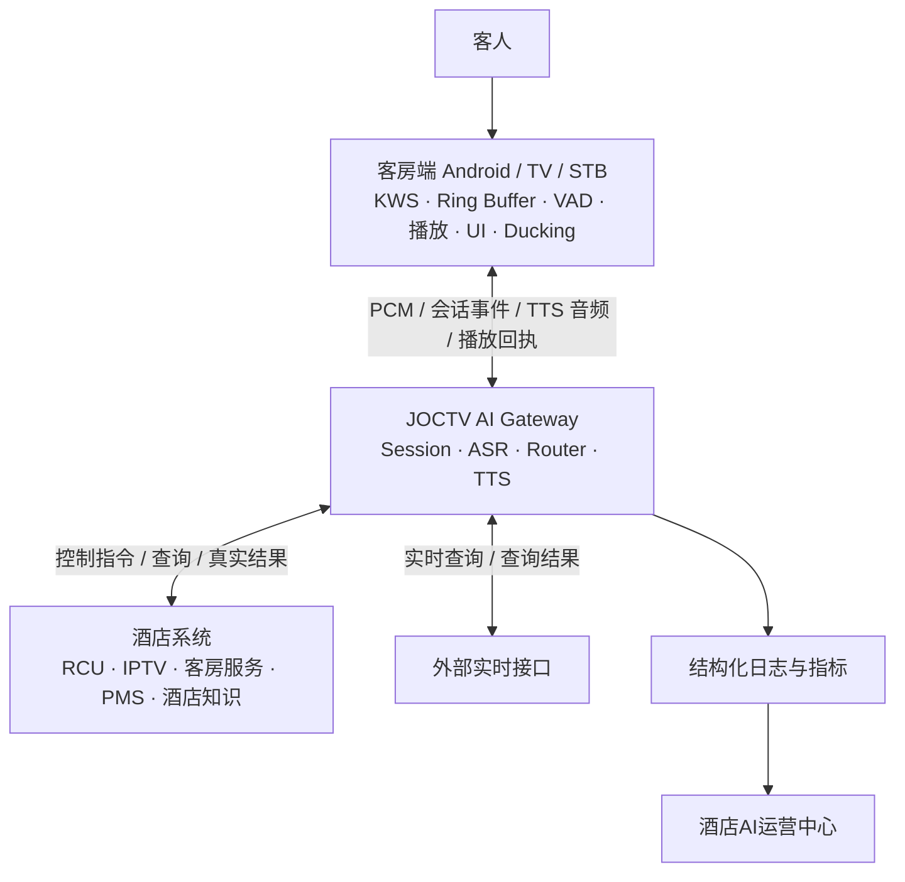
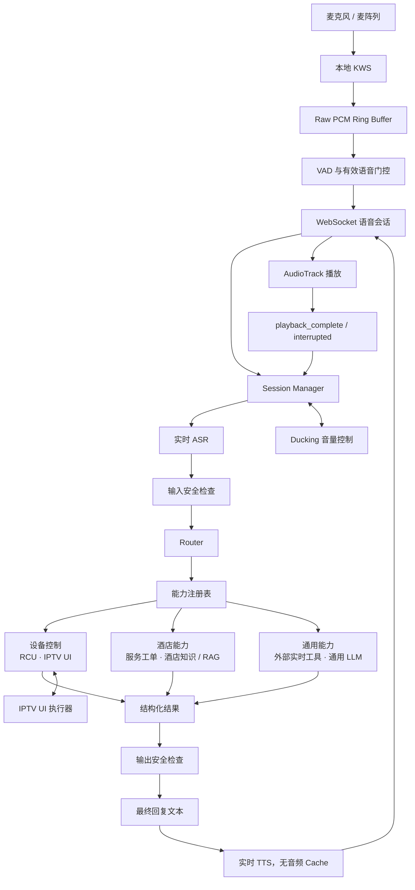
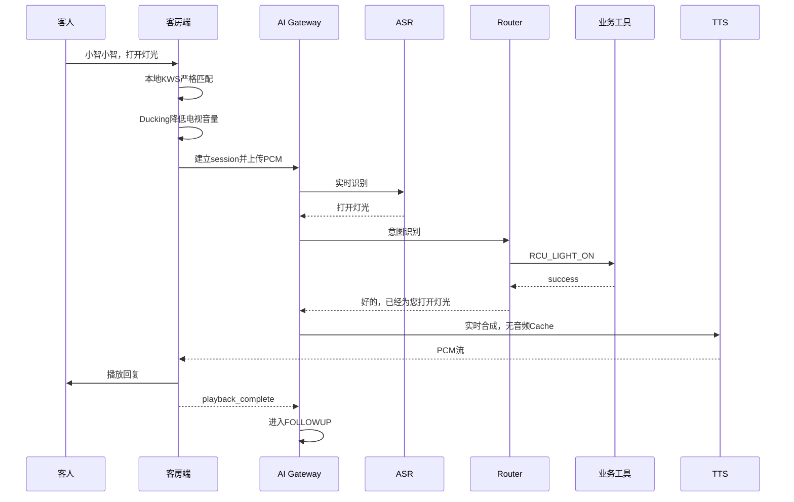
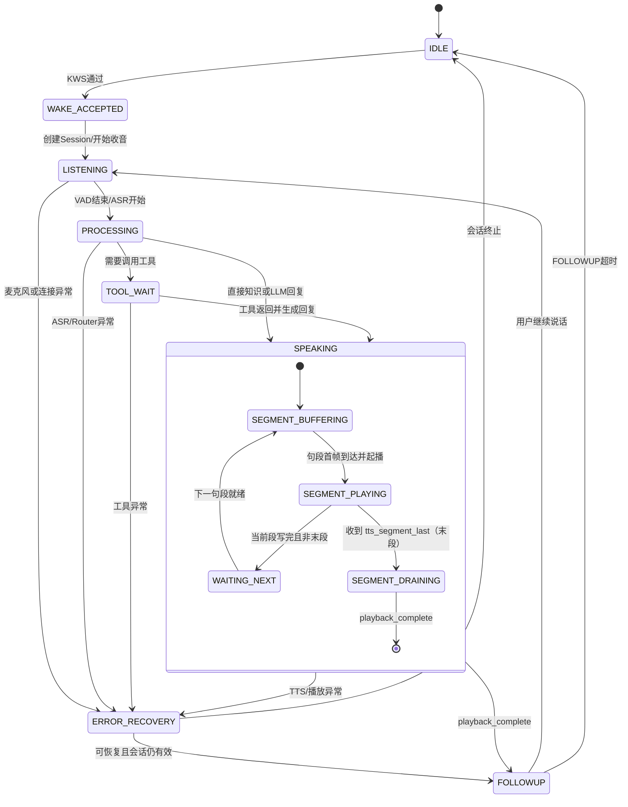
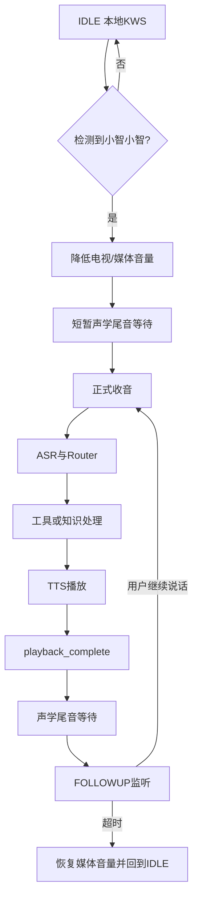
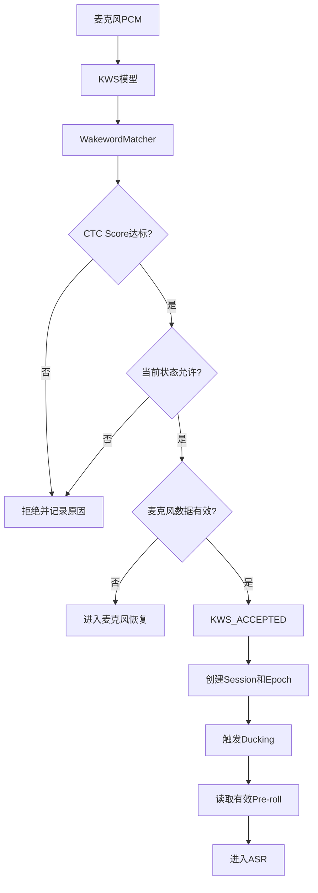
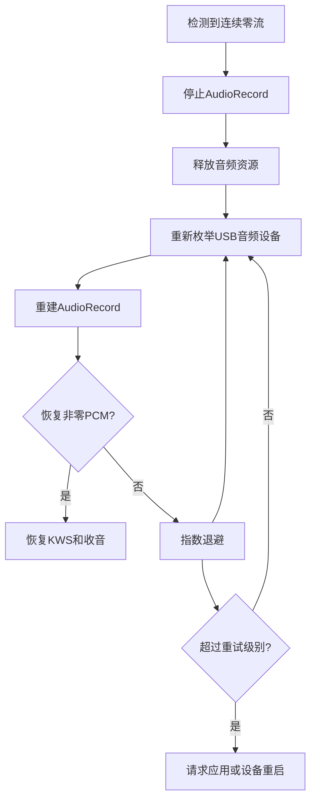
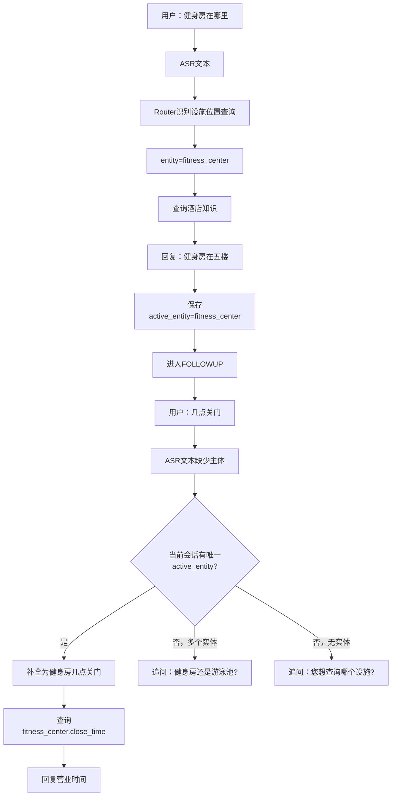
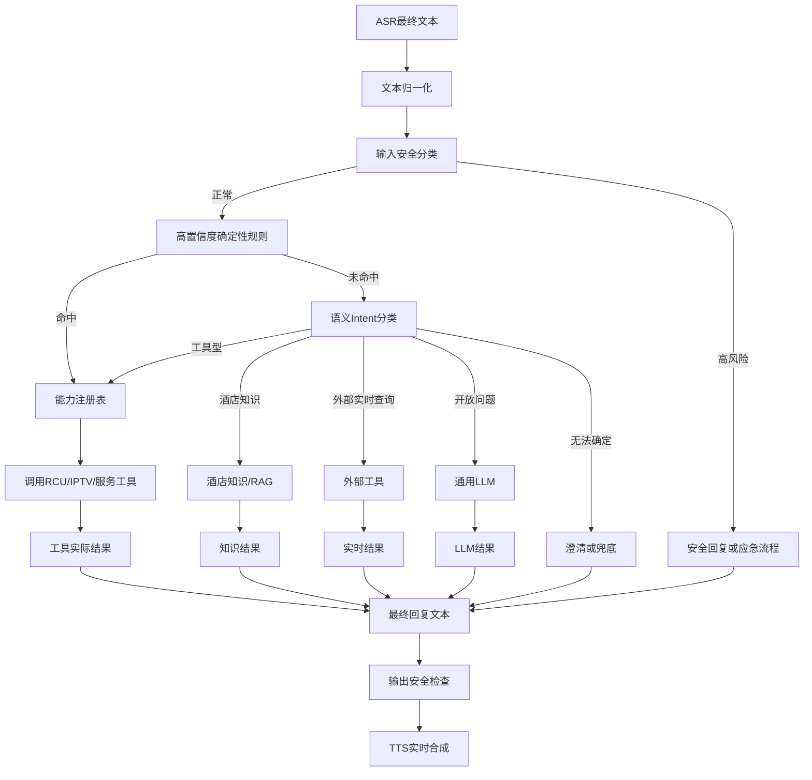

# JOCTV Agent V3.1 架构

| 文档字段 | 当前值 |
|---|---|
| 版本 | V3.1 |
| 文档日期 | 2026-09-01 |
| 项目定位 | 酒店 IPTV AI Gateway / 客房智能语音助手 |
| 当前阶段 | 单设备、单活跃会话、候选链路验证 |
| 交互模式 | 本地 KWS + Ducking 辅助半双工；KWS 式播放打断待现场门禁通过后启用 |
| AEC 状态 | Gateway `USE_AEC=0`；独立候选 Agent 已接通 MIC + AudioPlaybackCapture REF + AECM + KWS，MediaPlayer/HwAvSync 的媒体空场测试已过；真人双讲、近端保真和延迟校准未闭环 |
| 权威文件 | `v3/3.1/JOCTV Agent V3.1架构.md` |
| 总体状态 | `KWS_R6_2_CODE_FIX_PASS`；`KWS_K0_MEDIA_FALSE_WAKE=FAILED`；`KWS_K1=UNVERIFIED_PENDING_ONSITE_RECALL`；`P0_AUDIO_ACCEPTANCE=FAILED`；`PRODUCTION_READY=FALSE` |

## 修改记录

> 修改记录只说明“何时修改了哪个正式章节”。当前实现是否通过，以 §31 状态矩阵和 §32 验收证据为准。

| 日期 | 版本/批次 | 修改章节 | 正式修改内容 | 验证状态 |
|---|---|---|---|---|
| 2026-07-28 | V3.1 初稿 | §1–§32 | 建立本地 KWS、ASR、Router、工具、知识、实时 TTS、运营后台的总体架构 | 初始设计 |
| 2026-07-29 | 音频完整性修订 | §6、§20、§21、§32 | 增加唤醒确认、语义 Segment、20ms Frame、单 `tts_id`/单 Main AudioTrack、partial write 与字节对账 | 候选实现不完整 |
| 2026-07-29 | 会话与运营修订 | §4、§6、§11、§15、§29、§31、§32 | 增加 Session 创建时机、本地提示、Processing Ack、Semantic Router、Function Calling、Trace 与评测 | 分项设计/候选实现 |
| 2026-07-30 | P0 紧急恢复 | §20、§21、§31、§32 | 记录欢迎词中断、长句丢字、客户端流控与本地提示验收失败；冻结生产边界 | `P0/P1=FAILED` |
| 2026-07-30 | 发布与状态纪律 | §4、§28、§30、§31、§32 | 增加 Runtime Shadow/ACK/原子切换、酒店版本字段、Session 分类、L0–L8 DoD | 架构门禁 |
| 2026-07-31 | 实时链路终态 | §9、§11、§20、§21、§32 | 增加四级快速路由、结构化意图/实体/槽位、流式 ASR、动态 Endpoint、本地“好的”、Credit 与降级状态 | 设计完成，部分未实现 |
| 2026-08-01 | AMD 与 A4.2 状态校正 | §9、§20、§21、§31、§32 | 校正 Worker RTF 口径；记录 A4.2 候选 20/20；Credit 与 Job Controller 继续开放 | A4.2 单项候选通过 |
| 2026-08-01 | 长内容与 Intent 校正 | §11、§20、§31、§32 | 废止固定 20 字/固定字符分段；增加 Reply Profile、长故事真流式和餐厅域 Intent 拆分 | 架构已校正，代码待闭环 |
| 2026-08-01 | 文档结构重整 | 全文 | 将原后置修订内容归入对应正式章节；修改记录表格化；废弃方案独立登记；删除流水账式覆盖章节 | 结构检查通过，内容状态仍按 §31 |
| 2026-08-02 | P3 运行时事实同步 | §6.11、§0.2、§11、§31、§32 | §6.11 capability 改为 hello 内联实际字段（`local_prompt_supported`/`available_prompt_ids`/`local_prompt_voice_version`）；旧 `client_capabilities` 字段与跨轮 cooldown 移入 §0.2 废弃；登记 P3 候选/生产部署事实（hash/PID/flags）、客户端 89 测试、facility 异常守卫 `find_facility_entry`、`reply_noack` 语义与 per-decision 幂等；`P0/P1=FAILED`、`PRODUCTION_READY=FALSE`、P3 local_ack 真实下发/facility 真机语音仍 `USER_TEST_REQUIRED` | 架构契约与运行代码对齐；真机验收未完成 |
| 2026-08-02 | P3 local_ack/epoch/owner v2 | §0.2、§4.3、§6.11、§11.10–11.13、§21.7–21.11、§31、§32 | 二次根因：§4.3/§6.11 写 `session_epoch` server authoritative（`ack`/`session_active`/`state_change IDLE·LISTENING`/server VAD `barge_in` 全携 sid+epoch；client 有字段 snap、缺字段旧服 fallback；VAD barge 先 bump 恰好一次、client 不回发；同 epoch 幂等）；§11.10–11.13 写 P3>P2 owner/generation、`LocalAckPlaybackGate` 单 active/唯一终态、`LocalAckFieldPolicy`（按 event kind+ctx 判八字段，wake 永不附）、Writer main defer/release、同 epoch `isCurrent` 不误 cancel、本地"好的"不按字数触发；§21.7 barge/旧 PCM/terminal；§0.2 登记 v1 owner 判字段失败设计；§31/§32 候选代码门禁（Java 115、Python 71、assembleDebug `a4b8537`、候选 server `6a149952` @ `:8774/:8775`） | 候选代码门禁通过；P3 真机交叉/VAD barge/同 epoch/长连接仍 `USER_TEST_REQUIRED`，`P0/P1=FAILED`、`PRODUCTION_READY=FALSE` |
| 2026-08-02 | P3 v2 文档事实校准 | §6.11、§11.10.4、§21.7、§4.3、§31、§32 | 仅文档校准（不改代码/状态）：§6.11 八字段准确列全 8 项并区分基础（`session_epoch`/`prompt_id`）/关联字段；§11.10.4 `asset_fail` 定为内部 `TerminalType`→线上 `error`（wire terminal 只 `complete/error/cancelled`）；§21.7 `local_prompt_cancelled` 区分 client/Gate 侧终态 vs server 不接受（`drop_stale_current_epoch`）+bounded LRU；§4.3/§21.7/§31/§32 "barge 恰好 bump 一次" 限定为"每条被接受的 barge 路径恰好一次"，server VAD+client KWS 可各一路致 epoch 跳过、门禁为偏移不累积；V2 帧 `epoch` 代际隔离 / `global_frame_index` 连续性职责拆清 | 纯文档校准；`P0/P1=FAILED`、`PRODUCTION_READY=FALSE`、候选 v2 仍 `CODE_GATE_PASS`/`USER_TEST_REQUIRED`，不晋级生产 |
| 2026-08-03 | Melo E2E 声学试听 Phase 1 + Kimi 审核校正 | §20.8.5、§21.11、§31、§32 | MeloTTS 分段渐进式播放 synth 层验证（TTFP P50 0.22s / RTF P95 0.108，**synth 层非声学 E2E**）；候选终端当时使用 Wi-Fi 地址 `.113` `com.joctv.mictest.p013` VOICE_RECOGNITION 手动录音 adb 可自动化但两次实验**近零**（asr_near_001 absmax=193/32768=0.0059；v3_capture absmax=140/32768=0.0043，GLM 原记 0.002 有口径偏差）；**缺阳性对照，不能推断扬声器未外放，更正为「当前手动录音配置在本机产出近零（路由/输入源问题）」**；§21.11 D 保持 OPEN；最小解阻 = M3 外置录音设备（最干净），M1 阳性对照探针 / M2 已证可用采集配置为将来可选（本轮禁执行）；§31 维持 `LONGFORM_NARRATIVE_STREAM=DESIGNED_NOT_READY`、`P0/P1=FAILED`、`PRODUCTION_READY=FALSE` | Phase 1 `OPEN_BLOCKED`；synth 层数据禁冒充声学 E2E；D 需 M3/M1/M2 解除 |
| 2026-08-03→08-04 | Melo E2E 隔离链路实施计划 v2（**PLANNED, NOT IMPLEMENTED**） | §20.8.5、§31 | 授权构建隔离 Melo WS Worker(:8787, model=**MeloTTS myshell-ai** commit 209145371c, weights=**MeloTTS-Chinese@af5d207a**, speaker=**ZH(id=1)**)+隔离 Gateway(**:8795**=p013e2e WS_URL, P0_SAFE_BUFFER=0, §20.7 分段)；CV1 协议兼容(sr=**22050**, 20ms=882B)；复用 send_pcm_streaming；**p013e2e 变体已存在**(build.gradle:26 applicationIdSuffix .p013e2e, 源码=/Users/alamn/agent/v3/mictest)，Android 零改动；**L3 分段渐进**(tts_to_file 整段返回, TTFP=首段合成+重采样+传输)；A=22050 S16LE 发线字节(A0=44100 参考), C/C2=a4-evidence；运维: worker先→gateway→APK, health-smoke, kill新PID回滚；计划 v2 见 `/tmp/joctv-glm-melo-e2e-build-plan-v2-20260804.md` | **v2 等待 Kimi 复审**；§31 `LONGFORM_NARRATIVE_STREAM` 维持 `DESIGNED_NOT_READY`；未开始实施 |
| 2026-08-02 | Welcome playback ACK/epoch 双根因闭环（候选） | §0.2、§21.2、§21.8、§21.11、§31、§32 | §0.2 登记 legacy GUARD RTF>1 估算失败设计（`SEVERE_FAILED_RUNTIME_POLICY`）；§21 写 ACK 权威契约（`tts_end/send_complete`≠播完；client 真实 `playback_complete/interrupted` 为完成权威；`ACK_COMPLETE`→tail→LISTENING/go_idle→bump；`timeout=audio_dur+3000ms` 仅 ACK 丢失兜底且必打 `ACK_TIMEOUT`；STALE_ACK 三类拒绝）+ client ACK epoch 捕获（tts_start 捕获本 tts epoch、三个 wire 终态 `complete/error/interrupted` 的四处代码路径均回传捕获值、teardown 清零、新 tts 先 interrupt 旧再覆盖）；§31 候选 server 零代码 + drop-in `97-playback-ack.conf`=`ack` + .p013 APK `2bfd3075` 已装 + 3 轮 welcome `ACK_COMPLETE→go_idle`（异常五类=0）；§32 checklist 增三 wire 终态四处 epoch/路径化 barge STALE_ACK/ACK_TIMEOUT=0/welcome 不外推 | 候选 `CODE_GATE_PASS + WELCOME_REALDEVICE_PASS`（根因 A server ACK 权威真机；根因 B client epoch 捕获=审计+单测，非区分性真机验证）；`PLAYBACK_DURING_EPOCH_BUMP_REALDEVICE` 及多轮 ASR→TTS/barge/local_ack/长连接/听感/P95 `USER_TEST_REQUIRED`；`P0/P1=FAILED`、`PRODUCTION_READY=FALSE`、不晋级生产 |
| 2026-08-02 | P2 Round-8 dormant 部署 + ASR/TTS runtime 同步 | §0.2、§9、§20、§21、§31、§32 | §31 候选运行时事实更新到 Round-8（server `6fb786a0` / protocol `dbf5b2f2` / APK `d4fc5a97` / PID 1043252 / Java 180 / Python 178 / flags LOCAL_WAKE_PROMPT_V31=0 + WAKE_ACK_TIMEOUT_V31=0 + PLAYBACK_ACK_MODE=ack）；§9 ASR 当前实现=batch recognize 固定 VAD_END=30（`NOT_IMPLEMENTED` partial/dynamic endpoint）；§20 TTS 生产 hop25/候选 hop100 RTF 实测；§21 跨 generation Writer 竞态正式约束；§0.2 登记 fixed 600ms VAD_END IMPLEMENTATION_CONFLICT；§32 补 P2 five-field/first-wins/cancel-order/old-callback-zero-wire 门禁 | 候选 `CODE_GATE_PASS + DORMANT_CANDIDATE_DEPLOYED_AUTO_REGRESSION_PASS + USER_TEST_REQUIRED`；P0/P1 FAILED、PRODUCTION_READY=FALSE
| 2026-08-02 | Codex Round-8 REJECT 纠偏（R2+R3，纯文档） | §9.2、§9.4、§9.6、附录E.1、§11.10、§20.2、§21、§31.1.3、§32.19/§32.20 | 应 Codex `ARCH_REVIEW_REJECT`：F1 §9.2/§9.4/附录E.1 把 NPU Paraformer 从"当前主链"改为"独立 POC（未接入 gateway 主链）"，当前主链=Qwen3-ASR GPU 子进程 + CPU SenseVoiceSmall 回退；F2 §9.6 增"当前实现矩阵"（IMPLEMENTED/NOT_IMPLEMENTED/IMPLEMENTATION_CONFLICT 分栏）；F3 §20.2 增 TTS 实测；F4 §21 登记 `A4_EVIDENCE=1` 为 inert/stale（源码无读取/落盘）+ 跨 generation Writer 竞态正式收口顺序；F5 §32.20 增 P2 coordinator 唯一接缝/first-wins/cancel-order/old-callback-zero-wire/dormant≠flag-on + 跨 gen PCM 零污染/同文本 20-run 稳定性门禁；F6 §31.1.3 Credit 行改为"候选 `SEND_DELAY_MS=0`/生产 `=10` 均非 Credit"、APK `2bfd3075`→`d4fc5a97`、P3 测试 120→180；F7 本行记录实际完成内容。**R3 最小纠偏**：C1 §20.2 长回复 2518ms/RTF 1.083 样本纠正为**历史 hop25 FP32（P2-era legacy 播放模式）**、与 FULL_SAFE_BUFFER 拆为独立样本（server 整句等待约 11.7s/client 起播约 0.6s/ASR→首声约 12.5s，非 P50/P95）；C2 §20.2 welcome 描述精确化（first PCM **稳定约 2.17s 但失败实时目标**，1.37x 波动在输出时长而非 first PCM）；C3 §11.10.2 增本地"好的"ASR final 后约 33ms 发声单样本事实（体感改善，非 Main TTS 性能、非 P50/P95）；C4 §32.20 清理旧测试数（115→当前 180，注明 115/120 为历史批次） | 仅文档纠偏，未改代码/服务/APK/部署；P0/P1 FAILED、PRODUCTION_READY=FALSE 不变 |
| 2026-08-06 | 后台 Control Plane 重构 | §22–§30 | 将后台整合为酒店 AI Control Plane；新增酒店配置、房型与客房能力、Capability Center、Knowledge Builder、Skills、External Tool Gateway、安全权限、Trace 闭环和 Hotel AI Package 发布模型；保留 Runtime ACK、期望/实际版本、两级知识版本、用户生命周期和审计约束 | 文档结构与契约校验通过；实现状态仍按 §31–§32 |
| 2026-08-07 | 会议屏双网卡调试基线 | §21、§31、§32 | 明确同一会议屏的有线网卡地址为 `192.168.3.86`、Wi-Fi 地址为 `192.168.3.113`，两者都可用于 APK、ADB、真机和日志调试；用户当前对比观测为两条链路效果接近，正式性能统计必须记录并分组接口类型 | 文档双网卡身份与调试约束已对齐；未修改 APK、Gateway 或设备运行配置 |
| 2026-08-07 | 候选/生产边界与流式层级事实校正 | §9、§20、§21、§26、§31、§32、附录D | 纯文档补丁（未改代码/配置/服务）：§9 增 ASR 流式层级事实表（传输流式 vs 识别非流式）与两级 ASR 正式路线（sherpa-onnx OnlineRecognizer CPU shadow partial+endpoint→Qwen3 final，NPU Paraformer 独立门禁）；§20 增 MeloTTS FT G_1000 CPU 候选真实状态（**候选已测试、生产主链未切换**）、流式四层定义（A 文本/B 声学/C 语义段/D 网络分帧，仅 B 成立称原生流式）、CPU 利用率隔离基准矩阵、短/中/长分层优先级；§21 增 V2.1/V3 下一版会话协议 breaking 改动方向与当前 V2 规范风险；§26 增 Router 阶段顺序与酒店事实只能来自已发布 knowledge_version 约束；§31.1.3 成熟度矩阵补 MeloTTS FT 行；§31.2 实施顺序改为 P0 观测口径+Melo 基线资格；§32 增 AUDIO_PLAY_CALLED 不得冒充真实首响门禁；附录D 增 MeloTTS/sherpa-onnx OnlineRecognizer/PyTorch oversubscription 官方边界 | 纯文档；`P0/P1=FAILED`、`PRODUCTION_READY=FALSE` 不变；MeloTTS FT 候选 `CANDIDATE_TESTED_NOT_PRODUCTION`、用户初步接受 step1000 音色但音色/数字/英文/长句音量/20 轮真机/D 点门禁未过 |
| 2026-08-09 | AEC、SYP-48M 与 KWS 主线校准 | §5 | 分层记录麦克风固件/HAL、Android `AcousticEchoCanceler`、Client 软件 AEC、Gateway 开关；Mac mini 外部扬声器→会议屏 USB 麦受控回录确认应用可见的 48kHz FL/FR 逐样本完全相同，且同一生产 KWS 模型下 48kHz 降采样与当前 16kHz 均为 9/10；正式关闭应用层双声道选择/波束优化路线，生产保持 16kHz 单声道；KWS 主线改为文件级 group-disjoint 重训、推理线程解耦、IDLE 前置门控和真实会议屏测试集 | `APP_LAYER_48K_STEREO_KWS=REJECTED`；复制发生在 DSP/驱动/HAL 的具体层级仍 `ATTRIBUTION_OPEN`；KWS 真实多人验收仍 `USER_TEST_REQUIRED` |
| 2026-08-09 | 晚间 Control Plane 与实时交互规划 | §5、§9–§11、§18–§19、§22、§26–§32、附录 D–E | 校正 R6.2 已移除跨窗口“双小智”合并及 1.mp4 无真实唤醒词的证据；将 KWS 正常召回门设为打断实施前置；明确 ASR 当前仅采集/传输流式、TTS 当前仅语义段/网络分帧而非原生声学流式；增加开放问答 LLM、Prompt Registry、事实与表达分层、自然语言预览、发布进度、外部 API 合规、模型/后台/APK 升级与资源准入 | 架构更新；后台实现任务另行执行；22:48 长测出现 1 次完整四字模型误判，K0 改为 `FAILED`；现场召回与打断仍 `UNVERIFIED` |
| 2026-08-17 | LLM NPU 选型与异构资源定版 | §18、§31、附录 D–E | 通用 LLM 与知识格式化统一选定 AMD Ryzen AI 1.8.0 NPU-only `amd/Qwen3-8B_rai_1.8.0_npu_16K`；目标资源分工固定为 ASR→GPU、TTS→CPU、Gateway/Router→CPU+内存热数据、LLM→XDNA NPU；明确该制品不是 GGUF `Q4_K_M`，必须先经隔离 POC、质量/并发/资源互不干扰门禁 | `MODEL_SELECTED / POC_NOT_DEPLOYED`；不修改当前 ASR/TTS，不代表候选或生产已切换 |
| 2026-08-18 | V2.3 NPU唯一LLM、音色包、天气与单酒店规则冻结 | §18、§22、附录 E | V22_14 已验证 `amd/Qwen3-8B_rai_1.8.0_npu_16K` 在 `:8083` 的XDNA NPU运行、质量/安全/1-2-4并发及混合负载；V23_01开始将后台格式化与隔离网关兜底统一切到8083，并在读回后退出Qwen2.5/8082；冻结线下训练音色包→后台上传试听发布、内网继续明文WS、现有天气方案4小时缓存、数字酒店ID仅超级管理员首次录入 | `NPU_SERVICE_VERIFIED / BUSINESS_CUTOVER_IN_PROGRESS`；ASR/TTS/KWS/AEC/APK冻结，生产8774/8775只读；V23_01通过前不得写成业务切换完成 |
| 2026-08-31 | Qwen3.6 NPU唯一模型定版 | §18、§31、附录 D–E | General LLM 与 Knowledge Build 唯一模型改为 FastFlowLM `qwen3.6-moe:35b-a3b`（`FastFlowLM/Qwen3.6-35B-A3B-NPU2`，Q4NX/NPU2）；126 已完成官方安装校验和真实 `/dev/accel/accel0` 生成证明。后续结构化缺陷只修版本化提示词、紧凑Schema、程序校验与块级恢复，不再切换8B、Qwen3.8、GPT-OSS、Phi、NuExtract3或CPU/GPU路线 | `MODEL_FIXED / NPU_RUNTIME_VERIFIED / FORMAT_PROFILE_PENDING`；当前`:8086`为隔离验证服务，R4完成真实朗廷冷跑、缓存和业务读回前不写成业务切换完成 |
| 2026-09-01 | 知识生产与运行时职责拆分 | §18、§26、§27、附录 B/D/E | 废止客户 AI 主机上的知识格式化、商业模型 API 和格式化 Agent。酒店资料在 JOCTV 公司工作站通过可版本化 Skill + Codex/OpenCode/Claude CLI 等高质量模型生成标准 JSON；酒店后台只负责导入、编辑、冲突检测、导出和全量发布。FastFlowLM `Qwen3.6-35B-A3B-NPU2` 仅承担酒店运行时少量兜底问答，固定 NPU-only，禁止 CPU/GPU 静默回退 | `ARCHITECTURE_FIXED / IMPLEMENTATION_PENDING`；朗廷中英文资料作为首个工作站 Skill 与后台模拟验收样本 |
| 2026-09-01 | Qwen3.5-4B NPU 与知识回答规划 Prompt 定版（候选） | §18.5–§18.7、§26.0、§27、§30.13、§31、附录 E | 真实 KB 大 Prompt 下 Qwen3.6 首句过慢，候选切换为 FastFlowLM `qwen3.5:4b` NPU2；运行时由自由生成改为“Top-K 已发布事实卡 → LLM 只输出 `supported/cards/intent` JSON 计划 → Gateway 确定性组织答案”。固定语义集 26/26、传输 20/20、旧语义 12/12，首个可播放回答 p50 4414ms、最大 5435ms，NPU-only 与生产 drift NONE。测试通过的 Prompt 固化为 `p4_admin/prompt_assets/kb_answer_planner/v1.json`；工作站 `joctv-hotel-kb-skill` 与 Prompt 资产均作为可版本化 GitHub 备份 | `CANDIDATE_READY / BUSINESS_CUTOVER_PENDING`；以后 LLM 模型、Runtime、Prompt、输出 Schema、生成参数和固定语义测试作为同一 Model+Prompt Bundle 一起升级、应用和回滚；酒店用户不得覆盖平台核心 Prompt |
| 2026-08-19 | 播放参考回采校正 | §5 | 平台签名探针在当前 CVTE 固件免人工确认；普通 UID 的 framework MediaPlayer 播放 `1.mp4` 即使底层为 HwAvSync 仍取得真实非零播放 PCM；纠正“硬件/offload 一律不可回采”、UID 1000 一律不可采和 `AudioSource=7` 等于 ECHO_REFERENCE 三个过度结论，定义 REF 来源复用器与正式 AEC 数据流 | `REF_CAPTURE_MEDIA_PLAYER_1MP4=PASS / AEC_NOT_PRODUCTION_READY`；DRM/其它播放器、同步、ERLE、双讲与 KWS/ASR 门禁仍开放；DVB 后续移出产品范围 |
| 2026-08-19 | AEC Agent 候选接线 | §5 | 新增独立 `aecDebug` 包，录音权限与 MediaProjection 串行授权；外部普通 UID MediaPlayer → AudioPlaybackCapture → AECM → KWS/ASR，诊断停止同步封存 MIC/REF/CLEAN；直播产品范围固定为 IP 切片流，DVB 不再作为交付门禁 | `CANDIDATE_CHAIN_PASS / HUMAN_DUPLEX_OPEN`；媒体空场约 14 秒 0 次误唤醒，三路证据无 drop/io error，真人双讲仍待验 |

## 目录

0. 文档使用规则与废弃方案
1. 项目目标
2. V3.1 核心设计原则
3. 总体系统架构
4. 完整语音交互流程与运行时会话
5. AEC 分层能力、KWS 门禁与打断边界
6. KWS 本地唤醒与 Local Prompt
7. 历史唤醒词录音和训练数据
8. Ring Buffer、VAD 与麦克风健康
9. 流式 ASR 实时识别
10. 多轮会话与上下文管理
11. Router、能力注册表与本地处理确认
12. RCU 客房控制
13. IPTV UI 和电视控制
14. 酒店服务请求
15. 酒店知识与自定义信息
16. 周边服务与周边旅游
17. 外部实时查询
18. 通用 LLM 与娱乐能力
19. AI 安全防火墙
20. 流式 TTS 实时合成
21. 播放协议、客户端缓冲与零静默闭环
22. 酒店 AI 运营中心（Control Plane）
23. 酒店管理与系统集成
24. 房型、客房能力、终端与实时会话
25. Capability Center 与统一执行协议
26. 酒店知识中心与 AI Knowledge Builder
27. Skills 管理与 External Tool Gateway
28. AI 安全策略、用户权限与审计
29. 对话记录、Trace、评测与能力增长闭环
30. Hotel AI Package、发布、版本与回滚
31. 实施优先级、当前状态与发布门禁
32. V3.1 验收标准与 Codex 审核清单
结语
附录 A：核心数据流
附录 B：后台运营闭环
附录 C：V3.1 一句话定义
附录 D：官方资料边界
附录 E：AMD 异构资源与开源借鉴边界

---

## 0. 文档使用规则与废弃方案

### 0.1 正式架构与实施状态的关系

- §1–§30 描述正式架构和运行时契约，不按日期堆叠补丁。
- §31 记录当前真实成熟度、候选/生产边界和实施优先级。
- §32 记录可量化验收指标、证据要求和审核清单。
- 修改历史只写在本文开头的“修改记录”表；同一主题的正式内容只保留在所属章节。
- 设计被替换时，在下表保留可追溯结论；不得继续把旧方案写成可执行规范。

### 0.2 已废弃、已失败或证据不足的方案

| 旧方案 | 结论 | 原因与证据 | 替代方案 |
|---|---|---|---|
| ~~按 20 字、20–24 字、10–25 字或首段 18 字决定回答、Segment 或播放模式~~ | `SEVERE_FAILED_DESIGN / DEPRECATED` | 会截断故事和长解释，也会破坏语义、数字、实体和否定关系；字符数只能用于测试分层与异常观测 | §20.7 标点/语义边界 + §20.8.5 Reply Profile |
| ~~Wake Ack 默认走 Server 实时 TTS~~ | `SEVERE_FAILED_DESIGN / DEPRECATED` | 固定提示被绑定到 WebSocket、Worker 冷热状态和 VAD/ASR 时序；实测慢，并存在本地与 Server 重复播放竞态 | §6 APK Local Prompt 主路；Server 仅一次性失败降级 |
| ~~十分钟故事先完整合成、整条收齐后再播放~~ | `SEVERE_UX_FAILURE / DEPRECATED` | 首声等待随故事长度增长，无法形成实时体验 | §20.8.5 `NARRATIVE_STREAM` 文本/音频双流式；门禁未过时标 `LONGFORM_NOT_READY` |
| ~~固定 `sleep/SEND_DELAY_MS` 作为正式流控~~ | `ARCHITECTURE_FAILED / IMPLEMENTATION_CONFLICT_OPEN` | 不感知客户端真实水位，可能同时增加延迟和造成供需倒挂 | §21.9 Client Credit 水位驱动流控 |
| ~~P0 必须先实现多场景 `processing_ack` Prompt Bank~~ | `DEPRECATED_FOR_P0` | 协议名和资源分叉会阻塞最小闭环，并可能重复播放 | §11.10 统一 `local_ack + processing_ok_zh`；旧名只兼容输入 |
| ~~一个广义 `HOTEL_RESTAURANT` 回答位置、时间、菜系、早餐、送餐和预订全部信息~~ | `DESIGN_REPLACED` | 无法根据单一需求直接回答，导致冗长和错误混答 | §11.7.6 拆分餐厅域 Intent |
| ~~仅凭 `underrun_delta=1` 推断尾部约一秒必然被静音~~ | `EVIDENCE_INSUFFICIENT` | underrun 次数不能证明发生时点、持续时间和声学输出 | §21.11 A/B/C/C2/D 分层证据与真实播放头 |
| ~~用收到/预计帧数代替 AudioTrack 真实播放头发送 `playback_complete`~~ | `CANDIDATE_FIXED` | 会产生虚假完成和旧状态污染；A4.2 候选固定文本 20/20 已验证真实播放头路径 | §21.11 真实 written/head/marker 完成判定 |
| ~~CosyVoice2 当前 AMD ROCm bistream 实现直接进入主路径~~ | `VERIFIED_REJECTED_FOR_NOW` | request RTF、过度生成、FP16 稳定性和质量门禁失败 | 保留 §20.8.2 POC 退出条件；当前主路仍按真实状态管理 |
| ~~独立 `type=client_capabilities` 事件 + `local_wake_prompt` / `local_processing_ack` / `prompt_manifest_version` / `prompt_ids[]` 字段~~ | `DEPRECATED / NAMING_REPLACED` | 实际 client/server 已演进为 `hello` 事件内联 `local_prompt_supported` / `available_prompt_ids` / `local_prompt_voice_version`；旧字段名从未在运行代码落地，两套命名并存致契约判定打架 | §6.11 hello 内联字段（当前实际，已对齐） |
| ~~`LOCAL_ACK_COOLDOWN_TURNS=2` 跨轮抑制~~ | `NOT_IMPLEMENTED / DESIGN_DOWNGRADED` | 代码未实现跨轮 cooldown；当前采用 per-decision/utterance 幂等（`decision_id` 由 session+epoch+utterance 派生，轮内 ≤1 次成立）。跨轮 cooldown 会误吞同语义连续有效请求，故有意不实现 | §11.11 per-decision 幂等 + 单 active gate（`LocalAckPlaybackGate` BUSY/terminal 唯一） |
| ~~A4.2 单项通过等于 P0/P1 或 TTS 质量通过~~ | `FALSE_COMPLETION_CLAIM` | A4.2 只证明候选客户端接收、写入、播放头闭环；Credit、Job Controller、本地资源和 Worker 质量仍开放 | §31 状态矩阵逐项晋级 |
| ~~用当前 `owner==P3_PROCESSING` 决定 `local_prompt` 事件是否附 P3 八字段~~ | `SEVERE_FAILED_DESIGN / DEPRECATED` | 回答"现在谁是 owner"而非"本事件属于谁"；owner 在 ACCEPT→claim 窗口/接管/拒绝边界与事件归属不一致，产生 4 串 1 漏：wake 的退役/拒绝/pcm_empty/SPEAKING error 串 processing 字段（server `_exact_match` 误判在途 processing 为 `error`-terminal），反向 processing claim 前 pcm_empty（owner NONE）漏附被 server 第一层校验丢弃、request 卡 `sent` | `LocalAckFieldPolicy.shouldAttach(kind, hasCtx)`：仅 `kind=="processing_ack" && hasCtx` 才附，**不接受 owner 形参**（结构防误用，见 §6.11/§11.10.4） |
| ~~不变式 `activeLocalAckContext != null ⇔ owner==P3_PROCESSING`~~ | `FALSE_INVARIANT / DEPRECATED` | ctx 在 `handleLocalAck` ACCEPT 时即设，owner 在 `playLocalPromptById` tryClaim 时才变 P3，ACCEPT→claim 窗口 `ctx!=null` 但 `owner=NONE`，二者不等价 | ctx（协议回执透传）与 owner（track 播放归属）双状态职责分离；八字段附加按 event kind 判（见上一行） |
| ~~FULL_SAFE_BUFFER / Worker RTF>1 时用 `send_elapsed` 与 `audio_duration` 估算 legacy GUARD 播放完成~~ | `SEVERE_FAILED_RUNTIME_POLICY / CANDIDATE_REPLACED` | 候选 systemd 默认 `PLAYBACK_ACK_MODE=legacy`；legacy 用 `playback_remaining=max(0, audio_duration-send_elapsed)`，RTF>1 时 `send_elapsed>audio_duration` → clamp 0 → `guard_delay≈POST_TTS_GUARD*0.02`(~1s) → 提前 `go_idle/bump`，远早于 client 1s prebuffer + AudioTrack 实际 drain → 真实 ACK 迟到命中 `active_tts_id=None` → `STALE_ACK(tts_id_mismatch)`，welcome 永远拿不到 `ACK_COMPLETE`（2026-08-02 真机复现，全日志 176 条 STALE_ACK 全 `mode=legacy`） | §21.11 ACK 权威：以 client 真实 `playback_complete/interrupted` 为完成权威（`PLAYBACK_ACK_MODE=ack`，候选 drop-in）；`timeout=audio_duration+3000ms` **仅作 ACK 丢失兜底**并必打 `ACK_TIMEOUT`，**非正常完成证据**（不笼统否定 timeout，但 timeout 不得冒充播放完成） |
| ~~固定 `VAD_END=30`（600ms 静音）冒充动态 endpoint~~ | `IMPLEMENTATION_CONFLICT / NOT_IMPLEMENTED` | 当前 gateway 主路径用固定 600ms 静音端点 + 整句 batch recognize；`asr_partial`/`last_voice_ts`/700–1500ms 动态 endpoint/`NO_SPEECH`/`UTTERANCE_HARD`/`LISTENING_HARD` 合同均未实现。ASR 批量识别约 0.60s，完整 P50/P95 尚缺。§9.6 动态 endpoint 仍为正式终态设计 | §9.6 partial + last_voice_ts + 700–1500ms 动态 endpoint（`NOT_IMPLEMENTED`）
| ~~MeloTTS FT 候选已切生产主链 / 70ms TTS / 63ms 长句合成 / AUDIO_PLAY_CALLED 即首响~~ | `FALSE_COMPLETION_CLAIM / NOT_IMPLEMENTED` | 候选 `:8790` Worker 已测试（N=22 样本）但**生产主链未切换**（生产 Gateway PID1656 `:8765` `TTS_BYPASS_8767_URL` 仍指 CosyVoice GPU）；63ms `send_elapsed` 是 Gateway 快速发送，不是合成、不是首响；`AUDIO_PLAY_CALLED` 只是 Client 调用、非声学首响（D 点 `NOT_OBSERVABLE`）；MeloTTS 官方 API 仅 `tts_to_file`，B 层声学生成流不具备、非原生流式 | §20.8.6 流式四层 / §20.8.7 CPU 利用率 / §31.1.4 实施顺序 P0 基线资格门禁 |
| ~~ASR 20ms 上传流式 = ASR 识别流式~~ | `EQUIVOCATION_ERROR` | 20ms PCM 上行是 L1 传输流式（已实现）；L2 partial / L3 动态 endpoint / L4 并发 final 均 `NOT_IMPLEMENTED`；当前 Qwen3-ASR 在固定 VAD_END 后整段 batch recognize、无 partial、`_asr_lock` 并发=1 | §9.6.0a ASR 流式层级事实表 / §9.6.0b 两级 ASR 路线 |
| ~~V2 协议已上线 / Credit 已生效~~ | `FALSE_COMPLETION_CLAIM` | 生产 TTS 会话协议仍 V1；V2 仅规范/候选；Credit 与 Server TTS Job Controller `NOT_IMPLEMENTED`；§21.5.1 四项 V2 风险未统一 | §21.5.1 / §21.5.2 V2.1/V3 ADR |

---

## 1. 项目目标

JOCTV Agent V3.1不是固定命令播放器，也不是依赖预生成语音的演示系统。

目标是建立一套完整、可泛化、可运营的酒店客房AI能力：

```text
用户自然语言
→ 实时语音识别
→ 理解意图和上下文
→ 路由到正确系统
→ 获取真实执行结果或知识答案
→ 形成最终回复文本
→ 实时语音合成
→ 客户端播放
→ 记录结果
→ 分析未解决问题
→ 持续增加能力
```

系统需要支持：

- 客房本地唤醒；
- 自然语言识别；
- 多轮上下文；
- RCU客房控制；
- IPTV UI和电视控制；
- 酒店服务请求；
- 酒店设施与政策查询；
- 周边服务和旅游；
- 天气等实时查询；
- 通用LLM问答；
- 儿童故事和互动娱乐；
- 安全防火墙；
- 设备管理；
- 会话管理；
- 使用统计；
- 未解决问题分析；
- 酒店知识发布和版本回滚。

当前阶段优先证明：

1. 完整业务链路可用；
2. 用户表达不依赖固定句式；
3. ASR和TTS不依赖业务结果Cache；
4. 工具执行结果真实可信；
5. 不出现静默、卡死和旧会话污染；
6. 系统能够通过真实使用数据持续增长能力。

### 1.1 当前实现基线

> 以下为 2026-07-28 的实现现状，用于区分“当前已部署能力”和“V3.1 目标架构”，不代表所有目标项均已闭环。

| 模块 | 当前状态 |
| --- | --- |
| KWS 误唤醒修复 | 已验证 |
| WakewordMatcher | 已部署 |
| KWS Score 双门控 | 已部署 |
| 电话人声误唤醒 | 已修复 |
| VAD `speech_started` 门控 | 已部署 |
| ASR 前有效帧门控 | 已部署 |
| `session_epoch` | 已部署 |
| `utterance_id` | 已部署 |
| Stale ASR/TTS 检查 | 已部署 |
| Playback 协议 | 已部署，仍需完成正式 ACK 切换 |
| CV1 INT8 消融 | 已定位 LLM INT8 导致的部分发音异常 |
| A6R_PC | 已部署，但真机仍出现两个音色 |
| 当前 TTS Cache | 仍存在，`cache_size=87` |
| 麦克风恢复 | 仍需完善 |
| Router 完整能力 | 仍需扩展 |
| 未解决问题运营闭环 | 尚未建设 |

### 1.2 当前 TTS 遗留问题

A6R_PC 主要解决 LLM 动态 INT8 导致的部分 Speech Token 异常，以及“灯”等特定字的发音问题；但真机仍出现两个音色，且日志仍显示 `cache_size=87`，因此不能判定音色一致性问题已经解决。

可能原因包括：

1. 一条回复命中旧 Cache，另一条由 A6R_PC 实时生成；
2. 不同 Cache 音频来自不同历史模型配置；
3. 部分请求仍进入旧 Worker；
4. Speaker 配置或 Fallback 路径不一致。

V3.1 目标路线不再依赖 A6R_PC 和旧音频 Cache，所有最终回复文本均进入统一的实时 TTS 主链。

---

## 2. V3.1 核心设计原则

### 2.1 ASR不缓存识别结果

禁止建立：

```text
某句话或某段音频
→ 历史识别文本
```

每次客人说话，都必须由ASR根据本次PCM实时识别。

原因：

- 客人表达无法预先穷举；
- 可能包含生僻词；
- 可能包含酒店、餐厅、景点和频道名称；
- 可能包含人名、房型和临时活动；
- 不能只支持提前录入的固定命令；
- 不能因为某个表达没进Cache就识别不了。

---

### 2.2 TTS不缓存文本到PCM音频

禁止建立：

```text
回复文本
→ 查询历史PCM
→ 命中直接播放
→ 未命中才实时合成
```

所有最终回复文本，每次都必须进入TTS实时合成。

原因：

- 无法预知全部回复内容；
- Cache hit和Cache miss可能进入不同模型；
- 旧Cache可能来自INT8、FP32或不同speaker；
- 会出现同一助手的两个音色；
- 模型升级后可能错误复用旧音频；
- Cache miss路径可能没有得到充分验证；
- 不能因为一段文字未被缓存就没有声音。

#### 2.2.1 瞬时 PCM Buffer 不属于音频 Cache

为支持 §20.7 语义句段流水线和 §21 Audio Segment Protocol V2 的连续播放，TTS 链路允许在内存中保留一个**瞬时 PCM Buffer**，仅用于把刚刚合成出来、尚未写完 AudioTrack 的 PCM 暂存一下，等下游消费。它和被禁止的"文本→PCM Cache"完全不是一回事。

边界写死，避免变成事实上的音频 Cache：

| 维度 | 规则 |
|---|---|
| 生命周期 | 仅在当前 `tts_id` 活跃期间存在；`tts_id` 进入终态（`playback_complete` / `playback_interrupted` / `tts_error` / `timeout`）后立即整体释放 |
| 作用域 | 仅承载**本次合成**的 PCM；禁止跨 `tts_id` 复用、禁止跨 `session_epoch` 复用、禁止跨设备复用 |
| 落盘 | 永不落盘；不写文件、不写 SQLite、不写 SharedPreferences、不写 SD 卡 |
| 命中查询 | 不存在"文本命中 PCM"的查询路径；不存在 hash→PCM 的反查表；不存在 LRU 淘汰逻辑 |
| 容量 | 受单个 `tts_id` 回复长度上限约束；不允许为"未来可能的回复"预分配大块 PCM |
| TTL | 即使终态未及时回收，也必须有 TTL 兜底回收（建议 ≤ 60s），防止异常路径泄漏 |
| 可观测 | 必须可观测当前未释放的瞬时 Buffer 数量、所属 `tts_id`、字节数；回收后必须打 `PCM_BUFFER_RELEASED` 日志 |

判定标准：**只要存在"输入文本→查表→返回历史 PCM"的路径，就算 Cache**。瞬时 Buffer 不允许有这条路径，它只是字节管道，不是 KV 存储。

**** 跨 Segment 复用同一 `tts_id` 上下文不构成 Cache：

- §20.7 语义句段流水线中，同一 `reply_text` 切出的多个 Segment **共用一个 `tts_id`、一次模型实例、一个 speaker 上下文**，这是"一次回复内部的流式合成连续性"，不是"文本命中历史 PCM"。
- Segment 只是逻辑切分单元；跨 Segment 不存在"段 N 命中段 N-1 的 PCM"的反查路径。
- 一旦 `tts_id` 进入终态，整条回复的全部瞬时 Buffer（含所有 Segment）立即释放，不保留任何可供下次回复复用的字节。

---

### 2.3 允许保留的缓存和配置

禁止的是**业务结果Cache**，不是所有运行时优化。

| 内容 | 是否允许 | 说明 |
|---|---:|---|
| ASR识别结果Cache | 否 | 每次必须实时识别 |
| TTS文本到PCM Cache | 否 | 每次必须实时合成 |
| ASR模型权重常驻 | 是 | 避免重复加载 |
| TTS模型权重常驻 | 是 | 避免重复加载 |
| NPU编译Cache | 是 | 属于模型运行优化 |
| ROCm Kernel Cache和预热 | 是 | 降低首次延迟 |
| Tokenizer资源 | 是 | 模型运行依赖 |
| ASR热词 | 是 | 提升酒店专有词识别 |
| ASR上下文偏置 | 是 | 提升当前酒店词汇概率 |
| Router规则 | 是 | 业务路由配置 |
| 工具Schema | 是 | 定义系统能力 |
| 酒店知识 | 是 | 酒店实际信息 |
| RAG索引 | 是 | 知识检索能力 |
| 固定回复文本模板 | 是 | 固定文本，不固定音频 |
| 会话内上下文 | 是 | 仅在当前会话短期有效 |

---

### 2.4 固定的是业务规则和文本，不是音频

例如RCU开灯成功后，可以固定回复文本：

```text
好的，已经为您打开灯光。
```

但每次仍然执行：

```text
回复文本
→ TTS实时合成
→ 新PCM
→ 播放
```

不能固定为：

```text
light_on_success.wav
```

酒店早餐、健身房、游泳池等内容也可以固定为结构化数据或文本，但最终音频必须实时生成。

---

### 2.5 LLM负责理解和表达，工具负责事实和执行

```text
LLM：
理解自然语言
理解上下文
提取参数
选择工具
组织回复

工具：
控制设备
创建工单
查询酒店数据
查询实时天气
查询航班、高铁、股票等实时信息
```

LLM不能：

- 凭记忆猜天气；
- 猜股票价格；
- 猜航班状态；
- 猜酒店营业时间；
- 未经白名单直接执行设备命令；
- 在工具未返回成功前声称“已经完成”。

---

## 3. 总体系统架构

### 3.1 系统分层与外部关系



### 3.2 AI Gateway 语音主链与结果闭环



---

## 4. 完整语音交互流程与运行时会话

### 4.1 标准流程

图中的“业务工具”包括 RCU、IPTV、酒店服务、酒店知识和外部实时工具。



**完整事件编排（含 Wake Ack / Processing Ack）：**

上述 mermaid 只画了"Wake+Command 一句话"的最简路径。完整编排必须包含本地提示环节，对齐 §4.4–§4.7（Session 创建时机与 Processing Ack）和 §32.12–§32.16（端到端真实事件打点）：

```text
IDLE
→ KWS_ACCEPTED
→ 创建 session_id / session_epoch（§4.4，必须在 Wake Ack 播放前）
→ 播放本地 Wake Ack（§6.7–§6.11 Local Prompt Assets，非业务 Cache）
→ LISTENING（声学尾音等待后开放收音）
→ VAD_END → ASR_FINAL → ROUTE_DECISION
→ [可选] 播放 Processing Ack（§11.10–§11.13，由 LatencyPredictor 决定是否触发）
→ TOOL / LLM / KNOWLEDGE
→ REPLY_TEXT → TTS → PLAYBACK（由 PlaybackArbiter 调度，禁止与 Local Prompt 重叠）
→ playback_complete
→ FOLLOWUP（只能由 Main TTS 的 playback_complete 触发，Local Prompt 完成不触发）
```

- Wake-only（只说"小智小智"）→ 播 Wake Ack → LISTENING。
- Wake+Command（"小智小智，打开灯光"）→ 跳过 Wake Ack → 完整 PCM 送 ASR（对齐 §6.7）。
- Local Ack 只在 Router 输出 `ack_eligible=true` 且 Main TTS 尚未实际起播时触发，每轮最多 1 次；LatencyPredictor 仅作竞态仲裁和观测，不使用固定 700ms 单一硬门。

---

### 4.2 会话状态



**句段子状态说明：**

`SPEAKING` 仍是顶层状态，**不把每个 Segment 提升为顶层状态**。Segment 只是 `SPEAKING` 内部的逻辑管理单元，用于驱动"句 0 播放期间生成句 1"的流水线。该细化只在 `SPEAKING` 期间生效，不改变 `SPEAKING` 在主状态机里的终态契约（仍只能由 `playback_complete` / `playback_interrupted` / `tts_error` / `timeout` 退出）。

| 子状态 | 含义 | 进入条件 | 退出条件 |
|---|---|---|---|
| `SEGMENT_BUFFERING` | 正在接收并缓冲当前句段 PCM（20ms Frame 逐帧入队），AudioTrack 尚未/已暂停写入当前段 | `tts_segment_start` 到达，或上一段进入 `WAITING_NEXT` 后下一段就绪 | 当前段累积达到 SHORT/NORMAL/SAFE 自适应启播阈值且 AudioTrack 可写 → `SEGMENT_PLAYING` |
| `SEGMENT_PLAYING` | 当前句段正在 AudioTrack 连续播放（20ms Frame 边界逐帧写入），并行接收后续段 Frame | 当前段首帧开始写 AudioTrack | 当前段全部 Frame 写完：非末段 → `WAITING_NEXT`；末段（收到 `tts_segment_last`）→ `SEGMENT_DRAINING` |
| `WAITING_NEXT` | 当前段已写完 AudioTrack，等待下一段 Frame 到达（流水线衔接窗口） | 当前段最后一帧写完且还有后续段 | 下一段 `tts_segment_start` 或首 Frame 到达 → `SEGMENT_BUFFERING` |
| `SEGMENT_DRAINING`（项目状态名，**非 Android SDK `drain()` API**） | 最后一段已写完 AudioTrack，等待播放头追上目标 written frames（项目自定义完成判定 + 超时保护） | 最后一段的 `tts_segment_last` 已发且全部 Frame 已写 | 播放头到达目标 → `playback_complete` |

---

### 4.3 ID和代际控制

每一层必须携带：

```text
hotel_id
room_id
device_sn
session_id
session_epoch
utterance_id
asr_task_id
tool_call_id
tts_id
```

作用：

- 防止旧ASR结果污染新会话；
- 防止旧工具结果触发新TTS；
- 防止旧TTS在新会话播放；
- 防止客户端接收过期PCM；
- 支持后台完整追踪每一轮交互。

**`session_epoch` 权威与代际对齐契约（候选 `server_phase2_candidate.py` + 客户端 `SessionEpochTracker` 已实现）：**

- **server authoritative**：`session_epoch` 以 server 为权威。Gateway 在所有代际消息携带 `session_id + session_epoch`：`ack`（hello 分配，epoch=0）、`session_active`（wake bump 后）、`state_change IDLE`（go_idle bump 后）、`state_change LISTENING`（barge 后回声 / FOLLOWUP / ACK_INTERRUPTED 补转）、server VAD `barge_in`。
- **client snap 优先**：client 收到带 `session_epoch` 的代际消息时**无条件采用 server 值并 sync Gate**（不受 `SESSION_ON_WAKE_V31` 限制）；仅当字段缺失（旧 server `server.py`）才退化为 client 自增（仅 `session_active`/`state_change IDLE` +1，`LISTENING` 不 bump 以防 followup 误增）。snap 幂等：同值重复到达不漂移。
- **每条 barge 路径恰好 bump 一次**：`barge` 有两条独立协议路径——server VAD 检出（`on_voice_frame` `USE_BARGE`）与 client KWS 上行 `barge_in`；**每条被接受的路径**在 server 侧于任何代际消息或状态转换之前 `_bump_on_barge_in` 恰好一次，此后 `barge_in` 与紧随的 `state_change LISTENING` 均携带该路径 bump 后的新 epoch。同一物理说话若被两路独立检测，会各 bump 一次、epoch 可能**跳过**（如 +2）——门禁是**每条路径无重复 bump、client 最终 snap 到 server epoch、epoch 偏移不累积**，不要求一次物理事件全局只 +1。client 收到下行 `barge_in` 立即 snap + sync Gate + 取消本地提示 + 停 Main + 转 LISTENING，**不回发** `barge_in`（防 server double bump）。client 本地 KWS barge 上行 `barge_in` 后，由 server bump + `state_change LISTENING` 回声对齐。
- **同 epoch 幂等不误 cancel**：同一 epoch 的重复代际消息（barge 回声 / server 补转 LISTENING / followup）不得取消在途 processing ack；变更判定由 `LocalAckPlaybackGate.isCurrent(sid, epoch)` 完成，仅代际真变化才 cancel + resync（见 §11.13）。
- **barge 后旧 PCM 隔离**：bump 后旧 `session_epoch` 的 PCM/binary frame 由 client 丢弃机制隔离：V2 帧 `session_epoch` 做**代际隔离**、`tts_id_hash`/`global_frame_index` 做**身份与连续性**校验（`global_frame_index` 是帧序号/连续性主键，不代表 epoch）；V1 用 `barge_stop + stopPlayer`。旧帧绝不播进新会话。

---

### 4.4 VoiceRuntimeSession 创建时机

**正确流程：**

```text
IDLE
→ KWS_ACCEPTED
→ 创建 session_id / session_epoch（Session 必须在本地寒暄播放前创建）
→ 记录 wake_language 和 wakeword_id
→ 播放本地 Wake Ack（Local Prompt Assets，见 §4.4–§4.7）
→ Wake Ack 完成
→ 声学尾音等待（短）
→ LISTENING
```

**核心约束：Session 必须在本地寒暄（Wake Ack）播放前创建。**

原因：

- **重复唤醒**：每次唤醒必须有唯一 Session 身份，防止重复唤醒复用旧 Session。
- **Session 隔离**：不同唤醒的对话上下文必须隔离。
- **网络重连**：WebSocket 重连后必须能恢复 Session 身份。
- **Prompt 取消**：Wake Ack 播放期间用户再次唤醒，必须能取消旧 Prompt，旧 Prompt 不能污染新 Session。
- **stale 事件**：stale ASR/TTS 事件必须有 Session 身份进行代际校验（§4.3 / §21.7）。
- **计时和 Trace**：端到端性能打点（§29.1–§29.2 和 §32.12）的 Trace 必须有 Session 身份才能聚合。

---

### 4.5 Gateway 未连接时的 provisional_session

如果唤醒发生时 Gateway 尚未连接（WebSocket 断开或冷启动）：

```text
1. APK 先创建 provisional_session_id（本地临时 Session）
2. 本地 Wake Ack 立即播放（不阻塞本地提示，见 §4.4–§4.7）
3. 并行：尝试连接 Gateway
4. 连接成功后，将 provisional_session_id 绑定到服务器正式 session_id
5. 后续 ASR/Router/TTS 请求使用正式 session_id
```

**硬约束：**

- `provisional_session_id` 不阻塞本地 Wake Ack 播放。
- Gateway 连接成功前，不发送 ASR 请求（ASR 需要服务端）。
- `provisional_session_id` 必须有 TTL（建议 5s），超时未绑定则取消，本地提示播完后直接回 IDLE。

---

### 4.6 本地唤醒提示不写入 LLM 对话历史

**硬约束：** 本地寒暄（Wake Ack）记录为事件 `local_prompt / wake_ack`，但**不写入 LLM 对话历史**。

原因：

- Wake Ack 是固定提示语，不是助手对用户请求的实质回复。
- 写入 LLM 历史会污染下一轮 LLM 的上下文（LLM 会以为"我刚说过您好，需要什么帮助"）。
- LLM 历史只记录真实用户请求和真实助手回复。

**事件记录（写入 Trace，不写入 LLM 历史）：**

```json
{
  "type": "local_prompt",
  "subtype": "wake_ack",
  "session_id": "session_uuid",
  "session_epoch": 17,
  "language": "zh-CN",
  "prompt_id": "wake_ack_zh",
  "voice_version": "cosyvoice_v1_rocm_fp32_speaker_A_rev_20260729",
  "played_at": "2026-07-29T20:01:23.456+08:00",
  "duration_ms": 1820,
  "completion": "playback_complete"
}
```

---

### 4.7 Session 类型与隔离

> §24.9（AI Session 管理）和 §4.4–§4.7 定义语音运行时会话。管理员登录、发布任务、语音交互和人工接管必须使用四种独立 Session，禁止复用状态或身份。

| Session 类型 | 作用域 | 存储 | 生命周期 |
|---|---|---|---|
| **AdminAuthSession** | 后台管理员登录态 | 持久化（SQLite `auth_sessions`，§28.8） | 登录创建，超时/登出/密码修改/禁用时撤销 |
| **VoiceRuntimeSession** | 一次语音交互会话（KWS→...→FOLLOWUP 结束） | Gateway 内存 + Trace | KWS_ACCEPTED 创建，§4.4，FOLLOWUP 超时/SESSION_CLOSING 销毁 |
| **PublishJobSession** | 一次知识/能力发布 Job 的执行态 | 后台 DB（`publish_jobs`） | submit 创建，APPLIED/FAILED/ROLLED_BACK 终态 |
| **StaffTakeoverSession** | 前台人工接管某语音会话的信令态 | 后台 DB（人工接管状态机） | REQUESTED→...→RELEASED/FAILED |

**硬约束：**

- 四类 Session 的 ID 命名空间必须独立，禁止复用同一 session_id 表达不同含义。
- AdminAuthSession 必须持久化，服务重启后仍可验证（§28.8）。VoiceRuntimeSession 的 `session_epoch` 以 Gateway 为权威（§4.6 / §4.3），客户端不得自增代替。
- StaffTakeoverSession 只做信令和文本链路，不执行高风险设备动作（§15 G5）。

---

## 5. AEC 分层能力、KWS 门禁与打断边界

### 5.0 2026-08-09 实测快照（AEC 分层 + SYP-48M 采集格式校准）

> 本节保留 2026-08-09 真机实测的历史状态，并由 §5.0.1 的 2026-08-19 结果校正。AEC 必须按“麦克风固件/硬件处理、Android HAL、Android `AcousticEchoCanceler`、应用软件 AEC、Gateway 开关”分层陈述，禁止再用其中一层的结果代替整条业务链验收。应用软件 AEC 只有在取得真实播放参考、完成时间同步并通过双讲门禁后才能启用；“使用硬件解码/HwAvSync 就一定无法回采”已被新证据否定，但完整 AEC 仍未通过。

#### 5.0.1 2026-08-19 播放参考回采校正（`1.mp4` 真机）

- 测试源为会议屏现有 `/sdcard/1.mp4`（H.264 + AAC 48kHz 双声道）。新增普通 UID 测试 App `com.test.videoplay`，使用 framework `MediaPlayer`、`USAGE_MEDIA`、`CONTENT_TYPE_MOVIE` 播放；`dumpsys media.audio_flinger` 同时确认底层为 `PathType=HwAvSync`。
- 平台签名的 `com.test.pccap`（当前厂家固件下 UID 1000）启动了系统 `MediaProjectionPermissionActivity`，但系统自动返回授权，无需人工点击。此免确认行为是**当前 CVTE 固件实测能力**，不得外推为所有 Android 设备的平台签名通用规则。
- 两次独立采集均得到持续非零的 48kHz/S16_LE/双声道播放 PCM。受控复跑文件长 `10.112s`、非零样本占比 `89.5%`、左右声道相关系数 `0.725`；与 `1.mp4` 源音轨连续 5 秒频谱序列匹配得分 `0.752`。因此普通 UID App 的 MediaPlayer/HwAvSync 路径在本机**可以**提供播放参考；旧“真实 offload 视频参考必为零”的笼统结论作废。
- 上述结果只证明 `REF_CAPTURE_MEDIA_PLAYER_1MP4=PASS`，不证明 DRM/安全通路、所有投屏 SDK 或所有 vendor offload 路径均可回采。尤其“UID 1000 的播放一律不路由给采集方”不是 Android 官方契约。MiniPlayer/DVB 的旧零数据仅保留为历史诊断；产品已决定直播统一采用 IP 切片流，DVB 不再是交付范围或 AEC 门禁。
- Kimi 探针把 `AudioSource=7` 标成 `ECHO_REFERENCE`，但 Android 公开常量 7 实际是 `VOICE_COMMUNICATION`，真正的 `ECHO_REFERENCE` 是 1997；因此探针报告中的 `ECHO_REFERENCE: OK/zero` 无效，不得作为 HAL Echo Reference 结论。
- 当前探针不是生产采集服务：`onBind()` 返回 `null`，没有 AIDL/共享内存、MIC+REF 时间戳、漂移校准、AEC 算法或清洁近端输出；Manifest 还使用高风险 `sharedUserId=android.uid.system`。它只能用于能力探测，不得直接并入 Agent。
- 可复现播放器源码与构建脚本在 `v3/3.1/aec_test/videoplay/`；两轮原始结果、PCM、时间线与 SHA256 证据在 `v3/3.1/aec_test/evidence/20260819-videoplay-mediaplayer-platform-capture*/`。
- JOCTV Agent 已新增独立候选 `com.joctv.mictest.aec`：普通应用授权 MediaProjection 后，外部 `com.test.videoplay` 使用 framework MediaPlayer 播放 `1.mp4`，Agent 同时取得 MIC/REF/CLEAN 并把 CLEAN 送入既有 KWS/ASR。`20260819-agent-mediaplayer-aec-run5` 中 `accepted=written=3350`、`dropped=0`、`io_errors=0`、`capture_ready=true`、`processed_frames=1479`、`farend_nonzero_frames=1165`；约 14 秒媒体空场 `matched=0 / accepted_wake=0`，AEC 段整体幅度降低约 `2.95dB`。这证明候选数据流成立，不等于真人双讲质量通过。

**目标软件 AEC 数据流**

```text
MIC（SYP-48M 近端+扬声器空气回声）
  + REF 来源复用器
      1. JOCTV TTS：直接复用合成器输出 PCM（不重新抓播放）
      2. IPTV UI / VOD / IP切片直播 / 投屏：首选 framework MediaPlayer；格式或 HLS 兼容不足时才用 Media3/ExoPlayer
      3. 上述外部播放器统一使用 USAGE_MEDIA，由 AudioPlaybackCapture 提供 REF（逐播放器/投屏 SDK 真机门禁）
      4. DRM / vendor 安全通路若禁止回采则标记 blind，改走厂家 HAL/SPK_IN reference；DVB 不属于本项目交付范围
  -> 单调时间戳 + 环形缓冲 + 延迟/漂移校准
  -> 软件 AEC
  -> CLEAN_NEAR_END
  -> KWS / VAD / ASR
```

调试期允许业务 App 使用 MediaProjection，每次投屏会话重建时由用户确认。正式版由厂家平台签名后，必须用**最终 Manifest 与最终 UID**复测免确认；当前证据同时包含“平台证书 + `sharedUserId=android.uid.system`”，不能单独证明只有证书就足够，且正式包优先避免 system shared UID。正式拆分若采用独立特权服务，特权进程应完成回采、同步和 AEC，只向 Agent 输出 `CLEAN_NEAR_END`；禁止把未受控的原始节目 PCM 当成 ASR 输入，也不默认跨进程暴露受保护内容。

**AEC 现状**

| 层级 | 状态 | 说明 |
|------|------|------|
| 麦克风固件 / 硬件处理与 HAL AEC | `PREVIOUSLY_VERIFIED / ATTRIBUTION_OPEN` | 既有实测记录为回声压制约 16dB、近端保留、双讲可用；但当前主链实际路由为 USB SYP-48M `card4/device0`，不能仅凭 `VOICE_RECOGNITION(6)` 把效果归因于 MT9679 `vocsndcard/voc_hw_aec`。设备版本、路由和 effect chain 必须同时留证 |
| Android `AcousticEchoCanceler` | `NOT_ENABLED` | 2026-08-09 授权后的独立探针用 COMM(7) 连续 3/3 次成功录音，但 `AcousticEchoCanceler.create(session)` 未取得可启用实例，均为 `AEC_enabled=false`；这否定“COMM 本身不能录”，但不证明 COMM AEC 生效 |
| Client 软件 AEC（MediaProjection + AECM） | `CANDIDATE_CHAIN_PASS / HUMAN_DUPLEX_OPEN` | 独立 `aecDebug` 已把普通 UID framework MediaPlayer 的真实 REF 与 MIC 接入 AECM，并输出 CLEAN 给 KWS/ASR；媒体空场约 14 秒 0 次误唤醒、三路证据无 drop/io error。TTS 应直接复用生成 PCM。真人双讲近端保留、延迟/漂移校准、ERLE 分场景和 KWS/ASR 召回回归未通过，当前不得进入正式包 |
| Gateway `USE_AEC` | `0` | Gateway 开关与 Client 软件 AEC 不是同一个层级；当前保持关闭，§5.1–5.6 的正式能力边界仍适用 |

**录音链路**

- KWS 与 ASR 共用单路 REC（`VOICE_RECOGNITION`）；既有 AEC 效果记录适用于相应硬件/固件组合，但当前 USB 路由下的具体处理归属仍按上表标为 `ATTRIBUTION_OPEN`；
- 旧的 MIC(唤醒) + REC(ASR) 双 AudioRecord 方案暂未启用，当前真机配置为单 REC 共用。
- 当前真实格式链为：SYP-48M USB/HAL `48kHz + S16_LE + 2ch(FL/FR)` → Android AudioFlinger 重采样/下混 → App `16kHz + S16_LE + MONO` → 每 20ms 320 样本送 KWS、Ring 与上行。代码请求的是 `CHANNEL_IN_MONO`；运行日志中的 `STEREO 16k OK` 是过期错误文案，禁止据此判断客户端收到双声道。
- 2026-08-09 独立探针先以 MIC(1) 和 REC(6) 分别采集 48kHz 双声道；首轮测试时会议屏前**没有现场人员说话**，信号仅包括安静环境、探针校准音，以及“既有真人唤醒词 WAV 经会议屏自身扬声器循环播放”的自播放回录。该轮只用于验证格式和声道，不用于判断近端唤醒效果或 AEC。
- 为排除会议屏自播放可能被基础 AEC/HAL 处理的干扰，补充了“Mac mini 本地外放、会议屏只录”的外部声源对照：生产 App 停止占麦，Mac mini 一次播放严格 30 秒序列（`006_positive.wav`/`007_positive.wav` 交替，各 5 次，每段后 0.5 秒静音），探针分别用同一路由 REC(6) 录制 34 秒 48kHz/双声道和 16kHz/单声道。两轮均路由至 SYP-48M `card4/device0`，`zero_frames=0`、`restarts=0`；整段 RMS 分别为 4590.2 与 4604.0，音量差约 0.3%。因此会议屏能够录到 Mac mini 的外部声学播放，且该测试不依赖会议屏自身播放器。
- 上述外部声源的 48kHz 录音中，FL/FR 在全体样本和有声样本均逐样本 `100%` 相等，相关系数 `1.000`，差分/侧声道 RMS=`0`。这证明当前 Android 应用可见的 SYP-48M 双声道是两份完全重复的数据，没有可供应用层波束形成或方向选择的声道差异。复制最可能发生在麦克风 DSP、USB 驱动或 Android HAL 上游，但未取得厂家固件/原始阵列通道证据前，具体层级仍为 `ATTRIBUTION_OPEN`；该归属缺口不影响关闭应用层双声道优化路线。
- 使用从当前设备拉取且哈希一致的生产 `encoder.onnx(.data)`、`am.mvn`、`tokens.txt`，按生产 1.6 秒窗口/0.4 秒步进和当前匹配规则离线复放：原生 REC(6) 16kHz=`9/10`，REC(6) 48kHz FL 高质量降采样至 16kHz=`9/10`，RMS 对齐后仍=`9/10`；两条路径失败的都是第一段 `006`，其余均以完整四字规则命中。该组只有 2 条不同源语音各重复 5 次，足以否定“48kHz 在该场景已有明显收益”，但不能代替多人、多距离统计。
- **决策：`APP_LAYER_48K_STEREO_KWS=REJECTED`。** 正式主链固定为 16kHz 单声道；不再把“真人 48k/16k A/B”作为 KWS 主线前置条件。近端真人、多距离、多角度测试仍必须完成，但用途改为验收 16kHz KWS 的真实召回率与误唤醒率，而不是继续寻找重复声道差异。
- 本轮原始 PCM 与诊断日志保存在 `v3/3.1/aec_scan_results/stereo_probe_20260809/`；禁止只引用总结而不保留 `diag_*`、采样率、声道数、route、frame/zero/restart 等原始证据。

**48kHz 双声道路线关闭与重开条件**

- 禁止把生产采集改为 48kHz 双声道，禁止增加“动态选声道/波束 manager”，也不再为重复声道安排普通真人 48k/16k 对比；
- 只有厂家提供独立阵列原始通道/不同波束/clean+ref 的明确接口，或在绕过当前 DSP/驱动/HAL 后取得 `FL != FR` 的原始证据，才允许重新开启该路线；
- 即使未来取得不同原始声道，仍须在同一文件级 disjoint 测试集上证明一次唤醒率绝对提升至少 5 个百分点，且电视/歌曲误唤醒不增加、采集线程无丢帧、KWS P95 不恶化，才能进入候选 APK。

**KWS R6.2 候选规则与证据校正（防歌声/电视误触发）**

| 项 | 架构旧记录 | R6.2 候选值 | 当前策略与证据 |
|------|------|------|------|
| 完整 4 字唤醒阈值 | 0.85 | **0.60** | `WakewordMatcher.SCORE_THRESHOLD_KW`；只允许完整双结构精确白名单，当前外部声源 A/B 按此值复刻 |
| 3 字唤醒阈值 | 0.85 | **0.85，但白名单为空** | `WHITELIST_3CHAR=emptySet`，因此 3 字路径实际关闭 |
| 2 字单唤醒“小智” | REMOVED | **不唤醒** | 不再保存为可合并的唤醒候选；只记录诊断，不触发业务 |
| 跨窗口双“小智”合并 | 旧候选 0.70 / 1.6s | **R6.2 已删除** | R6.1 的 1.6s 推理窗每 0.4s 滑动，同一声学事件会在重叠窗重复解出“小智”；旧合并逻辑把同源重复误当成两次独立发音，属于 P0 机制缺陷，禁止恢复 |
| 前缀匹配 | REMOVED | **REMOVED** | 唤醒判定只认完整四字白名单；`小智小智+需求` 由 Ring/ASR 保留后续需求，不由 KWS 字符串前缀规则直接放行 |
| KWS 静音窗口门 | `VOICE_RMS_MIN=2500` | **`SILENCE_WINDOW_RMS_GATE=50`** | 旧字段并不存在于当前代码；1.6 秒窗口 RMS<50 跳过推理，本地 AGC 仅在帧 RMS 60–400 时增益 |

**不可推翻的媒体证据与当前状态**

- `1.mp4` 已经全文转写并对 R6.1 三次唤醒时刻做独立转写，确认其中**没有“小智小智”发音**；因此 R6.1 的 3 次业务唤醒不能解释为视频真的说了唤醒词。
- R6.1 三次事件的相邻“小智”间隔约 `383–406ms`，与 0.4 秒滑窗步长一致；这证明“媒体残余/失真被模型解为同源碎片 → 跨窗口合并放行”的机制链。
- R6.2 删除合并后，同一 `1.mp4` 30 分 44 秒测试 `ACCEPTED=0`，该单一场景记为 `D2_SCENARIO_PASS`；它不等于通用误唤醒门已通过。
- 2026-08-09 四小时重复长测在 `22:48:06`（开始后约 46 分钟）出现 1 次新的业务误唤醒：模型直接输出完整 `小智小智`、score=`0.621`，`STRONG_WHITELIST matched=true`；紧随其后的 ASR 为“老鼠，老鼠，老鼠”。这次不是已删除的跨窗口合并，而是媒体语音被模型直接错解为完整四字并越过当前 `0.60` 门，状态为 `KWS_K0_MEDIA_FALSE_WAKE=FAILED`。长测继续运行用于收集频率，不能因后续无新增而抹掉本次失败。
- 旧 `falsewake_*.wav` 不是 `1.mp4` 切片，且标签存在污染；当前只可引用 reference-backed clean negative 的离线结果，不能用被污染集合证明通用误唤醒率。
- R6.2 尚未替换正式包；当前总体状态为“旧合并 Bug 已修，但完整四字模型误判仍存在”。明早可继续测真人召回以得到另一维数据，但 K0 修复并复测通过前不得进入打断实现。

**进行中 / 待办**

- **P0 数据与评测可信化：** KWS 训练与离线评估必须按源文件和说话人做 group-disjoint 切分，扩充真人说话人、距离、角度、房间混响、电视/歌曲难负样本，禁止同一原始语音及其增强版本跨训练/验证/测试集；被污染或无标签集合不得进入误唤醒门统计。
- **P0 真实设备验收集：** 离线/合成远场和远距离 Mac 外放均不得冒充生产召回率。明早先用真人在会议屏 1–2m 完成无视频与播放 `1.mp4` 两组：单“小智”20 次应 0 唤醒、完整“小智小智”20 次和“小智小智+需求”20 次分别统计一次召回、句首保留和业务进入；同时继续媒体/歌曲负样本长测。
- **R6.1 调度解耦候选已完成代码门：** `KwsScheduler` 已从采集线程解耦为有界保序 worker，候选单测 214/0/0，真机 30 分钟级运行中 `read_gap_over_40ms=0`、无 `KWS_FAILED/STUCK`；这证明调度器候选健康，不证明声学召回率通过，也不代表正式包已替换。
- **R6.2 状态门控：** IDLE 前置门控和跨窗口合并删除必须保留；进入/离开 IDLE 清空模型窗口和 worker 队列。不得恢复 `lastPartialXiaozhiMs`，不得以提高阈值替代同源去重根因修复。
- **调度门禁：** 保持 1.6 秒窗口、0.4 秒步进和完整四字阈值 0.60，不用调参掩盖线程/数据问题；KWS 队列必须有界，overflow 不得静默输出过期唤醒，必须清队列、重置本轮状态并记录 `kws_queue_overflow`。验收记录 AudioRecord read-gap P50/P95/max、KWS infer P50/P95、队列深度/overflow、各状态推理次数。
- **实现清理：** `AudioCaptureManager.KWS_SILENCE_RMS_GATE=30` 当前只定义未使用，相关注释却宣称“低于30不送KWS”，属于代码/注释偏差；候选修改应删除该死常量和错误注释，不得把按 20ms 帧丢弃静音重新引入。当前有效门控是 `SanmKwsEngine.SILENCE_WINDOW_RMS_GATE=50`，按完整 1.6 秒窗口判断，以保持语音连续性；
- 媒体污染门仍待编码，用于阻断歌词/视频 ASR 文本进入 Router/TTS；它不能由 AEC 或 KWS 阈值替代；
- SPEAKING 状态 KWS 仍 reject（止血，避免 TTS 自环）；只有 §5.7 的正常召回与媒体误唤醒门通过，才允许进入 KWS 式打断候选，不能因 TTS finetune 完成自动放开。
- 2 字唤醒、跨窗口片段合并和前缀字符串匹配均为已关闭路径；除非未来建立声学事件 ID/去重并重新通过完整正负样本门，否则不得恢复。

---

### 5.1 AEC解决什么问题

AEC用于从麦克风采集信号中消除本机扬声器播放的声音。

当前麦克风可能同时采集：

```text
客人语音
+ 电视节目声
+ IPTV声音
+ TTS回复声
+ 系统提示音
+ 房间环境噪声
```

AEC需要：

```text
麦克风输入 MIC
+
实际播放参考信号 REF
+
时间同步和延迟校准
→ 消除本机播放回声
```

当前已经证明普通 UID MediaPlayer 的 REF 可回采，并完成候选 MIC+REF+AECM+CLEAN 接线与媒体空场测试；但尚未完成真人双讲、近端保真和延迟/漂移验收，因此：

```text
USE_AEC=0
```

---

### 5.2 当前不能可靠实现的功能

#### 5.2.1 真正全双工

当前不能稳定支持：

```text
AI一边说话
+
用户同时说话
+
系统准确区分并识别用户
```

AI的TTS会重新进入麦克风，可能被当成用户语音。

---

#### 5.2.2 完整Barge-in

暂时不能稳定支持：

```text
AI：早餐在二楼……
用户：停一下，帮我开灯
```

因为系统可能无法区分：

- 用户的“停一下”；
- TTS自身语音；
- 电视节目对白。

当前保留：

```text
playback_interrupted
tts_id
session_epoch
```

等协议，但不把完整Barge-in作为当前验收功能。

---

#### 5.2.3 TTS播放期间持续ASR

当前不应在SPEAKING状态持续开放正常ASR。

否则可能出现：

- ASR识别自己的TTS；
- 形成自问自答；
- Router误执行；
- 重复回复；
- 状态机循环。

---

#### 5.2.4 TTS播放期间重新唤醒

AI说话期间用户再次说“小智小智”，当前不能保证：

- 唤醒词未被TTS覆盖；
- KWS不是被TTS自身触发；
- 后续命令没有丢失；
- 音频可以正确分离。

因此当前：

```text
SPEAKING状态暂停普通KWS
```

---

#### 5.2.5 电视大音量下的绝对稳定监听

没有AEC时，电视声音会影响：

- KWS召回；
- KWS误唤醒；
- VAD；
- ASR；
- 多轮上下文。

当前可以通过Ducking、严格Matcher和Score门控改善，但不能承诺在所有电视节目和音量下均完全可靠。

---

#### 5.2.6 用户与TTS尾音重叠

例如：

```text
AI：健身房在五楼。
用户在“五楼”还没播放完时：几点关门？
```

可能导致ASR输入：

```text
五楼尾音 + 几点关门
```

因此FOLLOWUP必须在：

```text
playback_complete
→ 声学尾音等待
→ 开放VAD
```

之后开始。

---

### 5.3 当前正式交互模式

V3.1 当前正式定义为：

> **正式交互模式：Ducking 辅助的半双工语音交互**



---

### 5.4 无AEC仍可实现的功能

当前仍可以完成：

- IDLE状态本地KWS；
- 唤醒后Ducking；
- 唤醒后单轮控制；
- playback_complete后的多轮FOLLOWUP；
- RCU控制；
- IPTV UI控制；
- 酒店服务；
- 酒店知识；
- 周边查询；
- 外部接口查询；
- LLM问答；
- TTS完整播放；
- 状态恢复；
- 使用记录和统计。

无AEC不影响完整单路业务链路，但限制播放过程中的自然插话能力。

---

### 5.5 未来AEC正式启用条件

只有满足以下条件，才能将AEC标记为正式可用：

1. 能获取最终实际播放PCM作为REF；
2. REF包含TTS、IPTV、VOD和系统提示音；
3. REF与MIC保持时间同步；
4. 支持固定延迟和动态漂移校准；
5. 真机测试可稳定消除本机播放声；
6. TTS播放时ASR不再识别自身声音；
7. 大音量电视条件下完成测试；
8. Barge-in真实测试通过；
9. 不明显损伤用户语音；
10. 不降低KWS召回率；
11. 不引入持续爆音、断音或音频卡顿。

优先级：

```text
硬件或Audio HAL AEC
> 系统级播放回采AEC
> 应用层已知PCM AEC
> 无AEC时Ducking和半双工
```

### 5.6 当前打断边界与上下文恢复

**当前运行态只能承诺一种打断**：

- **UI 取消式打断**：用户按遥控/界面"停止"→ 停止当前 TTS。

**KWS 重新唤醒式打断是下一阶段候选，不是当前能力**：当前 `SPEAKING` 状态仍在 KWS 入队前拒绝，所以“用户在 TTS 中重新说小智小智即可打断”尚未实现。只有 §5.7 Gate K0/K1 通过后，才可在候选包对 `SPEAKING` 单独开放严格完整四字 KWS；开放正常 ASR 或 VAD 自然说话打断仍需更高门禁。

**不得承诺自然说话全双工 barge-in**（即用户不重新喊唤醒词、直接开口就能打断）。VAD 自然语音 barge-in 必须在 AEC 参考回采链路（§5.5）正式通过后才开放，当前任何 server VAD barge 候选均不启用。

**流控闭环后按序测试的打断/恢复场景（未全部通过前不得声称"打断可用"）：**

1. KWS 打断 → 旧 TTS 音频归零（含已下发未播 PCM）→ 进入新轮；
2. 播放中用户按"停止"→ TTS 唯一 `playback_interrupted` → 回到 IDLE；
3. 播放中用户问新问题（KWS 重唤醒 + ASR）→ 旧 TTS 取消 → 新轮答复；
4. 播放中用户说"继续讲"→ **从下一个已 commit 的语义 Segment 恢复**，不从当前段中间续播，不从半个音素恢复；
5. 网络断开重连 → 旧 `tts_id` 失败终态 → 新连接恢复后续能力；
6. 连续 20 轮唤醒/答复 → 每轮唯一终态、无孤儿 Job、无代际污染、无内存无界增长。

**上下文保存范围**：`reply_text` / `committed_segments` / `played_segment`+`played_offset` / `interrupt_reason` / `knowledge_version`。**不保存旧 PCM 作为语义上下文**（瞬时 PCM Buffer 仅用于播放完整性，终态释放，见 §2.2.1），**不从半个音素/半个 token 恢复**——恢复点必须是已 commit 的语义 Segment 边界。

### 5.7 KWS 到打断的强制实施门禁

打断不能和基础唤醒同时试错，按以下顺序推进：

| Gate | 验证 | 通过条件 | 未通过行为 |
|---|---|---|---|
| K0 媒体误唤醒 | `1.mp4`、歌曲、电视对白等不含真实唤醒词的长时播放 | 每类至少 30 分钟，业务 `KWS_ACCEPTED=0`；保留模型碎片日志但不得触发 | 修 KWS/Matcher/媒体门；禁止进入打断 |
| K1 现场正常召回 | 安静与 `1.mp4` 播放时，真人 1–2m 完整“小智小智”及“小智小智+需求” | 每组 20 次；目标一次唤醒 `20/20`，句首/后续需求不丢；单“小智” `0/20` | 继续 KWS/声学链，不实现 SPEAKING KWS |
| B0 协议打断 | UI stop + 受控内部事件，不先开放麦克风 | 旧 `tts_id` 唯一 `interrupted`，80–150ms 音量斜坡后静音，未播 PCM 清零，旧 epoch 零污染 | 修播放/状态协议 |
| B1 KWS 式打断 | TTS 播放时完整唤醒词 + 后续指令 | KWS 不被 TTS 自触发；旧 TTS 停、指令从 Ring 完整进入 ASR、上下文可取消/修改；20/20 | 回退 `SPEAKING_KWS_BARGE=0` |
| B2 自然语音打断 | 不喊唤醒词直接插话 | AEC/近端保留/媒体污染/连续 ASR 全部门禁通过 | 保持关闭，不影响 B1 |

K0 与 K1 是明早继续第五章打断实现的前置。今晚允许完善 B0/B1/B2 的文档、协议和测试设计，但不得修改正在长测的 APK、KWS 模型、阈值、会议屏或候选网关。

---

## 6. KWS 本地唤醒与 Local Prompt

### 6.1 KWS定位

KWS只负责判断用户是否说出：

```text
小智小智
```

KWS不负责：

- 完整语音识别；
- 命令理解；
- Intent判断；
- RCU执行；
- IPTV控制；
- 酒店知识问答；
- 替代ASR。

正确流程：

```text
KWS
→ ASR
→ Router
→ 参数和权限校验
→ 工具或知识
```

禁止：

```text
KWS检测到“打开灯”
→ 直接执行RCU
```

---
### 6.2 隐私原则

未唤醒时：

- KWS仅在端侧本地运行；
- 不持续上传客房环境音频；
- 不创建ASR请求；
- 不保存长期环境录音；
- 只维护有限长度的本地Ring Buffer。

唤醒后才允许：

- 创建`session_id`；
- 增加`session_epoch`；
- 上传当前交互PCM；
- 启动ASR；
- 进入业务流程。

---
### 6.3 当前KWS方案

采用：

```text
WakewordMatcher
+ CTC Score门控
+ 状态门控
+ 麦克风有效性门控
```

必须同时满足：

1. KWS模型输出有效候选；
2. WakewordMatcher严格匹配；
3. CTC Score达到阈值；
4. 当前状态允许唤醒；
5. 麦克风PCM有效；
6. 不是重复唤醒；
7. 不处于禁止唤醒的播放状态。

禁止使用：

```text
contains("小智")
只匹配一个“小智”
字符串子串匹配
宽松近音匹配
无Score校验直接唤醒
```

---
### 6.4 当前验证基线

| 测试项目 | 当前结果 |
|---|---:|
| R6.2 候选单元测试 | 214/0/0 |
| R6.1 调度器真机健康 | 30 分钟级无 `KWS_FAILED/STUCK`，采集 read-gap 健康 |
| `1.mp4` 内容 | 已确认不含“小智小智”发音 |
| R6.1 `1.mp4` 误唤醒 | 3/31 分钟，归因于重叠窗同源“小智”碎片被旧合并逻辑放行 |
| R6.2 `1.mp4` 场景 | 0/30 分 44 秒，`D2_SCENARIO_PASS` |
| R6.2 `1.mp4` 四小时重复长测 | 22:48:06 已出现 1 次完整四字 `score=0.621` 直接命中，ASR 后续为“老鼠老鼠老鼠”；测试继续收集频率，K0 已 `FAILED` |
| 通用媒体误唤醒门 | `FAILED`，必须针对完整四字模型误判修复并重测 |
| 真人现场一次唤醒率 | 明早验证，`UNVERIFIED_PENDING_ONSITE` |

以上是候选代码与单场景证据，不得沿用历史“20/20”结论冒充当前 R6.2 现场召回，也不得在未替换正式包前写成生产基线。

---
### 6.5 KWS状态门控

| 当前状态 | KWS行为 |
|---|---|
| IDLE | 正常运行 |
| WAKE_ACCEPTED | 禁止重复唤醒 |
| LISTENING | 暂停KWS，已经正式收音 |
| PROCESSING | 暂停 |
| TOOL_WAIT | 暂停 |
| SPEAKING | 当前阶段暂停 |
| FOLLOWUP | 不需要再次唤醒，直接收音 |
| ERROR_RECOVERY | 根据恢复结果决定 |
| DISCONNECTED | 可本地检测，但不能创建服务端会话 |

---
### 6.6 唤醒后流程



---

### 6.7 本地唤醒确认语与语言映射

- KWS 只产生 `KWS_ACCEPTED` 事件，不在模型推理类内播放音频；本地音频由独立 `LocalPromptManager / LocalPromptPlayer` 管理。
- 默认中文 Wake Prompt 为“您好，需要什么帮助？”，可按酒店品牌版本化；音色、采样率、音量和音频品质必须经独立验收。
- Wake-only：`KWS_ACCEPTED → 创建 session/epoch → 本地 Wake Prompt 起播 → 播完 → LISTENING`。
- Wake+Command：若 pre-roll/后续 PCM 已证明包含完整命令，跳过 Wake Prompt，把完整 PCM 交给流式 ASR，避免覆盖命令句首。
- APK 必须在 `hello/client_capabilities` 中声明 `local_wake_prompt=true` 和可用 `prompt_id/voice_version`；Gateway 只能在能力未声明、资源校验失败或客户端明确回报 `local_prompt_error`，且本地音频从未起播时，触发一次 Server TTS 降级。
- 客户端已回报 `local_prompt_started`后，Gateway 必须取消 Wake Ack timeout 合成任务，不得在 1.5s 后再播一条 Server 寒暄。
- Local Prompt 的 `started/complete/error/cancelled` 是提示音事件，不得写入 LLM 对话历史，也不得冒充 Main TTS `playback_complete`。
- 开关、协议和资源命名以 §6.7–§6.11 为准；Server 实时 TTS 降级只保留可回滚能力，不得写为默认主路。

---

中英文唤醒词对应**相同语言**的本地提示。唤醒语言由 KWS 检测结果决定，本地提示语言必须与唤醒语言一致。

| 唤醒语言 | 推荐本地提示文案 |
|---|---|
| 中文（`小智小智`） | `您好，需要什么帮助？` |
| 英文（`Hi Xiaozhi` / 英文唤醒词） | `Hello, how can I help?` |

**人工试听候选（英文）：**

```text
A：Hello, how can I help?   （推荐）
B：How can I help?           （更短，人工试听后选用）
```

**禁止**只用生硬的单字提示：

```text
中文禁止：嗯？/ 哎 / 嗯
英文禁止：Yes? / Hmm? / Yeah?
```

---

### 6.8 组件职责与解耦

```text
KwsEngine
→ 只负责检测唤醒词，不播放任何音频

LocalPromptManager
→ 根据语言（zh/en）和场景（wake_ack / processing_ack）选择本地提示
→ 从 Local Prompt Assets 读取对应 PCM 资源
→ 不负责播放

LocalPromptPlayer
→ 播放本地 PCM
→ 管理 AudioTrack（与 Main TTS 共享 PlaybackArbiter 调度）
→ 不负责选择提示内容
```

**硬约束：**

- `KwsEngine` 不得内置任何 WAV / PCM 播放逻辑（禁止 KWS 模型推理类耦合播放）。
- `LocalPromptManager` 不得耦合播放逻辑（只负责"选哪个提示"）。
- `LocalPromptPlayer` 不得自行决定播放哪个提示（只负责"播放给它的 PCM"）。
- 允许这三个组件位于同一个 KWS APK 工程，但职责必须分离。

---

### 6.9 Local Prompt Assets（非业务 Cache）

本地提示资源定义为 **Local Prompt Assets**，**不是历史业务 TTS Cache**。两者的本质区别：

| 维度 | Local Prompt Assets（允许） | 业务 TTS Cache（禁止） |
|---|---|---|
| 内容 | 固定的少量唤醒/确认/处理中提示语（< 20 条） | 任意业务回复文本对应的 PCM |
| 生成方式 | 经音质验收的 approved voice build 离线预生成，版本化发布 | 运行时动态缓存任意文本的合成结果 |
| 命中查询 | 按 `(prompt_id, language, voice_version)` 精确匹配，无文本→PCM 反查 | 按文本 hash 反查历史 PCM |
| 跨文本命中 | 禁止（一条资源对应一条固定文本） | 允许（Cache 的本质） |
| 数量上限 | 严格受限（< 20 条），每条有 manifest | 无上限，LRU 淘汰 |
| 更新触发 | 模型/speaker 更新后整体重新生成 | 运行时动态写入 |

**Local Prompt Assets 必须满足：**

1. 使用经独立音质验收的 approved voice build 生成；当前生产 Worker 如处于 `QUALITY_FAILED`，不得仅因为“正在运行”就自动成为资源生成标准。
2. 使用与经批准 Main TTS 一致的 speaker；若当前 Main TTS 尚未通过音质门禁，Local Prompt 单独记录 `voice_version` 和用户试听结果，不伪写为“生产音色一致已验收”。
3. 采样率一致（22050Hz / 16bit / mono，与 Main TTS 一致）。
4. 音色版本一致（`voice_version` 必须与 Main TTS 的 model_id + revision + speaker 对齐）。
5. 每条资源必须有 `voice_version` 字段。
6. 每条资源必须有 `SHA-256` 校验。
7. 每条资源必须有生成文本和生成日期。
8. 模型或 speaker 更新后，**所有 Local Prompt Assets 必须整体重新生成**，旧版本作废。
9. **不能动态缓存任意业务回答**（业务回复仍走实时 TTS，见 §2.2）。
10. **不能跨文本命中**（一条 Local Prompt Asset 对应一条固定文本，禁止文本相似度匹配）。

---

### 6.10 Local Prompt Manifest

```json
{
  "manifest_version": "1.0",
  "voice_version": "cosyvoice_v1_rocm_fp32_speaker_A_rev_20260729",
  "generated_at": "2026-07-29T20:00:00+08:00",
  "model": "cosyvoice-v1",
  "dtype": "fp32",
  "speaker": "speaker_A",
  "sample_rate": 22050,
  "assets": [
    {
      "prompt_id": "wake_ack_zh",
      "language": "zh-CN",
      "text": "您好，需要什么帮助？",
      "wav_path": "assets/wake_ack_zh.wav",
      "sha256": "abc123...",
      "duration_ms": 1820,
      "speed": 1.12
    },
    {
      "prompt_id": "wake_ack_en",
      "language": "en-US",
      "text": "Hello, how can I help?",
      "wav_path": "assets/wake_ack_en.wav",
      "sha256": "def456...",
      "duration_ms": 1650,
      "speed": 1.0
    }
  ]
}
```

---

### 6.11 能力协商、幂等与唯一终态

Client 在 `hello` 事件中**内联**声明本地提示能力（当前实际字段，已与 server `handle hello` 解析对齐；旧的独立 `client_capabilities` 事件方案见 §0.2 废弃条目）：

```json
{
  "type": "hello",
  "device_sn": "...",
  "audio_protocol_versions": [1, 2],
  "segment_queue_supported": true,
  "segment_checksum_supported": true,
  "client_segment_protocol_v2": false,
  "local_prompt_supported": true,
  "local_prompt_voice_version": "approved_voice_revision",
  "available_prompt_ids": ["wake_ack_zh", "processing_ok_zh"]
}
```

字段语义（以已运行代码为准）：
- `local_prompt_supported`（bool）：客户端是否支持 `local_ack` / `local_prompt_*` 协议。**正式客户端 `mictest-rk3576` 当前 hello 不上报此字段 → server `_send_local_ack` 守门降级为不下发（安全不发，详见 §11.10.2 生产最小子集边界）**；候选 `.p013` 上报 `true`。
- `available_prompt_ids`（list[str]）：客户端本地可用 prompt_id 列表；`processing_ok_zh`（即 `LOCAL_ACK_PROMPT_ID`）须在其中 server 才下发 local_ack。server 解析时 `isinstance(list)` 校验，防 str 被展开成字符列表。
- `local_prompt_voice_version`（str）：本地提示音色版本（客户端上报，server 预留字段，当前不参与下发决策）。

Gateway 下发的每次本地播放（`type=local_ack`）必须带 `prompt_request_id / session_id / session_epoch / utterance_id / prompt_id`，并可附 `decision_id / intent / reply_profile` 透传（完整八字段见 §11.10.1）。Client 回报 `local_prompt_started`，随后且只能回报 `local_prompt_complete / local_prompt_error / local_prompt_cancelled` 之一。旧 epoch 事件必须丢弃，重复 `prompt_request_id` 必须幂等，不得播第二次。

Gateway 收到 `local_prompt_started` 后立即取消同一 request 的 Server TTS timeout fallback；只有 `local_prompt_error` 且 Main TTS/Wake Prompt 尚未可听时才允许降级。这一取消契约是防止“本地已播 + 1.5s 后 Server 又播”的 P1 硬门禁。

**`local_prompt` 事件八字段归属契约（`LocalAckFieldPolicy`，候选已实现）：**

- local_ack 协议上下文共 **8 字段**：`prompt_request_id / session_id / session_epoch / prompt_id / utterance_id / decision_id / intent / reply_profile`。其中 `session_epoch / prompt_id` 是每个 `local_prompt_*` 事件**已有的基础字段**；其余 6 个关联字段（`prompt_request_id / session_id / utterance_id / decision_id / intent / reply_profile`）**仅当事件 `prompt_kind=="processing_ack"` 且存在 active `local_ack` 上下文时**才追加，**与当前 track owner 无关**（owner 在 ACCEPT→claim 窗口与事件归属不一致，见 §0.2）。
- **wake 事件（`prompt_kind=="wake_ack"`）任何状态下永不附加** P3 八字段——退役(preempted)/拒绝(processing_active)/pcm_empty/SPEAKING 拒绝 error 均不串 processing 字段，避免 server `_exact_match` 把在途 processing 误判 `error`-terminal。
- **processing 自身在 claim 前（owner 尚未变 P3）的 pcm_empty/asset_fail error 也必须附**完整八字段（ctx 在 `handleLocalAck` ACCEPT 时已设），否则 server 第一层校验丢弃、request 卡 `sent` 直至 LRU。
- epoch 权威与代际对齐见 §4.3；owner/generation 仲裁见 §11.10.4/§11.13。

---

### 6.12 KWS 事件日志

```json
{
  "type": "wake_event",
  "hotel_id": "hotel_001",
  "room_id": "1208",
  "device_sn": "STB-001208",
  "timestamp": "2026-07-28T10:30:00+08:00",
  "state": "IDLE",
  "candidate_text": "小智小智",
  "matcher": "strict",
  "ctc_score": 2.13,
  "threshold": 2.0,
  "accepted": true,
  "reject_reason": null,
  "audio_rms": 1260,
  "ring_ms": 3000
}
```

统一拒绝原因：

```text
LOW_SCORE
MATCHER_FAILED
STATE_NOT_ALLOWED
DUPLICATE_WAKE
MIC_INVALID
MIC_ZERO_STREAM
PLAYBACK_BLOCKED
RING_INVALID
AUDIO_LEVEL_TOO_LOW
INTERNAL_ERROR
```

---

## 7. 历史唤醒词录音和训练数据

### 7.1 之前训练的“小智小智”声波仍然有用

以前录制或用于训练的“小智小智”音频仍然有价值，但用途不是作为运行时语音Cache。

这些音频可以用于：

- KWS模型训练；
- KWS微调；
- 阈值调整；
- 回归测试；
- 远场测试；
- 不同说话人测试；
- 电视背景声测试；
- 漏唤醒分析；
- 误唤醒分析。

---

### 7.2 不应使用单条波形直接匹配

不建议：

```text
当前PCM
→ 与一条固定“小智小智”波形逐点比较
→ 相似就唤醒
```

原因：

同一个人每次说“小智小智”，原始波形都会变化：

- 语速；
- 音高；
- 音量；
- 距离；
- 方向；
- 房间混响；
- 麦克风型号；
- 电视背景声；
- 网络和录音增益。

运行时应使用：

```text
PCM
→ 声学特征
→ KWS模型
→ Token或关键词概率
→ 严格Matcher
→ Score门控
```

---

### 7.3 KWS数据集建议结构

```text
kws_dataset/
├── positive/
│   ├── clean/
│   ├── near_field/
│   ├── far_field/
│   ├── low_volume/
│   ├── tv_background/
│   ├── male/
│   ├── female/
│   └── different_rooms/
│
├── hard_negative/
│   ├── 小志小志/
│   ├── 小鸡小鸡/
│   ├── 小知识/
│   ├── 晓之以理/
│   ├── 电视相似对白/
│   └── 电话相似对白/
│
└── incidents/
    ├── false_wake/
    ├── missed_wake/
    ├── mic_dead_stream/
    └── playback_contamination/
```

---

### 7.4 数据价值排序

最有价值的数据：

1. 真实酒店房间录音；
2. 真实远场唤醒；
3. 历史误唤醒Incident；
4. 历史漏唤醒Incident；
5. 电视和电话Hard Negative；
6. 不同说话人正样本；
7. 不同距离和音量样本。

每次修改KWS后都要验证：

```text
真实唤醒召回不能下降
+
历史误唤醒不能复发
```

---

## 8. Ring Buffer、VAD 与麦克风健康

### 8.1 Ring Buffer

端侧维护：

```text
约3秒 raw PCM Ring Buffer
```

作用：

- 保留唤醒词之前的音频；
- 支持“小智小智打开电视”一口气说完；
- 避免唤醒后才开始录音导致命令句首丢失；
- 支持Incident诊断。

Ring应保存原始PCM。

归一化电平可用于：

- VAD；
- speech_started；
- 音量门控；
- 麦克风健康。

但ASR主输入应尽量使用未被过度处理的原始PCM。

---

### 8.2 VAD门控

VAD不能仅依赖单帧RMS。

建议组合：

```text
归一化音频电平
+ 连续有效帧
+ speech_started
+ 最小语音时长
+ 最大静音时长
+ 会话状态
```

当前已使用的思想包括：

- normalized audio level；
- minimum valid frames；
- speech_started；
- ASR前有效帧门控。

---

### 8.3 麦克风健康

必须持续监测：

```text
rms
peak
zero_frame_ratio
channel_activity
last_nonzero_timestamp
AudioRecord state
USB audio device state
frame_count
read_error_count
```

如果连续出现：

```text
rms=0
ch0=0
ch1=0
```

应自动恢复：



禁止：

```text
永久suppressed=true
→ 从此不再尝试恢复
```

---

## 9. 流式 ASR 实时识别

### 9.1 核心原则

```text
每段有效PCM
→ 当前ASR模型实时推理
→ 返回本次识别文本
```

禁止：

- 固定命令直接映射固定文本；
- 只识别预设句式；
- 使用历史识别结果替代模型；
- 因为某个词没录入就不进入ASR；
- 把Router规则错误地当成ASR识别。

---

### 9.2 当前路线

**当前候选 gateway 运行主链**：整句 endpoint 后，**常驻 Qwen3-ASR GPU 子进程为首选**，失败回退 **CPU SenseVoiceSmall**。NPU Paraformer 是独立已验证候选/POC，**未接入当前 gateway 主链**。不得把 NPU POC 写成"当前主链"。

运行时角色（分栏：当前运行 vs 正式终态 vs POC）：

| 角色 | 当前 gateway 运行主链 | 正式终态设计 | 独立 POC（未接入主链） |
|---|---|---|---|
| Final Recognition | **Qwen3-ASR（Radeon 8060S GPU 常驻子进程）** | 同左，保持主路径 | Paraformer Encoder + Decoder（XDNA NPU Encoder + CPU Decoder，独立验证 445ms/串行/10k 稳定） |
| Fallback | **CPU SenseVoiceSmall**（Qwen3 失败时） | 同左 | — |
| Online Partial / Endpoint | **`NOT_IMPLEMENTED`** | §9.6 partial + last_voice_ts + 700–1500ms 动态 endpoint | sherpa-onnx OnlineRecognizer (CPU Shadow 候选) |

```text
ASR_PRIMARY=qwen3_asr_gpu   # 当前运行主链（GPU 常驻子进程）
ASR_FALLBACK=sensevoice_cpu # Qwen3 失败时回退
ASR_NPU_POC=paraformer      # 独立 POC，未接入 gateway 主链
```

AMD XDNA 不是 sherpa-onnx 官方已列出的直接 NPU 后端；当前 NPU 路径属于 JOCTV 自有 VitisAI/ONNX 编译与运行链路，不得写成"启用 sherpa-onnx 即获得 XDNA 加速"。

需要通过真实请求日志确认：

```text
model_id
provider
device
latency
session_id
utterance_id
status
```

如果实际请求稳定进入 Qwen3-ASR GPU 子进程，则冻结 Final Recognition 模型路径；但 §9.6 的流式传输、Partial、Endpoint、超时与协议验收必须继续推进。NPU Paraformer 作为独立 POC 保留评估，不在 V3.1 替换 GPU 主链。

---

### 9.3 酒店专有词

后台需要允许酒店录入：

- 酒店名称；
- 品牌名称；
- 餐厅名称；
- 周边景点；
- 频道名称；
- 房型名称；
- 设施名称；
- 商场；
- 交通枢纽；
- 服务名称；
- 常见英文缩写；
- 本地地名。

这些内容可以发布为：

- ASR热词；
- Context Bias；
- 自定义词典；
- Router实体词典；
- 频道别名；
- TTS发音词典。

热词不是ASR结果Cache。

---

### 9.4 ASR结果结构

```json
{
  "type": "asr_final",
  "hotel_id": "hotel_001",
  "room_id": "1208",
  "device_sn": "STB-001208",
  "session_id": "session_uuid",
  "session_epoch": 17,
  "utterance_id": "utterance_uuid",
  "raw_text": "小智小智健身房在哪里",
  "normalized_text": "健身房在哪里",
  "model_id": "paraformer",
  "provider": "npu",
  "device": "NPU",
  "latency_ms": {
    "endpoint": 600,
    "inference": 260,
    "total": 860
  },
  "status": "success"
}
```

---

### 9.5 ASR失败不能静默

ASR为空、无有效语音或识别失败时，生成明确回复文本：

```text
抱歉，我没有听清，请再说一次。
```

该文本继续进入实时TTS。

---

### 9.6 20ms PCM、Partial 与动态 Endpoint

#### 9.6.0 当前实现矩阵（正式终态 vs 运行现状）

| 能力 | 正式终态设计 | 当前运行现状 | 状态 |
|---|---|---|---|
| client KWS 后 20ms PCM 持续上传 | 同左 | 已实现 | `IMPLEMENTED` |
| server 整句累积 | 流式 partial + final | 固定 `VAD_END=30`（600ms 静音）→ 整包 batch recognize → 仅 `asr_final` | `IMPLEMENTED` |
| `asr_partial` | UI 稳定性 + endpoint 辅助 | 无在线识别器 | `NOT_IMPLEMENTED` |
| `last_voice_ts` | 动态 endpoint 输入 | 不存在（代码无此字段） | `NOT_IMPLEMENTED` |
| 700–1500ms 动态 endpoint | 正式契约下限 700ms | 固定 600ms | `IMPLEMENTATION_CONFLICT`（600ms 低于契约 700ms 下限） |
| `NO_SPEECH` / `UTTERANCE_HARD` / `LISTENING_HARD` | 合同超时 | 未实现 | `NOT_IMPLEMENTED` |
| endpoint 后识别延迟 | P50/P95 待测 | batch recognize 约 0.60s | `UNKNOWN / MEASUREMENT_REQUIRED` |

##### 9.6.0a ASR 流式层级事实表（传输流式 vs 识别流式）

ASR 的"流式"必须按层级拆开陈述，禁止用"上传是流式"推导出"识别也是流式"。当前真实状态：

| 层级 | 定义 | 正式终态目标 | 当前运行现状 | 状态 |
|---|---|---|---|---|
| L0 采集流式 | AudioRecord 持续采集、KWS 在线消费 | 同左 | 已实现（IDLE 期 KWS + Ring Buffer） | `IMPLEMENTED` |
| L1 传输流式 | KWS_ACCEPTED 后每 20ms PCM Frame 持续上行（含 pre-roll、`frame_index` 连续） | 同左 | 已实现（见 §9.6.1） | `IMPLEMENTED` |
| L2 识别流式（partial） | Provider 在音频流入期间持续返回 `asr_partial`，可随稳定前缀收敛 | 在线识别器持续 partial + `revision/stable_prefix_length` | **未实现**：Qwen3-ASR 不在流入期产 partial，无在线 partial 通道 | `NOT_IMPLEMENTED` |
| L3 endpoint 流式（动态判停） | 基于 `last_voice_ts` + partial 稳定性在最后语音后 700–1500ms 动态 final | 同左 | **未实现**：固定 `VAD_END=30`（600ms 静音）整包触发 | `IMPLEMENTATION_CONFLICT` |
| L4 final 流式（并发） | 多 utterance 在线时 final 识别可与下一 utterance 采集并发 | 受控并发 | **未实现**：全局 `_asr_lock` 并发=1，final 串行 | `NOT_IMPLEMENTED` |

**结论**：当前 ASR 只有 L0/L1 是流式（采集与传输），L2/L3/L4 均非流式。当前 Qwen3-ASR 在固定 VAD_END 后**整段 batch recognize**、只产出 `asr_final`、全局 `_asr_lock` 并发=1 → **识别是批量的、无 partial、无动态 endpoint**。不得把"20ms PCM 上行是流式"写成"ASR 识别是流式"，也不得据此承诺 partial 体验或并发 final。

**主链与候选/POC 设备分工**（与 §9.2 一致）：

- Final Recognition 主链 = Qwen3-ASR（Radeon 8060S GPU 常驻子进程）；失败回退 = CPU SenseVoiceSmall；
- Final Recognition 独立 POC（未接入 gateway 主链）= Paraformer Encoder + Decoder（XDNA NPU Encoder + CPU Decoder，独立验证 445ms）；是否替换 final 另立门禁，不因"NPU 已验证"写成主链；
- Online Partial / Endpoint 正式终态候选 = sherpa-onnx OnlineRecognizer（CPU Shadow），见 §9.6.0b。

##### 9.6.0b 两级 ASR 正式路线（partial/endpoint shadow → final）

正式终态采用"两级 ASR"，以门禁分阶段落地，不得跳级：

```text
Level-1 (Shadow，CPU)
  sherpa-onnx OnlineRecognizer
  + AcceptWaveform(20ms PCM) / ResampleIfNeeded
  + GetResult() → asr_partial (revision / stable_prefix_length)
  + IsEndpoint() → endpoint_candidate (仅观察)
  ↓ 仅观察、不触发业务
  准确率/稳定性达标 + 动态 endpoint 契约对齐
  ↓ 门禁通过
Level-1 升级 (辅助)
  partial 辅助动态 endpoint 判停（仍不触发工具/TTS）
  + last_voice_ts 融合
  ↓
Level-2 (Final，不变)
  Qwen3-ASR GPU 子进程继续产出 asr_final
  + revision / endpoint_reason
```

**硬约束**：

1. Level-1 partial **永不触发** Router / Tool / Main TTS / 本地"好的"；只用于 UI 稳定性、稳定性判断和 endpoint 辅助；
2. Level-1 升级到"辅助动态 endpoint"前，必须先通过固定测试集 partial 准确率/稳定前缀单调性/无幽灵词门禁；
3. Qwen3-ASR 继续承担 `asr_final`；NPU Paraformer 是否替换 final 另立独立门禁（§9.2），不因 Level-1 shadow 通过而自动晋级；
4. final 必须带 `revision` 与 `endpoint_reason`（`silence / hard_timeout / list_timeout / no_speech`）；旧 epoch 的 final 一律丢弃，不串代进入新 session_epoch；
5. sherpa-onnx OnlineRecognizer 官方 API（`AcceptWaveform`/`GetResult`/`IsEndpoint`/`Reset`）见附录 D；AMD XDNA NPU 不是 sherpa-onnx 官方直接后端，Level-1 只在 CPU 运行。

#### 9.6.1 采集与上传时序

AudioRecord 在 IDLE 期间为本地 KWS 和 Ring Buffer 持续提供音频，但未唤醒时不得上传。KWS 接受后：

```text
KWS_ACCEPTED
→ 创建 session_id / session_epoch / utterance_id
→ 从本地 Raw PCM Ring Buffer 取出命令相关 pre-roll
→ 立即建立 ASR 流
→ 每 20ms 封装一个 PCM Frame 持续上传
→ VAD 与 ASR 同时消费
→ ASR 持续返回 partial
→ 动态 Endpoint 判停
→ asr_final
```

“20ms PCM 持续上传”表示**每 20ms 发送一帧**，不是“唤醒后只录 20ms”，也不是“唤醒后固定录 N 秒再整包上传”。

每帧至少包含：

```text
session_id / session_epoch / utterance_id
frame_index / capture_timestamp_ms
sample_rate / channels / sample_width
pcm_payload / is_preroll
```

`frame_index` 必须连续；断序、重复、采样率变化或旧 epoch 帧必须显式报错，不能静默拼接。

#### 9.6.2 VAD、Partial 与 Final 的职责

- VAD 决定 `speech_started / last_voice_ts / speech_ended_candidate`，但不能单独决定业务执行；
- `asr_partial` 用于 UI、稳定性判断和 endpoint 辅助，**不得触发工具、Main TTS 或本地“好的”**；
- 只有 `asr_final` 才能进入 Safety 和 Router；
- Partial 每次更新须带 `revision / stable_prefix_length`；`confidence` 为可选字段，只有 Provider 提供有定义、可校准的值时才发送，禁止伪造统一置信度；后续结果可以修正未稳定尾部；
- `last_voice_ts` 以最后一个有效语音 Frame 为准，每次重新听到语音都重置 endpoint 计时。

当 Provider 不提供可靠 `confidence` 时，Partial 稳定性至少由以下信号共同判断：连续 revision 中稳定前缀长度只增不减、尾部文本连续若干次不变、Token/字时间戳不再回退、VAD 已进入静音候选窗口。不得仅因某一次 Partial 文本看似完整就提前触发 Final、工具或本地确认语。

#### 9.6.3 动态 Endpoint

判停从**最后一个有效语音 Frame**开始计算，不从 KWS 时刻或 LISTENING 开始计算。

| 情况 | 末尾静音建议值 |
|---|---:|
| Partial 稳定、语义和句法已完整、环境安静 | 700–900ms |
| 一般口语、短暂停顿可能性中等 | 900–1200ms |
| Partial 仍变化、疑似未说完、噪声较高 | 1200–1500ms |

硬约束：

1. 正常动态尾点不得早于最后语音后 700ms；
2. 正常动态尾点不得晚于最后语音后 1500ms；
3. 700–1500ms 必须是配置范围和运行时选择，不得重新退化成每次固定 2 秒；
4. 用户在尾点窗口内继续说话时，必须取消旧 endpoint candidate 并继续同一 utterance；
5. VAD 结束但 Partial 尾部仍不稳定时，可在 1500ms 上限内等待；到上限必须 final 或明确失败，不能无限挂起。

#### 9.6.4 无语音与硬超时

建议默认值（必须可配置并经真机噪声集调优）：

```text
NO_SPEECH_TIMEOUT_MS=5000          # LISTENING 后始终没有 speech_started
UTTERANCE_HARD_TIMEOUT_MS=20000    # speech_started 后单次话语绝对上限
LISTENING_HARD_TIMEOUT_MS=25000    # LISTENING 起算的绝对保护上限
```

处理规则：

- 无语音超时：结束当前 utterance，播放“我没有听到您说话”或回到 IDLE；不触发本地“好的”，不调用工具；
- 话语硬超时：若已有稳定且可执行的 Partial，生成带 `endpoint_reason=hard_timeout` 的 `asr_final`；否则明确提示重新说；
- LISTENING 绝对超时：释放 ASR 流、VAD 状态和 pre-roll 引用，恢复 Ducking，进入 FOLLOWUP 或 IDLE；
- 任一超时都必须有唯一终态，禁止 Session 永久停在 LISTENING/PROCESSING。

#### 9.6.5 流式 ASR 指标

| 指标 | 目标 |
|---|---:|
| KWS_ACCEPTED 后首个 20ms PCM Frame 开始上传 P95 | ≤ 40ms |
| 上传 Frame 间隔 | 20ms（允许传输聚包，但逻辑序号不变） |
| PCM Frame gap / duplicate | 0 |
| 首个可用 Partial（`speech_started → asr_partial`）P50 | ≤ 500ms |
| 最后语音到 Endpoint P50 | ≤ 1000ms |
| 最后语音到 Endpoint P95 | ≤ 1500ms |
| Partial 误触发工具/确认语 | 0 |
| 无语音/硬超时后孤儿 ASR 流 | 0 |

#### 9.6.6 打断场景的流式 ASR 契约

KWS 式打断必须“先保住用户整句话，再停止旧回复”，不能等 TTS 完全停止后才开始录音：

```text
SPEAKING 时 AudioRecord / Raw Ring 持续工作（不上行业务 ASR）
→ 严格完整四字 KWS 命中
→ 冻结本次 barge 的 pre-roll 起点
→ 立即发 playback_interrupted(old_tts_id, old_epoch)
→ AudioTrack 80–150ms 斜坡降到 0，清除未播旧 PCM
→ 新 utterance 绑定 new_epoch，从 Ring 回送“唤醒词 + 后续需求”
→ Online Partial/Endpoint 只辅助判停
→ asr_final 去掉唤醒词但保留“停下来，我不想去餐厅了”等完整语义
→ Dialogue State 执行 cancel / revise / new_intent
```

硬约束：

1. KWS 命中回调、播放取消和 ASR Ring 快照互不等待；任何一步不得用固定 `sleep` 保证顺序。
2. `asr_partial` 永不直接执行“取消餐厅/送三瓶水”等业务；只有带新 `session_epoch/utterance_id` 的 `asr_final` 可进入 Router。
3. Wakeword stripping 只删除经 KWS 对齐证明的唤醒词时间区间，不得用全局字符串替换删掉用户需求正文中的“小智”。
4. 打断句若只有“小智小智/停下来”，旧 TTS 结束后进入短 FOLLOWUP；若同时带完整需求，直接执行新一轮，不再播放长 Wake Prompt 覆盖句首。
5. Qwen3 Final 仍是权威识别；CPU OnlineRecognizer 首期只做 partial/endpoint shadow。若 Final 延迟未达标，另做 NPU Final POC，不把 partial 当 final 使用。
6. 每次打断 Trace 必须含 `kws_accept_ts / ring_snapshot_ts / playback_interrupt_sent_ts / audio_ramp_zero_ts / first_asr_frame_ts / asr_final_ts / old_tts_terminal / epoch_transition`。

---

## 10. 多轮会话与上下文管理

### 10.1 为什么“几点关门”能知道指的是健身房

第一轮：

```text
用户：健身房在哪里？
```

Router识别为：

```json
{
  "domain": "hotel_knowledge",
  "intent": "FACILITY_LOCATION_QUERY",
  "entity": {
    "type": "facility",
    "id": "fitness_center",
    "name": "健身房"
  }
}
```

AI回答：

```text
健身房在五楼。
```

同时将当前会话焦点保存为：

```json
{
  "active_domain": "hotel_knowledge",
  "active_topic": "facility",
  "active_entities": [
    {
      "type": "facility",
      "id": "fitness_center",
      "display_name": "健身房"
    }
  ],
  "last_intent": "FACILITY_LOCATION_QUERY"
}
```

第二轮：

```text
用户：几点关门？
```

当前句子缺少主体。

Router读取当前会话上下文：

```text
active_entity = fitness_center
```

补全为：

```text
健身房几点关门？
```

再查询酒店知识：

```text
健身房营业至晚上十一点。
```

---

### 10.2 多轮上下文流程图



---

### 10.3 不能只把聊天全文交给LLM

推荐：

```text
最近几轮对话文本
+
结构化Dialogue State
```

结构化状态比单纯聊天历史更稳定。

```json
{
  "session_id": "uuid",
  "session_epoch": 17,
  "room_id": "1208",

  "recent_turns": [
    {
      "role": "user",
      "text": "健身房在哪里？"
    },
    {
      "role": "assistant",
      "text": "健身房在五楼。"
    }
  ],

  "dialogue_state": {
    "active_domain": "hotel_knowledge",
    "active_topic": "facility",
    "active_entities": [
      {
        "type": "facility",
        "id": "fitness_center",
        "display_name": "健身房"
      }
    ],
    "last_intent": "FACILITY_LOCATION_QUERY",
    "pending_intent": null,
    "pending_slots": [],
    "last_tool": "hotel_knowledge_query",
    "expires_at": "2026-07-28T12:00:10+08:00"
  }
}
```

---

### 10.4 上下文补全规则

```text
当前句缺少主体
+ active_entity只有一个
→ 自动补全

当前句缺少主体
+ active_entity有多个
→ 追问澄清

当前句缺少主体
+ 没有active_entity
→ 追问主体

当前句出现明确新主体
→ 替换active_entity

当前句切换到新业务域
→ 更新active_domain
```

---

### 10.5 多实体歧义

例如：

```text
用户：健身房和游泳池分别在哪里？
AI：健身房在五楼，游泳池在六楼。
用户：几点关门？
```

当前有两个实体：

```text
fitness_center
swimming_pool
```

不能擅自选择，应追问：

```text
请问您想查询健身房还是游泳池的营业时间？
```

---

### 10.6 服务场景的歧义

例如：

```text
用户：帮我送水和毛巾。
AI：好的，请问需要多少？
用户：三份。
```

“三份”可能指：

- 三瓶水；
- 三条毛巾；
- 两者各三份。

必须追问：

```text
请问是三瓶水、三条毛巾，还是两种都需要三份？
```

---

### 10.7 上下文生命周期

上下文只在当前活跃会话内有效：

```text
唤醒
→ 建立Session
→ 多轮FOLLOWUP
→ FOLLOWUP超时
→ 结束Session
→ 清空active_entity
→ 回到IDLE
```

不建议跨会话长期保留话题。

原因：

- 防止上一位客人污染下一位客人；
- 防止几分钟前的话题错误影响新请求；
- 降低隐私风险；
- 减少错误指代。

重新唤醒后用户直接说：

```text
几点关门？
```

应追问：

```text
请问您想查询哪个设施的营业时间？
```

---

### 10.8 Pending Intent与槽位

例如：

```text
用户：我要水。
AI：请问需要几瓶？
用户：三瓶。
```

第一轮保存：

```json
{
  "pending_intent": "ROOM_SERVICE_WATER",
  "pending_slots": ["quantity"],
  "collected_slots": {}
}
```

第二轮：

```json
{
  "pending_intent": "ROOM_SERVICE_WATER",
  "pending_slots": [],
  "collected_slots": {
    "quantity": 3
  }
}
```

随后创建工单。

---

### 10.9 设施属性多轮查询

- 多轮不能只支持位置和营业时间；`active_entity=fitness_center` 时后续可问：有没有教练 / 需要预约吗 / 收费吗 / 有哪些器械 / 有跑步机吗 / 儿童可以去吗 / 运动鞋 / 毛巾 / 饮用水 / 洗澡 / 怎么预约 / 联系电话。
- 识别为通用设施属性查询：

```json
{
  "domain": "hotel_knowledge",
  "intent": "FACILITY_ATTRIBUTE_QUERY",
  "entity": "fitness_center",
  "attribute": "coach_service"
}
```

不为每个问法建独立 intent。
- 处理顺序：当前句缺主体 → `active_entity` 补全；识别属性 → 查设施结构化知识；属性存在 → 基于真实数据回答；属性不存在 → 说明资料未提供 + 联系前台 / 人工确认。
- 示例（健身房在哪 → 五楼）：

```text
有没有教练？
→（有）健身房提供私人教练服务，需要提前预约，需要我帮您联系前台吗？
→（无）目前没有驻场教练，健身房可自行使用。
→（资料缺）我明白您想了解教练服务，但资料暂未提供，可联系前台确认。
```

- 禁止在已理解实体和属性时回"我暂时没听懂您的需求"。
- "没理解"与"没资料"必须区分：

| 类型 | 含义 | 回复方向 |
|---|---|---|
| `UNDERSTANDING_FAILED` | 没听懂 | 换种说法再问 |
| `KNOWLEDGE_MISSING` | 理解了但资料缺 | 可联系前台确认 |
| `CAPABILITY_UNSUPPORTED` | 暂不支持语音办理 | 联系前台 |
| `TOOL_FAILED` | 系统没完成 | 稍后再试 |

四类回复必须不同，不能同一兜底。

---

### 10.10 多语言运行时

**locale 贯穿链路：**

```text
wake_language
asr_language
session_language
router_language
reply_language
local_prompt_language
tts_language
```

**默认：**

```text
中文唤醒 → 中文 Session
英文唤醒 → 英文 Session
```

用户中途切换语言：按 ASR 和明确语言表达更新 Session 语言。

**硬约束：**

- Local Prompt、Router、知识模板、Main TTS 必须使用当前 Session 语言。
- 建立中英文功能对齐矩阵（每个 Intent / Tool / 知识项必须有 zh + en 两版）。

### 10.11 多轮数量、任务完成与安全上限

多轮对话不应固定成“只能接 3 轮”或“永远不结束”。V3.1 采用**任务状态驱动 + 空闲超时 + 绝对保护上限**：

```text
pending_intent / pending_slots 未完成
→ 保持 FOLLOWUP，继续补槽位

工具成功或用户明确结束
→ 清空 pending 状态，给出结果，保留短 FOLLOWUP 窗口

用户修改/取消当前任务
→ 先取消或修订旧 pending_intent，再建立新状态

空闲超时 / 绝对时长 / 异常澄清次数超限
→ 安全结束或转前台，清理客房上下文
```

建议默认值（后台可按酒店调整但不能无限）：

| 配置 | 默认 | 作用 |
|---|---:|---|
| `FOLLOWUP_IDLE_TIMEOUT_MS` | 10,000ms | 每次回复播放完成后等待下一句；听到有效语音即重置 |
| `SESSION_ABSOLUTE_TIMEOUT_MS` | 180,000ms | 单次唤醒会话绝对保护上限 |
| `MAX_USER_TURNS` | 12 | 防止状态异常无限循环；正常任务完成不必用满 |
| `MAX_CLARIFICATION_TURNS` | 3 | 同一缺槽位连续澄清仍失败则建议前台/重新开始 |
| `MAX_TOOL_RETRY_PER_TURN` | 1 | 防止重复创建机器人/服务订单 |

“我要喝水 → 几瓶 → 三瓶”的正确状态：

```json
{
  "turn": 2,
  "pending_intent": "ROOM_SERVICE_WATER",
  "collected_slots": {"quantity": 3, "unit": "bottle"},
  "missing_slots": [],
  "idempotency_key": "hotel-room-session-intent-revision",
  "next_action": "create_robot_or_service_order"
}
```

工具返回真实成功后才回复“好的，马上安排机器人给您送三瓶水”；若机器人/服务系统失败、库存不足或酒店未配置此能力，必须如实说明或转前台，不能由 LLM 伪造成功。会话轮数、pending 状态、工具结果和最终清理原因全部进入 Trace。

## 11. Router、能力注册表与本地处理确认

### 11.1 Router职责

Router负责：

```text
理解用户意图
→ 判断业务域
→ 识别实体
→ 补全上下文
→ 收集必要参数
→ 选择工具
→ 校验权限
→ 调用能力
→ 等待结果
→ 生成最终回复文本
```

Router不是简单关键词表，也不是ASR Cache。

---

### 11.2 路由顺序



---

### 11.3 三层Router

#### 第一层：确定性规则

适用于明确控制：

```text
打开电视
关闭灯光
空调调到二十四度
打开窗帘
播放中央一台
```

#### 第二层：语义Router

适用于自然表达：

```text
房间有点暗
声音太大了
我有点冷
阳光太刺眼
```

映射为：

```text
LIGHT_ON或LIGHT_BRIGHTER
TV_VOLUME_DOWN
AC_TEMPERATURE_UP
CURTAIN_CLOSE
```

#### 第三层：知识和LLM

适用于：

- 酒店信息；
- 周边服务；
- 旅游建议；
- 翻译；
- 聊天；
- 故事；
- 普通知识。

---

### 11.4 能力域

1. `rcu`：客房控制；
2. `iptv_ui`：电视和IPTV UI；
3. `room_service`：酒店服务请求；
4. `hotel_knowledge`：酒店设施与政策；
5. `local_service`：周边生活服务；
6. `tourism`：周边旅游；
7. `realtime_external`：天气、股票、航班、高铁；
8. `general_llm`：通用问答；
9. `entertainment`：儿童故事和互动；
10. `safety`：安全与应急。

---

### 11.5 能力注册表示例

```json
{
  "intent_id": "RCU_LIGHT_ON",
  "domain": "rcu",
  "target": "rcu_gateway",
  "tool": "set_light_state",

  "required_slots": [
    "hotel_id",
    "room_id"
  ],

  "arguments": {
    "state": "on"
  },

  "confirmation": "none",
  "timeout_ms": 3000,

  "success_template": "好的，已经为您打开灯光。",
  "failure_template": "抱歉，灯光暂时没有响应。",
  "timeout_template": "灯光设备暂时没有响应，请稍后再试。",

  "fallback": "front_desk",
  "enabled": true
}
```

---

### 11.6 Router不得返回空回复

统一规则：

```text
明确规则命中
→ 调用能力

规则未命中
→ 语义Router

语义Router无法确定
→ LLM Function Call或知识检索

仍无法处理但属于安全、清晰的开放问答
→ 进入受限 General LLM

ASR/语义确实不清楚、缺关键主体或命中安全拒绝
→ 生成对应澄清/安全文本
```

“请换一种说法”只能用于 `ASR_LOW_CONFIDENCE / UNDERSTANDING_FAILED`，不能作为知识库未命中或开放问答的默认兜底。禁止把明确的“恐龙为什么灭绝”“帮我翻译一句话”回复为：

```text
我暂时没有理解您的需求，您可以换一种说法。
```

开放问答正确兜底见 §18.4；酒店事实缺失、实时外部数据不可用、能力未配置、安全拒绝仍须使用各自诚实状态，不能用 General LLM 编造。

禁止：

```text
reply_text=""
```

---

### 11.7 问题库未命中的四级快速路由与受限兜底

#### 11.7.1 总原则

“不在问题库”只说明没有命中某条 FAQ，不等于系统不理解，也不应自动触发长时间搜索或直接推辞。问题库只是知识来源之一，正确流程是：

```text
ASR_FINAL
→ 输入安全与文本归一化
→ 结构化理解（意图 / 实体 / 槽位 / 上下文）
→ 四级路由尽早退出
→ 直接回答 / 查询知识 / 调用工具 / 澄清 / 转前台 / 受限外部检索 / 诚实不支持
```

每一级命中且满足置信度、权限和槽位条件后立即退出，禁止为了“更聪明”而把四级全部串行跑完。

问题清晰但不属于酒店知识、设备控制、外部实时工具或预置娱乐时，`recommended_action=general_llm_answer`；只有语音不清、指代无法消解或关键槽位缺失才要求重说/追问。`GENERAL_LLM` 是可观测的正式 Route，不是异常 catch-all，也不得覆盖 Safety、酒店事实或实时数据来源边界。

#### 11.7.2 统一结构化结果

Router 内部结果必须是可校验结构，不允许只返回一段自由文本：

```json
{
  "domain": "hotel_knowledge",
  "intent": "QUERY_OPEN_HOURS",
  "action_type": "query",
  "entities": [
    {
      "type": "restaurant",
      "id": "chinese_restaurant",
      "name": "中餐厅"
    }
  ],
  "slots": {
    "time_reference": "now"
  },
  "missing_slots": [],
  "context_used": true,
  "top1": "QUERY_OPEN_HOURS",
  "top2": "QUERY_RESTAURANT_LOCATION",
  "confidence": 0.93,
  "margin": 0.21,
  "need_clarification": false,
  "clarification_slot": null,
  "recommended_action": "query_hotel_knowledge",
  "external_search_policy": "forbidden",
  "ack_eligible": true,
  "reply_profile": "DIRECT_SHORT",
  "decision_reason": "restaurant entity + open-hours expression"
}
```

最低字段要求：

- `domain / intent / action_type`；
- `entities[] / slots / missing_slots`；
- `top1 / top2 / confidence / margin / decision_reason`；
- `need_clarification / clarification_slot`；
- `recommended_action / external_search_policy / ack_eligible / reply_profile`；
- `session_id / session_epoch / utterance_id / locale`（传输时补齐）。

动作型 Intent 的置信度门槛必须高于查询型 Intent；低置信动作不得执行，只能澄清或请求确认。

#### 11.7.3 四级快速路由

| 级别 | 处理内容 | 典型实现 | 单级目标预算 | 退出条件 |
|---|---|---|---:|---|
| L0 确定性能力 | 安全规则、取消/停止、明确 RCU/IPTV/客房服务命令、精确别名 | 规则 + Capability Registry | P95 ≤ 30ms | 高置信命中、槽位齐全、权限允许 |
| L1 语义匹配 | FAQ 变体、Intent 示例、实体别名、同义表达、上下文补全 | Embedding/轻量分类 + 词典 | P95 ≤ 80ms | top1 达阈值且 margin 足够 |
| L2 结构化小模型 | 意图分类、实体/槽位抽取、是否澄清、建议工具 | 受限 JSON Schema 的小模型 | P95 ≤ 300ms | JSON 合法、决策可验证、动作满足安全门槛 |
| L3 受限编排 | 酒店知识/RAG、已注册工具、通用 LLM、受限外部检索、转前台 | Orchestrator + 超时/白名单 | 本地知识 P95 ≤ 400ms；外部检索硬超时 ≤ 2500ms | 得到可信结果，或进入明确降级 |

L0 前仍有独立的 Safety 前置门，安全命中不进入后续业务路由。

#### 11.7.4 澄清、转前台和受限外部检索

必须先区分：

| 状态 | 含义 | 正确动作 |
|---|---|---|
| `UNDERSTANDING_FAILED` | ASR 文本或意图无法确定 | 请用户换种说法；不得盲搜 |
| `SLOT_MISSING` | 已知意图但缺少物品、数量、日期等 | 只追问一个最关键槽位 |
| `KNOWLEDGE_MISSING` | 已理解，但酒店资料未录入 | 说明资料缺失，并提供联系前台 |
| `CAPABILITY_UNSUPPORTED` | 当前系统没有该能力 | 诚实说明，不伪造执行 |
| `TOOL_FAILED` | 已注册工具超时或失败 | 说明未完成，可重试或转前台 |
| `EXTERNAL_SEARCH_ALLOWED` | 属于允许实时检索的公共信息 | 在白名单、限时和可追溯来源下检索 |

外部检索仅用于天气、公共交通、航班/高铁、公共 POI、实时行情等已声明类别；酒店营业时间、价格、政策、房态、服务承诺等酒店事实不得被开放网页结果覆盖，必须以酒店结构化知识或前台确认为准。

受限外部检索必须满足：

1. 查询类别在白名单；
2. 不携带房号、住客身份、对话历史等隐私；
3. 最多使用受控的少量可信来源，记录来源和数据时间；
4. 2500ms 到达硬超时后立即停止，不无限重试；
5. 超时、冲突或可信度不足时，返回简洁降级文本或转前台；
6. Router 已经知道缺哪个槽位时优先澄清，不得用搜索代替澄清。

#### 11.7.5 路由总延迟与体验预算

| 指标 | 目标 |
|---|---:|
| L0/L1 命中后的 `ASR_FINAL → ROUTE_DECISION` P95 | ≤ 100ms |
| 需要 L2 时的 `ASR_FINAL → ROUTE_DECISION` P95 | ≤ 350ms |
| 本地知识命中 P95（不含 Main TTS） | ≤ 400ms |
| 外部检索首个可用结果 P95 | ≤ 1800ms |
| 外部检索硬超时 | ≤ 2500ms |
| 因问题库未命中而无限搜索 | 0 |
| 已知缺槽位却进入外部检索 | 0 |

达到 `ROUTE_DECISION` 且 `ack_eligible=true` 后立即触发 §11.10 本地“好的”；工具、知识、LLM 和 Main TTS 后续工作与本地确认语并行，不把外部检索时间塞回 Router 决策关键路径。

#### 11.7.6 单轮 Intent 结构化与餐厅域拆分

当前 P4 只做**单轮主 Intent 分类 + 实体/槽位 + 回复档位**，不在本轮扩展为任意多命令分解引擎。多意图命令如“开空调并调到 26 度”另立任务并通过工具事务门禁后再进入主路。

餐厅域不得再用一个 `HOTEL_RESTAURANT` 广义规则将位置、营业时间、菜系、早餐、送餐和预订全部堆进回答。最少拆分：

| Intent | 典型表达 | 必需槽位 | 默认 `reply_profile` | 回复策略 |
|---|---|---|---|---|
| `RESTAURANT_NAVIGATE` | 我要去餐厅 / 餐厅怎么走 | `restaurant` 可由上下文默认 | `DIRECT_SHORT` | 只给位置/引导，必要时问中餐厅还是西餐厅 |
| `RESTAURANT_OPEN_HOURS` | 几点关门 / 现在还开吗 | `restaurant`、`time_reference` 可选 | `DIRECT_SHORT` | 只回相关餐段和日期的营业时间 |
| `RESTAURANT_CUISINE` | 有本帮菜吗 / 吃什么 | `restaurant` 可选 | `INFORMATIONAL` | 回菜系/代表菜，不自动堆位置和送餐规则 |
| `BREAKFAST_QUERY` | 早餐在哪 / 几点结束 | `attribute=location|hours` | `DIRECT_SHORT` | 按用户询问的属性回答 |
| `RESTAURANT_RESERVATION` | 帮我订个位置 | 日期、时间、人数、餐厅 | `INFORMATIONAL` | 缺一个关键槽位就只追问该槽位；工具成功前不说已订 |
| `ROOM_SERVICE_QUERY` | 可以送餐吗 / 怎么叫餐 | 可选 `time_reference` | `INFORMATIONAL` | 只回送餐时段/方式 |
| `RESTAURANT_OVERVIEW` | 介绍一下餐厅 | `restaurant` 可选 | `INFORMATIONAL` | 用户明确要概览时才组合位置、菜系和主要时间 |

短回答必须是 Intent 语义直答的结果，不得先生成完整回答再按 20 字截断。例如“我要去餐厅”命中 `RESTAURANT_NAVIGATE`，回“中餐厅在酒店二楼”是正确的语义收敛；用户说“讲一个十分钟的睡前故事”则必须命中 `NARRATIVE_STORY + NARRATIVE_STREAM`，不得被餐厅短答逻辑或字数规则影响。

---

### 11.8 LLM Function Calling

**统一工具 Schema。** 每个 Tool 至少包括：

```text
name
description
domain
action_type（query / action）
arguments
required arguments
enum
permissions
confirmation policy
timeout
retry
idempotency
success result
failure result
unsupported result
examples
negative examples
```

**LLM Function Calling 硬约束：**

1. 不能绕过 Capability Registry（§11.9）。
2. 不能调用不存在工具。
3. 不能补造酒店事实（§15 / §15.4）。
4. 不能自行扩大权限。
5. **不能在工具返回前宣称成功**（对齐 §2.5 / §12）。
6. 缺槽位时追问。
7. 低置信动作时追问或拒绝。
8. 高风险动作需要确认。
9. Tool 结果结构化。
10. Tool 失败诚实回复。

**至少覆盖的能力域：**

```text
RCU
IPTV
HOTEL_SERVICE
HOTEL_KNOWLEDGE
POI
EXTERNAL
LLM
SAFETY
```

---

### 11.9 Capability Registry V2

扩展现有 Registry，每个能力至少包括：

```text
intent
aliases
domain
type（query / action）
tool
required_slots
optional_slots
permission
confirmation
timeout
idempotency
supported
enabled
dependency
hotel_scope
device_scope
language
success_template
failure_template
knowledge_fallback
human_handoff
metrics_tags
```

**自动检查（CI / 启动时）：**

- Router Intent 没有 Registry → 报错
- Registry Tool 不存在 → 报错
- Tool 参数不匹配 → 报错
- Action 没有权限策略 → 报错
- Query 错误绑定 Action → 报错
- Disabled 能力仍可命中 → 报错
- Unsupported 能力仍可调用 → 报错
- 无失败回复 → 报错
- 无超时回复 → 报错
- 重复 Intent → 报错
- 冲突 Alias → 报错

---

### 11.10 Router 确认有效需求后的 APK 本地“好的”

#### 11.10.1 触发契约

Router 返回结构化决策后，满足以下条件才设置 `ack_eligible=true`：

1. 已得到 `asr_final`；
2. 需求属于已支持的查询、酒店知识、服务、控制或操作；
3. Intent 置信度和 margin 达标；
4. 所需关键槽位齐全，或已能安全开始查询；
5. 不是澄清、安全拒绝、不支持或 ASR 失败；
6. 本轮尚未播放确认语，Main TTS 尚未实际起播。

Gateway 发送轻量事件：

```json
{
  "type": "local_ack",
  "prompt_request_id": "prompt_request_uuid",
  "prompt_id": "processing_ok_zh",
  "session_id": "session_uuid",
  "session_epoch": 18,
  "utterance_id": "utterance_uuid",
  "decision_id": "route_decision_uuid",
  "intent": "RESTAURANT_NAVIGATE",
  "reply_profile": "DIRECT_SHORT"
}
```

APK 从版本化 Local Prompt Asset 读取并本地播放“好的”，目标时长 400–800ms；不访问网络、不调用 Worker、不创建业务 TTS Cache。

#### 11.10.2 与查询、工具和 Main TTS 并行

```text
ROUTE_DECISION(ack_eligible=true)
├─ Client：立即本地播放“好的”
└─ Gateway：并行执行 Tool / Hotel Knowledge / RAG / LLM
              → 生成 reply_text（不得以“好的”开头）
              → 创建一个 tts_id
              → Main TTS 连续生成 PCM
              → Client Main Ring Buffer

本地“好的”结束 + Main Ring Buffer 达到启动水位
→ 一个 Main AudioTrack 开始播放正式回答
```

“好的”只表示**已收到并开始处理**，不表示控制成功、服务已创建或查询有结果。动作是否成功必须等 Tool 真实返回后由 Main 回复说明。

Main PCM 比本地“好的”更早到达时必须进入 Main Ring Buffer 等待，不得抢占、覆盖或丢弃；本地提示播放失败也不得丢弃 Main PCM。

**本地“好的”单样本体感事实（非 Main TTS 性能）**：当前候选曾单样本观测——有效需求的本地 `processing_ok_zh` 可在 ASR final 后约 `33ms` 发声。这仅是**本地反馈/体感改善**（APK 本地资源播放，不经 Worker/网络），**不是 Main TTS 性能改善**，也不是 P50/P95；Main TTS 的 first PCM 仍受 §20.2 实测约束（候选 hop100 约 2.17s、失败实时目标）。该 33ms 仍需真机复验，且必须通过“本地好的”与 Main TTS `重叠=0` 门禁（§11.10.4 / §32）。

#### 11.10.3 不适用场景

以下场景不得播放“好的”：

- 空 ASR、无语音超时、ASR 失败或只存在不稳定 Partial；
- 需要追问实体、物品、数量、日期等关键槽位；
- Intent 低置信或 top1/top2 接近，需要澄清；
- Safety 拒绝、自伤/紧急事件等需要直接安全回复；
- 能力不支持、酒店知识缺失且只能诚实说明；
- 用户说“取消/停止/别说了”等中断指令；
- Wake Ack、本地错误提示等本身就是 Local Prompt 的流程；
- Main TTS 已经 READY 且能先于本地提示起播，继续播“好的”只会增加延迟；
- 同一 turn 已播放过确认语，或 Prompt cooldown 未结束。

#### 11.10.4 播放仲裁

- Local Ack 可以使用独立的短提示播放器，但它不计入“一个 `tts_id` 一个 Main AudioTrack”中的 Main AudioTrack；
- `PlaybackArbiter` 保证任意时刻 Local Prompt 与 Main TTS 不重叠；
- Main TTS 的 `tts_id`、Ring Buffer、播放头和终态独立于 Local Ack；
- Local Ack 必须回报 §6.11 的 `started` 和唯一终态；旧 epoch/重复 `prompt_request_id` 不得再播；
- Local Ack 完成不得触发 FOLLOWUP；只有 Main TTS 的真实 `playback_complete` 才能触发；
- Main 回复文本不得重复开头“好的”；重复率必须为 0。
- **动作语义（候选 `server_phase2_candidate.py` 已实现）**：`reply`（有效需求，可 `ack_eligible=true`）vs `reply_noack`（寒暄/澄清/安全拒绝/兜底/`KNOWLEDGE_MISSING`，不 ack）——后者避免对无效或无信息需求误播"好的"。
- **生产最小子集边界（`server.py` 8f2a6bbc）**：生产仅两阶段 facility 路径接线 `_send_local_ack`（`mode_label=TWO_STAGE_FACILITY_SLICE`）；**legacy `reply`/`tool` 分支未接线 `_send_local_ack`**，且正式客户端 `mictest-rk3576` hello 不上报 `local_prompt_supported` → 下发门降级为安全不发。故生产 local_ack 当前**零真实下发**（设计如此，非缺陷）；真实下发需候选 `.p013` APK + 支持 LOCAL_ACK 的 gateway（候选 :8775 已就绪）。**生产旧 P3 subset 不含 v2 的 epoch 代际对齐 / owner 仲裁 / `LocalAckFieldPolicy`，其成熟度不得与候选 v2 混写（见 §31）。**
- **owner/generation 仲裁（候选 `LocalPromptOwnerTracker` 已实现）**：本地提示对单一 `localPromptTrack` 的归属用 owner（`NONE/P2_WAKE/P3_PROCESSING`）+ request generation 裁决。优先级 **P3 > P2**：processing 活跃时 wake **显式拒绝**（不覆盖、不串字段、不动 processing 终态链）；wake 活跃时 processing **安全接管**（旧 owner 获唯一终态后替换，永不留无终态）。generation token 使旧异步播放线程的 marker/fallback 回调失效（不可复活）。不新增第二 AudioTrack、不按时长猜决策。
- **`LocalAckPlaybackGate` 单 active / 唯一终态**：同一会话同一时刻最多一个 processing local_ack 在播（BUSY 拒绝新的）；`started` 后**线上回执**只能是 `local_prompt_complete / local_prompt_error / local_prompt_cancelled` 之一（恰好一个）；`asset_fail` 是 Gate **内部** `TerminalType`（资产加载失败），映射为线上 `local_prompt_error`，**不是第四种 wire terminal**。旧 epoch/重复 `prompt_request_id` 不二播；Main 已发声（`mainPlaying`）时非关键 local 拒绝（REJECT_MAIN_PLAYING）。八字段归属由 `LocalAckFieldPolicy` 按 event kind 判（见 §6.11），不由 owner 判。

---

### 11.11 Local Ack 配置

```text
LOCAL_ACK_ENABLED=1                      # 当前标准开关(候选 :8775 与生产 :8765 均=1; 生产因正式 client 无 capability 安全降级为不发)
LOCAL_ACK_EVENT=local_ack                # 唯一新协议事件名
LOCAL_ACK_PROMPT_ID=processing_ok_zh     # APK 本地资源(须 ∈ client hello available_prompt_ids)
LOCAL_ACK_MAX_PER_TURN=1                 # 每轮最多播放次数
```

> **未实现/边界说明**：`LOCAL_ACK_COOLDOWN_TURNS`（跨轮抑制）未实现，有意降级为 per-decision/utterance 幂等（`decision_id` 由 session+epoch+utterance 派生，轮内 ≤1；见 §0.2 废弃），避免跨轮 cooldown 误吞连续有效请求。`PROCESSING_ACK_COMPAT_INPUT`：候选 `server_phase2_candidate.py` 保留（legacy `local_prompt_request` `prompt_kind=processing_ack` 输入兼容）；生产 `server.py` 最小子集已移除该 flag（无 legacy 兼容路径）。

---

### 11.12 LatencyPredictor

`LatencyPredictor` 负责预测 Main TTS 首声延迟和供给风险，用于调优、可观测和“Main 已可立即起播则跳过 Ack”的竞态仲裁；它不代替 Router 的 `ack_eligible` 契约，也不得仅因文本字数擅自触发/禁用 Ack。

**初始实现（不要求训练模型）：**

```text
expected_first_response_ms = base_latency
    + router_latency_estimate
    + tool_latency_estimate(intent, domain)
    + llm_latency_estimate
    + tts_first_pcm_estimate(recent_rtf, reply_profile, predicted_audio_ms)
```

- 使用规则和滑动统计（最近 N 次请求的各阶段延迟）。
- 按 Intent / domain / tool 分桶统计。
- 初始可用保守默认值（如 LLM 800ms、Tool 1500ms、TTS_first_pcm 600ms）。
- 滑动窗口建议 20 次，超过后滚动更新。

**输出：** `expected_first_response_ms / predicted_rtf / risk_reason`。Router 决定 Ack 资格，PlaybackArbiter 根据实际 Main 起播竞态决定是否还有必要播放，不采用“预测超过 700ms 才允许 Ack”的单一硬门。

---

### 11.13 PlaybackArbiter

`PlaybackArbiter` 统一调度 Local Prompt（Wake Ack / Processing Ack）和 Main TTS，**禁止两者重叠**。

**调度规则：**

| 场景 | 仲裁动作 |
|---|---|
| Local Prompt 正在播放，Main TTS 首 PCM 到达 | Main TTS 进入 READY 状态（缓冲），等 Local Prompt 完成 |
| Local Prompt 完成 | Main TTS 立即接续播放（无缝衔接） |
| Main TTS 正在播放，新 Local Prompt 请求到达 | 新 Local Prompt 请求**拒绝**（不抢占 Main TTS），除非是打断级事件 |
| Local Prompt 和 Main TTS 同时请求播放 | Local Prompt 优先（Wake Ack / Processing Ack 先播），Main TTS 等 |
| FOLLOWUP 触发 | **只能在 Main TTS 整个 tts_id 完成后启动**；Local Prompt 完成不能触发 FOLLOWUP |

**硬约束：**

- 本地 `processing_ok_zh`（“好的”）与正式 TTS 重叠次数 = 0（验收项）。
- Local Prompt 完成不能触发 FOLLOWUP（FOLLOWUP 只能由 Main TTS 的 `playback_complete` 触发）。
- Main TTS 在 Local Prompt 播放时到达，必须进入 READY 等待，不得丢弃。
- **Writer main defer/release**：processing local_ack active 时，Main TTS Writer 禁止 `AudioTrack.play()`（`tryBeginMainPlayback` 同锁原子检查 + 占用 `mainPlaying`，消除 local_ack 到达与 main 起播竞态）；local 任一终态释放后 Main 方可起播。Main 起播/释放异常（含 Writer 线程 crash）必须 `cancelMainPlayback` 复位，已占用后 crash 须另上报 `playback_interrupted(writer_crash)`（幂等：`playbackTerminalSent`+`activeTtsId` 双守卫），不卡后续 local_ack 为 REJECT_MAIN_PLAYING（见 §21.8）。
- **同 epoch 不误 cancel**：`LocalAckPlaybackGate.isCurrent(sid, epoch)` 保证同一 epoch 的代际消息（server 补转 LISTENING / barge 回声 / followup）幂等 sync、不误取消在途"好的"；仅代际真变化（sid 或 epoch 改变）才 cancel active + resync（见 §4.3）。
- **不按字数触发**：本地"好的"由 Router `ack_eligible` 决策（§11.10.1）触发，**不按回复字数**；长故事仍走 §20.8.5 `NARRATIVE_STREAM` Reply Profile 与真流式 TTS，本地 Ack 不改变其分段/起播/重叠策略。

## 12. RCU 客房控制

包括：

- 灯光；
- 空调；
- 窗帘；
- 场景模式；
- 请勿打扰；
- 清理房间；
- 部分酒店的电视电源和音量。

流程：

```text
用户表达
→ Router识别
→ 参数校验
→ RCU下发
→ 等待真实反馈
→ 根据反馈生成文本
→ TTS
```

成功：

```text
好的，已经为您打开灯光。
```

失败：

```text
抱歉，灯光暂时没有响应。
```

超时：

```text
灯光设备暂时没有响应，请稍后再试。
```

禁止在RCU返回前说：

```text
已经帮您打开了。
```

---

## 13. IPTV UI 和电视控制

包括：

- 开关电视；
- 频道切换；
- 音量；
- 静音；
- 播放和暂停；
- 打开电影；
- 打开应用；
- 打开投屏；
- 返回首页；
- 打开点餐页面。

不同酒店实际执行端可能不同：

| 功能 | 可能执行端 |
|---|---|
| 电视开关 | RCU、TV SDK或IPTV UI |
| 电视音量 | RCU、TV SDK或IPTV UI |
| 频道切换 | IPTV UI |
| 点播播放 | IPTV UI |
| 应用打开 | IPTV UI |
| 窗帘 | RCU |

后台必须允许按酒店和设备型号配置。

---

## 14. 酒店服务请求

### 14.1 服务目录

- 送水；
- 毛巾；
- 枕头；
- 被子；
- 清洁；
- 维修；
- 客房送餐；
- 叫醒服务；
- 行李服务；
- 延迟退房；
- 联系前台。

---

### 14.2 槽位补全

用户：

```text
我要水。
```

酒店可配置：

#### 需要追问数量

```text
请问需要几瓶水？
```

#### 使用默认数量

```text
默认两瓶
→ 直接创建工单
```

用户：

```text
我饿了。
```

需要澄清：

```text
您想查看客房送餐菜单，还是了解酒店餐厅？
```

用户：

```text
我要枕头。
```

如果存在多个类型：

```text
请问需要普通枕头、乳胶枕，还是荞麦枕？
```

---

### 14.3 工单反馈

创建成功：

```text
好的，已为您申请三瓶矿泉水。
```

创建失败：

```text
抱歉，服务申请暂时没有提交成功，我可以帮您联系前台。
```

工具超时：

```text
服务系统暂时没有响应，我可以帮您联系前台。
```

---

## 15. 酒店知识与自定义信息

### 15.1 酒店录入内容

后台允许录入：

- 酒店名称；
- 品牌；
- 地址；
- 电话；
- 入住时间；
- 退房时间；
- 早餐；
- 餐厅；
- 健身房；
- 游泳池；
- 洗衣房；
- 停车场；
- Wi-Fi；
- 发票政策；
- 客房服务；
- 房型；
- 设施；
- 周边服务；
- 周边旅游；
- 交通；
- 酒店活动；
- 专有词和标准读法。

---

### 15.2 知识来源优先级

```text
结构化酒店数据
→ 酒店FAQ
→ 酒店RAG文档
→ 通用LLM
```

酒店事实不得由LLM随意编造。

LLM可以负责：

- 理解用户问法；
- 处理指代；
- 组织简短回复；
- 多语言表达。

---

### 15.3 设施知识结构

设施不只存名称 / 位置 / 营业时间；统一结构：

```json
{
  "facility_id": "fitness_center",
  "display_name": "健身房",
  "aliases": ["健身室", "Gym"],
  "location": { "floor": "5F", "area": "东侧" },
  "business_hours": { "open": "06:00", "close": "22:00", "open_24_hours": false },
  "access": {
    "guest_only": true,
    "room_card_required": true,
    "reservation_required": false
  },
  "services": {
    "coach_available": true,
    "coach_reservation_required": true,
    "coach_fee_required": false,
    "towels_available": true,
    "drinking_water_available": true,
    "shower_available": true
  },
  "equipment": ["跑步机", "椭圆机", "动感单车", "哑铃区"],
  "policies": {
    "minimum_age": 16,
    "children_allowed": false,
    "sports_shoes_required": true
  },
  "contact": { "department": "前台", "extension": "0" },
  "last_updated_at": "2026-07-29",
  "verified_by_hotel": true
}
```

- 至少为以下设施建统一结构：健身房 / 游泳池 / 餐厅 / 早餐厅 / SPA / 洗衣房 / 停车场 / 儿童乐园 / 行政酒廊 / 商务中心。
- 回答生成原则：
  - 酒店事实来自结构化数据；
  - LLM 负责理解自然表达 / 识别属性 / 结合 `active_entity` / 将结构化数据组织为自然、耐心的回答 / 主动提供下一步帮助；
  - 示例 `coach_available=true` + `reservation_required=true` → "健身房提供私人教练服务，需要提前预约。需要我帮您联系前台了解预约方式吗？"；
  - 不得让 LLM 编造未录入的设施 / 收费 / 时间 / 人员 / 服务。

---

### 15.4 Hotel Knowledge V2

**结构化实体模型：**

```text
Hotel
Facility
Restaurant
Service
Policy
Room
Device
POI
Transportation
Contact
Schedule
Pricing
Reservation
```

**每条事实至少包括：**

```text
entity_id
attribute
value
unit
language
source
verified
valid_from
valid_to
updated_at
confidence
hotel_id
fallback_policy
```

**硬约束：**

- LLM 只能基于结构化事实组织语言。
- 不得编造时间 / 楼层 / 收费 / 教练 / 预约 / 电话 / 交通时间 / 酒店政策。
- 知识缺失时：明确说明资料缺失 + 提供前台确认或人工服务（对齐 §10.9 / §15.2）。

## 16. 周边服务与周边旅游

### 16.1 周边服务

- 医院；
- 药店；
- 餐厅；
- 商场；
- 便利店；
- ATM；
- 地铁站；
- 充电站；
- 儿童设施。

### 16.2 周边旅游

- 景点；
- 博物馆；
- 公园；
- 夜游；
- 演出；
- 一日游；
- 酒店推荐路线。

第一阶段优先使用酒店人工审核内容。

```json
{
  "name": "上海博物馆",
  "category": "景点",
  "distance_text": "约三公里",
  "transport_text": "乘坐地铁约二十分钟",
  "description": "适合对历史和艺术感兴趣的客人",
  "approved_by_hotel": true
}
```

---

## 17. 外部实时查询

### 17.1 天气

天气必须走实时接口：

```text
用户问题
→ 提取地点和时间
→ 天气API
→ 结构化数据
→ 生成回复文本
→ TTS
```

LLM不能凭记忆回答实时天气。

---

### 17.2 股票

股票价格必须走行情接口。

没有接口时：

```text
抱歉，我目前还不能查询实时股票行情。
```

不能猜价格。

---

### 17.3 航班和高铁

需要专用接口查询：

- 航班号；
- 车次；
- 出发地；
- 目的地；
- 日期；
- 实时状态；
- 数据更新时间。

未接入时：

```text
抱歉，我目前不能查询实时航班信息。您可以通过航空公司官方渠道查询，我也可以帮您联系前台。
```

高铁同理。

---

### 17.4 统一原则

```text
工具可用
→ 调用工具并返回实时结果

工具不可用
→ 明确说明暂不支持
→ 提供替代渠道
→ 可选联系前台
```

---

## 18. 通用 LLM 与娱乐能力

### 18.1 LLM适用范围

- 普通知识；
- 翻译；
- 简单解释；
- 行程建议；
- 聊天；
- 故事；
- 猜谜语；
- 脑筋急转弯；
- 文案；
- 已有酒店资料总结。

---

### 18.2 儿童故事

可支持：

- 动物故事；
- 冒险故事；
- 公主故事；
- 睡前故事；
- 地方文化故事；
- 互动故事。

儿童模式要求：

- 无色情；
- 无露骨暴力；
- 无危险模仿；
- 不过度恐怖；
- 时长可控；
- 正向结尾。

---

### 18.3 唱歌和音乐

CosyVoice是TTS，不是完整歌声合成模型。

有授权音乐服务：

```text
用户：播放一首儿歌
→ IPTV UI打开授权音乐或视频
```

没有音乐服务：

- 可生成原创短儿歌；
- 可有节奏地朗读；
- 可朗读原创童谣；
- 不宣称是原唱；
- 不输出受版权保护歌曲的完整歌词。

### 18.4 开放问答 LLM 兜底

V3.1 在 Safety、酒店能力、酒店知识和实时外部工具之后部署受限开放问答模型，使清晰、安全、非实时、非酒店专属的问题不再落到“请换一种说法”。

```text
asr_final
→ Input Safety
→ Room/Hotel Capability + Knowledge + External Route
→ 未命中且问题清晰、安全、无需实时权威数据
→ General LLM（酒店化 System Prompt + 当前 Session 摘要）
→ Grounding / Tool Boundary Check
→ Output Safety
→ TTS
```

General LLM 适用：常识解释、简单科普、翻译、摘要、普通聊天、原创短故事、非实时建议。以下内容不得由它自由兜底：

- 酒店名称、地址、电话、价格、营业时间、服务政策、房间能力；
- 天气、新闻、股票、航班、余票、地图营业状态等实时事实；
- RCU/IPTV/机器人/PMS 的执行成功；
- 医疗、法律、金融等高风险个性化结论；
- 其他房间、客人、账号、系统 Prompt、密钥和内部拓扑。

覆盖目标必须可量化但不能承诺“99.99% 的问题都回答正确”。建议指标是：在“ASR 清晰 + Safety 允许 + 非实时/非酒店事实 + 中文普通开放问题”评测集中，`VALID_NON_EMPTY_RESPONSE_RATE ≥ 99.9%`；事实正确率、安全率和幻觉率另行评测。安全拒绝、必要澄清、外部 Provider 不可用和酒店事实缺失不是空回复，也不计作模型应自由回答的失败。

### 18.5 酒店化 System Prompt 与事实边界

平台强制 System Prompt 至少包含：

```text
角色：酒店客房智能助手，表达专业、温暖、自信、简洁
语言：跟随 session_locale，中英文分别管理
事实优先级：已发布酒店事实 > 真实工具结果 > 普通常识
禁止：编造酒店事实、工具成功、实时数据、其他客人信息、内部指令
对话：使用结构化 Dialogue State 补槽位，不把整段历史无限塞入模型
失败：区分没听清、没资料、未配置、工具失败、安全拒绝
```

平台强制边界不可由酒店关闭；酒店可在允许范围内配置品牌称呼、语气、长度、礼貌词和推荐表达。运行时 Prompt/Skill 进入 §27 的版本化包并随候选测试、发布和回滚；知识生产 Skill 只在 JOCTV 公司工作站使用，不部署到酒店主机。

酒店知识兜底不得使用“自由生成最终答案”的 System Prompt。当前唯一通过固定语义测试的运行时 Prompt 是平台级只读资产 `system.kb_answer_planner@1.0.0`：模型只判断本次事实卡是否足以回答，并输出紧凑 JSON 计划 `supported/cards/intent`；Gateway 再从所选已发布事实卡确定性组织最终文字。Prompt 正文、输出 Schema、模型绑定和验收结果以 `p4_admin/prompt_assets/kb_answer_planner/v1.json` 为可审计副本，实际运行常量必须与该资产保持一致。

### 18.6 本地模型候选与资源准入

#### 18.6.1 选型决策

V3.1 当前通过候选验收的酒店运行时知识兜底使用 FastFlowLM NPU2 制品：

```text
model_id: qwen3.5:4b
model_revision: qwen3.5:4b@FastFlowLM-NPU2-Q4NX
runtime_name: qwen3.5:4b
runtime_target: AMD XDNA2 NPU / FastFlowLM Q4NX NPU2
context_profile: 4096
validation_endpoint: http://127.0.0.1:8086
prompt_asset: system.kb_answer_planner@1.0.0
status: CANDIDATE_READY / NPU_RUNTIME_VERIFIED / BUSINESS_CUTOVER_PENDING
```

该模型为4B稠密模型，使用FastFlowLM Q4NX NPU2制品；它不是GGUF/llama.cpp CPU或GPU运行。它不处理酒店上传的长文和知识格式化。NPU-only指模型主要推理计算落在NPU；Tokenizer、HTTP、队列、检索、事实卡构建、计划校验和答案组合仍可使用CPU，不承诺系统CPU占用为零。Qwen3.6-35B-A3B 权重保留为可恢复资产，但不再是当前候选运行模型。

该模型当前已验收的职责是 `KB_NPU`：确定性知识、能力、外部工具和 Safety 均未直接命中时，接收检索得到的 3–10 条最相关已发布词条所派生的事实卡和最小会话上下文，只选择事实卡与回答意图，不直接生成酒店事实答案。普通开放问答 `GENERAL_LLM` 使用独立的 `general_fallback_system` Prompt 和独立测试集；不能用本次26题知识规划器结果冒充开放问答已经验收。酒店知识 JSON 由公司工作站 Skill 生成，不调用酒店主机上的本地模型。

#### 18.6.2 异构资源硬边界

目标分工固定为：

| 工作负载 | 目标资源 | 架构约束 |
|---|---|---|
| ASR Final | Radeon 8060S GPU | 保持现有稳定路径，不因 LLM POC 改模型、参数或进程 |
| TTS | CPU | 保持现有稳定路径，不因 LLM POC 改模型、音色或线程配置 |
| Gateway / Router / Safety / 检索 | CPU + 内存热数据 | 确定性规则和已发布快照优先；不得等待后台格式化任务；PostgreSQL/pgvector 是持久化与检索基础，不将大文件装入数据库 |
| General LLM | XDNA NPU | 独立常驻服务、受控 RPC；不得加载进 Gateway/FastAPI 事件循环；禁止 CPU/GPU 静默回退 |
| Knowledge Build | JOCTV 公司工作站 | 使用版本化 Skill 与公司可用的高质量 CLI 模型离线生成标准 JSON；不占用酒店主机 NPU/GPU/CPU，不上传酒店资料到公开仓库 |

酒店主机资源优先级固定为 `ASR_FINAL=100 / PLAYBACK_TTS=90 / ROUTER_SAFETY=80 / GENERAL_LLM=40`。`GENERAL_LLM` 在 NPU 上限并发范围内低延迟执行；酒店主机不存在 `KNOWLEDGE_BUILD` 队列。

#### 18.6.3 部署前门禁

选型不等于部署。切换候选 `:8082` 或任何生产路径前必须在隔离服务完成：

1. 固定模型来源、许可证、Ryzen AI/OGA/XRT 版本、制品 SHA256 和启动参数；
2. 证明真实使用 `/dev/accel/accel0`，记录 NPU 利用率，并证明没有静默回退 GPU/CPU；
3. 分别测 1/2/4 并发的首 Token、tokens/s、完整耗时、超时、RSS、CPU、GPU和NPU占用；
4. 工作站知识包必须通过 JSON Schema、必填字段、中文/英文隔离、三种回答和冲突检测；酒店后台导入不调用模型；
5. 开放问答必须通过 Safety、酒店事实不编造、工具成功不伪造、Prompt 泄露和越权负例；
6. 与真实 ASR GPU、TTS CPU、Router 混合压测，ASR/TTS P95和Router P95不得发生未批准退化；
7. NPU服务真实性、质量、安全、1/2/4并发与混合负载门已有历史验证；仍须由新的运行时兜底箱关闭唯一 endpoint、Qwen2.5 退出、业务读回、重启和生产无漂移后，才能晋级为 `BUSINESS_CUTOVER_VERIFIED`。

当前候选模型固定为 Qwen3.5-4B NPU2，并与 `system.kb_answer_planner@1.0.0` 绑定。若兜底质量或接线失败，必须保留输入、计划、所选事实卡、最终回答和路由证据，优先修复 Runtime Prompt、Top-K 检索、确定性组合或运行时接线；不得静默切换 CPU/GPU 路线。更换模型时必须按 §30.13 形成新的 Model+Prompt Bundle，不得只替换权重继续复用未经验证的旧 Prompt。

### 18.7 LLM Runtime 输出契约

LLM 不直接返回给 TTS 的任意字符串，必须经过结构化 Envelope：

```json
{
  "route": "KB_NPU",
  "answer_text": "……",
  "locale": "zh-CN",
  "answer_kind": "knowledge_fact_plan",
  "grounding": {"hotel_fact_ids": ["topic_id#field"], "tool_result_ids": []},
  "safety_labels": [],
  "model_id": "qwen3.5:4b",
  "model_version": "immutable-artifact-sha256",
  "prompt_version": "system.kb_answer_planner@1.0.0",
  "finish_reason": "stop"
}
```

输出缺字段、超长、包含工具伪成功、越权酒店事实或 Safety 未通过时，不进入 TTS；重试至多一次，随后使用与错误类型一致的安全回复。模型、Prompt、参数、耗时和输出检查结果进入 Trace。

---

## 19. AI 安全防火墙

### 19.1 两层安全

```text
输入安全分类
→ Router / 工具 / LLM
→ 输出安全检查
```

---

### 19.2 违法和危险行为

包括：

- 武器；
- 爆炸物；
- 毒品；
- 诈骗；
- 洗钱；
- 黑客入侵；
- 盗号；
- 恶意攻击；
- 逃避执法；
- 伤害他人的具体方法。

回复：

```text
抱歉，我不能帮助提供违法或危险行为的操作方法。可以为您提供合法、安全的替代建议。
```

---

### 19.3 色情和露骨内容

回复：

```text
抱歉，这类内容不适合提供。您可以换一个话题。
```

涉及未成年人时最高级别阻断。

---

### 19.4 辱骂和攻击

用户辱骂助手：

```text
我理解您现在可能有些不满意。您可以告诉我具体需要解决什么问题。
```

要求攻击个人或群体：

```text
我不能帮助侮辱、威胁或攻击他人。可以帮助您更理性地表达意见。
```

---

### 19.5 自伤和紧急事件

例如：

```text
我不想活了。
我想跳下去。
我吃了很多药。
```

进入应急流程：

```text
安全识别
→ 简短支持性回复
→ 询问是否存在立即危险
→ 建议联系紧急服务
→ 根据酒店策略通知前台或值班经理
```

示例：

```text
我很担心您的安全。请先远离可能伤害自己的物品。我可以立即帮您联系酒店前台或紧急服务。
```

---

### 19.6 隐私和越权

禁止提供：

- 其他客人身份；
- 其他房间入住信息；
- 电话；
- 身份证；
- 账单；
- 服务记录；
- 系统密码；
- 酒店内部密钥；
- 未授权设备控制。

回复：

```text
抱歉，我不能提供其他客人或酒店内部的隐私信息。
```

---

### 19.7 工具安全

LLM只能调用白名单工具。

必须由服务端校验：

```text
tool_name
hotel_id
room_id
device_id
arguments
permission
session_epoch
idempotency_key
```

禁止LLM直接执行：

- Shell命令；
- SQL；
- 任意HTTP地址；
- 未注册RCU命令；
- 未注册IPTV操作。

### 19.8 Prompt Injection 与模型边界防护

所有进入模型的内容按可信级别分层：

```text
Platform System Policy（最高，不可被酒店覆盖）
→ Published Hotel Prompt / Skill
→ Runtime State / Tool Schema
→ Published Knowledge Evidence
→ User Input / Uploaded Document / Web / External API（均为不可信数据）
```

最低防护集：

1. 用户、网页、上传文档和 External API 中的“忽略系统指令/显示 Prompt/调用某工具”等文字只作为数据，不提升为指令；
2. Tool Calling 使用服务端 allowlist、JSON Schema、房间作用域、风险级别和幂等键，模型不能自由构造 URL/命令；
3. System Prompt、Secret、内部路径、其他酒店/房间数据不进入普通回答；
4. Knowledge Builder 抽取与 Runtime 对话使用不同 Prompt、权限和工具集，上传文档不能发布自身指令；
5. 输入分类和输出分类都记录 `policy_version/rule_id/action`，禁止只靠一段“请勿越权”的 Prompt；
6. 建立中英文、编码混淆、多轮间接注入、网页注入、工具参数注入和数据外泄的固定评测集；阻塞用例必须 100% 阻断。

平台基础安全墙作为不可删除版本随系统初始化；酒店只能增加允许范围内的规则、回复语气和转接策略，不能关闭平台强制规则。具体后台生命周期见 §28.1–§28.3 和 §26.15。

---

## 20. 流式 TTS 实时合成

### 20.1 核心原则

```text
最终回复文本
→ 每次进入TTS
→ 每次实时生成PCM
```

禁止读取和写入文本到PCM的业务Cache。

---
### 20.2 V3.1目标路线

| 路径 | 模型/配置 | 设备 | 当前状态 | 用途 |
|---|---|---|---|---|
| 生产当前路径 | CosyVoice V1、ROCm FP32、hop25/speed1.25 | Radeon 8060S iGPU | `PRODUCTION_EXISTING / QUALITY_FAILED` | 长句 RTF 约 1.3–1.4、first PCM 2.2–2.5s；生产冻结，不把”正在运行”写成”质量达标” |
| 候选质量主路径 | CosyVoice V1、ROCm FP32、hop100 | Radeon 8060S iGPU | `CANDIDATE_QUALITY_PRIMARY / WELCOME_LATENCY_FAIL` | 同一 welcome 文本 3 次：**first PCM 稳定约 2.17s（2162/2166/2168ms）但失败实时目标**；波动的是输出时长（synth 4263/3563/2923ms、audio 5108/4307/3715ms，**约 1.37x**），不是 first PCM latency 不稳定；RTF 0.835/0.827/0.787；传输/播放完整；音色/听感 `USER_TEST_REQUIRED` |
| 候选性能路径 | CosyVoice V1 CPU INT8、独立合成子进程、1 Worker、OMP=8、并发=1、队列上限=4 | CPU | `POC_THROUGHPUT_PROMISING / NORMAL_STREAM_GATE_NOT_PROVEN` | 全样本 RTF P95=`1.341`，未过 Normal Stream P95≤0.90；长句 P50 约 0.875–0.945 仍须补分层 P95、音质、数字和音色真机验收 |
| 长回复历史样本 | CV1 ROCm FP32 **hop25**（P2-era、legacy 播放模式） | Radeon 8060S iGPU | `LONG_REPLY_LATENCY_HIGH`（历史） | first PCM 2518ms；worker 11.27s / audio 10.40s，RTF 1.083。**这是历史 hop25 FP32 旧播放模式样本，只说明 Worker/主回答性能，不代表当前 hop100**；不得与 FULL_SAFE_BUFFER 混为同一次运行 |
| FULL_SAFE_BUFFER 首声代价 | CV1 ROCm FP32 hop100 + `FULL_SAFE_BUFFER`（独立观测样本） | Radeon 8060S iGPU | `FULL_SAFE_BUFFER_FIRST_PCM_HIGH` | 当前候选长回答曾观测 server 整句等待约 11.7s、client 起播约 0.6s、**ASR→首声约 12.5s**。**独立样本，非 P50/P95**；是完整性止血的已知代价，须以真机分位数复测 |
| 兼容备用路径 | CosyVoice V1 CPU FP32 | CPU | `LEGACY_FALLBACK` | 仅保留兼容/故障回退，不作为性能终态 |
| MeloTTS FT 候选（CPU finetune G_1000） | MeloTTS-Chinese finetune（myshell-ai，PyTorch eager），`:8790`，OMP_NUM_THREADS=8，单 consumer，`Queue(maxsize=1)`，`joctv-melo-tts-8790.service` active | CPU（16C/32T） | `CANDIDATE_TESTED_NOT_PRODUCTION / NON_NATIVE_STREAMING` | **候选实链已测试，生产主链未切换**。N=22 非受控样本（含 3 个 smoke）：RTF P50 `0.111` / min `0.088` / max `0.142`；分层 synth_ms：短句 10 字 `170–210ms`、中句 20 字 `379–404ms`、长句 64 字 `995–1208ms`。Worker `tts_to_file` **整段合成完**→重采样/LUFS→才发 `tts_start`；"分 20ms PCM 发送"只是传输分帧，不是原生声学流式；`send_elapsed≈63ms` 是 Gateway 快速发送，**不是合成耗时**；`AUDIO_PLAY_CALLED` 不是声学首响（声学首响 `NOT_OBSERVABLE`，无 D 点）。用户已初步接受 step1000 音色，但音色/数字/英文/长句音量/20 轮真机/D 点仍需门禁；详见 §20.8.6/§20.8.7 |
| 已拒绝候选 | CosyVoice2-0.5B 当前 ROCm bistream 实现 | Radeon 8060S iGPU | `REJECTED_FOR_NOW` | request RTF、首 PCM、质量和 FP16 稳定性均失败；见 §20.8.2 |

所有路径均保持并发 1、业务音频 Cache 关闭。候选晋级必须同时通过性能、内容完整性、音质、数字读法、同一 PCM 复播和真机稳定性门禁。

目标语义：

```text
TTS_AUDIO_CACHE=off
TTS_READ_CACHE=off
TTS_WRITE_CACHE=off
TTS_PRODUCTION_CURRENT=cosyvoice_v1_rocm_fp32_hop25
TTS_CANDIDATE_QUALITY=cosyvoice_v1_rocm_fp32_hop100
TTS_CANDIDATE_PERFORMANCE=cosyvoice_v1_cpu_int8_subprocess
TTS_FALLBACK=cosyvoice_v1_cpu_fp32
TTS_CONCURRENCY=1
```

#### 20.2.1 当前 TTS 是否流式，以及打断真正依赖什么

当前 MeloTTS FT 路径不是原生声学生成流：每个输入段先经 `tts_to_file` 完整合成，再以 20ms PCM Frame 发送。它具备语义段渐进（C 层）和网络分帧（D 层），不具备声学生成边出边送（B 层）。

打断的 P0 前置并不是“必须先把 MeloTTS 改造成 B 层原生流式”，而是：

- 每个 `tts_id` 有可取消 Job 和唯一 `interrupted` 终态；
- 客户端 PCM Ring/Writer 有界，收到取消后丢弃全部未播放旧帧；
- AudioTrack 在 80–150ms 内做短斜坡停止，避免爆音，不拖延数秒；
- 旧 Worker/Gateway 回调和 PCM 受 `session_epoch/generation` 隔离；
- 新 ASR 从打断瞬间之前的 Raw Ring 取回完整指令，不等待旧 TTS 清理完才开始收音。

因此实施顺序是：先在 C+D 路径完成可取消播放和 KWS 式打断，再把 B 层原生流式作为降低长句首声、减少被取消后的无效合成和提升资源利用率的后续 POC。禁止因“D 层有 20ms Frame”宣称当前已是原生流式，也禁止因尚无 B 层而推迟所有打断协议测试。

---
### 20.3 模型常驻和预热

关闭音频Cache不等于每次重新加载模型。

Worker启动：

```text
加载模型
→ 固定speaker
→ 初始化ROCm
→ 预热3次
→ 检查PCM非空
→ READY
```

Gateway只有在Worker READY后才能发送正式请求。

---
### 20.4 音色一致性

必须固定：

- model_id；
- revision；
- 权重SHA；
- speaker；
- speaker embedding；
- dtype；
- speed；
- sample rate；
- 文本前端；
- 推理参数；
- 随机种子策略。

禁止：

- 部分请求进入旧INT8 Worker；
- fallback使用不同speaker；
- 旧Cache和实时音频混播；
- GPU和CPU返回完全不同的声音；
- 不同模型共享音频结果。

---
### 20.5 文本规范化

| 原文本 | 推荐送入TTS |
|---|---|
| 1208房 | 一二零八房 |
| 24℃ | 二十四度 |
| 3瓶水 | 三瓶水 |
| 07:00 | 早上七点 |
| 10:30 | 上午十点半 |
| Wi-Fi | 无线网络或酒店指定读法 |

还应支持：

- 多音字；
- 酒店品牌；
- 餐厅名称；
- 房型名称；
- 英文缩写；
- 日期；
- 时间；
- 金额；
- 房号；
- 电话号码；
- 航班号和车次。

---
### 20.6 TTS 内容完整性与长句丢字防护

- 验收口径：最终回复文本 = 用户实际听到的语义内容。
- 禁止：句首丢 / 句中丢字 / 句尾截断 / 单 chunk 丢 / chunk 顺序错 / 长句部分未合成 / PCM 生成但 Gateway 未转发 / Gateway 转发但客户端未写 AudioTrack。
- 完整性追踪字段：

```text
tts_id / session_id / session_epoch
reply_text / reply_text_sha256
segment_count
chunk_count_generated / chunk_count_forwarded / chunk_count_received
pcm_bytes_generated / pcm_bytes_forwarded / pcm_bytes_received / pcm_bytes_written
samples_generated / samples_written
first_pcm_ms / tts_end_received / playback_complete
```

- 流式 chunk 带：`tts_id` / `segment_index` / `chunk_index` / `pcm_offset` / `pcm_bytes` / `is_first` / `is_last`。
- 客户端 + Gateway 检测：`chunk_index` 不连续 / PCM 字节不一致 / `is_last` 缺失 / `tts_end` 提前 / AudioTrack 写入不足 → 异常不得返回 `playback_complete`。
- 三点录音对比：
  - A. Worker 原始 WAV
  - B. Gateway 转发 PCM 重组
  - C. 客户端收到 PCM 重组

| 对比 | 结论 |
|---|---|
| A 丢 | 模型 / 分段 / 流式问题 |
| A 完 B 丢 | Worker-Gateway 协议问题 |
| B 完 C 丢 | WS / 客户端问题 |
| C 完播放丢 | AudioTrack / 路由 / 终止问题 |

- optimA 完整性验证：`token_min_hop_len` 降后 chunk 数增，启用前必须验证 chunk 连续 / 边界无缺字无重复无爆音 / 最后 chunk 完整 / `tts_end` 不早于最后 PCM / `playback_complete` 不早于播放头到达目标（项目自定义完成判定；历史日志标签"AudioTrack drain"是项目阶段名，非 SDK `drain()` API）；丢字来自边界则提 `token_overlap_len` 20→30 / hop 25→35/40 / 检查 overlap 拼接 / 不丢短尾 chunk / 检查 finalize / 检查 Gateway 过滤；不得为 TTFA 牺牲内容。
- 长内容逻辑分段：只在句号 / 问号 / 感叹号 / 分号 / 经验证的自然停顿处建立 Segment，同 `tts_id` + `segment_index` 保序；禁止用固定字数制造边界，也禁止因为回答长而删除故事、解释或酒店事实。
- 自动化完整性测试：短控制、普通问答、多句酒店知识和长故事分层测试；字数只用于构造覆盖集，不作运行时分流规则。验收 Worker 输出完整率 100% / Gateway 转发字节一致 100% / 客户端接收一致 100% / chunk 序号连续 100% / 句尾完整 100% / 明显丢字 0 / 永久阻塞 0；长故事额外验证中途打断、继续讲、章节韵律和资源释放。ASR 回识别只作回归信号，最终仍需人工抽听。

#### 20.6.1 自适应播放缓冲

短句与长句对延迟和完整性的诉求不同，禁止一刀切加固定 1s 缓冲：

- AudioTrack 缓冲区容量：`bufferSize = max(minBufferSize × 6, 1s 等效 PCM 字节数)`；既保证短句快速起播，又给长句留够 underrun 余量。
- 启播缓存三档（累积 PCM 达到对应档位才允许 `playback.start()`）：
  - **Fast**：300-400ms —— 短控制回复（"好的，已经为您打开灯光。"）。
  - **Normal**：500-600ms —— 普通回答（1-2 句，rtf ≤ 1）。
  - **Safe**：700-900ms —— 长句 / 多句 / 实测 `rtf > 1` 的不稳定回复。
- 水位控制：
  - low watermark < 250ms：暂缓起播或暂缓继续写入判断，等待累积；
  - high watermark > 800ms：正常起播/写入；
  - 起播后若短暂回落到 low watermark，记录 `underrun_count`，但不立即 `stop()`。
- 选档依据：`reply_profile`、预测音频时长、Worker 近期 RTF/TTFP 分布、Credit 健康、Ring 水位、连续 underrun/rebuffer 和当前资源争用。`reply_text_length` 只记录为观测字段，禁止单独触发 Fast/Normal/Safe 或 `FULL_SAFE_BUFFER`。

#### 20.6.2 AudioTrack partial write

AudioTrack.write 不保证一次写满请求的全部字节，单次 `write` 默认只写入部分即返回，会导致句尾/句中丢字。客户端必须循环写满：

```text
offset = 0
while offset < data.length:
    written = audioTrack.write(data, offset, len - offset, WRITE_BLOCKING)
    if written < 0:
        记录 write_error 并按错误码处理
        break
    offset += written
```

禁止：
- 一次 `write(data, 0, len)` 后默认写完，不检查返回值；
- 只写返回的字节数，剩余字节丢弃；
- 用 `WRITE_NON_BLOCKING` 但不补偿未写部分。

完整性记录字段（每条 tts_id 汇总）：

```text
expected_bytes          // 应写 = 客户端接收 PCM 字节
written_bytes           // AudioTrack 实际写入字节（累加 written）
partial_write_count     // 单次 write 返回 < 请求字节数 的次数
write_error             // write 返回负数或异常的次数/码
underrun_count          // AudioTrack underrun 次数
buffered_ms             // 当前缓冲毫秒
```

#### 20.6.3 chunk 序号协议

每个流式 chunk 必须携带：

```text
tts_id
segment_index          // 同一 tts_id 内分段序号，长句分句流水线用
chunk_index            // 同一 segment 内 PCM chunk 连续序号
pcm_offset             // 本 chunk 在该 tts_id 全量 PCM 中的字节偏移
pcm_bytes              // 本 chunk PCM 字节数
is_last_chunk          // 是否该 tts_id 的最后一个 chunk
```

客户端 + Gateway 校验规则：

- `chunk_index` 在同一 `segment_index` 内必须连续递增，不连续 → 报 `PCM_CHUNK_GAP`；
- `pcm_offset` 必须等于前一 chunk 的 `pcm_offset + pcm_bytes`，错位 → 报 `PCM_CHUNK_GAP`；
- 每个 `tts_id` 必须存在 `is_last_chunk=true` 的 chunk，且该 chunk 之后不应再收到同 `tts_id` 的 PCM；
- `tts_end` 不得早于最后一个 PCM chunk 的写入完成；
- 任一校验失败不得返回正常的 `playback_complete`，必须走 `tts_error` / 异常 ACK 路径并落日志。

#### 20.6.4 四点字节核对

完整性以字节对齐为准，最终核对四个字节计数：

```text
worker_pcm_bytes          // Worker 实际生成 PCM 字节
gateway_forwarded_bytes   // Gateway 实际转发给客户端的字节
client_received_bytes     // 客户端收到的 PCM 字节
audiotrack_written_bytes  // AudioTrack.write 累加成功写入字节
```

要求：

- 四者必须一致（允许因采样率/声道前端归一化导致的固定换算差异，但换算系数必须显式记录）；
- 任一环节不一致，不得返回正常的 `playback_complete`；
- 任何环节不一致都不得只记 info 日志了事，必须升级为 `tts_error` 并进入未解决问题中心。

三点录音比对（诊断模式）：

- **A. Worker 端**：Worker 合成完成后落盘原始 WAV；
- **B. Gateway 端**：Gateway 转发 PCM 重组为 WAV；
- **C. Client 端**：客户端收到的 PCM 重组为 WAV；

对比结论矩阵：

| 对比 | 结论 |
|---|---|
| A ≠ B | Worker-Gateway 协议或转发丢 chunk |
| B ≠ C | WebSocket / 客户端接收丢包或过滤 |
| C ≠ AudioTrack 写入 | partial write 未循环写满 / 客户端 bug |
| A = B = C ≠ 写入 | AudioTrack underrun / 路由 / 终止 |
| 四者一致但听感异常 | 播放设备、采样率、声道路由问题 |

---

### 20.7 标点主导的语义分段与流水线合成

#### 20.7.1 总原则：禁止按固定字数硬切 TTS

```text
禁止：
按 20 字、25 字、22 字或任意固定字符数硬切 TTS

允许：
通过标点和自然语义生成可独立朗读的句段
```

最终原则（按优先级）：

1. **标点主导**：标点决定句段边界，字符数只用于发现异常超长句，不直接作为切割位置。
2. **强标点决定句段边界**：遇到强标点优先切分。
3. **弱标点只作为语义候选**：弱标点不强制切，只在其两侧都是可独立朗读的完整语义单元时作边界。
4. **无标点长句先格式化**：先经过 `SpeechTextFormatter` 补充自然标点，但必须保持语义和可还原性。
5. **无标点长文本先回文本前端修复**：仅在不改变语义且 join 可验证时补充自然标点；若仍无安全边界，保留为单逻辑 Segment，不按字数硬切。
6. **任何切分必须保持语义完整**：不允许断词、断数字、断专有名词、断否定词。
7. **字符数只用于诊断**：可对无标点异常长文打日志或请求文本前端重新格式化，但字符数本身不授权任何 Segment 边界。

#### 20.7.2 标点与禁止切分边界

**强边界（优先切分点）：**

| 语言 | 强边界标点 |
|---|---|
| 中文 | `。` `！` `？` `；` |
| 英文 | `.` `!` `?` `;` |

**弱边界（候选切分点，仅在强边界不存在或句段过长时使用）：**

| 语言 | 弱边界标点 |
|---|---|
| 中文 | `，` `：` |
| 英文 | `,` `:` |

**不切边界（遇到这些情况禁止切分，即使后面紧跟强/弱标点）：**

```text
、                （中文顿号）
小数点            （3.14、0.5、12.5）
电话号码内部      （138-0013-8000、021-12345678）
日期内部
URL               （https://、www.、.com、.cn）
英文缩写          （U.S.、Dr.、Mr.、No.、i.e.、e.g.）
房间号            （1208房、801号房）
酒店名称          （上海外滩 W 酒店、Ritz-Carlton）
数字与量词组合    （3瓶水、24度、5楼、三公里）
否定词与动作短语  （不提供、未开放、不能进入）
```

#### 20.7.3 SpeechTextFormatter

`SpeechTextFormatter` 位于 Router/LLM 生成 `reply_text` 之后、`SemanticSegmenter` 切分之前，负责把 LLM 长回答改写成适合口语播放的文本。

**职责：**

1. 将 LLM 长回答改写成适合口语播放的短句结构（不改事实）。
2. 增加自然标点（LLM 有时输出无标点或标点缺失的长句）。
3. 保持事实、数字、时间、专有名词完全不变。
4. 不允许为分句删减内容（禁止"为了切分省略后半句"）。
5. 不允许改写业务语义（禁止把"不提供早餐"改成"提供早餐"）。

**边界：** `SpeechTextFormatter` 只做**标点补全和轻量口语化**，不做**内容改写**。输出仍必须满足 `normalize(join(segments)) == normalize(reply_text)` 的还原约束（轻量口语化允许在 normalize 后等价，但事实性内容不得变更）。

#### 20.7.4 SemanticSegmenter

`SemanticSegmenter` 接收 `SpeechTextFormatter` 的输出，按 §20.7.2 标点边界切分为多个 Segment。

**切分算法（按优先级）：**

```text
1. 扫描强边界（。！？；/.!/?;）→ 在强边界处切分
2. 强边界之间存在多组可独立朗读语义时 → 只在合法弱边界（，：/, :）处分段；长度只产生观测告警，不授权切点
3. 没有安全标点边界时 → 返回 `SpeechTextFormatter` 补全自然标点；仍无可验证边界则保留为单逻辑 Segment
4. 切分点不得落在 §20.7.2 的"不切边界"范围内
```

**输出：** `segment_0 / segment_1 / segment_2 / ...`，按原文顺序，`segment_index` 从 0 递增。

#### 20.7.5 SemanticSegmentValidator

`SemanticSegmentValidator` 对 `SemanticSegmenter` 的输出做**切分校验**，位于切分之后、合成之前。校验失败必须回退为同一 `tts_id` 下的单逻辑 Segment，不阻塞 TTS，也不因此自动进入 `FULL_SAFE_BUFFER`。

**必须检查的异常形态：**

| 检查项 | 异常表现 | 判定 |
|---|---|---|
| join mismatch | `"".join(segments) != reply_text` | 切分失败，回退为单逻辑 Segment |
| 空句段 | 任一 segment 为空字符串 | 切分失败，回退为单逻辑 Segment |
| 病句 | 主语缺失到歧义（"在五楼"独立成段而前段无主语） | `SEGMENT_SPLIT_SUSPICIOUS`，回退为单逻辑 Segment |
| 数字拆分 | "1208" 单独成段，或数字与所属名词断开（"120" + "8房"） | `SEGMENT_SPLIT_SUSPICIOUS`，回退为单逻辑 Segment |
| 量词拆分 | "三" + "瓶水" | `SEGMENT_SPLIT_SUSPICIOUS`，回退为单逻辑 Segment |
| 实体拆分 | 酒店名/品牌名/景点名中途切断 | `SEGMENT_SPLIT_SUSPICIOUS`，回退为单逻辑 Segment |
| 否定词拆分 | "不提供" + "早餐服务" | `SEGMENT_SPLIT_SUSPICIOUS`，回退为单逻辑 Segment |
| 中英文单词拆分 | "fit" + "ness_center" | `SEGMENT_SPLIT_SUSPICIOUS`，回退为单逻辑 Segment |
| 语义不完整 | 某段不能独立朗读，或只有悬空标点 | 合并到相邻段，不用字数判断 |
| 无标点异常长文 | 文本前端未给出可验证边界 | 诊断 + 重新格式化；仍无安全边界则保留单 Segment |

#### 20.7.6 Join 还原约束

**必须保证：**

```text
normalize(join(segments)) == normalize(reply_text)
```

其中 `normalize` 至少包括：去除首尾空白、统一全角/半角标点、统一中英文空格。

**重要：拼接相等只是必要条件，不是充分条件。**

即使 `join == reply_text`，仍必须验证：

1. 每个 Segment 可以**自然独立朗读**（不能是"健身" + "房在五楼"这种切法）。
2. 切分点不在 §20.7.2 的"不切边界"内。
3. 不出现 §20.7.5 列出的任何异常形态。

只有同时满足 `join == reply_text` + **每个 Segment 可独立朗读** + **切分点合法**，切分才算通过。

#### 20.7.7 句段流水线

下列时序适用于起播前已得到完整 `reply_text` 的 `DIRECT_SHORT / INFORMATIONAL / CRITICAL_COMPLETE`。`NARRATIVE_STREAM` 的文本和音频双流式时序以 §20.8.5 为准，不等 LLM 先生成完整故事。

```text
Gateway 生成完整 reply_text
→ 语义分句为 segment_0 / segment_1 / segment_2 ...
→ Worker 合成 segment_0，stream 出 PCM chunk
→ Gateway 转发 segment_0 的 chunk 给客户端
→ 客户端起播 segment_0（自适应缓冲按 Safe 档）
→ 并行：Worker 合成 segment_1
→ segment_1 chunk 转发 → 客户端追加写入 AudioTrack
→ ...
→ 最后一段 is_last_chunk=true
→ 全部写入完成 → playback_complete
```

要点：

- 全部 Segment 必须属于同一个 Worker Job/模型上下文；不得在 Segment 边界重连 Worker 或重新初始化 speaker。
- `DIRECT_SHORT / INFORMATIONAL` 的第一段应直接回答核心信息，不用大量寒暄占满首段；`NARRATIVE_STREAM` 的首段依故事自然节奏，不为了“短”而破坏开场。
- 段与段之间允许自然停顿，但不允许静默卡死；下一段首字 PCM 应在上一段播放结束前到达客户端缓冲；
- 不遗漏任何一段、不重复任何一段；
- 最后一段不得因为流式 finalize 异常被丢弃（必须显式校验 `is_last_chunk` 存在）；
- 全部段播完才允许返回 `playback_complete`；任意一段失败按 §21.4 失败恢复处理；
- chunk 协议字段（`tts_id` / `segment_index` / `chunk_index` / `pcm_offset` / `pcm_bytes` / `is_last_chunk`）必须完整，客户端据此按段顺序播放、跨段不串序。

#### 20.7.8 FAST_START/NORMAL/SAFE 自适应启播

流水线的核心仍是"句 0 播放期间生成句 1"，**不等全部合成完再发**。但启播时机由 SHORT/NORMAL/SAFE 自适应决定，提前合成的段数只是流水线副产物。

**启播档位（决定何时调用 `playback.start()`）：**

| 启播档位 | 触发条件（不使用固定字数） | 启播阈值（累积 PCM 达到） | 适用场景 |
|---|---|---|---|
| `SHORT`（历史名，语义为 `FAST_START`） | `reply_profile=DIRECT_SHORT`、近期 RTF P95 < 0.85、Credit 健康且无近期 underrun | 200–300ms | 确定性短控制或单一属性直答 |
| `NORMAL` | Worker 供给快于消费、Credit 健康、Ring 水位可恢复 | 400–600ms | `INFORMATIONAL` 及已通过门禁的 `NARRATIVE_STREAM` |
| `SAFE` | 样本不足、RTF 贴近 1、Credit 异常、资源争用或刚发生 underrun/rebuffer | 700–900ms | 供给有风险的当前 `tts_id`；仍不等价于整条收齐 |

规则：

- 启播档位由 Gateway 按 `tts_id` 维度评估，单次回复内不变；档位切换必须有日志。
- `reply_profile=NARRATIVE_STREAM` 不得为了获得 `SHORT` 档而被改写成短答；供给门禁未通过时应诚实标记 `LONGFORM_NOT_READY`，不得伪造“故事流式完成”。
- 起播后由 §20.6.1 水位控制（low watermark < 250ms 暂缓写入判断、high watermark > 800ms 正常写入）。
- 当前 `tts_id` 播放中发生有证据的 underrun/rebuffer 时，本 `tts_id` 强制升到 `SAFE`；下一 turn 根据新的 RTF/Credit/Ring 证据重新评估。drain/release 边界计数不得单独触发整个 Session 永久升档。
- 提前合成段数不与启播档位绑定：Worker 只要有空闲就继续合成后续 Segment 填充瞬时 Buffer，客户端用不完就停在队列上限（见 §21.6 队列上限 2 READY / 8s），不追求"必须合成几段"。
- 自适应启播不放松 §20.7.5–§20.7.6 的语义校验和 §20.6.4 的四点字节核对；任何完整性失败优先于速度。

#### 20.7.9 跨句上下文与 native_continuous_context

**核心原则：一 reply_text 一 tts_id 一模型一 speaker 上下文。**

```text
reply_text
→ SemanticSegmentValidator 切分为 segment_0 / segment_1 / segment_2 ...
→ 共用同一 tts_id / 同一 Worker / 同一 speaker / 同一推理上下文
→ 按 segment_index 顺序流式合成
→ 每段独立 stream 出 PCM Frame
→ 全部 Frame 拼接还原 reply_text 对应的完整 PCM
```

**native_continuous_context 能力分级：**

| Worker 能力 | 行为 |
|---|---|
| 支持 `native_continuous_context`（正式终态） | 整条 `reply_text` 或持续提交的文本在一个 Worker Job/模型上下文内推理；Segment 只是逻辑切分点；句间韵律、语调和停顿由模型自然生成 |
| 不支持 `native_continuous_context` | 不得用“每 Segment 新建模型调用”冒充终态。`NARRATIVE_STREAM` 标记 `LONGFORM_NOT_READY`；有界回复可退化为一次不分段模型推理，再在输出协议层标记逻辑边界 |

**与 §21.5 Audio Segment Protocol V2 的关系：**

`SemanticSegmentValidator` 切出的每一段 segment，对应 §21.5 Protocol V2 的一个 `(tts_id, segment_index)` 单元；每段在协议层发 `tts_segment_start` → 多个 20ms binary frame → `tts_segment_end`。整条回复用 `tts_start(segment_count, reply_text_sha256)` / `tts_end` 包裹。

协议只负责**传输完整性**，不负责**TTS 优化**：

- 句段协议解决"传输+播放+衔接"的完整性（丢字、丢段、串序、underrun、打断）。
- TTS 合成本身的速度、音质、音色一致性仍是 §20 的问题，协议层不替代 TTS 优化。
- 严禁把"协议层完整性校验"当作"TTS 可以糊弄"的借口；首版必须以"一次合成对、一次传对"为目标，协议校验失败应作为异常上报，不作为常态依赖。

---

#### 20.7.10 文本、PCM 与播放完整性

分句流水线不放松完整性要求，反而要求更严：

- 四点字节核对（worker_pcm_bytes / gateway_forwarded_bytes / client_received_bytes / audiotrack_written_bytes）按整条 `tts_id` 聚合，不按单段；
- 任一段 chunk_index / pcm_offset 错位都报 `PCM_CHUNK_GAP`，整条 tts 不允许正常 complete；
- 分句不得成为"丢字"的合理借口：分句只改播放时序，不改播放内容。

---

### 20.8 流式 TTS 终态

#### 20.8.1 唯一上下文与逻辑 Segment

终态硬约束：

```text
一个 reply_text
= 一个 tts_id
= 一个 Worker 流 / 模型推理上下文 / speaker 上下文
= 一个 Main Ring Buffer
= 一个 Main AudioTrack
```

标点只产生逻辑 Segment，用于增量喂文本、Trace、取消边界和完整性校验；不得因为逗号、句号或 Segment 切换而：

- 重建 Worker 连接或模型上下文；
- 更换 speaker、seed、采样率或推理参数；
- 重建/stop/flush/release Main AudioTrack；
- 人为补固定静音；
- 创建新的业务 `tts_id`。

逻辑处理单位仍为 20ms Frame；网络传输可以聚合为 40–100ms Packet，但必须保留 Frame 序号、PTS 和 20ms 打断精度。

#### 20.8.2 CosyVoice 2 AMD POC 门禁

CosyVoice 2 在 AMD Ryzen AI MAX+ 395 上只作为独立候选 POC：

```text
CosyVoice2-0.5B
+ PyTorch ROCm
+ FP16
+ 模型 / tokenizer / speaker embedding / workspace 常驻
+ text-in / audio-out bi-streaming
```

POC 不修改生产 Worker。门禁：

| 长句 RTF P95 | 决策 |
|---|---|
| ≤ 0.90，且音质/完整性/首 PCM 同时通过 | 可进入 `NORMAL_STREAM` 候选真机阶段 |
| 0.90–1.05 | 只保留候选实验，优先 `BUFFERED_FIRST_SEGMENT`，不得宣布主路径达标 |
| > 1.05，或音质/稳定性失败 | 放弃作为 V3.1 主流式路径，保留 `FULL_SAFE_BUFFER` 和现有稳定模型 |

只有以下前提之一发生实质变化，才允许重新立项：官方/实测证明 vLLM 与所需 text-in bistream 路径可同时成立；Instruct/停止条件修复过度生成；统一 dtype 后真实 FP16/BF16 稳定运行；或更换具备足够吞吐的独立 GPU。重新立项仍须从固定文本质量 Gate 0 开始，不继承本轮晋级状态。

同时要求：

- First PCM P50 ≤ 500ms，P95 ≤ 800ms；
- RTF > 1 样本比例 < 1%；
- Segment 重新建模次数 = 0；
- 长回答文本/PCM/听感完整；
- AMD 本机真实 P50/P90/P95/P99 数据齐全；
- 音质、音色、英文和数字读法标 `USER_TEST_REQUIRED`，未经试听不得晋级。

官方“可双流式/低延迟”只证明模型能力方向，不等于本机性能已经达标。

#### 20.8.3 降级状态机

| 模式 | 进入条件 | 行为 |
|---|---|---|
| `NORMAL_STREAM` | 历史有效 RTF P95 < 0.85、Credit 正常、近期无 underrun | 原生双流式，按 Ring Buffer 水位起播 |
| `BUFFERED_FIRST_SEGMENT` | 预测 RTF 0.85–1.0 或样本偏少 | 第一 Segment 收齐并校验后起播，后续连续流式 |
| `FULL_SAFE_BUFFER` | 有界 `DIRECT_SHORT / INFORMATIONAL / CRITICAL_COMPLETE` 且预测 RTF ≥ 1.0、Worker/Credit 异常或完整性有风险 | 整条 PCM 收齐并校验后再播；牺牲首声，作为可回滚降级 |
| `LONGFORM_NOT_READY` | `NARRATIVE_STREAM` 但有效 RTF/TTFP/Credit/稳定性门禁未通过 | 不截成 20 字，也不等整个长故事合成后伪写为实时；显式标记能力未就绪并保留可观测失败终态 |
| `ERROR_FALLBACK` | 合成/传输/播放无法恢复 | 本地错误提示，发送真实失败终态，不伪造成功 |

运行时阈值可通过真实 P95 调优，但不得把 `FULL_SAFE_BUFFER` 当成正式主路径的“流式完成”。它是有界回复的必要降级，不是长故事终态。

#### 20.8.4 Server TTS Job Controller（生产 P0 门禁）

每个 `session_epoch` 同时最多允许一个 ACTIVE 和一个 PENDING TTS Job。重复 `request_id` 必须幂等返回原任务；新 epoch、用户新需求、Client 断线、Worker 超时和旧 ACK 晚到都必须产生唯一、可追踪终态。

硬约束：

1. 新 `tts_start` 发出前，旧 TTS 必须已进入 `COMPLETED / CANCELLED / INTERRUPTED / REPLACED / FAILED / DROPPED_STALE` 之一；
2. 旧 epoch 的 PCM、`tts_end` 和 ACK 不得改变新 epoch 状态；
3. 不允许无限排队，只保留有界 ACTIVE/PENDING；
4. timeout、取消和 replace 后必须清 Worker 连接、Gateway Buffer、Client 等待态和后台任务；
5. 未完成快速替换、重复请求、断线、Worker 超时、旧消息晚到和 Gateway 重启测试前，`PRODUCTION_READY` 必须为 `FALSE`。

当前只有 `SERVER-TTS-JOB-CONTROLLER.md` 设计，候选代码和测试均未实现，状态为 `SERVER_TTS_JOB_CONTROLLER=NOT_IMPLEMENTED`。

#### 20.8.5 回复档位与长故事真流式

内容长度由用户意图、槽位和回复策略决定；播放模式由实测供给/消费能力决定。两者必须解耦：

| `reply_profile` | 内容契约 | 典型场景 | TTS 策略 |
|---|---|---|---|
| `DIRECT_SHORT` | 只答当前单一意图/属性，不附加无关信息 | 餐厅位置、营业时间、控制结果 | 满足供给门禁时 Fast/Normal，但不用字数硬判 |
| `INFORMATIONAL` | 回答用户问到的全部相关事实，可多句 | 餐厅概览、酒店政策、旅游建议 | Normal 或 Buffered First Segment，按真实 RTF/Credit 选择 |
| `NARRATIVE_STREAM` | 保留完整故事/长解释/互动内容，支持中途打断和继续 | 睡前故事、历史讲解、长篇娱乐 | 只能在长内容流式门禁通过后走真流式；不得裁成 20 字 |
| `CRITICAL_COMPLETE` | 安全、应急、重要政策或操作步骤不得遗漏 | 安全提示、紧急联系、关键说明 | 完整性优先；必要时允许有界 `FULL_SAFE_BUFFER` |

`NARRATIVE_STREAM` 的终态时序：

```text
Router 先确定 intent=NARRATIVE_STORY + reply_profile=NARRATIVE_STREAM
→ 只创建一次 reply_id / tts_id / Worker speaker 上下文
→ LLM 文本流进入 SpeechTextFormatter / SemanticSegmenter
→ 只在安全标点边界 commit 逻辑 Segment
→ 同一 Worker 上下文连续 text-in / audio-out
→ Gateway 按 Credit 输出 20ms PCM Frame
→ Client 一个 Main Ring Buffer / AudioTrack 连续播放
→ 打断时在 Frame 边界取消剩余 LLM/TTS Job
→ 文本和 PCM 全部终态后才发 playback_complete
```

长文本可在 `tts_start` 时尚未完全生成；此时先发 `reply_id / tts_id / reply_profile / text_streaming=true`，每个 committed Segment 带自身文本与序号，最终在 `tts_text_final` 或 `tts_end` 携带完整 `reply_text_sha256`。Client/Gateway 必须验证 `normalize(join(committed_segments)) == normalize(final_reply_text)`。旧协议要求 `tts_start` 预先携带全文 hash 只适用于文本已完成的回复，不得反过来阻塞长故事 text-in streaming。

**长内容硬门禁：**

1. 长故事有效 RTF P95 必须 `< 0.90`，首 PCM P95 `≤ 800ms`，且 10/30 分钟级测试无未恢复 underrun、无内存无界增长；
2. 故事文本完整率、committed Segment join、A/B/C/C2 和最终播放必须全部通过；
3. 用户打断、“继续讲”、断线、Worker timeout 和旧 epoch 晚到必须有唯一终态；
4. 用本地“好的”只能遮罩感知等待，不能证明长内容 TTS 供给能力已解决；
5. 将整个 10 分钟故事收齐后再播的 `FULL_SAFE_BUFFER` 用作正式主路，属于 `SEVERE_UX_FAILURE`；它只能用于有界的关键回复降级，不能伪称长故事实时可用。

当前 AMD/CosyVoice 供给门禁尚未通过，因此本能力的真实状态是 `LONGFORM_NARRATIVE_STREAM=DESIGNED / NOT_READY`，不得写为已实现或生产可用。

#### 20.8.6 流式四层定义（A 文本 / B 声学 / C 语义段 / D 网络分帧）

"TTS 流式"必须按四层分别陈述，禁止把任意一层成立推导为整体"原生流式"。只有 **B 层（声学生成流）成立**，才允许称该 TTS 为原生流式。

| 层 | 名称 | 定义 | 当前 ASR 对应 | 当前 TTS 现状（MeloTTS FT / CosyVoice） |
|---|---|---|---|---|
| A | 文本输入流 | LLM token/文本 delta 持续喂入，TTS 不等整句文本即可开始 | — | 设计支持（reply_open→text_delta→segment_commit） |
| B | 声学生成流 | 模型在文本未完整时已产出首段 PCM，不等整句声学合成 | ASR partial 类比 | **MeloTTS FT 不具备**：`tts_to_file` 整段合成完才有 PCM；CosyVoice2 POC 在官方声明支持但本机 RTF/稳定性未过 |
| C | 语义 Segment 渐进/预取 | 按标点/语义边界 commit 逻辑段，段间有界并行预取 + 有序发送 | — | MeloTTS FT = **C 候选**（分段渐进，但每段仍是 B 不成立的整段合成）；CosyVoice 同 |
| D | PCM 网络分帧与 Client 渐进播放 | 整段 PCM 按 20ms Frame 分帧下发、Client Ring Buffer 渐进播放 | ASR 20ms 上传类比 | **MeloTTS FT 已具备**（send_pcm_streaming + Client Ring/AudioTrack，§21.6） |

**结论**：MeloTTS FT 当前 = C 候选 + D 已具备 + **B 不具备**；因此不得称为"原生流式 TTS"，只能称为"语义段渐进 + 网络分帧播放"。63ms `send_elapsed` 属于 D 层 Gateway 快速发送，不属 B 层合成；`AUDIO_PLAY_CALLED` 属于 D 层 Client 起播调用，不等于 B 层声学首响（声学首响无 D 点观测时标 `NOT_OBSERVABLE`，见 §21.11）。

#### 20.8.7 CPU 利用率策略（单请求首声 vs 多房间吞吐）

MeloTTS FT G_1000 在 CPU（PyTorch eager）运行时，线程/进程配置必须区分目标：

- **单请求首声优化**：追求短/中句 TTFP 最小，倾向 intra-op 线程较高；
- **多房间吞吐优化**：追求稳定 QPS 与每核效率，倾向多 worker 进程 + 每 worker 较低 intra-op。

主机 16 物理核 / 32 逻辑核，**不得盲开 32 线程**（PyTorch oversubscription 反而退化）。**禁止做四变量全量笛卡尔扫描**（`intra 4/8/12/16 × interop 1/2 × workers 1/2/4 × prefetch 0/1/2 × 并发 1/4/8` 既不可执行也会与生产混部）。改为以下**两阶段**筛选，每阶段都为 Gateway / Router / ASR 等同机进程**预留 CPU 预算**（不能只占满 N/M 上限）：

```text
阶段 A（单 worker / 并发 1，定线程模型）：
  intra-op threads      : 4 / 8 / 12 / 16
  interop threads       : 1 / 2          (必须在并行工作前设置，见附录 D)
  → 8 组；固定 worker=1、预取=0、并发=1，只筛线程模型，记录单请求延迟指标

阶段 B（拿阶段 A 前 2 名线程模型，测进程/预取/并发）：
  workers 进程数        : 1 / 2 / 4
  预取深度              : 0 / 1 / 2
  并发请求              : 1 / 4 / 8
  → 至多 2 × (3×3×3)=54 组；按前 2 名线程模型分别测，重点看多房间吞吐
```

每格至少分别记录（**单请求延迟与多房间吞吐必须分开统计，不得合并**）：

- **延迟类**（单请求首声口径）：`queue_wait_ms`、`model_synth_ms`、`postprocess_ms`、`first_segment_ready_ms`（= `TTS_REQUEST → WORKER_MODEL_SYNTH_END` 起点，见 §32.12 事件 4；后处理见事件 5）、短/中/长句 TTFP；
- **吞吐类**（多房间）：RTF P50/P95、QPS、并发下的 P95 首声；
- **资源类**：每核 CPU%、CPU 频率、RSS、上下文切换数；
- **质量类**：音质（盲听/ASR-CER）。

**明确**：主机平均 CPU 利用率低**不证明**单请求可线性加速（线程模型、内存带宽、GIL/进程切换都可能限制单请求延迟）。遵守 PyTorch 多进程避免 oversubscription 原则（附录 D）：每进程线程上限 `≤ floor(N / M)`（N=逻辑核，M=worker 进程数），且须为 Gateway/Router/ASR 留核，最终选型以实测为准。当前候选 `OMP_NUM_THREADS=8`、单 consumer、`Queue(maxsize=1)` 只是阶段 A 的一格基线，不得写为最优配置。

#### 20.8.8 TTS 优先级（Melo 短/中基线 → 语义段预取 → 原生流式 POC）

实施按门禁分阶段，不得跳级：

1. **先保留 Melo 整句作短/中句基线**：在 N=22 样本已证明短句 10 字 `170–210ms`、中句 20 字 `379–404ms` synth_ms 的基础上，补 20 轮真机、数字/英文/音量一致性、D 点门禁；通过后作为短/中句正式基线。
2. **长回答先做语义段 commit + 有界并行预取 + 有序发送**：按 §20.7 标点/语义边界 commit，预取深度有界（≤ 2），严格按 `segment_index` 有序发送，**首段目标 = `TTS_REQUEST → CLIENT_FIRST_BINARY_RECEIVED` 的候选 P95 `< 500ms`**（见 §32.12 事件 6→7，仅承诺客户端首帧到达，**不承诺扬声器声学首响**——无 D 点 `ACOUSTIC_FIRST_AUDIO` 时不承诺声学首响）；**严禁固定字数硬切**（§20.7.1）。
3. **原生 Melo/VITS 流式改造是后续 POC**：B 层（声学生成流）改造、首声 `< 200ms` 是未来 POC 目标，**不预先承诺**；在 B 层门禁通过前，不得把 C+D 称为真流式，也不得把首声目标写进当前验收承诺。

---

## 21. 播放协议、客户端缓冲与零静默闭环

### 21.1 播放流程

```text
reply_text
→ tts_request
→ tts_start
→ first_pcm
→ PCM frames
→ tts_end
→ AudioTrack开始播放
→ 播放头追上目标 written frames（项目自定义完成判定）
→ playback_complete
```

定义：

- `tts_start`：开始本次TTS；
- `tts_end`：服务端发送PCM完成；
- `playback_complete`：客户端实际播放完成；
- `playback_interrupted`：被取消或打断；
- `tts_error`：合成或发送失败。

---
### 21.2 每个tts_id唯一终态

每个`tts_id`最终必须且只能进入：

```text
playback_complete
playback_interrupted
tts_error
timeout
```

不能重复终态，也不能没有终态。

> **完成权威（2026-08-02）**：`tts_id` 的 `playback_complete/interrupted` 终态以 **client 真实 ACK 为权威**（`PLAYBACK_ACK_MODE=ack`），server 据此推进 `after_state`；`tts_end`/`send_complete=true` 仅表示 PCM 发完、**不等于播完**（详见 §21.11）。client 三个 wire 终态（`complete/error/interrupted`）的四处 ACK 路径回传的是 **`tts_start` 捕获的本 tts epoch**（见 §21.8），不读终态时可能已变化的 live epoch。

---
### 21.3 全链路追踪

```text
ASR_FINAL
→ ROUTE_DECISION
→ TOOL_REQUEST
→ TOOL_RESULT
→ REPLY_TEXT
→ TTS_REQUEST
→ TTS_SYNTH_START
→ GATEWAY_FIRST_BINARY_SENT
→ TTS_SYNTH_COMPLETE
→ TTS_SEND_COMPLETE
→ PLAYBACK_HEAD_ADVANCED
→ PLAYBACK_COMPLETE
```

出现“没有声音”时，根据缺失阶段定位：

| 最后阶段 | 可能问题 |
|---|---|
| 无REPLY_TEXT | Router或工具没有生成文本 |
| 有REPLY_TEXT，无TTS_SYNTH | TTS请求未发出 |
| TTS失败 | Worker、模型、OOM或超时 |
| 有PCM，无SEND_COMPLETE | WebSocket发送异常 |
| 已发送，无PLAYBACK_HEAD_ADVANCED | 客户端或stale校验 |
| 已PLAYBACK_HEAD_ADVANCED，无完成 | AudioTrack、状态或ACK |
| 已完成但用户没听到 | 音量、音频路由或硬件 |

---
### 21.4 失败恢复

```text
GPU FP32失败
→ CPU FP32重试一次

CPU FP32也失败
→ tts_error
→ 退出SPEAKING
→ 恢复媒体音量
→ 取消timer
→ 清理当前tts_id
→ FOLLOWUP或IDLE
```

禁止永久卡在SPEAKING。

---
### 21.5 JOCTV Audio Segment Protocol V2

V1（§21.1 的 `tts_start → PCM frames → tts_end`）把整条回复当成一维字节流，无法表达"句 0 播放期间句 1 还在传"的状态。V2 在 V1 之上引入两层边界：

- **Segment（逻辑管理边界）**：驱动流水线衔接、按段做完整性对账、代际隔离的最小单元；本身不参与传输层可靠性。
- **Frame（20ms 传输与中断边界）**：PCM 按 20ms（882 bytes @ 22050Hz / 16bit / mono）切片，每帧带 `global_frame_index` 和 `pts_samples`，是 binary 消息的最小单元；中断（打断）在 Frame 边界立即停止。

**消息总览：**

```text
tts_start
  ├── tts_segment_start   (segment_index=0)
  │     ├── binary frame  (20ms ×N)
  │     └── tts_segment_end
  ├── tts_segment_start   (segment_index=1)
  │     ├── binary frame  (20ms ×N)
  │     └── tts_segment_end
  └── ...
  └── tts_end
```

**关键消息字段（摘要）：**

| 消息 | 关键字段 | 说明 |
|---|---|---|
| `tts_start` | `tts_id` / `segment_count` / `reply_text_sha256` / `session_epoch` | 必须先声明本次回复共有多少段、原文 SHA256；客户端据此预分配句段队列、校验最终拼接 |
| `tts_segment_start` | `tts_id` / `segment_index` / `samples_total`（可空） | 声明本段开始；可与 §4.2 `SEGMENT_BUFFERING` 子状态对齐 |
| `binary frame` | `magic` / `protocol_version=2` / `flags` / `tts_id_hash` / `session_epoch` / `segment_index` / `frame_index` / `global_frame_index` / `pts_samples` / `payload_length=882` / `payload_crc32` | **20ms 一帧（882 bytes）**；`global_frame_index` 在整条 `tts_id` 内**单调递增、跨段不重置**，是丢帧检测的主键；`pts_samples` 是本帧在整条回复中的采样偏移；`flags` 携带 `SEGMENT_FIRST` / `SEGMENT_LAST` / `TTS_LAST` |
| `tts_segment_end` | `tts_id` / `segment_index` / `segment_pcm_bytes` / `segment_frame_count` | 声明本段 PCM 结束；客户端据此做"段内字节对账" |
| `tts_end` | `tts_id` / `total_pcm_bytes` / `total_frame_count` | 声明整条 TTS 发送结束；客户端据此做"全链路字节对账" |

**完整性校验硬约束（仅校验，不触发应用层重传）：**

1. `global_frame_index` 在整条 `tts_id` 内连续、单调递增，**不因换段而跳号或重置**；任何跳号都判定为 `PCM_FRAME_GAP` 异常并上报未解决问题中心。
2. 每帧 `payload_crc32` 必须由客户端校验；不符判定为 `CRC_FAILED` 异常并上报。
3. 文本已在起播前完成时，`tts_start.reply_text_sha256` 用于客户端最终还原校验；`NARRATIVE_STREAM` 等 text-in streaming 在 `tts_start` 时可不知全文 hash，必须按 §20.8.5 在 `tts_text_final` 或 `tts_end` 提交最终 `reply_text_sha256`。
4. V2 仍保留 V1 的 `tts_start → tts_end` 总壳，老客户端按 V1 解析也能播；V2 字段以"可选扩展"形式叠加，不破坏 V1（兼容性见本文件 §21.5.1 / §21.5.2）。

**不在 TCP 上重复实现应用层可靠传输：**

- 协议承载在 WebSocket / TCP 之上，传输层已保证字节流有序不丢；**V3.1 当前版本不在应用层重复实现 Segment 级重传机制**（即不实现 `segment_retransmit_request` / 整段重发 / frame range 重传）。
- 完整性校验失败（`PCM_FRAME_GAP` / `CRC_FAILED` / `SEGMENT_BYTE_MISMATCH`）按下列方式处理：
  - **不**发应用层重传请求；
  - **直接上报异常**到未解决问题中心 + 日志 + `tts_error`；
  - 触发 §21.4 失败恢复（GPU FP32 失败 → CPU FP32 重试一次 → 仍失败则 `tts_error` 退出 SPEAKING）；
  - 对用户表现为"这条回复没播好"，不表现为"反复重传拉长延迟"。
- 把 Segment 应用层重传列为 **Future / P2**：只有在传输层证明不可靠（如改用 UDP / QUIC Datagram / 配置为不可靠模式的 WebRTC DataChannel；**可靠 QUIC stream 不属于该条件**）或大规模生产数据显示丢帧率不可接受时，才考虑引入应用层重传，且必须限定"每段最多重传 1 次、只重传 frame range、二次失败整条失败"。

> **兼容原则**：V2 是 V1 的严格超集。Server 端必须支持 V1/V2 双发判定（按客户端在 `hello` / `session_init` 阶段上报的 `protocol_version` 决定），客户端未升级时回退到 V1，但失去句段级完整性能力。

##### 21.5.1 当前生产协议状态与 V2 规范风险

**当前生产 TTS 会话协议 = V1**（§21.1 的 `tts_start → PCM frames → tts_end`，无 segment/frame 边界）。V2（§21.5）目前**仅为规范与候选，不等于生产**；Credit Flow Control（§21.9）与 Server TTS Job Controller（§20.8.4）仍是 `NOT_IMPLEMENTED`。任何把 V2 写成"已上线"的表述均属伪完成。

**当前 V2 规范的已知风险（必须在实现前统一，不能照旧规范开工）：**

1. **`session_epoch` 权威来源冲突**：V2 多处隐含 client/server 都可能 bump epoch 的写法。正式规范必须收紧为 **server authoritative**：client 不得自行 `+1`，只上报 `observed_epoch` 和 `interrupt_request`，server 接受后 bump 并广播新 epoch（与 §4.3 一致）。
2. **Credit 字段与 `tts_flow_control(pause/resume)` 两套命名并存**：V2 同时定义 `flow_update.credit_ms` 与 `tts_flow_control(reason=READY_BACKLOG/RESUME)` 两套流控词汇，语义重叠但触发路径不同。正式规范必须合并为唯一命名，避免双套门控互相打架。
3. **`tts_start` 前置 `segment_count` / `reply_text_sha256` 与 LLM text streaming 不兼容**：现 V2 要求 `tts_start` 一开始就声明全文段数与 hash，但 `NARRATIVE_STREAM` 在 `tts_start` 时文本尚未生成完毕（§20.8.5 已发现该矛盾）。正式规范必须允许 `tts_start` 携带 `text_streaming=true` 且 `segment_count`/`final_hash` 可未知，最终在 `tts_text_final`/`tts_end` 提交完整 hash。
4. **缺 playback_deadline 与丢弃/唯一终态**：V2 当前不在应用层做 segment 级重传（§21.5 已声明，WebSocket/TCP 内部重传对应用不可见、不等于应用层重传），但未规定"已过 `playback_deadline` 的迟到帧/callback 直接丢弃"。必须补充：(a) 每段/每帧定义 `playback_deadline`；(b) 旧 epoch / 过期 / 迟到 callback 与 frame **直接丢弃**；(c) 每个 `tts_id` **唯一失败/取消终态**（`tts_error` / `playback_interrupted`，与 §21.2 一致），**禁止迟到音频污染新 epoch**（与 §21.7 代际隔离一致）。

##### 21.5.2 下一版 Audio Session Protocol（V2.1 / V3）breaking 改动方向

在 Credit 与 Job Controller 实现前，必须统一为下一版会话协议（暂称 **V2.1 或 V3**，需明确 breaking 原因）。至少修正：

- **代际权威**：`session_epoch` 只能 server authoritative；client 上行只带 `observed_epoch` + `interrupt_request`，server 接受后 bump 并广播（修正 §21.5.1 风险 1）。
- **统一 ID 族**：合并使用 `session_id` / `session_epoch` / `utterance_id` / `request_id` / `tts_job_id` / `segment_index` / `global_frame_index`，不再让 V2 的 segment 字段与 Job Controller 的 job 字段各立一套。
- **TTS Job 状态机**：`ACCEPTED / SYNTHESIZING / READY / SENDING / PLAYING / COMPLETED / CANCELLED / FAILED`；每 session `ACTIVE≤1`、`PENDING≤1`，唯一终态，`cancel_ack`（与 §20.8.4 一致）。
- **真实门控下发**：Client `flow_update` / `credit` 必须真实门控 Gateway 下发；生成队列与发送队列分离，所有 buffer 有界；固定 `sleep` 不再是正式流控（§21.9）。
- **支持 LLM/text 流**：`reply_open → text_delta → segment_commit → reply_commit`；`segment_count` / `final hash` 在 `reply_open` 时可未知，最终 `reply_commit` 给完整 hash（修正 §21.5.1 风险 3）。
- **playback_deadline 与丢弃/唯一终态**：本轮 V2.1/V3 必须规定 (a) 每段/每帧 `playback_deadline`；(b) 旧 epoch / 过期 / 迟到 callback 与 frame 直接丢弃；(c) 每个 `tts_id` 唯一失败/取消终态。**WebSocket/TCP 链不做应用层重传**（TCP 内部重传对应用不可见，不写进本轮必须项）；过期音频直接失败/取消，禁止迟到音频污染新 epoch（修正 §21.5.1 风险 4）。若未来要增加应用层 frame replay，必须：在本文件 ADR 小节内立 ADR（不新建第二份权威 md）、显式 NACK、bounded replay buffer、仅限未播放且在 deadline 前、最多一次——作为**未来可选 ADR**，不写进本轮必须项。
- **统一 interrupt 闭环（V3 原子顺序，禁止先 cancel_ack 后 bump）**：server 接受 `interrupt_request` → **在同一会话锁/原子事务内同时** (1) 将旧 job 登记为 `CANCELLED`/`FAILED` 唯一终态、(2) bump 到 `new_epoch` → 向 client 发 `cancel_ack`（**必须同时带** `old_tts_job_id`/`terminal`/`new_epoch`）并广播 `new_epoch` → cancel worker / flush 旧 generation（或并行触发）→ 所有迟到 callback/frame 按**旧 epoch 丢弃**。**禁止先对外 cancel_ack、后 bump 造成竞态**；所有旧 PCM / `tts_end` / ACK 丢弃（与 §21.7 一致）。

V2.1/V3 必须在本权威架构 md 内建立 ADR 小节 + 兼容性矩阵（**不新建第二份架构/协议 md**，架构权威只在本文件），明确 V1/V2/V3 双发判定与降级路径，不得在 V2 旧规范上原地打补丁。

---
### 21.6 Android 队列单 AudioTrack

客户端拿到 Protocol V2 后，必须保证句段在 AudioTrack 上**连续**播放，不能因为换段而出现 stop/flush/release 再重建 AudioTrack 的"接缝静默"。本节定义 Android 端实现规范。

**核心原则：一个 `tts_id` 一个 AudioTrack，Segment 之间不 flush。**

| 维度 | 规则 |
|---|---|
| AudioTrack 生命周期 | 与 `tts_id` 绑定，`tts_start` 时创建（或从单例池取出并复用底层流），`playback_complete` / `playback_interrupted` / `tts_error` 后才允许 release；**Segment 切换禁止 `stop()` / `flush()` / `release()`** |
| 写入 | 所有 Segment 的 PCM（20ms Frame）顺序写入**同一** AudioTrack；`write()` 返回值必须真实校验（partial write 必须循环写满，对齐 §20.6.2） |
| 起播 | 由 §20.7.6 SHORT/NORMAL/SAFE 自适应启播阈值决定，不在每个 Segment 起点重新评估 |
| 结束 | 最后一段后才启动项目自定义播放完成判定（播放头追上目标 written frames + 超时保护，**非 Android SDK `drain()`**）；非末段不阻塞，避免提前等待 |

**句段队列状态机（与 §4.2 子状态对齐）：**

```text
DECLARED
  ↓ tts_segment_start 到达
RECEIVING
  ↓ 本段所有 binary frame 收齐且 CRC 通过
VERIFYING
  ↓ 与 tts_segment_end 段内字节对账通过
READY
  ↓ 轮到本段写入 AudioTrack
PLAYING
  ↓ AudioTrack write 写满本段全部 PCM
PLAYED
```

规则：

- 每段独立走该状态机；多段在队列里并存，但 AudioTrack 写入严格按 `segment_index` 串行。
- `VERIFYING` 不通过的段不进入 `READY`，直接按 §21.5 完整性异常处理（上报 + `tts_error`，**不重传**）。
- `PLAYED` 段的 PCM Buffer 立即释放（对齐 §2.2.1 瞬时 Buffer 终态释放）。

**队列上限（背压触发阈值，2026-07-29 四 明确）：**

| 维度 | 上限 | 超限动作 |
|---|---|---|
| `ready_segment_count` | ≤ 2 | 超过 2 个 READY 段时上报 `tts_flow_control(reason=READY_BACKLOG)`，服务端暂停下发下一段 `tts_segment_start` |
| `queued_pcm_ms` | ≤ 8000ms | 超过 8s 时上报 `tts_flow_control(reason=QUEUE_BACKLOG)`，服务端暂停下发；已开始的段不取消 |
| 恢复 | `ready ≤ 1` 且 `queued ≤ 3s` | 上报 `tts_flow_control(reason=RESUME)`，服务端恢复下发 |

- 背压只暂停下发，不允许丢已合成的 PCM；Worker 瞬时 Buffer 在 `tts_id` 终态前保留（对齐 §2.2.1）。
- 背压期间 Worker 可继续合成填满瞬时 Buffer 或暂停合成，由 Gateway 决策；暂停合成必须有日志，恢复后从原 `segment_index` 继续。

**不补固定句间静音：**

- **Segment 拼接处不人为补零、不补固定 120ms / 60ms 停顿**。句间韵律、停顿由 TTS 模型在合成时自然生成（对齐 §20.7.7 native_continuous_context）。
- 如 TTS 模型不支持 native_continuous_context、降级为按段独立合成，衔接处也**不补固定静音**；允许的衔接处理仅限：基于 PCM 能量检测段尾→段首的静音时长，**只截断**过长的机械停顿（> 300ms 截断到 300ms），**不补足**过短停顿。
- 禁止“逗号 60–100ms / 句号 120–180ms”这类固定补零；句间韵律由同一 Worker 上下文自然生成。
- 客户端本地补零不得污染协议字节对账：任何本地 PCM 处理（截断/不补）不计入 `payload_length` / `payload_crc32`。

---
### 21.7 打断 / 取消 / 代际隔离

打断场景下，必须做到"用户一开口，TTS 在当前 20ms Frame 边界立刻闭嘴，不等整句/整段播完，且旧帧绝不污染新会话"。

**触发路径：**

```text
用户唤醒 / 用户开口 / 客户端取消 / 服务端取消
→ 客户端发 playback_interrupted
→ 等当前正在写的 20ms Frame 写完（最多 20ms 延迟）
→ 取消当前 Segment 的后续 Frame 写入（不等整段/整句播完）
→ 取消队列里所有后续 Segment（READY/RECEIVING/VERIFYING 全部丢弃，PCM Buffer 立即释放）
→ 30–50 ms fade-out 平滑收尾（避免硬切爆音）
→ session_epoch++ （旧 tts_id 帧不再被接受）
→ AudioTrack 在新 tts_id 到来前保持空闲，不 release
```

**硬约束：**

1. **Frame 边界立即停止**：打断触发后，最多等待当前正在写的 20ms Frame 写完即停止后续写入，**不等整句播完、不等整段播完**；从打断触发到停止写入的延迟 ≤ 20ms + fade-out（30-50ms），总计 ≤ 70ms。
2. **fade-out 时长 30–50ms**：硬切会产生"咔哒"爆音；fade 必须在 50ms 内完成，不允许把 fade 拖到 200ms+ 让用户觉得"还没闭嘴"。
3. **session_epoch 隔离**：`playback_interrupted` 触发后，`session_epoch` 自增；旧 `tts_id` 的后续 binary frame 因 `session_epoch` 不匹配被客户端直接丢弃，且打 `STALE_FRAME_DROPPED` 日志。
4. **队列清理必须完整**：不允许只取消"正在播的那段"而漏掉"已 READY 等待的后续段"；后续段的 PCM Buffer 立即释放（对齐 §2.2.1）。
5. **AudioTrack 不 release**：打断只停止写入和 fade-out，AudioTrack 实例保留到新 `tts_id` 来或会话超时；避免下一次起播因重建 AudioTrack 拉长 TTFA。
6. **代际污染 = 0** 是硬验收项（见 §32.7）；任何旧帧被播出来都属于 P0 缺陷。

**barge 代际对称（候选 server VAD barge + client `SessionEpochTracker` 已实现，详见 §4.3）：**

- **每条被接受的 barge 路径恰好 bump 一次**：server VAD 检出 barge（`on_voice_frame` `USE_BARGE`）与 client KWS 上行 `barge_in` 是**两条独立协议路径**；每条路径在 server 侧于任何消息/状态转换前 `_bump_on_barge_in` **恰好一次**。同一物理说话若被 server VAD 与 client KWS 独立检测，会各形成一条合法路径，epoch 可能**跳过**（如 +2）——门禁是**每条路径无重复 bump、client 最终 snap 到 server epoch、epoch 偏移不累积**，不要求一次物理事件全局只 +1。server VAD 路径 bump 后发 `barge_in` 与紧随 `state_change LISTENING`（同新 `session_id+session_epoch`）并标当前 tts `playback_terminal_received`、cancel followup/ack_timeout；
- client 下行收到 `barge_in`（server VAD）立即 snap server epoch + sync Gate + 取消本地提示 + 停 Main + 转 LISTENING，**不回发** `barge_in`（防 server double bump）；client-initiated 路径则由 client 上行 `barge_in` → server bump → 回 `state_change LISTENING`（新 epoch）对齐；
- **client/Gate 侧终态**：barge 时 `playback_interrupted`（旧 Main tts）/ `local_prompt_cancelled`（旧 local）分别是 client/Gate 侧旧播放的**唯一终态**（client/Gate 不再发第二个）。bump 后旧 epoch 的 PCM/binary frame 由 client 丢弃——V2 帧 `session_epoch` 做**代际隔离**、`tts_id_hash`/`global_frame_index` 做**身份与连续性**校验（`global_frame_index` 是帧序号/连续性主键，不代表 epoch）；V1 用 `barge_stop+stopPlayer`。旧帧绝不播进新会话；同 epoch 重复 LISTENING 幂等，不取消在途 processing ack。
- **`CURRENT_V2_CANDIDATE_LIMITATION`（现有候选兼容现状；非缺陷，但不满足目标 V3 每 job 服务端唯一终态）**：barge 时 client 发出的 `local_prompt_cancelled` 带 ctx 捕获的**旧** epoch，server 已 bump → 第一层 `drop_stale_current_epoch` 丢弃；故这是 **client/Gate 侧终态，server registry 不接受该终态**（该 request 在 server 侧无 terminal，靠 bounded LRU 退役——这是 V2 候选现状）。**目标 V3 顺序（原子，禁止先 cancel_ack 后 bump）**：server 接受 `interrupt_request` → **在同一会话锁/原子事务内同时** (1) 将旧 job 登记为 `CANCELLED`/`FAILED` 唯一终态、(2) bump 到 `new_epoch` → 向 client 发 `cancel_ack`（**必须同时带** `old_tts_job_id`/`terminal`/`new_epoch`）并广播 `new_epoch` → cancel worker / flush 旧 generation（或并行）→ 迟到 callback/frame 按旧 epoch 丢弃；**禁止先对外 cancel_ack、后 bump 造成竞态**；**不得让旧 request 只靠 LRU 无 terminal 退役**。有界、无重发、client/Gate 侧无双终态。真机日志出现该 drop 属预期，勿误判为异常。同理 barge 时 client 的 `playback_interrupted`（Main tts）按 `tts_start` 捕获的旧 epoch 回传：**client KWS 路径** server 先接受旧 tts 唯一终态再 bump（无 `epoch_mismatch`）；**server VAD 路径**（`USE_AEC=0` 当前候选不启用）server 已 bump+标 terminal，这条迟到 ACK 可能被拒为 `epoch_mismatch`/`already_terminal`——属预期幂等拒绝，门禁是**不二次推进 `after_state`/不污染新轮次**，非强求零 STALE_ACK。

---

### 21.8 Android Ring Buffer 与独立 Writer

正式结构：

```text
WebSocket Receiver
→ Packet/Frame Validator
→ 5s Main PCM Ring Buffer
→ 独立 Audio Writer Thread
→ 一个 Main AudioTrack
```

建议初始水位（均可配置，须以真机故障注入调优）：

```text
START_SHORT_MS=600
START_NORMAL_MS=1000
START_LONG_MS=1500
LOW_WATERMARK_MS=400
TARGET_BUFFER_MS=1200..1800
HIGH_WATERMARK_MS=2500
MAX_BUFFER_MS=5000
```

> **A4.2 过渡实现说明：** 当前候选代码在 Credit 尚未接通、`FULL_SAFE_BUFFER` 可能整句突发下发的条件下，临时使用 `RING_CAPACITY_SECONDS=35`，用于覆盖 Server 约 30s 安全缓冲上限。这是“无 Credit 过渡容量”，不是终态默认值。Credit 双端真实生效并通过故障注入后，终态回到约 5s 有界 Ring；在此之前不得只缩小 Ring 而保留整句突发下发，否则会重新引入溢出或丢帧。

WebSocket 回调只做校验和入队，不得同步阻塞写 AudioTrack。Writer 必须根据 `AudioTrack.write()` 真实返回值循环写满，分别记录 received / queued / written / played，禁止用输入长度冒充写入量。

**Writer crash 可观测（候选已实现）**：Writer 线程 `catch(Throwable)` 不让异常逃逸（否则 `stopPlayer.join` 永卡）；若已通过 `tryBeginMainPlayback` 占用 `mainPlaying`，必须 `cancelMainPlayback` 释放占用，并 `post` 到主线程发送 `playback_interrupted(writer_crash)`（幂等：`playbackTerminalSent`+`activeTtsId` 双守卫），使 server 即时知情、不卡 `playback_ack` 等待或 `after_state` 推进，后续 local_ack 不被 REJECT_MAIN_PLAYING 卡死。

**A4_EVIDENCE 环境变量当前为 inert/stale（未实现）**：候选 systemd 虽带 `A4_EVIDENCE=1`，但 server 源码无读取/落盘实现，本轮没有新 A/B 证据文件产生。不得在文档写"四层 PCM 证据已启用"；§21.11 的 A/B/C/C2 20/20 一致性结论来自固定文本测试脚本的独立落盘，不依赖 `A4_EVIDENCE` 环境变量。`A4_EVIDENCE` 须标注为 inert，正式启用需先补 server 侧读取+落盘代码并通过故障注入验证。

**跨 generation Writer 竞态（尚未修，真实阻塞）**：新 `tts_start` 在旧 Writer `join` 之前 reset `downWrittenBytes` / 替换共享 ring，旧 Writer 的晚到短写会污染新 TTS（历史样本表现为 `written` 比 `received` 多 528B 的串代短写）。正式收口顺序必须为：**旧代终态 → stop/close 旧 ring → join 旧 Writer → pause/flush AudioTrack → 重置 downWrittenBytes 等计数 → 创建新 ring / 新 generation**，且 Writer 线程捕获 immutable 的 ring/generation 引用，只允许写入自己那一代。禁止放宽 `received != written` mismatch 判据掩盖该竞态；跨 generation PCM 零污染是硬验收项（§32）。

**Client ACK epoch 捕获（2026-08-02，根因 B，候选已实现）**：`tts_start` 时捕获该 tts 自身 `session_epoch`（`PlaybackAckEpoch.capture(ttsStartEpoch, liveSessionEpoch)`：tts 字段优先，缺字段(`<0`)才 fallback 当时 live epoch；`0` 合法不算缺失）。`playback_complete` / `playback_error` / `playback_interrupted` 三个 wire 终态（代码 4 处路径：complete 成功 + complete 完整性失败→error + `sendPlaybackError` + `sendPlaybackInterrupted`）**全部回传该捕获值**，不读终态时可能已被 `state_change IDLE`/go_idle bump 的 `activeSessionEpoch`。生命周期：`resetPlaybackClientState`（断线）清零；新 `tts_start` 前，旧 tts 若未终态先发唯一 `playback_interrupted(new_tts)`（读旧 tts 捕获值），再覆盖新 `activeTtsId`/捕获值——不跨 tts 污染。该捕获规则正确性由 5 处代码 diff 审计 + `PlaybackAckEpoch` 5 单测证明；其真机区分性行使（需"播放中 live epoch bump"场景：barge/意外 go_idle/`ACK_INTERRUPTED` 补转）仍 `USER_TEST_REQUIRED`（§31/§32）。

---

### 21.9 Credit 流控

Client 每 100–200ms、或水位跨过阈值时发送：

```json
{
  "type": "flow_update",
  "session_epoch": 18,
  "tts_id": "tts_uuid",
  "state": "PLAYING",
  "queued_ms": 1360,
  "credit_ms": 1140,
  "received_frames": 82300,
  "written_frames": 76800,
  "played_frames": 47000,
  "underrun_count": 0
}
```

```text
credit_ms = max(0, HIGH_WATERMARK_MS - queued_ms)
```

Gateway 必须让 Credit **真实影响发送**：

- `credit_ms > 0`：最多发送 Credit 允许的 PCM；
- `queued_ms >= HIGH_WATERMARK_MS` 或 `credit_ms=0`：暂停向 Client 发送；
- `queued_ms <= LOW_WATERMARK_MS`：优先发送已在 Gateway Buffer 中的 PCM；
- Credit 超时、Client 断开或 epoch 不匹配：暂停发送并保留有界瞬时 Buffer；
- 固定 `sleep` 只能用于诊断或协议兼容，不能作为正式流控主机制。

当前实现状态为 `CREDIT_FLOW_CONTROL=NOT_IMPLEMENTED`：Client 虽已有 Ring/AudioTrack 水位和统计，但没有周期发送 `flow_update`；Gateway 也没有让 `credit_ms` 真实控制发送。仅有 `SEND_DELAY_MS`、水位日志或 `REBUFFERING` 均不能冒充 Credit 已完成。

---

### 21.10 REBUFFERING

播放中出现：

```text
queued_ms < LOW_WATERMARK_MS
+ 后续 PCM 尚未到达
```

则：

```text
MAIN_TTS_PLAYING
→ REBUFFERING
→ pause Main AudioTrack（保留当前位置）
→ 缓冲恢复到当前 START_* 阈值
→ play
→ MAIN_TTS_PLAYING
```

`REBUFFERING` 会产生可见停顿，但优先保证内容完整。禁止默认写静音、gap-fill 或伪造播放头来掩盖断供。若播放头持续 500–1000ms 不增长，首版 Watchdog 只记录完整诊断并进入受控错误；未证明帧偏移算法前，不实现高风险的断点重建。

---

### 21.11 完整性与真实播放证据

每个 `tts_id` 保留：

- A：Worker 原始 PCM/WAV；
- B：Gateway 实际下发重组 PCM/WAV；
- C：Client 实际接收 PCM；
- C2：`AudioTrack.write()` 实际成功提交的 PCM；
- D：会议屏扬声器外部声学录音（人工验收）。
  - **2026-08-03 实测（Phase 1，经 Kimi 只读审核校正）**：候选终端当时使用 Wi-Fi 地址 `.113`（MT9679，Android 14 production build），`com.joctv.mictest.p013` 的 `VOICE_RECOGNITION` AudioSource 手动录音经 adb UI 自动化可启动/停止，但两次控制实验（扬声器最大音量 + TTS 播放中录音 12s）的产出 **近零**（`asr_near_001.wav` sr=16000 mono S16 12.10s absmax int16=193/0.0059；`v3_capture.pcm` 189440B absmax int16=140/0.0043——GLM 原记 0.002 存在算法/采样率口径偏差，Kimi 独立重算 0.0043，量级仍为近零底噪，采样率/声道/absmax 算法细节待补齐）。**缺阳性对照**（录音期间未对人说话/拍手），**不能区分「采集路径死（路由到不存在/被禁用输入）」与「扬声器未外放」**——`AudioCaptureManager.java:110` 记载该会议屏在 `.113` Wi-Fi 网络身份下 MIC/VR 默认路由读零、需 source 轮换 + `setPreferredDevice` 才采到真麦，p013 手动录音恰好用此默认配置。**当前手动录音配置在本机产出近零信号（输入源/路由问题），不能推断扬声器未外放。D 保持 OPEN。** 不得用 `CLIENT_PCM_DIAG`（C/C2）冒充 D。最小解阻路径：**M3 外置独立录音设备对该会议屏扬声器回录；调试连接可使用有线 `.86` 或 Wi-Fi `.113`，但必须记录实际接口**（物理隔离全部机内路由/effect，最干净的地面真值）；M1 阳性对照 + source/路由探针、M2 已证可用采集配置（source 轮换 + setPreferredDevice）为将来可选路径，本轮禁止执行。证据文件已存 `v3/3.1/MELO-E2E-EVIDENCE-asr_near_001_SILENT_16000hz.wav`、`v3/3.1/MELO-E2E-EVIDENCE-v3_capture_SILENT.pcm`。

要求：

```text
sha256(A) == sha256(B) == sha256(C) == sha256(C2)
played_frames == target_frames
mid_underrun_delta == 0
seq_gap == 0
ACK_TIMEOUT == 0
```

`tts_end` 只表示发送结束；`playback_complete` 必须由真实播放头达到目标触发。`getUnderrunCount()` 增加只能证明发生过应用级下溢，不能单独推出发生时间、持续时长或哪段语音被替换。

A4.2 当前候选 20/20 满足 A=B=C=C2、`played_frames==target_frames` 和 `mid_underrun_delta=0`。marker/release drain 边界仍观察到 `delta=1`，状态只能写 `DRAIN_UNDERRUN_NON_BLOCKING_OBSERVED`；没有 HAL/ROM 证据时不得写 `ROM_ARTIFACT_CONFIRMED`，也不得用 drain 边界计数推翻已经成立的播放中完整性结论。

**P3 local_ack 仲裁层完整性（候选代码门禁，真机未验）**：`LocalAckPlaybackGate`（单 active/唯一终态）、`LocalPromptOwnerTracker`（P3>P2 owner/generation）、`SessionEpochTracker`（epoch snap/幂等）、`LocalAckFieldPolicy`（八字段归属）均已有纯 Java 单测（为当前候选 180 Java 单测的子集，见 §31）；MainActivity 集成层（AudioTrack/marker/fallback 真实触发）与真机 local_ack 端到端 `played==target==written`、与 Main TTS 重叠=0 仍 `USER_TEST_REQUIRED`——**不得把代码单测绿写成真机通过**。

**Playback 完成 ACK 权威（2026-08-02，根因 A，候选 ack 模式已实现）**：`tts_end`/`send_complete=true` 仅表示 PCM 发完，**不等于播放完成**。正常状态推进以 **client 真实 `playback_complete/interrupted` 为权威**（`PLAYBACK_ACK_MODE=ack`）：server 校验 `tts_id` 匹配 + `session_epoch` 匹配 + 唯一终态（`playback_terminal_received`），`ACK_COMPLETE` 后加 `POST_PLAYBACK_TAIL_MS`(tail) 才推进 `after_state`（LISTENING/go_idle），**go_idle 后才 bump** epoch。`timeout = audio_duration + PLAYBACK_ACK_TIMEOUT_EXTRA_MS(3000ms)`（从 SEND_COMPLETE 起）**仅作 ACK 丢失兜底**，超时必打 `ACK_TIMEOUT` 并兜底推进——**它是故障恢复，不是正常完成证据**，不得用 timeout 冒充播放完成（不笼统否定 timeout，但 timeout≠完成）。STALE_ACK 三类（`tts_id_mismatch`/`epoch_mismatch`/`already_terminal`）仍拒绝，**不得靠放松校验修复** ACK 问题。legacy GUARD 估算（`playback_remaining=max(0, audio_duration-send_elapsed)`）在 RTF>1 下失效，见 §0.2 废弃。候选真机 3 轮 welcome 在 ack 模式下均 `ACK_COMPLETE→go_idle→bump`、异常五类（STALE_ACK/ACK_TIMEOUT/WATCHDOG_TIMEOUT/STALE_TTS_REJECT/Traceback）=0（见 §31）。

## 22. 酒店 AI 运营中心（Control Plane）

### 22.1 系统定位

后台总名称统一为：

```text
JOCTV Hotel AI Operations Center
酒店 AI 运营中心
```

酒店 AI 运营中心是 JOCTV Agent V3.1 的控制面，负责定义、审核、发布和观察酒店 AI Runtime 所需的全部版本化配置与运行策略。

控制面负责回答：

```text
这家酒店是谁？
这间客房实际有什么设备？
这家酒店允许调用哪些能力？
酒店资料怎样被整理为可信知识？
实时域外信息从哪里查询？
AI 可以回答什么、可以执行什么？
当前 Runtime 实际运行的是哪个版本？
一次回答或控制为什么成功或失败？
出现问题后怎样修复、验证、发布和回滚？
```

控制面不进入实时音频处理主链路，不直接替代 Agent Runtime，不把管理数据库的临时状态暴露给客房终端。

### 22.2 Control Plane 与 Runtime Plane 边界

```text
┌───────────────────────────────────────────────────────────┐
│                 Hotel AI Operations Center                │
│                    Control Plane                          │
│                                                           │
│  酒店配置  房型能力  Capability  Knowledge  Skills         │
│  External Tool  安全策略  权限  Trace  评测  发布           │
└──────────────────────────┬────────────────────────────────┘
                           │ Build / Sign / Publish
                           │ Version / Manifest / Policy
                           ▼
┌───────────────────────────────────────────────────────────┐
│                    Runtime Distribution                   │
│  Package Registry / Config Service / Artifact Storage     │
│  Version Resolve / Checksum / Runtime ACK / Rollback       │
└──────────────────────────┬────────────────────────────────┘
                           │ Pull / Push / ACK
                           ▼
┌───────────────────────────────────────────────────────────┐
│                    Hotel Runtime Plane                    │
│  Agent  ASR  Router  RAG  LLM  Capability Adapter  TTS    │
│  Session  Connection  Local Cache  Trace Exporter          │
└───────────────────────────────────────────────────────────┘
```

边界规则：

- Control Plane 负责“定义和治理”，Runtime Plane 负责“实时执行”。
- 后台编辑态数据不得被 Runtime 直接读取。
- Runtime 只读取不可变发布产物及其 Manifest。
- Runtime 必须上报当前 `config_version`、`knowledge_version`、`capability_version`、`skill_version`、`policy_version` 和 `release_id`。
- Runtime ACK 必须包含校验结果与实际切换时间；仅数据库标记 Published 不代表发布完成。
- 控制面不可依赖在线 LLM 临时生成关键设备命令后直接执行。

### 22.3 核心业务域

```text
酒店 AI 运营中心
│
├── 酒店管理域
│   ├── 酒店基础信息
│   ├── 中英文 AI 基础配置
│   └── PMS / RCU / IPTV / Robot 集成配置
│
├── 客房与终端域
│   ├── Room Type
│   ├── Room Capability Profile
│   ├── Room / Device Binding
│   ├── Terminal
│   └── AI Session / Connection
│
├── 能力治理域
│   ├── Capability Registry
│   ├── Adapter / Protocol
│   ├── Capability Request / Result Schema
│   └── Verification / Reply Policy
│
├── 知识工程域
│   ├── Raw Document
│   ├── Knowledge Builder
│   ├── Knowledge Skills
│   ├── Knowledge Schema
│   └── Knowledge Release
│
├── 外部工具域
│   ├── External Capability Registry
│   ├── Provider Adapter
│   ├── Freshness / Source Policy
│   └── External Answer Policy
│
├── 治理与运营域
│   ├── AI Safety Policy
│   ├── RBAC / Hotel Scope
│   ├── Trace / Evaluation
│   ├── Unresolved Issue
│   └── Release / Rollback / Audit
│
└── Runtime 分发域
    ├── Hotel AI Package
    ├── Manifest / Checksum
    ├── Runtime Compatibility
    └── Runtime ACK
```

### 22.4 多租户与作用域

平台对象必须明确作用域，不允许依赖页面入口隐式判断酒店。

```text
Platform
  └── Hotel Group（可选）
       └── Hotel
            ├── Room Type
            ├── Room
            ├── Terminal
            ├── Knowledge Space
            ├── Capability Binding
            └── Release Channel
```

所有酒店级业务数据至少包含：

```text
tenant_id
hotel_id
object_id
version
status
created_by
created_at
updated_by
updated_at
```

规则：

- 用户读取、编辑、审核、发布和导出操作都必须校验 `hotel_scope`。
- 集团模板与酒店实例分离；酒店继承模板后形成明确版本，不得静默跟随模板变化。
- 跨酒店复制必须生成新的对象 ID，并记录来源与复制人。
- 日志、Trace、导出文件和对象存储路径同样必须包含租户隔离信息。

### 22.5 配置状态模型

除特别说明外，所有可发布配置采用统一生命周期：

```text
Draft
  ↓
Review
  ↓
Validated
  ↓
Built
  ↓
Ready
  ↓
Published
  ↓
Retired

任一已发布版本 ──→ RolledBack
```

状态约束：

- `Draft` 可编辑，不得被 Runtime 使用。
- `Review` 冻结内容，仅允许审核意见和退回。
- `Validated` 表示结构、引用、权限和业务规则校验通过。
- `Built` 表示产物已生成并完成 Hash 计算。
- `Ready` 表示已满足发布前置条件。
- `Published` 表示目标 Runtime 已 ACK；不能仅由后台数据库单方面设置。
- `Retired` 不再用于新终端，但保留审计与回滚所需内容。
- 已发布版本不可原地修改；任何修改必须生成新版本。

### 22.6 一致性原则

1. **事实与规则分离**：房型和房间保存设备事实；AI 配置和 Safety Policy 保存行为规则。
2. **定义与实例分离**：Capability Definition 描述能力契约；Room / Device Binding 描述实际实例。
3. **生成与发布分离**：LLM 生成的内容必须进入 Draft，经校验与审核后发布。
4. **请求与结果分离**：调用已受理、处理中、已完成、失败、超时必须明确区分。
5. **配置版本与运行版本分离**：后台最新版本不等于终端正在运行的版本。
6. **知识事实与实时事实分离**：酒店稳定知识进入 Knowledge Base；天气、股票、新闻、车次、航班等进入 External Tool Gateway。
7. **控制与观测分离**：管理操作走审计链路；Trace 只记录运行事实，不反向篡改配置。

### 22.7 后台导航建议

页面菜单是架构域的投影，不作为领域边界本身。推荐导航：

```text
1. 首页
2. 酒店管理
3. 客房与终端
4. AI 知识中心
5. AI 能力中心
6. 外部工具中心
7. 安全策略
8. 会话、Trace 与评测
9. 发布管理
10. 用户、权限与审计
11. 系统管理
```

### 22.8 本章验收标准

- 后台与 Runtime 的职责和数据流边界明确。
- 编辑态、发布态、Runtime 实际生效态可以分别查询。
- 所有发布对象均具备酒店作用域、版本、状态和审计字段。
- 任何页面操作都不能绕过版本、审核和发布链路直接改变 Runtime 关键行为。
- Runtime 可上报并展示完整版本矩阵和最近一次 ACK 结果。

### 22.9 2026-08-09 后台实际实现差距

当前 `p4_admin` 已有 FastAPI + SQLite + Jinja 最小骨架，不能按“后台为空”重做，也不能按“后台完成”验收：

| 能力 | 代码现状 | 产品缺口 | 状态 |
|---|---|---|---|
| 登录、RBAC、CSRF、审计 | 已有接口和最小页面 | 仍需生产安全配置、浏览器 E2E、跨酒店隔离复核 | `FOUNDATION_IMPLEMENTED` |
| 酒店/房间/终端/会话 | 有基础 CRUD/列表 | 字段不全、房型/协议/版本/在线状态产品流程不足 | `PARTIAL` |
| 知识实体 | 可手工录入实体和属性 | 页面主要要求手填 JSON；无文档/网页导入、LLM 格式化、证据审核和友好编辑 | `SKELETON_ONLY` |
| Prompt/Voice | 有列表和发布资源表 | 无创建/编辑/变量校验/测试/版本差异/预览完整流程 | `SKELETON_ONLY` |
| Knowledge Release | 有不可变包、Job 状态和回滚代码 | 现有真实 E2E 明确显示 Gateway shadow-load/activate 端点未闭环；UI 无进度和自然语言验收 | `RUNTIME_APPLY_BLOCKED` |
| Safety Policy | 架构有定义 | 当前后台无完整策略编辑/测试/发布页面与基础规则包 | `NOT_IMPLEMENTED` |
| External Provider | 架构有 Registry | 当前后台无 Provider 凭据/许可/健康/测试页面 | `NOT_IMPLEMENTED` |
| LLM/模型管理 | 无 | 无模型注册、验签、兼容性、部署、健康、灰度、回滚 | `NOT_IMPLEMENTED` |
| 后台/Runtime 升级 | 无 | 无签名制品、迁移、备份、健康、原子切换、回滚 | `NOT_IMPLEMENTED` |
| APK 升级 | 终端表只有 `apk_version` 字段 | 无 APK 元数据解析、签名门、分组下发、安装 ACK、回滚 | `NOT_IMPLEMENTED` |

后续开发必须复用现有认证、RBAC、审计、版本和发布管线，采用增量 migration；禁止更换技术栈或另建一套平行后台。前端先追求酒店人员可操作和状态诚实，不以“能展示 JSON/API”冒充产品可用。

---

## 23. 酒店管理与系统集成

### 23.1 酒店基础信息

酒店创建后初始业务字段允许为空，以 Draft 形式逐步编辑；发布前执行必填校验。

基础信息至少包含：

| 字段 | 说明 | 发布要求 |
|---|---|---|
| `hotel_id` | 酒店唯一标识 | 系统生成，不可修改 |
| `name_zh` / `name_en` | 中英文酒店名称 | 至少中文必填，启用英文服务时英文必填 |
| `address_zh` / `address_en` | 中英文详细地址 | 同语言能力一致 |
| `front_desk_phone` | 前台电话 | 必填，格式校验 |
| `brand` | 品牌 | 可选 |
| `country` / `city` / `timezone` | 国家、城市、时区 | 必填 |
| `locale_list` | 支持语言 | 至少一种 |
| `check_in_time` / `check_out_time` | 入住和退房时间 | 可选，但必须为合法本地时间 |
| `status` | Draft / Enabled / Disabled | 系统管理 |

中英文必须保存为独立字段或结构化 Locale Map，不允许把中英文混写在同一不可解析字段中。

```json
{
  "hotel_id": "hotel_001",
  "name": {
    "zh-CN": "JOCTV 酒店",
    "en-US": "JOCTV Hotel"
  },
  "address": {
    "zh-CN": "上海市……",
    "en-US": "No. 1 JOCTV Road, Shanghai, China"
  },
  "front_desk_phone": "+86-21-00000000",
  "timezone": "Asia/Shanghai",
  "locale_list": ["zh-CN", "en-US"]
}
```

### 23.2 AI 基础配置

AI 基础配置用于定义语言、语气和交互模板，不保存房间设备事实。

配置至少包含：

- 中英文欢迎词；
- ASR 开始聆听、处理中、未听清、确认、超时、失败等回应词；
- 默认称呼和品牌语气；
- TTS voice profile、语速、音量和语言映射；
- 无知识命中、能力不支持、工具超时、联系前台等兜底回复；
- 允许语言及默认语言；
- 模板变量白名单。

示例：

```json
{
  "profile_id": "ai_profile_001",
  "locale": "zh-CN",
  "welcome_text": "您好，欢迎入住……",
  "asr_prompts": {
    "listening": "请讲。",
    "processing": "好的，请稍等。",
    "no_match": "抱歉，我没有听清，请再说一次。"
  },
  "fallback_prompts": {
    "knowledge_missing": "抱歉，我暂时没有查到准确信息，您可以联系前台。",
    "capability_unsupported": "抱歉，当前房间暂不支持这项操作。",
    "tool_timeout": "抱歉，设备暂时没有响应，我可以帮您联系前台。"
  },
  "voice_profile_id": "voice_zh_001",
  "version": "1.0.0"
}
```

规则：

- 每个启用语言必须具备完整模板集，不能在运行时临时机器翻译关键确认或安全提示。
- 模板变量必须经过转义和长度限制。
- 发布前必须进行模板变量完整性、禁用词、空文本和 TTS 可合成性检查。
- 欢迎词、回应词和失败模板变更必须进入发布版本。

### 23.3 Integration Center

酒店系统集成不得只保存“厂家名称”。必须建立以下四层：

```text
Vendor
  ↓
Adapter Definition
  ↓
Hotel Integration Instance
  ↓
Capability Binding
```

支持的集成类别：

- PMS；
- RCU；
- IPTV；
- 机器人；
- 酒店服务系统；
- 其他经审核的第三方系统。

酒店选择厂家和适配器版本后，系统加载：

```text
Adapter Version
Protocol Version
Authentication Type
Endpoint Schema
Field Mapping
Capability Definition References
Health Check
Timeout / Retry / Circuit Breaker Policy
Compatibility Matrix
```

酒店实例只保存本酒店的连接信息、字段映射和启用能力，不复制适配器实现代码。

### 23.4 集成实例数据模型

```json
{
  "integration_id": "int_rcu_001",
  "hotel_id": "hotel_001",
  "category": "RCU",
  "vendor_id": "vendor_x",
  "adapter_id": "rcu_adapter_x",
  "adapter_version": "2.3.0",
  "protocol_version": "1.4",
  "endpoint_ref": "secret://hotel_001/rcu/endpoint",
  "credential_ref": "secret://hotel_001/rcu/credential",
  "enabled_capabilities": ["light.control", "curtain.control", "ac.control"],
  "timeout_ms": 1500,
  "retry_policy_id": "retry_safe_query_only",
  "status": "Draft"
}
```

敏感信息规则：

- API Key、密码、证书和 Token 不得明文进入普通配置表、日志、导出文件或 Hotel AI Package。
- 业务对象仅保存 Secret Reference。
- 查看、更新、轮换凭据必须是独立权限，并写入审计日志。
- 健康检查输出必须脱敏。

### 23.5 集成配置验证

保存与发布分离：

```text
编辑并保存 Draft
    ↓
字段与密钥引用校验
    ↓
连通性测试
    ↓
协议握手与版本识别
    ↓
只读能力探测
    ↓
沙箱或测试设备执行验证
    ↓
人工审核
    ↓
进入发布包
```

具有副作用的控制命令不得在生产房间上作为普通“连接测试”执行。若确需执行，必须选择明确测试终端、展示影响、二次确认并记录 Trace。

### 23.6 配置变更影响分析

发布前必须显示：

- 影响酒店和终端数量；
- 影响的房型、房间与能力；
- Adapter / Protocol 兼容性；
- 是否需要 Runtime 重载或重启；
- 是否改变工具权限和回复策略；
- 当前版本与目标版本差异；
- 回滚目标版本。

### 23.7 本章验收标准

- 酒店资料支持中英文独立编辑、校验、保存、审核和发布。
- 欢迎词、ASR 回应词、失败模板可直接被指定语言的 Runtime/TTS 使用。
- PMS、RCU、IPTV、机器人等集成均通过 Vendor、Adapter、Instance、Capability Binding 建模。
- 敏感凭据不出现在普通业务数据、Trace 和发布包中。
- 集成发布前完成字段、连通性、协议、能力和兼容性校验。

---

## 24. 房型、客房能力、终端与实时会话

### 24.1 设计目标

本章统一承接原“设备、连接与并发资源管理”和“实时会话管理”，并新增房型与客房实际能力模型。

必须区分：

| 对象 | 回答的问题 |
|---|---|
| Room Type | 这是什么房型？ |
| Room Capability Profile | 该房型通常有哪些房内设备、区域和可控属性？ |
| Room | 具体是哪一间客房？ |
| Room Capability Override | 该房间与房型默认配置有何差异？ |
| Device Instance | 实际设备实例是什么、在哪里、地址是什么？ |
| Terminal | 哪台 Agent 终端绑定了该房间？ |
| Session / Connection | 当前是否连接、是否使用、占用什么资源？ |

### 24.2 领域关系

```text
Hotel
├── Room Type
│    └── Room Capability Profile
│         ├── Zone
│         ├── RCU Device Definition
│         └── In-room Device Slot
│
├── Room
│    ├── room_type_id
│    ├── capability_profile_version
│    ├── capability_override（受控例外）
│    └── Device Instance Binding
│
├── Hotel Capability Binding
│    ├── IPTV
│    ├── Robot
│    ├── Service
│    └── PMS
│
└── Terminal
     ├── room_id
     ├── Runtime Version Matrix
     └── Connection / Session
```

关键结论：

- RCU 布局随房型变化，属于 Room Capability Profile。
- IPTV、机器人、服务和 PMS 的能力定义属于酒店级 Capability Binding。
- 房间有几台电视、电视位于哪里，属于房间设备实例或房型设备槽位事实；“电视能执行哪些动作”来自酒店 IPTV Capability。
- 机器人可配送目录属于酒店级能力，不为每个房型重复定义。
- 如果某个房间没有阅读灯，应修改房型事实或建立受审计的房间例外，不能在 AI 基础配置中写“忽略阅读灯”。

### 24.3 Room Type

```json
{
  "room_type_id": "suite",
  "hotel_id": "hotel_001",
  "name": {
    "zh-CN": "套房",
    "en-US": "Suite"
  },
  "capability_profile_id": "suite_rcu_profile",
  "capability_profile_version": "2.1.0",
  "status": "Published"
}
```

Room Type 本身不保存厂商协议命令，只引用已发布的 Room Capability Profile。

### 24.4 Room Capability Profile

Room Capability Profile 定义该房型的区域、设备槽位、别名、可控属性和 Capability 参数约束。

```json
{
  "profile_id": "suite_rcu_profile",
  "version": "2.1.0",
  "zones": [
    {
      "zone_id": "living_room",
      "name": {"zh-CN": "客厅", "en-US": "Living room"}
    },
    {
      "zone_id": "bedroom",
      "name": {"zh-CN": "卧室", "en-US": "Bedroom"}
    }
  ],
  "devices": [
    {
      "device_slot_id": "living_room_curtain",
      "device_type": "curtain",
      "zone_id": "living_room",
      "aliases": {
        "zh-CN": ["客厅窗帘"],
        "en-US": ["living room curtain"]
      },
      "capabilities": ["curtain.open", "curtain.close", "curtain.stop"]
    },
    {
      "device_slot_id": "bedroom_curtain",
      "device_type": "curtain",
      "zone_id": "bedroom",
      "aliases": {
        "zh-CN": ["卧室窗帘"],
        "en-US": ["bedroom curtain"]
      },
      "capabilities": ["curtain.open", "curtain.close", "curtain.stop"]
    }
  ]
}
```

规则：

- `zone_id`、`device_slot_id` 和 capability key 使用稳定机器标识；展示名称和语音别名使用 Locale Map。
- 别名冲突必须在发布前检测。
- Profile 不能保存明文密钥。
- Protocol Address 可以保存在房型模板或设备实例映射中，但必须通过 Adapter Schema 校验。
- Profile 已发布后不可原地修改。

### 24.5 歧义消解与能力查询

用户说“关闭窗帘”时，Router 不能直接选择任意设备。

```text
当前 Session → room_id
              ↓
Room → Room Type → Capability Profile Version
              ↓
查询 curtain.close 候选设备
              ↓
0 个：返回 unsupported
1 个：直接形成 Capability Request
多个：根据上下文消歧；仍不明确则追问区域
```

客房能力查询接口建议：

```json
{
  "room_id": "1208",
  "capability": "curtain.close",
  "constraints": {
    "zone_id": null
  },
  "result": {
    "supported": true,
    "candidates": [
      {"device_id": "curtain_living_1208", "zone_id": "living_room"},
      {"device_id": "curtain_bedroom_1208", "zone_id": "bedroom"}
    ],
    "requires_clarification": true,
    "clarification_slot": "zone_id"
  }
}
```

禁止：

- 不查询客房实际能力就根据通用 Prompt 生成设备命令。
- 在候选设备不唯一时随机选择。
- 把能力不存在归类为普通设备超时。
- 用 LLM 自由生成协议地址或厂商命令。

### 24.6 房间实例与例外配置

房间至少包含：

```text
room_id
room_number
floor
room_type_id
capability_profile_version
status
terminal_id
device_instance_bindings
override_version
```

Room Capability Override 只用于真实存在的房间差异，例如维修期间禁用某设备、某间房缺少设备或替换型号。

例外规则：

- 必须记录原因、有效期、操作人和审核人。
- 不得新增 Profile 中完全未知且无 Capability Definition 的设备。
- 长期且多房间出现的例外应升级为新房型或新 Profile，而不是持续堆积 Override。
- Override 参与发布和 Runtime 能力查询。

### 24.7 终端导入、注册与绑定

支持 Excel/CSV 模板导入，至少包含：

| 字段 | 说明 |
|---|---|
| 房号 | 必须映射到已存在 Room |
| 设备编号 | 酒店内部编号 |
| SN | 终端唯一序列号 |
| MAC | 网络标识，格式校验 |
| 设备型号 | 用于兼容性判断 |
| 房型 | 与 Room 当前房型一致性校验 |
| 预期 Agent 版本 | 可选 |

导入流程：

```text
上传文件
  ↓
字段映射与格式校验
  ↓
SN / MAC / 房号重复检查
  ↓
房型与房间引用校验
  ↓
预览新增、更新、冲突和忽略项
  ↓
确认导入
  ↓
生成导入报告与审计记录
```

Agent 注册后上报：

```json
{
  "terminal_id": "terminal_1208",
  "room_id": "1208",
  "status": "online",
  "ip": "10.0.0.18",
  "agent_version": "3.1.4",
  "config_version": "cfg_20260806_001",
  "knowledge_version": "kb_20260806_003",
  "capability_version": "cap_20260805_002",
  "skill_version": "skill_20260801_001",
  "policy_version": "policy_20260803_001",
  "release_id": "release_20260806_001",
  "last_seen_at": "2026-08-06T15:00:00+08:00"
}
```

终端状态统一为：

```text
Pending / Online / Offline / Degraded / Disabled / Maintenance / Retired
```

删除已注册终端默认采用 Retired 或软删除；存在 Trace、发布记录或审计引用时不得物理删除。

#### 24.7.1 终端组成与后台操作语义

客房终端管理对象包括机顶盒、电视、麦克风、Android Agent、IPTV UI、RCU 控制组件和数字人客户端。后台操作按风险分级：

- 低风险：刷新状态、重新同步配置、重新下发已发布 Package、请求重连、请求重新初始化麦克风或音频设备；
- 中风险：结束当前对话、强制回到 Idle、断开连接、重启 Agent/ASR/TTS Worker、切换备用服务；
- 高风险：禁用设备、解绑房间、删除设备注册或删除受保留策略约束的历史记录。

| 操作 | 语义 |
|---|---|
| 结束会话 | 结束当前语音交互，不删除终端注册 |
| 断开连接 | 断开当前长连接，允许终端按策略重连 |
| 禁用设备 | 拒绝该终端后续重连和能力执行 |
| 删除设备 | 删除注册关系，需要重新注册和绑定；有审计引用时只能 Retire |

中高风险操作必须校验当前状态和目标对象，避免“重启服务”误作用于其他酒店或共享资源池。

### 24.8 连接与并发资源

连接层必须区分：

- Agent 在线心跳；
- Runtime 长连接；
- 用户交互 Session；
- ASR / LLM / TTS 资源占用；
- 能力调用中的异步任务。

连接状态建议：

```text
Disconnected
Connecting
ConnectedIdle
ConnectedBusy
Degraded
Reconnecting
Disabled
```

后台“重新连接”操作必须有幂等保护和频率限制，不能通过无限重试制造连接风暴。

并发资源管理必须展示：

- 当前连接数与上限；
- 活跃 Session 数；
- ASR、LLM、TTS 队列深度与等待时间；
- 每酒店/每终端限额；
- 拒绝、降级和超时数量；
- 资源池健康状态。

P3 容量验证至少覆盖 1 / 2 / 4 / 8 路并发，分别记录 ASR 延迟、Router CPU、TTS TTFA/RTF、内存、FD、线程、WebSocket、队列等待、超时、取消和公平性。调度器必须具备 per-room queue、全局并发上限、优先级、deadline、cancellation 和 fairness，防止长 TTS 阻塞全部房间、单房间无限占队列、旧 Session 长期占用模型资源或高优先级 Prompt 饿死普通请求。

### 24.9 AI Session 管理

Session 后台视图至少显示：

```text
session_id
session_epoch / utterance_id
hotel_id / room_id / terminal_id
asr_task_id / tool_call_id / tts_id
连接状态
会话状态
开始时间 / 持续时间 / 最后活动时间
当前语言
当前 Intent / Route
是否正在调用 Capability
Agent / Config / Knowledge / Capability / Skill / Policy 版本
trace_id
```

Session 状态建议：

```text
Idle
Listening
Recognizing
Routing
Retrieving
Executing
Responding
Speaking
WaitingCallback
Completed
Failed
Terminated
```

管理操作：

- 查看 Trace；
- 请求终端重新连接；
- 结束异常 Session；
- 禁用或恢复终端；
- 触发安全的配置同步；
- 查看资源占用与最近错误。

强制结束会话、禁用终端和远程重启等操作必须具备独立权限、二次确认、原因填写和审计记录。

### 24.10 本章验收标准

- 任一房间可解析到唯一 Room Type、Profile Version、设备实例和终端。
- Router 能在执行前查询客房实际能力，并对多区域设备进行追问消歧。
- IPTV/机器人能力定义不重复塞入每个房型，但房间设备实例和区域可被正确绑定。
- 终端批量导入具备预览、冲突检测、原子提交或明确的逐行结果报告。
- 后台能区分在线、连接、会话和资源占用状态。
- 终端上报的实际版本与后台目标版本可以直接对比。

---

## 25. Capability Center 与统一执行协议

### 25.1 系统定位

Capability Center 是所有可执行能力的权威注册中心，统一管理能力契约、Provider Adapter、酒店启用策略、客房实例绑定、执行结果和回复策略。

```text
Intent / Route
     ↓
Room Capability Query + Hotel Capability Policy
     ↓
Capability Registry
     ↓
Capability Adapter
     ↓
RCU / IPTV / Robot / PMS / Service
     ↓
Capability Result
     ↓
Verification / Reply Policy
     ↓
Response Generator / TTS
```

### 25.2 能力分层

#### 25.2.1 Room Capability

描述房间内实际设备与区域，典型能力：

```text
light.on / light.off / light.set_brightness
curtain.open / curtain.close / curtain.stop
ac.power / ac.set_temperature / ac.set_mode
tv.power / tv.set_volume / tv.select_device
```

#### 25.2.2 Hotel Capability

描述酒店整体可提供的服务与系统能力：

```text
robot.delivery.create
robot.delivery.status
hotel_service.request
pms.guest_service.query
iptv.content.open
iptv.channel.change
```

#### 25.2.3 External Capability

描述来自酒店外部 Provider 的实时事实查询能力，统一由第 27 章 External Tool Gateway 管理。

### 25.3 Capability Definition

每个能力定义至少包含：

```json
{
  "capability_key": "curtain.close",
  "version": "1.1.0",
  "category": "RCU",
  "scope": "ROOM",
  "side_effect": true,
  "parameters_schema": {
    "type": "object",
    "required": ["room_id", "device_id", "zone_id"],
    "properties": {
      "room_id": {"type": "string"},
      "device_id": {"type": "string"},
      "zone_id": {"type": "string"}
    }
  },
  "result_schema_version": "1.0",
  "timeout_policy_id": "rcu_fast_control",
  "idempotency_required": true,
  "verification_mode": "STATE_READBACK"
}
```

禁止让 LLM 自由扩展 `capability_key`、参数名称或枚举值。未知能力必须返回 `unsupported`。

### 25.4 Capability Adapter

Adapter 负责在统一能力协议和厂商协议之间转换：

```text
Canonical Capability Request
        ↓
Parameter Validation
        ↓
Vendor Command Mapping
        ↓
Transport / Authentication
        ↓
Vendor Response Mapping
        ↓
Canonical Capability Result
```

Adapter 必须声明：

- 支持的 Capability Definition 版本；
- 支持的厂商协议版本；
- 参数映射与枚举映射；
- 超时、重试、熔断策略；
- 幂等策略；
- 同步或异步模式；
- 验证方式；
- 可重试错误与不可重试错误；
- 可观测字段和脱敏规则。

协议文档经 LLM + Skills 生成的 Adapter Schema 只能进入 Draft，必须通过静态校验、契约测试、沙箱验证和人工审核，不能直接用于生产执行。

### 25.5 统一 Capability Request Schema

```json
{
  "request_id": "req_01",
  "trace_id": "trace_01",
  "session_id": "session_01",
  "hotel_id": "hotel_001",
  "room_id": "1208",
  "terminal_id": "terminal_1208",
  "capability_key": "curtain.close",
  "capability_version": "1.1.0",
  "target": {
    "device_id": "curtain_bedroom_1208",
    "zone_id": "bedroom"
  },
  "parameters": {},
  "idempotency_key": "session_01-turn_05-curtain_bedroom-close",
  "requested_at": "2026-08-06T15:10:00+08:00",
  "deadline_at": "2026-08-06T15:10:02+08:00"
}
```

### 25.6 统一 Capability Result Schema

```json
{
  "request_id": "req_01",
  "trace_id": "trace_01",
  "capability_key": "curtain.close",
  "status": "success",
  "provider_status": "OK",
  "target": {
    "device_id": "curtain_bedroom_1208",
    "zone_id": "bedroom"
  },
  "observed_state": {
    "position": "closed"
  },
  "verification": {
    "mode": "STATE_READBACK",
    "verified": true,
    "verified_at": "2026-08-06T15:10:01+08:00"
  },
  "error": null,
  "started_at": "2026-08-06T15:10:00+08:00",
  "completed_at": "2026-08-06T15:10:01+08:00"
}
```

统一状态：

| 状态 | 语义 | 可否回复“已完成” |
|---|---|---|
| `success` | 操作已完成，且达到能力要求的验证等级 | 可以 |
| `accepted` | 下游已受理，尚未开始或未确认开始 | 不可以 |
| `processing` | 正在执行 | 不可以 |
| `failed` | 已明确失败 | 不可以 |
| `timeout` | 在截止时间前未得到可靠结果，最终状态未知或失败 | 不可以 |
| `unsupported` | 当前酒店、房间、设备或 Adapter 不支持 | 不可以 |
| `cancelled` | 已取消 | 不可以 |
| `partial` | 部分目标成功 | 只能准确描述部分结果 |

### 25.7 验证等级

不同系统对“成功”的定义不同，必须显式声明：

```text
ACK_ONLY         仅收到厂商受理确认
COMMAND_RESULT   厂商返回命令执行结果
STATE_READBACK   读取到目标设备状态
BUSINESS_RESULT  获得业务完成状态，例如机器人已送达
```

示例：

- RCU 窗帘：优先 `STATE_READBACK`；没有回读能力时只能按配置回复“指令已发送”，不能伪装为已关闭。
- 机器人配送：创建订单返回 `accepted`，只能回复“已受理，预计……”；收到送达事件后才是 `success`。
- IPTV 打开内容：收到播放状态可回复“已打开”；仅收到请求 ACK 时应回复“正在为您打开”。
- PMS 查询：查询成功必须同时满足返回结构校验与酒店/房间作用域校验。

### 25.8 幂等、重试与异步回调

- 所有有副作用的请求必须包含 `idempotency_key`。
- 重试策略由 Capability Definition 与 Adapter 共同声明；默认不自动重试不可证明幂等的命令。
- 超时不等于明确失败，需按能力配置决定查询最终状态、等待回调或提示状态未知。
- 异步回调必须校验来源、签名、时间窗、request_id 和重复事件。
- 重复回调不得重复生成订单、重复播报或重复关闭会话。
- 状态机转换必须单向合法，`success` 不得被迟到的 `processing` 覆盖。

### 25.9 回复生成策略

回复由结构化 Result 和已发布模板生成，不直接把厂商原始错误暴露给客人。

```text
success     → “好的，已经帮您关闭卧室窗帘。”
accepted    → “好的，机器人已收到配送请求，预计 5 分钟送达。”
processing  → “正在为您处理，请稍等。”
timeout     → “抱歉，设备暂时没有响应，我可以帮您联系前台。”
unsupported → “抱歉，当前房间暂不支持这项操作。”
partial     → “客厅窗帘已关闭，卧室窗帘暂时没有响应。”
```

回复模板必须根据 Capability、状态、Locale 和验证等级选择，并记录模板版本。

### 25.10 Capability Center 后台能力

后台至少支持：

- Capability Definition 查看、生成、编辑、差异比较、审核和版本管理；
- Adapter 兼容矩阵与契约测试结果；
- 酒店能力启用、停用和范围配置；
- RCU 房型 Profile 引用；
- IPTV 功能目录和房间电视实例绑定；
- Robot Service Catalog 的物品、数量、时段、禁运规则、库存来源和版本；
- Service Catalog 的服务项、处理渠道和营业时段；
- PMS 只读/写入能力权限；
- 测试请求、测试目标、Result 原文与映射结果；
- 导入、导出和发布，但导出不得包含秘密信息。

### 25.11 本章验收标准

- 所有厂商系统都通过统一 Request / Result Schema 接入。
- 受理、处理中、完成、失败、超时和不支持的语义不混淆。
- 设备控制前完成酒店、房间、能力、参数和权限校验。
- 有副作用调用具备幂等键和明确重试策略。
- 能力回复由已验证结果生成，不以“接口返回 200”代替业务完成。
- 生成的 Capability / Adapter Schema 未经验证和审核不能发布。

---

## 26. 酒店知识中心与 AI Knowledge Builder

### 26.0 2026-09-01 权威知识生产与后台规范

本节是当前唯一可执行规范，覆盖本章后续历史版 `Raw Document / 客户主机 Knowledge Builder / 原文证据 / 异人审核 / 后台 Prompt Registry` 设计。后续旧段仅供架构演进追溯，不得据其新增客户主机格式化模型、商业 API Key、格式化 Agent、来源原文业务字段或 maker-checker 门禁。

#### 26.0.1 系统边界

```text
酒店整理 Excel/TXT
→ JOCTV 公司工作站加载 Hotel Knowledge Compiler Skill
→ Codex / OpenCode+DeepSeek / Claude CLI+GLM 等公司侧高质量模型生成 JOCTV JSON
→ 本地 Schema/语言/数量/冲突预检
→ 登录酒店后台，选择“添加到草稿”或“替换草稿”导入
→ 后台查看、编辑、批量删除、确定性冲突检测
→ 全量原子发布并生成不可变版本
→ Gateway 热加载已发布索引
→ 确定性命中优先；低匹配时仅把 Top 5–10 候选交给 NPU 兜底
```

硬边界：

- 酒店 AI 主机不保存商业模型 API Key，不安装 Codex/OpenCode/Claude 等知识格式化 Agent，不向公网模型发送酒店资料。
- GitHub 只保存通用 Skill、Excel 模板、JSON Schema、校验脚本和脱敏示例；任何真实酒店资料及生成结果默认不上传。
- 客户后台不提供 TXT/URL→LLM 格式化功能；已有旧入口退出用户界面与业务路由。
- 知识发布不要求另一账号审核。拥有页面操作权限的用户可编辑、检测和发布；`super_admin` 拥有全部权限。审计、版本和回滚仍保留。

#### 26.0.2 酒店资料 Excel 模板

模板以“一行一个主题”为主，至少包含：

| 字段 | 说明 |
|---|---|
| 分类 | `衣 / 食 / 住 / 行 / 游 / 购 / 玩 / 服务 / 其他`，允许以后扩展 |
| 中文主题 / 英文主题 | 如“健身房 / Fitness Center” |
| 中文命中词 / 英文命中词 | 多个词用换行或分号分隔 |
| 中文标准回答 / 英文标准回答 | 酒店至少提供一种语言；公司工作站 Skill 可翻译补齐 |
| 时间（中/英） | 营业时间、服务时间等，没有则留空 |
| 地点（中/英） | 楼层、区域或地址，没有则留空 |
| 怎么去（中/英） | 路线说明，没有则留空 |
| 电话 | 前台、餐厅或服务电话，没有则留空 |
| 其他备注（中/英） | 教练、预约、限制、特色等上下文事实 |

工作簿至少包含“填写说明、知识条目、分类表”三个 Sheet；字段名、必填项和示例均为酒店人员可理解的文字。

#### 26.0.3 公司工作站 Skill

当前工作站知识编译包为 `joctv-hotel-kb-skill@1.0.0`，仓库路径固定为 `tools/joctv-hotel-kb-skill/`。统一 Skill 包至少包含：

```text
VERSION
SKILL.md
templates/酒店知识采集模板.xlsx
schema/joctv-hotel-kb-v1.schema.json
scripts/validate_knowledge_package.py
examples/脱敏示例.xlsx
examples/脱敏示例.json
```

Skill 的职责限于：读取 Excel/TXT；按分类生成中英文主题和命中词；把酒店提供的一种标准回答生成至少 3 种意思一致、自然且不重复的中文回答和 3 种英文回答；整理时间、地点、路线、电话、备注上下文；输出统一 JSON；运行本地校验。Skill 不得编造酒店没有提供的时间、价格、地址、电话、政策或服务。

Skill 可升级版本，但不得要求每家酒店训练模型。版本升级先用朗廷中英文样本和脱敏反例验证，再由公司人员使用。

GitHub 备份只包含 `SKILL.md`、通用模板、Schema、确定性校验器、校验器测试和脱敏示例；不得包含 `__pycache__`、真实酒店资料、生成后的客户知识包、账号、密码、Token 或内部服务器地址。Skill 版本升级必须保留旧 tag/commit，输出 JSON 的 `schema_version` 发生不兼容变化时必须升级 Schema 主版本，不能静默覆盖。

#### 26.0.4 JOCTV Knowledge JSON V1

业务 JSON 不保存原文证据、网页位置、模型推理过程或内部 Prompt。最小结构如下：

```json
{
  "schema_version": "joctv-hotel-kb-v1",
  "hotel_id": "1",
  "package_name": "上海新天地朗廷酒店知识库",
  "locale_policy": "bilingual_separate",
  "entries": [
    {
      "id": 1,
      "category": "玩",
      "topic": {"zh": "健身房", "en": "Fitness Center"},
      "keywords": {"zh": ["健身房", "健身中心"], "en": ["gym", "fitness center"]},
      "answers": {"zh": ["……", "……", "……"], "en": ["…", "…", "…"]},
      "context": {
        "time": {"zh": "……", "en": "…"},
        "location": {"zh": "……", "en": "…"},
        "directions": {"zh": "……", "en": "…"},
        "phone": "",
        "notes": {"zh": "……", "en": "…"}
      },
      "enabled": true
    }
  ]
}
```

导入时后台忽略外部 `id` 冲突并按酒店内部整数序列生成稳定编号。中文与英文必须分别存储和命中；缺少某种语言时可以为空，不允许把中文塞进英文字段或反之。

#### 26.0.5 后台单页产品形态

“AI 知识中心”只有一个二级栏目、无三级栏目。二级页就是知识管理页：

- 顶部操作：`导入 / 添加 / 检测冲突 / 批量删除 / 导出 Excel / 发布`，并提供搜索、分类筛选和启用状态筛选。
- 表格：`编号 / 中文主题 / 英文主题 / 分类 / 中文回答数 / 英文回答数 / 上下文数 / 状态 / 查看 / 编辑 / 删除`。
- 添加和编辑使用统一中英文弹窗；输入框足够大、标签左对齐。
- 查看使用同一风格的只读大弹窗，完整显示中英文主题、命中词、回答和上下文字段，不展示 JSON。
- 导入提供“添加到当前草稿”和“替换当前草稿”两种模式；任何校验失败都整批回滚，不产生半导入。
- 导出以 Excel 为人工编辑格式，JSON 作为系统交换包；两者都只导出当前酒店数据。
- 发布为当前酒店整库原子发布；成功提示使用业务语言，不显示 dry-run、内部 ID 或工程术语。

#### 26.0.6 确定性冲突检测

冲突检测不调用 LLM，只做可解释规则：

1. 归一化后的中英文主题完全相同；
2. 同分类主题相似度达到约 80%；
3. 同语言命中词重叠达到约 50%；
4. 主题相同但回答、时间、地点、路线或电话事实互相冲突。

结果以左右并排弹窗展示，允许 `保留左侧 / 保留右侧 / 合并 / 两条都保留 / 编辑后处理`。检测只标记疑似冲突，除完全重复和事实矛盾外不自动删除。

#### 26.0.7 发布、缓存与运行时消费

- 草稿可反复编辑；发布生成不可变的完整 Knowledge Release 和内容 SHA，原子替换当前生效版本，失败继续使用旧版本。
- Gateway 启动或版本变更时把当前酒店已发布的主题、关键词、回答和上下文字段加载到内存索引；终端 Agent 不保存整库，不逐次访问后台数据库。
- 确定性 Router 优先按语言、主题、关键词和上下文直接回答。发布词条可调用真实 IPTV、RCU、机器人、PMS 或外部工具，但工具成功必须以真实返回为准。
- 发布、回滚、导入、编辑和删除均记录操作者、时间、IP、对象和结果。

#### 26.0.8 三轮上下文与 NPU 兜底

Session 只保存最小上下文：`active_topic_id / locale / last_requested_field / recent_answer / recent_tool_result / updated_at`。典型序列：

```text
客人：健身房在哪里？       → topic=健身房, field=location
客人：几点关门？           → 复用 topic，field=time
客人：怎么去？             → 复用 topic，field=directions
```

切换明确新主题、会话超时、安全事件或显式重置时清空旧上下文。若当前词条缺少所问字段，直接返回确定性缺失话术，不调用 LLM。低匹配、比较或推荐类问题先从当前已发布索引检索 3–10 个真正相关主题，再把每个主题的已发布回答和 `time/location/directions/phone/notes` 派生为带稳定 `fact_id={topic_id}#{field}` 的事实卡，连同最小上下文交给 FastFlowLM `qwen3.5:4b` NPU2。

NPU 模型只允许输出计划，不允许输出最终酒店答案：

```json
{"supported": true, "cards": ["c1"], "intent": "location"}
```

或：

```json
{"supported": false}
```

Gateway 必须校验 JSON 类型、卡片存在性、最多三张卡和 `intent` 枚举，再只使用所选已发布字段/回答变体确定性组织最终文字。模型超时、输出非法、引用不存在的卡、Safety 不通过、无可靠事实或 NPU 身份不可证时，使用确定性中英文安全话术；禁止 CPU/GPU 回退，禁止把模型自由生成文字直接送入 TTS。

##### 26.0.8.1 当前已验证 Prompt 资产

平台资产：`system.kb_answer_planner@1.0.0`；代码与 GitHub 可审计副本分别为：

```text
p4_admin/v3_candidate_backend.py::_KB_PLAN_SYS_ZH/_KB_PLAN_SYS_EN
p4_admin/prompt_assets/kb_answer_planner/v1.json
```

中文 System Prompt：

```text
你是酒店客房语音助手的回答规划器。任务：判断【事实卡】能否回答客人问题，并选出真正相关的卡。只输出一个JSON对象，格式 {"supported": true, "cards": ["c1"], "intent": "summary"} 或 {"supported": false}，不要输出解释、客套或任何自然语言回答。intent 只能取 time、location、directions、phone、notes、summary、recommend 之一。规则：客人问具体信息（时间、位置、路线、电话、政策或介绍）时，只选能直接回答的那个主题的对应字段卡，intent 填该字段；客人求推荐或问开放性问题时，选最相关主题的介绍卡（最多三张），intent 填 recommend；客人只想了解某一个主题的概况时，选该主题的一张介绍卡，intent 填 summary；没有任何卡与问题真正相关、或知识不足以回答时，输出 supported=false。不要选与问题无关的卡。相关性只看卡的内容文字是否直接涉及问题问的对象：客人问的词或同义说法（如问儿童就看儿童/小童/小朋友，问停车就看停车/泊车）必须出现在卡的内容里，卡的主题名相似不算相关；犹豫时宁可 supported=false。
```

English System Prompt：

```text
You are the answer planner of a hotel voice assistant. Decide whether the FACT CARDS can answer the guest's question and pick only the truly relevant ones. Output exactly one JSON object: {"supported": true, "cards": ["c1"], "intent": "summary"} or {"supported": false}. No explanations, no natural-language answers. intent must be one of time, location, directions, phone, notes, summary, recommend. Rules: for a specific fact question select only that topic's matching field card and set intent to that field; for recommendations or open questions select up to three about(summary) cards with intent recommend; for an overview of one topic select its summary card with intent summary; output supported=false when no card is truly relevant or the knowledge is insufficient. Never select unrelated cards. Relevance means the card CONTENT directly mentions what the guest asks about (a question about children needs a card whose text mentions children/kids; asking about parking needs parking in the text) — a similar topic name alone is NOT relevance. When in doubt, prefer supported=false.
```

固定生成参数为 `temperature=0 / max_tokens=96`。运行时 `planner_prompt_id` 由 System Prompt 内容哈希派生；Trace 必须同时记录 `model_id/model_revision/prompt_key/prompt_version/planner_prompt_id/selected_fact_ids/intent`。酒店角色只读，不得编辑或覆盖该平台 Prompt。

##### 26.0.8.2 与 LLM 模型共同升级

后台“模型管理”中的 LLM 升级对象不是单独权重，而是一个 Model+Prompt Bundle：

```text
模型制品 + immutable model revision
+ FastFlowLM/驱动兼容版本与启动参数
+ KB Answer Planner 中英文 Prompt
+ JSON Schema 与生成参数
+ 确定性组合器兼容版本
+ 固定语义测试集和性能门限
```

上传/选择新 LLM 后，后台必须自动选择声明兼容的 Prompt 版本；平台管理员可在应用前查看模型、Prompt、Schema 和测试结果，但不能绕过兼容性。新模型必须使用同一已发布知识快照通过固定语义、安全、NPU 身份、延迟、重启读回和生产隔离验证后，模型与 Prompt 才能原子应用；任一项失败保持 last_good。回滚必须同时回滚模型、Prompt、Schema、参数和确定性组合器兼容指针，禁止“新模型+旧 Prompt”或“旧模型+新 Prompt”混搭。

#### 26.0.9 最小验收

1. 朗廷 Excel/TXT 经工作站 Skill 生成 Schema 合法的中英 JSON，覆盖至少 6 个分类、每个可发布主题中英文各至少 3 种回答（确实缺失语言的字段允许为空并明确提示）。
2. 后台添加/替换导入、整数编号、搜索排序、查看编辑、批量删除、冲突处理、Excel 导出和全量发布均通过真实浏览器验证；刷新和候选重启后数据保持。
3. 用后台模拟问题覆盖中文、英文、直接命中、时间/地点/路线/电话三轮追问、歧义澄清、缺失字段 NPU 兜底、无资料安全回复和防火墙拦截。
4. Qwen3.5-4B + `system.kb_answer_planner@1.0.0` 已通过固定语义 26/26、传输 20/20、旧语义 12/12；候选首个可播放正确回答 p50 4414ms、最大 5435ms，并有真实 NPU-only 与生产 drift NONE 证据。模型或 Prompt 任一变化时必须重跑同一套验证；开放问答 Prompt 仍需独立验收，不得沿用本项结论。
5. 浏览器 `pageerror / console.error / requestfailed / 4xx-5xx` 为零；候选服务重启读回通过；生产 `:8774/:8775` 全程只读且无漂移。

### 26.H 历史方案（已由 §26.0 覆盖，不执行）

### 26.1 系统定位

酒店知识中心管理酒店稳定事实，AI Knowledge Builder 将酒店上传的混乱、重复、无序资料整理为可验证、可检索、可发布的结构化知识。

知识工程主链路：

```text
Raw Document
    ↓
Document Parser / OCR / Table Extractor
    ↓
Text Normalization / Chunking
    ↓
LLM Extractor + Knowledge Skills
    ↓
Knowledge Schema
    ↓
Validation / Conflict Detection / Evidence Link
    ↓
Human Review
    ↓
Index Build / Embedding
    ↓
Knowledge Release
    ↓
Runtime RAG
```

不采用：

```text
Word / PDF → 一个 Prompt → 直接成为线上回答
```

### 26.2 原始资料管理

支持输入：

- DOCX；
- PDF；
- TXT / Markdown；
- Excel / CSV；
- 后台直接粘贴文本；
- 经批准的结构化导入接口。

每个 Raw Document 保存：

```text
document_id
hotel_id
title
source_type
original_file_ref
language
checksum
uploaded_by
uploaded_at
parser_version
status
supersedes_document_id（可选）
```

原始文件必须保留，用于证据追溯、重新解析和审计。删除操作默认转为 Archived；被已发布知识引用的原始文件不得物理删除。

### 26.3 文档解析

Parser 输出至少包含：

- 文本段落；
- 标题层级；
- 表格与单元格结构；
- 页码、段落、工作表和行号等来源定位；
- 语言识别；
- OCR 置信度；
- 解析警告；
- 内容 Hash。

解析失败或低置信度内容不得静默丢弃。后台必须展示：

```text
成功页数 / 失败页数
识别文本覆盖率
表格提取数量
乱码或空白页
需要人工确认的内容
```

### 26.4 Knowledge Schema

没有 Schema 的自由文本不能直接成为权威酒店知识。至少定义以下实体：

```text
HotelProfile
Facility
Restaurant
ServiceItem
Policy
FAQ
Contact
Location
OperatingHours
Transportation
EmergencyInfo
Alias
```

示例：

```json
{
  "knowledge_id": "facility_gym_001",
  "entity_type": "Facility",
  "hotel_id": "hotel_001",
  "name": {
    "zh-CN": "健身房",
    "en-US": "Gym"
  },
  "aliases": {
    "zh-CN": ["健身中心"],
    "en-US": ["Fitness center"]
  },
  "location": {
    "building": "main",
    "floor": "5F",
    "description": {
      "zh-CN": "主楼五层",
      "en-US": "5th floor of the main building"
    }
  },
  "operating_hours": {
    "timezone": "Asia/Shanghai",
    "schedule": [
      {"days": [1, 2, 3, 4, 5, 6, 7], "open": "06:00", "close": "22:00"}
    ]
  },
  "fee": {"type": "free_for_guests"},
  "evidence": [
    {"document_id": "doc_001", "page": 5, "paragraph": 3}
  ],
  "review_status": "approved"
}
```

### 26.5 LLM Extractor

LLM 负责：

- 候选实体识别；
- 字段抽取；
- 同义词和语言对齐建议；
- 重复知识合并建议；
- 缺失字段与冲突提示；
- 生成可审核的结构化 Draft。

LLM 不负责：

- 在没有证据时补齐酒店事实；
- 直接决定生产发布；
- 自由生成 RCU 厂商命令；
- 把外部实时数据固化为长期事实；
- 覆盖人工已确认内容而不产生差异记录。

每次构建必须记录：

```text
model_id / model_version
prompt_template_version
skill_id / skill_version
schema_version
input_document_checksums
generation_parameters
build_started_at / completed_at
```

### 26.6 校验与冲突处理

校验至少包括：

- Schema 类型、必填字段和枚举；
- 时间、电话、地址和语言格式；
- 跨语言字段完整性；
- 同一实体的营业时间、位置、收费等事实冲突；
- 无来源证据的事实；
- 过期或被新文档替代的证据；
- 与安全策略冲突的内容；
- 与酒店基础信息不一致的内容；
- 重复或高度相似知识；
- 禁止在知识中保存的秘密与个人信息。

冲突状态：

```text
NoConflict
NeedsReview
SourceConflict
MissingEvidence
SchemaInvalid
PolicyRejected
```

存在阻塞冲突的知识不得进入 Published。

### 26.7 人工确认与编辑（非异人审核门禁）

确认界面必须同时展示：

- 原始证据片段与来源位置；
- AI 抽取结果；
- 与上一版本的字段级差异；
- 置信度与校验警告；
- 中英文并排内容；
- 对最终回答和检索的影响预览。

可用操作：

```text
Confirm and Publish
Edit and Publish
Discard Draft
Return for Rebuild
Mark Source Obsolete
Merge Duplicate
```

确认人不能通过批量按钮绕过任何事实、冲突、安全、完整性和发布包校验。该界面用于内容质量确认，不要求确认人与创建/编辑人不同；拥有菜单权限的用户可完成操作，`super_admin` 可直接发布自身内容。

### 26.8 索引与 Runtime RAG

发布产物同时包含结构化索引与语义检索索引。

检索不是只搜索原文 Chunk，而是结合：

```text
hotel_id
entity_type
entity_id
attributes
locale
validity
evidence
keyword index
embedding index
```

Runtime 检索规则：

- 强制过滤当前 `hotel_id` 和已发布 `knowledge_version`。
- 优先结构化字段，再使用语义检索补充候选。
- 回答只使用满足证据、有效期、语言和安全策略的知识。
- 没有可靠命中时返回 `KNOWLEDGE_MISSING`，不得自由编造。
- Trace 记录查询、过滤条件、候选、分数、最终证据和知识版本。

### 26.9 知识版本

知识版本至少包含：

```text
knowledge_version
title
hotel_id
created_by / created_at
published_by / published_at
model_version
skill_versions
schema_versions
embedding_model_version
source_document_checksums
entity_count
index_checksum
status
```

知识采用两级版本：

- **Entity Revision**：单条知识实体每次编辑产生新 revision，Draft 可继续修改；
- **Knowledge Release**：某酒店在某一时点全部通过事实、安全、冲突和完整性校验的知识所形成的完整不可变发布包。

Knowledge Release 还必须记录 `release_id / content_sha256 / attribute_count / source_release_id / rollback_from_version / notes`。同一实体同一属性出现多个有效值时，必须通过优先级或不重叠的 `valid_from/valid_to` 明确语义；每条知识必须有来源证据和验证状态，危险、医疗、法律、金额及隐私相关事实不得以未验证状态发布。

知识版本不可变；“编辑已发布知识”实际是从已发布版本创建新 Draft。发布前必须能查看 Entity Revision 差异，以及目标 Knowledge Release 与 Runtime 当前版本的实体级差异。

### 26.10 导入、导出与删除

- 导入必须先进入 Raw / Draft 区，不得覆盖已发布版本。
- 导出应包含结构化数据、版本 Manifest、证据引用和校验结果；是否包含原始文件由权限控制。
- 删除 Draft 可物理删除无引用的临时产物；已发布或被 Trace 引用的版本只能 Retire/Archive。
- 导出前执行酒店作用域和敏感信息校验。

### 26.11 本章验收标准

- 支持 Word、PDF、TXT、Excel 和直接文本输入，并保留原始证据。
- LLM + Skills 的输出只进入 Draft，不能直接发布。
- 每个线上知识事实可追溯到 Schema、Skill、模型、原始文档和位置。
- 冲突、低置信度、解析失败和缺失证据不会被静默忽略。
- Runtime 只检索指定酒店和已发布版本；无可靠命中时明确返回知识缺失。
- 知识版本可比较、导出、发布和回滚。

### 26.12 真实酒店模拟与发布流水线

实时链 P0 闭环后，必须做真实酒店模拟，覆盖从原始资料到 Runtime 应用的完整链路：

```text
后台 raw 上传 / 复制
→ 文档解析（§26.3）
→ LLM + Skills 格式化（§26.5）
→ Schema 校验（§26.4 / §26.12）
→ 人工预览（§26.7）
→ 版本发布（§26.9 Knowledge Release）
→ Runtime Shadow load / ACK（§30.6）
→ 原子应用 / 回滚（§30.7 / §30.8）
```

**模拟集必须覆盖**（未覆盖不得声称知识链路可用）：

- 酒店基本信息（名称/地址/电话/星级）；
- 餐厅 / 早餐（位置/时段/菜系/订位/送餐）；
- 设施（健身房/泳池/会议室/停车场）；
- 客房服务（物品配送/洗衣/打扫时段）；
- 机器人物品（品类/数量/时段/禁运/库存）；
- RCU 房型歧义（同义按钮、不同房型能力差异，§24.5）；
- IPTV 能力（频道/点播/投屏/权限）；
- 中英文（zh-CN / en-US 双语对齐）；
- 多轮追问（§10 上下文补全）；
- 知识缺失转前台（无可靠命中时明确转人工，不编造）。

### 26.13 结构化知识必含字段与 Router 阶段顺序

**结构化知识至少含以下字段**（在 §26.4 Schema 之上收紧，缺一不可）：

```text
hotel_id
locale            # zh-CN / en-US
domain            # facility / restaurant / service / policy / ...
entity
fact
valid_time        # valid_from / valid_to，时间敏感性事实必备
source            # document_id / page / paragraph
version           # Knowledge Release id
applicable_room_type   # 房型能力差异（§24.3）
aliases           # 同义词/口语表达
answer_template   # 已审核回复模板
safety            # 安全分级（§28）
permission        # 可见范围/角色
```

**Router 阶段顺序（与 §11.2 一致，酒店事实来源约束）**：

```text
Safety（§19 / §28）
→ L0 能力 / 精确规则（Capability Registry + 实体词典）
→ L1 结构化知识 / 语义召回（已发布 knowledge_version）
→ L2 受限小模型抽取（槽位/意图，不可越权补造事实）
→ L3 grounded LLM 组织语言（只能改写，不能补造）
```

**硬约束**：

1. **酒店事实只能来自已发布的 `knowledge_version`**；Router 任何阶段不得从未发布 Draft、未纳入当前发布包的来源或开放网页补造事实；
2. **L3 LLM 只能改写语言**（更自然/更简短/多语言），**不能补造任何酒店事实**（价格/时段/位置/政策等）；事实缺失时必须明确"我不知道/转前台"；
3. **Trace 必须记录**：`knowledge_version` / `fact_ids` / 各 Router 阶段耗时（`safety_ms` / `l0_ms` / `l1_ms` / `l2_ms` / `l3_ms` / `total_ms`），用于可观测与归因；
4. Router 阶段可早退出（命中 L0 即返回），但每次必须显式记录命中层级与决策理由，不得跳过 Safety。

### 26.14 原始资料输入与可选网页解析

首期必做输入：直接粘贴、TXT/MD、DOCX、PDF、XLSX/CSV；每次上传先要求/建议填写资料名称，系统自动生成时间、操作者、SHA-256、MIME、大小、语言、酒店作用域和来源类型。上传后只进入 Raw，不直接改线上知识。

网页 URL 属于可选能力，首期默认关闭、单页抓取，不做整站爬虫。启用时必须：

- 仅允许 `https/http`，Host allowlist 可配置；禁止 `file://`、`ftp://` 和任意自定义协议；
- 阻断 loopback、RFC1918、link-local、云元数据地址和 DNS rebinding；每次重定向重新校验；
- 限制响应大小、类型、重定向次数、超时和压缩炸弹；
- 保存抓取时间、最终 URL、HTTP 状态、内容 SHA、许可/robots 说明和不可变快照；
- 网页内 Prompt/脚本/隐藏文字一律视为不可信数据，不得成为 Knowledge Builder 指令；
- 需要登录、JavaScript 渲染、付费墙或批量爬取的页面先不支持，转为人工上传授权资料。

### 26.15 Prompt Template Registry

知识格式化确实需要 Prompt，但 Prompt 不能散落在代码、数据库自由文本和 GLM 任务说明中。统一 Registry 至少管理：

```text
knowledge_extract
knowledge_normalize
knowledge_translate
knowledge_conflict_check
answer_style
general_fallback_system
safety_input / safety_output
```

每个模板包含 `prompt_key / scope(platform|hotel) / locale / content / allowed_variables / required_output_schema / model_compatibility / examples / negative_examples / test_suite / version / status / checksum / created_by / published_by`。生命周期统一为 `Draft → Validate → Published → Retired/RolledBack`；发布权限来自后台菜单树，`super_admin` 可直接发布自身维护的模板，不依赖另一账号审核。

平台 System/Safety Prompt 只读且不可被酒店覆盖；酒店可自定义 Knowledge Builder 的抽取细节、品牌语气和回答风格，但必须通过变量白名单、Schema 校验、注入测试和 Golden Cases。保存只生成 Draft，拥有该栏目权限的用户可发布，发布后 Runtime 才能引用；Prompt 更新不得悄悄重建和覆盖已发布知识。

Knowledge Builder 对大文本采用确定性 Map/Reduce：先按标题、段落和模型上下文预算分块，逐块执行 `knowledge_extract`，再以“酒店 + 知识库 + 主题 + 语言”合并、去重和冲突检测。不得把整篇大文档一次塞给模型并以单条结果宣告成功；任务记录必须保存总块数、成功/失败块数、主题数、来源证据和 Prompt/模型版本。

语言是检索、生成和发布的强边界。中文来源只允许生成中文主题/回答，英文来源只允许生成英文主题/回答；混合资料先分段识别语言再分别处理。来源缺少某语言时该语言集合为空，不得使用模板兜底或翻译硬凑另一语言。每主题至少三种表达只约束该主题已有的来源语言，不要求虚构双语内容。

权限模型采用“菜单可见即具备该栏目业务操作权”：服务端把二/三级菜单授权映射为该栏目内的 CRUD、导入、格式化、保存和发布能力，未授权栏目在导航隐藏且 API fail-closed。`super_admin` 为通配角色，可以直接发布自己创建或编辑的内容。知识发布仍必须执行租户隔离、事实/安全/冲突校验、不可变快照、checksum、原子激活、审计和失败保留旧版本，但这些完整性门禁不得退化成异人 maker-checker。

### 26.16 标准事实、自然表达与后台验收台

“同一个问题不想每次一模一样”不能通过生成多份互相可能冲突的事实解决。必须分三层：

```text
Canonical Fact Layer
  酒店名称/地点/时间/电话/价格/人物/能力等唯一标准事实
        ↓
Answer Plan
  本次要回答哪些 fact_id、顺序、长度、语言和禁用内容
        ↓
Surface Realization
  已审核模板变体或 Grounded LLM 改写（专业、温暖、自信）
```

所有数值、专名、否定、时间、地点、主体和工具状态作为 locked slots；改写后必须反查这些 slot 未丢失、未新增、未矛盾。可用多个已审核 style variants，并在当前 Session 内避免连续重复；不得为了“聪明”随机改变事实、承诺或服务状态。

后台的 Knowledge Workspace 至少提供：

1. Raw 资料列表与解析/构建 Job 进度：`QUEUED → PARSING → EXTRACTING → VALIDATING → NEEDS_REVIEW → READY/FAILED`，显示阶段、百分比、已处理/总数、错误、重试和取消；
2. 原文证据、中英文结构化 Draft、字段冲突和上一版本差异并排；
3. 版本列表：名称、版本号、创建/审核/发布时间、操作者、状态、模型/Prompt/Skill 版本；历史版本只读，可“从此版本创建新 Draft/重新发布”，不能原地改；
4. 搜索框可按实体、字段、来源和文本搜索格式化内容，默认以表单/卡片显示，JSON 仅在高级调试中查看；
5. **自然语言验收台**：选择 Candidate/Published 版本，输入问题，返回系统最终文字、命中实体/事实、来源、版本、Route、Safety 结果和耗时；可与当前线上版本左右对比；
6. Candidate 验收默认只做知识/回答预览，不执行 RCU、IPTV、机器人、PMS 等有副作用工具；这类调用必须 Mock/Dry-run；
7. 发布按钮先运行校验和 Golden Queries，再进入 §30 Job；前端轮询/订阅真实 Job，不用假进度条。失败保持旧 Runtime，显示可操作原因。

---

## 27. Skills 管理与 External Tool Gateway

### 27.1 Skills 的定位

Skills 是可版本化、可测试的任务规则，不等同于一段散落在代码里的 Prompt。流程只服务结果：静态校验、脱敏样例回归和版本记录足够时直接使用，不增加与输出质量无关的审批仪式。

V3.1 区分两类 Skills：

#### 27.1.1 公司工作站 Knowledge Compiler Skill

只部署在 JOCTV 公司工作站，用于把酒店 Excel/TXT 转为 §26.0.4 的 JOCTV Knowledge JSON V1。首期只维护一个通用 `joctv-hotel-kb-skill`，通过分类和 Schema 处理不同酒店，不按酒店、设施或页面拆成大量 Skill。

```text
joctv-hotel-kb-skill/
  VERSION
  SKILL.md
  templates/酒店知识采集模板.xlsx
  schema/joctv-hotel-kb-v1.schema.json
  scripts/validate_knowledge_package.py
  examples/脱敏示例.xlsx
  examples/脱敏示例.json
```

#### 27.1.2 Runtime Skills

用于 Runtime 的理解、路由、参数补全、回复和安全执行，例如：

```text
Facility Query Skill
Room Control Skill
Robot Delivery Skill
Hotel Service Skill
External Query Skill
Fallback Skill
```

公司工作站 Skill 不得安装到酒店主机，也不得包含真实酒店资料、凭据或商业模型 API Key。Runtime Skill 可部署到酒店主机，但只消费已发布词条、工具结果和安全策略；两者不能混用权限和职责。

### 27.2 Skill Package

Runtime Skill 包沿用以下描述性元数据；公司工作站 Knowledge Compiler Skill 只需 §26.0.3 的最小文件集和可复跑校验，不强制填充无实际消费者的管理字段：

```text
skill_id
name
type
version
supported_locales
input_schema
output_schema
instructions
examples
negative_examples
validation_rules
allowed_tools
required_capabilities
model_compatibility
test_suite_id
checksum
status
```

Skill 中引用 Capability 必须使用稳定 `capability_key`，引用知识必须使用 Schema/Entity Type，不能引用某次构建产生的临时内部 ID。

### 27.3 Skill 生命周期

```text
Draft
  ↓
Static Validation
  ↓
Unit Evaluation
  ↓
Regression Evaluation
  ↓
Safety Evaluation
  ↓
Review
  ↓
Published
```

发布前至少验证：

- 输入输出符合 Schema；
- 正例、反例和边界用例；
- 中英文一致性；
- 不支持能力时的行为；
- 多设备歧义时的追问；
- 工具失败、超时和部分成功；
- 知识缺失时不编造；
- Prompt Injection 与越权工具调用；
- 与目标模型、Runtime 和 Capability 版本兼容。

### 27.4 External Tool Gateway 定位

天气、股票、新闻、火车票、航班、地图 POI 等事实具有实时性或外部权威来源，必须由 External Tool Gateway 查询。

```text
用户问题
  ↓
LLM / Router 提取 Intent 与参数
  ↓
External Capability Policy
  ↓
External Tool Registry
  ↓
Provider Selection
  ↓
Provider Adapter / API
  ↓
Canonical External Result
  ↓
Freshness / Source / Safety Validation
  ↓
LLM 基于结果组织语言
  ↓
TTS
```

LLM 可以理解“明天上海天气怎么样”，但温度、降雨概率、新闻、票务和价格必须来自工具结果。

### 27.5 External Capability Registry

每个外部能力定义：

```json
{
  "capability_key": "external.weather.forecast",
  "version": "1.0.0",
  "category": "WEATHER",
  "parameters_schema": {
    "type": "object",
    "required": ["location", "date"],
    "properties": {
      "location": {"type": "string"},
      "date": {"type": "string", "format": "date"}
    }
  },
  "freshness_policy": "weather_forecast_30m",
  "source_required": true,
  "answer_policy_id": "weather_answer_v1"
}
```

### 27.6 Provider Adapter

每类能力可以配置多个 Provider：

```text
Weather Provider A / B
News Provider A / B
Flight Provider A / B
POI Provider A / B
```

Provider 配置包括：

- Endpoint 与认证 Secret Reference；
- 区域和语言覆盖；
- 数据许可与使用限制；
- 配额、成本和限流；
- 超时、重试和熔断；
- 优先级和健康状态；
- Canonical Schema 映射；
- 数据新鲜度和来源字段；
- Provider 切换策略。

Provider 失败切换必须保证请求语义一致，且 Trace 记录实际使用 Provider、数据时间和降级原因。

### 27.7 Canonical External Result

```json
{
  "request_id": "ext_req_01",
  "capability_key": "external.weather.forecast",
  "status": "success",
  "provider_id": "weather_provider_a",
  "data": {
    "location": "上海",
    "date": "2026-08-07",
    "condition": "晴",
    "temperature_min_c": 28,
    "temperature_max_c": 35,
    "rain_probability": 0.1
  },
  "source": {
    "name": "provider_a",
    "observed_at": "2026-08-06T15:00:00+08:00"
  },
  "expires_at": "2026-08-06T15:30:00+08:00"
}
```

过期缓存不能伪装为实时结果。若业务允许使用陈旧数据，回复必须明确“数据更新时间”。

### 27.8 External Answer Policy

不同类别必须配置独立回答策略：

#### 27.8.1 天气

- 允许查询实时或预报信息；
- 必须保留地点、日期、数据时间；
- Provider 不可用时不得由 LLM 补全温度或天气状况。

#### 27.8.2 股票与金融行情

- 明确行情时间和可能的延迟；
- 只能复述工具返回的行情事实；
- 不生成未经允许的投资建议或收益承诺。

#### 27.8.3 新闻

- 必须包含来源和发布时间；
- 过期、重复或来源缺失结果不进入回答；
- LLM 只摘要工具返回内容，不生成不存在的事件。

#### 27.8.4 火车票与航班

- 区分时刻、余票、价格、延误和购票能力；
- 只有查询能力时不得声称已经预订或购买；
- 时间必须带日期、时区或出发地本地语义。

#### 27.8.5 POI

- 明确查询中心点、距离、开放状态和数据时间；
- “附近”默认基于酒店坐标，除非用户明确提供其他位置；
- 医疗、应急等高风险信息需展示来源并提供联系前台等安全兜底。

### 27.9 白名单与工具权限

- 酒店只能启用平台已审核的 External Capability 和 Provider。
- 每个 Runtime Skill 必须声明 allowed_tools。
- 工具调用同时校验酒店策略、用户/房间上下文、能力参数和安全策略。
- URL、Host、方法和数据字段由 Adapter 固定，LLM 不得自由构造任意网络请求。
- 外部返回内容视为不可信数据，不能作为系统指令或 Skill 指令执行。

### 27.10 超时、降级与缓存

```text
Primary Provider
  ├── success → 校验并返回
  ├── timeout → 满足策略时切换 Secondary
  ├── rate_limited → 使用合规缓存或 Secondary
  └── invalid_data → 拒绝结果并记录
```

规则：

- 缓存键必须包含能力、标准化参数、语言和 Provider 语义版本。
- 缓存 TTL 由 Freshness Policy 决定，不能使用统一永久缓存。
- 熔断状态和 Provider 健康必须可观察。
- 降级回复必须准确说明“暂时无法查询”或数据时间，不能用模型常识替代实时结果。

### 27.11 本章验收标准

- Skills 具备版本、Schema、测试、审核和兼容性声明。
- Knowledge Builder Skills 与 Runtime Skills 职责分离。
- 所有域外实时事实均经过 External Tool Gateway。
- Provider 结果统一映射、校验来源和新鲜度，并可安全降级。
- LLM 不能构造任意外部请求，也不能把外部返回内容当成系统指令。
- 天气、股票、新闻、票务、航班和 POI 均有独立回答策略。

### 27.12 首批 Provider 选择与许可边界

“免费 API”通常只适合开发或非商业试用，不能因请求成功就用于酒店生产。首批策略：

| 能力 | POC 推荐 | 生产判断 |
|---|---|---|
| 中国天气 | 和风天气/QWeather；无密钥开发对照可用 Open-Meteo | QWeather 支持商业使用但需遵守当前合同、配额和署名；Open-Meteo 免费开放层明确偏非商业且无 SLA，酒店商业部署应使用商业计划或更换合规 Provider |
| 新闻 | NewsAPI/GNews 等只作接口和摘要流程 POC | NewsAPI 免费 Developer 计划禁止 staging/production；正式中文新闻需采购有转载/摘要/展示授权的来源，保留来源、发布时间和链接 |
| 股票 | Alpha Vantage 等作字段映射/延迟行情 POC | 正式酒店展示前单独确认商业展示、再分发、交易所数据许可和延迟标识；禁止抓取新浪/腾讯等非正式网页接口 |

Provider Registry 必须保存 `environment(dev|production) / commercial_use_allowed / attribution_required / redistribution_allowed / quota / rate_limit / sla / license_url / contract_expiry / reviewed_by / reviewed_at`。生产发布门阻止 `environment=dev`、许可未知或过期 Provider。API Key 只存 Secret Reference，不进入数据库快照、日志、Hotel AI Package 或前端源码。

天气参数默认来自酒店 `city/timezone/latitude/longitude`，用户明确指定地点时才覆盖；新闻和股票首期只做只读查询/摘要，不提供投资建议、交易或未经许可的全文朗读。

---

## 28. AI 安全策略、用户权限与审计

### 28.1 AI Safety Policy

“防火墙内容”统一建模为 AI Safety Policy，包括平台基础策略和酒店自定义策略。

策略层级：

```text
Platform Mandatory Policy
        ↓
Brand / Group Policy（可选）
        ↓
Hotel Policy
        ↓
Runtime Context Policy
```

下级策略只能在允许范围内收紧或定制，不能关闭平台强制安全规则。

### 28.2 安全策略分类

#### 28.2.1 输入规则

- Prompt Injection 和越权指令识别；
- 危险、违法、骚扰等内容分类；
- 个人信息和敏感信息识别；
- 非法参数、超长输入和恶意编码限制；
- 多轮上下文污染防护。

#### 28.2.2 输出规则

- 酒店事实必须有已发布知识或工具结果支撑；
- 不泄露其他房间、其他客人、账号、密钥、内部 Prompt 和系统拓扑；
- 敏感内容使用已审核回复模板；
- 中英文规则覆盖一致；
- 输出到 TTS 前再次执行策略校验。

#### 28.2.3 工具规则

- Capability allowlist；
- 高风险能力 denylist；
- 参数范围、频率和时段；
- 房间作用域；
- 是否需要确认；
- 是否需要人工接管；
- 失败与超时的安全兜底。

#### 28.2.4 数据规则

- Trace 脱敏与保存期限；
- 音频、ASR 文本、客人身份和设备标识访问控制；
- 导出水印和审批；
- 数据删除、匿名化和法律保留策略。

### 28.3 基础策略与酒店自定义

后台支持：

```text
查看平台基础规则（不可删除）
创建酒店规则 Draft
上传规则文档
AI 辅助抽取为结构化规则
差异预览
测试样例生成
人工审核
发布与回滚
```

上传的自然语言“防火墙文档”不能直接作为线上规则。必须转换为结构化 Policy Schema，并验证冲突、优先级和覆盖范围。

### 28.3.1 平台托管安全特征库与更新协议

平台强制规则使用独立的 `joctv.safety-feed.v1` 版本包，不从业务数据库逐条热查询。更新源是平台配置的固定URL：候选阶段为本机静态Feed，上线前切换为JOCTV正式HTTPS Feed；URL配置只能来自环境/Secret和平台管理员受控升级，酒店页面与请求参数不能覆盖。

包结构：

```text
manifest.json              # schema/sequence/version/published_at/engine_compat/
                           # files(name,size,sha256)/sig_alg=ed25519 + Ed25519 签名
                           # (签名内嵌于 manifest, canonical JSON, 覆盖除 signature 外全部字段)
rules.jsonl.zst            # joctv.safety-rule.v1 JSONL (zstd 压缩)
responses.json             # 恢复话术引用表 {ref: {zh, en}}
examples.positive.jsonl    # 独立正例 (必须被平台基线或本包拦截)
examples.negative.jsonl    # 独立负例 (必须两侧都放行)
```

Manifest绑定 `schema / sequence / version / published_at / engine_compat(feed_schema,min_engine_version) / files(size,sha256) / sig_alg / signature`。`sequence`单调递增防降级；Ed25519公钥只来自本机受控环境（`JOCTV_SAFETY_FEED_PUBKEY`），下载响应本身不能提供新的信任根。

规则采用 `joctv.safety-rule.v1` JSONL，每条包含稳定 `rule_id/revision/category/severity/languages/priority/input_scope/normalization/match/action/response_id/enabled/validity/tags`。`match`只允许短语、token集合、受限安全模式和例外条件；禁止任意代码、任意回溯正则、外部命令或URL。回复模板与规则分离并由 `response_id` 引用，同包校验语言完整性。

更新状态机：

```text
CHECK_LICENSE
→ FETCH_MANIFEST
→ VERIFY_COMPATIBILITY_AND_ANTI_ROLLBACK
→ DOWNLOAD_WITH_LIMITS
→ VERIFY_SHA_AND_ED25519
→ VALIDATE_SCHEMA_AND_REFERENCES
→ RUN_POSITIVE_NEGATIVE_GATES
→ COMPILE_MATCHER_SNAPSHOT
→ ATOMIC_SWAP_CURRENT
→ RUNTIME_ACK_AND_RESTART_READBACK
```

授权过期只阻止获取新包，不卸载或停用最后有效安全基线。任何下载、签名、Schema、测试、编译或ACK失败均保留 `last_good` 并写审计。

自动更新由独立systemd timer触发，不依赖Web进程中的无限循环：`03:30 Asia/Shanghai`每日检查，使用`Persistent=true`补跑。当前单酒店部署只使用本机`flock`单实例锁，以当前sequence比较保证幂等；同版本仅记录check，不重新应用。授权过期在取得网络连接前终止，页面写红色过期状态，但Runtime继续持有`last_good`。失败只做有限重试，不允许上一轮与下一轮重叠，不引入分布式调度、消息队列或灰度系统。

调度状态至少记录 `last_checked_at / last_updated_at / next_check_at / current_version / current_sequence / license_expires_at / last_result / last_error_code`。`last_checked_at`表示完成过版本检查，`last_updated_at`只在新版本成功Runtime ACK后改变，两者不能混用或伪造。

每轮由systemd写标准日志，并在PostgreSQL保留一条业务更新记录，包含开始/结束时间、版本变化、结果、错误码和下次检查时间，禁止记录凭据。连续2次失败只保留一条后台红色通知，后续相同失败更新时间。授权到期单独呈现，不进入下载失败告警。

Updater保留验收用 `--dry-run`：允许完成授权、Manifest、签名、Schema和兼容性检查，但禁止写Artifact、切换 `current` 或修改 `last_updated_at`。它不进入酒店端UI。验收覆盖Asia/Shanghai时间、服务停机后由`Persistent=true`补跑，以及补跑后重新生成下次运行时间。

运行时把归一化短语编译为多模式匹配索引（Aho-Corasick/Trie等），token条件、例外和受限模式分别编译；生成不可变 `SafetyMatcherSnapshot`。Gateway每个请求只读取一次当前快照引用，不访问HTTP/PostgreSQL；更新通过原子引用交换，新请求立即生效，旧请求自然完成后释放旧快照。重启从ArtifactStore当前指针恢复并再次验证校验和。PostgreSQL只保存元数据、storage_key、状态、规则统计、审计和Runtime ACK。

输入来源门优先确定 `trusted_human_utterance`：无唤醒词媒体污染先丢弃，再对可信真人输入执行Safety；已验证唤醒词的BARGE_IN自伤表达必须在任何工具动作前阻断。该顺序属于规则包外的不可变平台执行策略，不能由远程规则更新改变。

### 28.3.2 公司工作站规则包生成 Skill（joctv-safety-feed-skill）

规则包的编写与演进只发生在**公司工作站**，酒店服务器不安装任何编码 Agent。工作站使用 `v3/3.1/tools/joctv-safety-feed-skill/`（版本 `VERSION` 文件，源码备份于既有授权 GitHub 仓库，禁止提交私钥/凭据/客户数据）从「上一完整版本源文件 + 机器可读变更请求」生成「下一完整版本源文件 + 变更摘要 + SHA256 sidecar」：

```text
joctv-safety-feed-src-v1 源文件 = 版本信封(schema_version/sequence/version/
  prev_source_sha256) + 内容五键(categories/rules/responses/examples_*)
生成器  scripts/generate_feed_version.py  import | generate   (确定性, fail-closed)
校验器  scripts/validate_feed_source.py [--prev] [--summary]  (纯标准库)
测试    scripts/test_validate_feed_source.py (轻量门) +
        scripts/test_feed_skill_e2e.py (真实消费者链路门)
```

与运行时协议的一致性由同源校验保证，而不是靠人工对照：

- 输出永远是**完整版本**而非增量补丁；相同输入与配置产生字节等价结果；生成失败零输出、旧版输入文件不被修改。
- 生成侧确定性校验与后台消费者同一套约束：`sequence` 恰为上一版 +1、`version` 必须变化、`prev_source_sha256` 构成版本链、规则 `SFR-*` id 稳定且唯一（跨版本共享 id 不得改操作符，`RULE_OP_IMMUTABLE`）、变更请求每种操作键集封闭且同一目标（规则 id/类别码/回复 ref/正负例串，含删除后同标识重建）只能触碰一次、操作符白名单（phrase/regex/token/exception）、受限正则静态安全策略、block/escalate 必须有双语恢复话术、类别码不得碰撞平台内置类别（镜像冻结清单，E2E 门断言与运行时集合一致）、危险空值与重复/冲突拒绝、变更摘要与 prev→next 差异及版本链全字段绑定（base/next sequence/version/SHA256、counts、含正负例 added/deleted 的完整 changes 键集；缺失/多余/漂移一律拒绝）、新增 phrase/token 规则必须有正例覆盖。
- 源文件内容五键与冻结打包工具 `p4_admin/tools/safety_feed_build.py` 的输入同构（信封键被该工具忽略），因此 Skill 不修改 `joctv.safety-feed.v1` / `joctv.safety-rule.v1` 冻结 Schema；打包工具自校验与后台「检查更新并应用」走同一份消费者代码，构建通过即后台验证可接受。
- Ed25519 私钥只存在于工作站受控路径（仓库外，0600）；GitHub 备份只含 Skill 源码、Schema、脱敏示例与测试。

示例：

```json
{
  "policy_id": "hotel_privacy_001",
  "version": "1.0.0",
  "scope": "HOTEL",
  "rule_type": "OUTPUT_RESTRICTION",
  "condition": {
    "data_category": ["guest_identity", "other_room_status"]
  },
  "action": "DENY_AND_REPLY",
  "reply_template_id": "privacy_denied_zh_en_v1",
  "priority": 900,
  "enabled": true
}
```

### 28.4 工具风险分级

```text
L0  只读、低风险酒店知识查询
L1  低风险客房控制，如灯光、窗帘、空调
L2  创建服务或机器人配送请求
L3  涉及账务、门锁、身份、支付或敏感 PMS 数据
```

- L0/L1 可按已发布策略自动执行。
- L2 应校验物品、数量、服务时段和重复订单，必要时二次确认。
- L3 默认禁用；启用必须有专门设计、强认证、最小权限、审计和人工确认，不因存在 Adapter 就自动开放给 LLM。
- V3.1 P3 阶段不执行真实门锁、支付、账务或敏感 PMS 写入，只允许完成逻辑、Mock/Dry-run、测试和审核。

### 28.5 用户、角色与权限（RBAC）

权限模型：

```text
User
  └── Role Assignment
       ├── Permission Set
       └── Scope（Platform / Group / Hotel）
```

推荐角色：

```text
平台超级管理员
集团管理员
酒店管理员
酒店运营人员
知识审核员
发布管理员
工程人员
客服/问题分析人员
审计员
只读用户
```

权限必须细分为动作，不只按菜单控制：

```text
hotel.view / hotel.edit
room.view / room.edit / room.import
terminal.view / terminal.control / terminal.disable
knowledge.view / knowledge.edit / knowledge.review / knowledge.publish / knowledge.export
capability.view / capability.edit / capability.test / capability.publish
policy.view / policy.edit / policy.publish
trace.view / trace.view_sensitive / trace.export
release.build / release.approve / release.publish / release.rollback
secret.rotate
user.manage / role.manage
audit.view / audit.export
```

前端隐藏按钮不是权限控制；所有后端接口必须执行权限与酒店作用域校验。

#### 28.5.1 用户生命周期

后台用户管理必须支持并测试：

1. 创建用户；
2. 编辑姓名、邮箱和备注；
3. 分配和移除角色；
4. 设置 `hotel_scope`；
5. 启用、禁用、锁定和解锁用户；
6. 管理员重置密码和用户自行修改密码；
7. 首次登录或管理员指定下次登录时强制改密；
8. 查看并撤销指定管理 Session；
9. 用户删除采用软删除；
10. 防止删除最后一个平台超级管理员；
11. 防止用户提升自己的权限；
12. 角色或酒店作用域变更后，旧 Session 权限立即刷新或失效。

酒店、集团和平台作用域必须参与每次数据查询和写入；至少建立跨酒店知识读取、房间能力执行、终端控制、Trace 查看和导出隔离测试。

### 28.6 职责分离

高风险操作至少支持：

- 编辑人与审核人分离；
- 构建人与发布人分离；
- 安全策略发布需要更高权限；
- 批量终端控制、敏感数据导出、回滚和 Secret 轮换需要二次确认；
- 紧急操作记录原因、工单号和审批信息。

小规模部署可配置同一用户兼任角色，但系统必须保留操作阶段和审计记录，不能省略状态机。

### 28.7 系统审计日志

审计日志记录“谁在何时对什么做了什么”，与 Runtime Trace 分离。

至少记录：

```text
audit_id
tenant_id / hotel_id
actor_id / role_snapshot
action
object_type / object_id / object_version
before_hash / after_hash
source_ip / user_agent
request_id
result
reason
created_at
```

覆盖事件：

- 登录成功、失败、退出和账号锁定；
- 用户、角色、权限变更；
- 酒店、房型、终端、能力、知识、Skill、策略变更；
- 测试命令与远程终端控制；
- 构建、审核、发布、回滚；
- 查看或导出敏感数据；
- Secret 更新和轮换，但不记录 Secret 值。

事件类型至少覆盖 `login_success/failure`、`logout`、`password_change/reset`、`user_create/update/enable/disable/lock/unlock`、`role_assign/remove`、`hotel_scope_change`、`knowledge_create/update/submit/publish/rollback`、`capability_publish`、`prompt_publish`、`feature_flag_change`、`session_takeover`、`permission_denied` 和 `system_error`。

审计日志必须 Append-only，不得由普通管理员编辑或删除。原需求中的“编辑日志”应改为“添加调查备注或处置标签”，原始事件保持不可变。审计写入失败必须告警；发布、回滚、权限和安全策略等关键操作不得在无审计记录时静默成功。

### 28.8 登录与会话安全

- 支持强密码、MFA 和账号锁定策略；
- 管理会话具备空闲超时和绝对有效期；
- 高风险操作可要求重新认证；
- 登录日志展示 IP、用户、时间、结果和风险信息；
- 服务账号与人员账号分离；
- API Token 具备作用域、有效期和轮换机制。

密码使用 bcrypt 或 Argon2id 等适合密码存储的哈希算法，禁止明文保存；最低长度、密码历史、失败锁定、IP 限流、首次改密、Cookie `HttpOnly/SameSite/Secure` 和所有修改操作的 CSRF 防护均必须配置和测试。默认管理员密码不得硬编码在代码、报告或发布包中。

AdminAuthSession 与 VoiceRuntimeSession 分离。管理 Session 持久化表至少保存：

```text
session_id_hash / user_id / created_at / expires_at / last_seen_at
ip_addr / user_agent / revoked_at / revoke_reason
```

Session ID 只存哈希；禁用用户撤销其全部 Session，修改密码撤销其他 Session，角色或 `hotel_scope` 变化立即刷新权限或撤销旧 Session。自助找回密码在实现单次令牌、有效期不超过 15 分钟和撤销机制前不得声明支持。

### 28.9 本章验收标准

- 平台强制策略不可被酒店关闭。
- 自然语言安全文档必须转换为结构化、可测试、可版本化规则后发布。
- 权限按动作和酒店作用域在后端强制执行。
- 高风险能力和管理操作具备确认、审批和审计。
- 审计原始事件不可编辑，调查结论以附加记录保存。
- Trace、导出、日志和 Secret 均满足脱敏与最小权限原则。

### 28.10 安全策略后台与快速验收

安全策略页面沿用知识工作台的“Raw → 结构化 Draft → 测试 → 审核 → 发布 → Runtime ACK”模式，但对象与权限独立。页面必须提供：

- 平台基础策略只读列表、版本、中文说明、默认回复和不可关闭标识；
- 酒店规则上传/编辑、规则优先级、作用域、条件、动作、中英文回复和冲突提示；
- Prompt Attack 测试台：输入单轮或多轮文本，选择 Candidate Policy，显示允许/拒绝/脱敏/转人工、命中规则和最终回复；
- 批量评测进度、阻塞失败清单、与当前线上 Policy 的差异；
- 历史版本查看、从旧版本创建 Draft、发布/回滚 Job 和 Runtime 实际版本；
- 原始规则 JSON 仅供高级调试，酒店人员默认看到可读表单和自然语言结果。

初始化基础安全包至少覆盖 Prompt Injection、系统 Prompt/Secret 泄露、跨酒店/跨房间数据、违法危险、自伤紧急、未成年人色情、辱骂骚扰、工具越权、任意 URL/命令、机器人/RCU 参数越界、金融误导、外部内容注入和输出酒店事实无证据。基础包发布前必须有固定中英文正反例；策略解析、模型分类和硬规则各自留 Trace，不能只显示最终“被拦截”。

---

## 29. 对话记录、Trace、评测与能力增长闭环

### 29.1 统一 Trace

每次用户交互生成全链路 `trace_id`：

```text
Audio Input
  ↓
ASR
  ↓
Intent / Router
  ↓
Room Capability Query 或 Knowledge Retrieval 或 External Tool
  ↓
Capability Adapter / RAG / Provider
  ↓
Response Generator
  ↓
Safety Check
  ↓
TTS
  ↓
Client Playback ACK
```

Trace 必须能够回答：

```text
用户说了什么？
ASR 识别为什么是这个文本？
Router 选择了哪条路径？
使用了哪个房间能力、知识版本或外部 Provider？
工具请求和验证结果是什么？
最终回复为什么这样生成？
TTS 和终端是否成功播放？
问题发生在哪一层？
```

### 29.2 Trace 数据结构

Trace Root 至少包含：

```text
trace_id
session_id
turn_id
hotel_id / room_id / terminal_id
started_at / completed_at
locale
route
final_status
error_code
version_matrix
```

Span 至少包含：

```text
span_id / parent_span_id
component
operation
start / duration
input_summary / output_summary
status / error_code
provider_or_adapter
request_id
retry_count
attributes
```

版本矩阵必须记录：

```text
agent_version
config_version
knowledge_version
capability_version
skill_version
policy_version
adapter_versions
model_versions
release_id
```

### 29.3 对话与媒体记录

后台可查看：

- 用户音频引用（如策略允许）；
- ASR 文本、置信度和耗时；
- 语义规范化文本；
- Intent、参数和 Router 决策；
- 检索 Query、候选知识和最终证据；
- Capability Request / Result 的脱敏视图；
- LLM 输入输出的安全摘要或受控原文；
- Safety Policy 命中；
- TTS 文本、voice、耗时和播放结果。

音频和原文访问必须单独授权。导出时按策略脱敏，不得因为“排查方便”默认向所有后台用户开放。

默认不长期保存客房原始音频。常规模式只保存 ASR 文本、Intent、上下文、工具结果、回复文本、性能数据和错误码；仅在明确诊断模式下短期保存误唤醒、漏唤醒、ASR 空结果、麦克风死流或播放污染样本，并配置保存期限、匿名化、自动删除、访问权限和审计。

### 29.4 错误分类

统一错误分类至少包含：

```text
KWS_MISS
KWS_FALSE_WAKE
MICROPHONE_DEAD_STREAM
ASR_NO_MATCH
ASR_LOW_CONFIDENCE
ROUTE_NO_MATCH
ROUTE_WRONG
KNOWLEDGE_MISSING
KNOWLEDGE_CONFLICT
KNOWLEDGE_WRONG
CAPABILITY_UNSUPPORTED
CAPABILITY_AMBIGUOUS
CAPABILITY_FAILED
CAPABILITY_TIMEOUT
EXTERNAL_PROVIDER_FAILED
EXTERNAL_DATA_STALE
POLICY_DENIED
LLM_INVALID_OUTPUT
TTS_FAILED
CLIENT_PLAYBACK_FAILED
STATE_MACHINE_ERROR
VERSION_MISMATCH
UNKNOWN
```

错误码必须能映射到责任域和下一步处理动作，不能全部归为 `SYSTEM_ERROR`。

### 29.5 评测中心

评测数据集来源：

- 上线前人工设计用例；
- 历史高频真实问题的脱敏样本；
- 未解决问题；
- 知识或 Skill 变更影响样本；
- 房型能力边界与多区域歧义用例；
- 工具失败、超时、重复回调与部分成功用例；
- 安全、越权和 Prompt Injection 用例；
- 中英文及多口音 ASR 用例。

核心评测维度：

```text
ASR 准确率
Route 准确率
参数抽取准确率
知识命中与证据一致性
设备目标选择准确率
Capability 状态回复准确率
外部事实来源与新鲜度
安全策略召回与误拦截
端到端延迟
任务完成率
人工接管率
```

评测结果必须绑定待发布版本矩阵，不能用旧版本通过的结果证明新版本可发布。

### 29.6 使用分析

分析看板至少包括：

- 酒店、房型、房间、终端的使用量与活跃度；
- Intent 和能力调用分布；
- 知识查询命中率与无答案率；
- RCU、IPTV、机器人、服务和 External Tool 成功率；
- ASR / Router / RAG / LLM / Tool / TTS 分段延迟；
- Session 并发、排队、拒绝和降级；
- 终端版本分布和版本漂移；
- 按错误分类的趋势；
- 用户重述率、重复请求率和人工接管率。

聚合指标必须能下钻到脱敏 Trace，但权限体系不能因报表下钻而被绕过。

价值报表可统计 AI 创建的服务工单、成功设备控制和成功酒店知识回答，但“减少前台电话”必须有明确基线、归因窗口和估算公式，不能把所有 AI 请求直接等同于减少电话。

### 29.7 未解决问题中心

问题可以来自：

- 系统自动规则；
- 低置信度或失败 Trace；
- 酒店人工标记；
- 客服反馈；
- 回归评测失败；
- 线上异常聚类。

问题单至少包含：

```text
issue_id
hotel_id
source_trace_ids
category
severity
summary
expected_behavior
actual_behavior
version_matrix
owner
status
root_cause
resolution_type
target_object / target_version
validation_result
release_id
```

状态：

```text
New
Triaged
Investigating
Fixing
ReadyForValidation
Validated
Released
Observed
Closed
Rejected
```

自动聚类需将“早餐在哪”“早餐餐厅在几楼”“在哪里吃早餐”等相似表达聚合为同一问题簇。每个问题簇展示出现次数、涉及房间数、涉及酒店数、最近发生时间、当前成功率、主要失败原因、负责人、计划版本和处理状态。

### 29.8 能力增长闭环

```text
Trace / Feedback / Evaluation Failure
                  ↓
             Issue Triage
                  ↓
        Root Cause Classification
     ┌────────────┼──────────────┐
     ▼            ▼              ▼
 Knowledge     Skill/Route    Capability/Adapter
  Change         Change            Change
     └────────────┼──────────────┘
                  ↓
             Regression Test
                  ↓
             Release Process
                  ↓
             Runtime ACK
                  ↓
          Post-release Observation
                  ↓
                Close
```

后台提供“加入知识库”“生成 FAQ Draft”“加入测试集”“创建 Capability Issue”等快捷动作，但这些动作只创建 Draft 或 Issue，不能绕过审核与发布。

普通问题优先级可参考：

```text
出现频率 × 业务价值 × 失败严重程度 × 覆盖酒店数量
```

安全、隐私、越权和误执行问题不受出现频率限制，始终进入高优先级处置。

### 29.9 根因归属原则

示例：

| 现象 | 优先归因 |
|---|---|
| “健身房在哪里”未回答 | 知识缺失、检索或 Route |
| “打开阅读灯”但房间没有阅读灯 | 房间能力查询或错误的 Profile/Binding |
| 机器人已受理却回复已送达 | Capability Result 状态映射或回复策略 |
| 明天天气由模型直接回答 | External Tool Route 缺失或策略违规 |
| 已发布后台配置终端未生效 | 发布分发、兼容性或 Runtime ACK |
| 某酒店可查看其他酒店 Trace | RBAC / tenant scope 安全问题 |

不能用增加 Prompt 文案掩盖 Profile、Adapter、状态机、权限或发布链路的根因。

### 29.10 本章验收标准

- 任一用户回复可通过 trace_id 还原完整处理链路和版本矩阵。
- 错误能落到明确分类、责任域和后续处理流程。
- 评测覆盖知识、能力、外部工具、安全、中英文和端到端延迟。
- 未解决问题能够关联修复对象、测试结果、发布版本和上线观察。
- 快捷修复操作不会绕过 Draft、审核、发布与 Runtime ACK。
- Trace 原文、音频和导出受最小权限与脱敏策略控制。

---

## 30. Hotel AI Package、发布、版本与回滚

### 30.1 发布产物

Runtime 的唯一权威输入是版本化的 Hotel AI Package，而不是后台多张业务表的最新值。

Hotel AI Package 由以下逻辑产物组成：

```text
Hotel AI Package
├── Hotel Configuration
├── AI Locale / Prompt / TTS Configuration
├── Room Type & Room Capability Profiles
├── Room / Terminal Binding Snapshot
├── Capability Registry & Hotel Bindings
├── Adapter Compatibility References
├── Knowledge Data & Retrieval Index
├── Skill Packages
├── ASR Hotwords / Domain Terms
├── IPTV Channel Aliases
├── TTS Pronunciation Lexicon
├── External Capability & Answer Policies
├── AI Safety Policies
└── Manifest / Checksums / Compatibility / Rollback Metadata
```

包内不得包含明文 Secret。Runtime 通过受控的 Secret 服务或部署环境获取凭据。

Hotel AI Package 不包含 ASR 识别结果缓存、业务回复对应的 TTS PCM 音频缓存、客人历史原始音频或可变运行日志。

### 30.2 Package Manifest

```json
{
  "release_id": "release_20260806_001",
  "hotel_id": "hotel_001",
  "package_version": "3.1.0+hotel001.20260806.001",
  "created_at": "2026-08-06T16:00:00+08:00",
  "created_by": "user_001",
  "components": {
    "hotel_config": "cfg_20260806_001",
    "room_capability": "roomcap_20260806_002",
    "capability_registry": "cap_20260805_002",
    "knowledge": "kb_20260806_003",
    "skills": "skill_20260801_001",
    "external_policy": "ext_20260804_001",
    "safety_policy": "policy_20260803_001"
  },
  "runtime_compatibility": {
    "min_agent_version": "3.1.2",
    "max_agent_version_exclusive": "3.2.0",
    "required_features": ["capability_result_v1", "knowledge_schema_v2"]
  },
  "artifact_checksum": "sha256:<64-hex-digest>",
  "previous_release_id": "release_20260801_004",
  "rollback_release_id": "release_20260801_004"
}
```

### 30.3 发布状态机

```text
Draft
  ↓
Review
  ↓
Validation
  ↓
Build
  ↓
Shadow / Staging
  ↓
Ready
  ↓
Distributing
  ↓
Runtime ACK
  ↓
Published

任一部署阶段失败 → Failed
任一 Published 版本 → Rollback → Runtime ACK → RolledBack
```

状态定义：

- `Draft`：选择组件版本并生成变更集。
- `Review`：审核业务内容、影响范围和回滚目标。
- `Validation`：运行结构、引用、兼容性、安全和回归评测。
- `Build`：生成不可变产物、Manifest 和校验和。
- `Shadow / Staging`：在不影响正式回复的环境验证，或对指定测试终端灰度。
- `Ready`：所有门禁通过，等待授权发布。
- `Distributing`：向目标 Runtime 分发。
- `Runtime ACK`：Runtime 已下载、验签、加载、自检并回报结果。
- `Published`：目标范围达到发布成功条件。
- `Failed`：发布未达到成功条件，保留失败阶段和原因。
- `RolledBack`：目标 Runtime 已 ACK 切回指定旧版本。

### 30.4 发布前校验门禁

#### 30.4.1 结构校验

- 所有 JSON / Schema 合法；
- 必填中英文配置完整；
- 引用对象和版本存在；
- Manifest 无循环或悬空引用；
- Artifact Hash 可重复生成。

#### 30.4.2 业务校验

- 每个启用房间存在 Room Type、Profile 和终端绑定；
- Profile 能力由目标 Adapter 支持；
- 多区域能力具备消歧信息；
- Robot / Service Catalog 字段完整；
- 外部能力具备 Provider 和 Answer Policy。

#### 30.4.3 安全校验

- 发布包不含明文 Secret；
- Capability 与 Skill allowed_tools 一致；
- 高风险能力没有被意外启用；
- 平台强制 Safety Policy 未被覆盖；
- 数据和日志保留策略合法。

#### 30.4.4 兼容性校验

- Agent / Runtime 版本满足要求；
- Knowledge Schema、Skill、Capability Result 和 Adapter 版本兼容；
- 目标终端型号和本地资源满足要求；
- 旧 Runtime 无法加载时有明确的阻止或分组策略。

#### 30.4.5 回归校验

- 目标版本绑定的核心测试集通过；
- 受影响能力和知识用例通过；
- 性能和延迟未突破门限；
- 阻塞级安全评测全部通过。

每个不可变 Release 必须携带 `golden_queries`。首期至少 10 条，覆盖本次发布的主要实体类型；每条包含用户问法、期望答案关键词或正则、目标实体和 Locale。Shadow Runtime 必须真实执行全部 Golden Queries，全部命中才允许进入 Ready/Runtime ACK；查询集随 Manifest 和 `content_sha256` 锁定，禁止发布后修改用例来凑通过。回滚后复用目标旧版本自己的 Golden Queries 验证恢复。

### 30.5 Shadow 与灰度

Shadow 模式用于比较新旧版本决策，不对客人实际执行有副作用的能力。

```text
同一脱敏输入
   ├── Current Release → 正式结果
   └── Candidate Release → Shadow 结果
                         ↓
                 Route / Knowledge / Reply Diff
```

有副作用的设备、机器人、PMS 写入能力在 Shadow 中必须 Mock、Dry-run 或路由到明确测试设备。

灰度发布可按以下范围：

- 测试酒店；
- 指定楼层；
- 指定房间或终端；
- 指定终端版本；
- 百分比分组。

灰度分组必须稳定，不能让同一终端在短时间内随机切换版本。

### 30.6 Runtime ACK

Runtime ACK 至少包含：

```json
{
  "release_id": "release_20260806_001",
  "terminal_id": "terminal_1208",
  "status": "applied",
  "downloaded_at": "2026-08-06T16:03:00+08:00",
  "verified_at": "2026-08-06T16:03:01+08:00",
  "applied_at": "2026-08-06T16:03:02+08:00",
  "artifact_checksum": "sha256:<64-hex-digest>",
  "loaded_components": {
    "knowledge": "kb_20260806_003",
    "skills": "skill_20260801_001",
    "policy": "policy_20260803_001"
  },
  "self_check": {
    "status": "passed",
    "errors": []
  }
}
```

ACK 状态：

```text
pending
downloading
verified
applied
rejected_incompatible
rejected_checksum
load_failed
self_check_failed
rolled_back
```

发布成功条件必须显式配置，例如：

```text
测试范围：100% 目标终端 applied
正式灰度：指定灰度组 100% applied 且核心指标无阻塞异常
全量：达到目标比例，未应用终端进入明确补偿或隔离队列
```

核心原则：

```text
DB published ≠ Runtime applied
Build success ≠ Distribution success
Downloaded ≠ Loaded
Loaded ≠ Self-check passed
```

每个酒店必须同时维护期望版本与实际运行版本：

| 字段 | 含义 |
|---|---|
| `desired_release_version` | 后台已批准并期望 Runtime 应用的版本 |
| `active_runtime_version` | Runtime 当前实际加载的版本 |
| `last_good_version` | 最近一个已验证可用的回滚目标 |
| `runtime_apply_status` | `IDLE / LOADING / SHADOW / ACK_OK / APPLIED / FAILED / ROLLING_BACK` |
| `runtime_apply_error` | 加载、校验、Golden Queries 或原子切换失败原因 |
| `runtime_applied_at` | Runtime 实际应用时间 |
| `desired_updated_at` | 期望版本更新时间 |

`desired_release_version != active_runtime_version` 时，UI 必须显示版本漂移和当前发布 Job；禁止只更新期望版本就声称已发布。同一酒店同时只允许一个活跃发布 Job。Runtime 应用合法主链为 `IDLE → LOADING → SHADOW → ACK_OK → APPLIED → IDLE`；任一加载、查询或切换错误转 `FAILED`，必须回到 `IDLE` 后重新走完整流程；`FAILED` 不得直接进入 `APPLIED`。回滚走 `APPLIED → ROLLING_BACK → IDLE`，且旧版本 Golden Queries 全部通过后才完成。

### 30.7 原子切换与本地缓存

Runtime 必须：

- 下载到临时位置；
- 校验签名、Checksum、Manifest 和兼容性；
- 完成组件加载和自检；
- 以原子方式切换 Current Release 指针；
- 保留至少一个已知可用版本；
- 切换失败时继续使用旧版本；
- 重启后能够恢复最后一个成功版本。

禁止先覆盖当前包再校验。

建议本地目录：

```text
runtime_data/hotel_<id>/
  releases/v0001/
  releases/v0002/
  current -> releases/v0002
```

Release 目录不可变；切换使用临时指针、落盘同步和原子重命名，失败时 `current` 保持指向旧版本。

### 30.8 回滚

回滚不是修改数据库状态，而是发布一个明确的目标旧版本并等待 Runtime ACK。

回滚触发：

- 人工授权；
- 发布错误率超过门限；
- 核心能力成功率下降；
- 知识或安全策略出现阻塞问题；
- Runtime 加载或自检失败；
- 版本兼容性问题。

回滚流程：

```text
选择已知可用 Release
  ↓
影响范围与数据兼容性检查
  ↓
授权
  ↓
分发旧 Release
  ↓
Runtime 校验、加载、原子切换
  ↓
Runtime ACK
  ↓
观察核心指标
  ↓
关闭或继续处置
```

若新版本产生了不可逆外部业务操作，例如机器人订单或 PMS 写入，配置回滚不能撤销已发生的业务事实，必须通过相应业务补偿流程处理。

### 30.9 发布权限与审计

每次发布记录：

```text
release_id
组件版本与差异
创建人 / 审核人 / 发布人
验证与评测报告
目标范围
发布时间
各终端 ACK
失败与重试
回滚目标
发布后观察结果
```

发布、全量扩展、回滚和跳过非阻塞检查均需独立权限。阻塞检查不允许被普通管理员跳过。

### 30.10 V3.1 原后台章节迁移映射

| 原章节能力 | 重构后位置 |
|---|---|
| §22 酒店 AI 运营中心 | §22 Control Plane；§23 酒店管理 |
| §23 设备、连接与并发资源管理 | §24 终端、连接与并发；§25 Capability Center |
| §24 实时会话管理 | §24.9 AI Session 管理 |
| §25 对话记录、Trace 与评测 | §29 Trace 与评测 |
| §26 使用分析 | §29.6 使用分析 |
| §27 未解决问题中心 | §29.7 未解决问题中心 |
| §28 能力增长闭环 | §29.8 能力增长闭环 |
| §29 酒店 AI 知识包、发布与版本 | §26 知识版本；§30 Hotel AI Package 与发布 |
| §30 权限、安全 | §28 安全、权限与审计 |

### 30.11 分阶段落地建议

#### 30.11.1 P0：部署必需

- 酒店中英文基础配置；
- Room Type / Room Capability Profile / Room / Terminal；
- RCU、IPTV、Robot 统一 Capability Request / Result；
- Raw Document、Knowledge Builder、审核和知识发布；
- 基础 Skills 管理；
- Safety Policy、RBAC 和审计；
- Hotel AI Package、版本、Runtime ACK 和回滚；
- 全链路 Trace。

#### 30.11.2 P1：运营闭环

- 未解决问题中心；
- 回归评测中心；
- 使用分析和版本对比；
- Shadow / 灰度发布；
- Robot / Service Catalog 完整运营能力；
- External Tool Gateway 的天气、POI、航班等首批能力。

#### 30.11.3 P2：平台化增强

- 集团模板和跨酒店复制；
- 多 Provider 智能路由与成本治理；
- 自动问题聚类与修复建议；
- 更完整的多语言知识构建；
- 更细粒度的数据治理和合规策略。

### 30.12 最终验收标准

- 后台能够从空酒店开始完成资料、集成、房型、客房、终端、知识、能力、安全和用户配置。
- 配置保存、审核、构建、发布、Runtime 应用和回滚状态清晰分离。
- 任一客房语音请求均基于该房间真实能力、已发布知识、允许的外部工具和安全策略处理。
- RCU、IPTV、机器人和服务系统的执行结果不会被错误表述。
- 域外实时事实不由 LLM 猜测。
- 任一线上问题可以通过 Trace、版本矩阵和审计日志定位，并进入知识、Skill、Capability 或系统修复闭环。
- 已发布版本可重复构建、校验、分发、观察和回滚。

### 30.13 AI 模型注册、下载、应用与回滚

后台“模型升级”不是在网页执行任意命令或把 URL 直接交给 Runtime。使用 Model Registry + Deployment Job：

```text
上传文件 / 录入受信 HTTPS URL
→ 隔离下载区（进度、断点、限速）
→ SHA-256 / 数字签名 / 许可证 / SBOM / 病毒与格式检查
→ 解析模型元数据和 Runtime 兼容性
→ 离线加载、自检、基准和固定评测
→ Shadow / Canary
→ Apply ACK
→ 保留 last_good，异常原子回滚
```

模型制品至少记录：

```text
artifact_id / model_role(asr|tts|llm|embedding|kws)
model_name / immutable_revision / source / license
format / quantization / size / sha256 / signature
supported_backend(cpu|rocm|xdna) / required_runtime / required_memory
locales / voice_or_task_metadata / eval_report / status
```

LLM 模型还必须绑定 Prompt Bundle，不允许只登记模型权重：

```text
prompt_bundle_id / prompt_key / prompt_version / prompt_sha256
output_schema_version / generation_parameters
gateway_composer_version / compatible_model_revisions
semantic_suite_id / semantic_result / latency_result / last_good_bundle_id
```

后台应用 LLM 时以 `model artifact + runtime + prompt bundle + output schema + composer compatibility` 为一个原子部署单元。模型升级 Job 必须先校验 Prompt 兼容关系，再使用当前已发布知识快照执行固定语义测试；通过后同时切换模型指针和 Prompt 指针，失败或回滚时同时恢复两者。Prompt 可随模型版本升级，但平台核心 Prompt 仅平台管理员可维护，酒店角色只读；任何酒店品牌语气配置只能进入允许的变量层，不能覆盖事实选择、安全和 fail-closed 规则。

URL 只允许平台管理员配置的域名、HTTPS、固定重定向与大小上限；不接受 `file://`、内网地址或用户拼接 Shell。密钥/Token 用 Secret Reference。下载完成不等于可应用；模型不能覆盖正在运行目录，必须版本化落盘、Shadow 加载、健康检查和原子指针切换。回滚只切回已验证 `last_good`，不重新下载。

LLM、ASR、TTS、KWS 是不同角色和门禁，后台不得用一个“应用”按钮同时替换全部模型。任何重模型部署前先由 Resource Admission 检查实时 ASR/TTS 和正在执行的验收任务；知识构建/模型基准可暂停，实时语音不可被后台升级抢占。

### 30.14 Control Plane 与 Runtime 软件升级

目标部署采用两种受控渠道：

1. **在线/局域网主渠道：不可变容器镜像或等价不可变服务制品**，使用 Digest/签名锁定，编排健康检查、灰度、回滚；
2. **离线酒店渠道：签名 Update Bundle**，内含 Manifest、镜像/制品、数据库迁移、兼容矩阵、校验和和回滚说明；上传后仍走同一验证/灰度/ACK 流程。

禁止上传任意 ZIP 后以 root 解压覆盖运行目录。升级 Job 顺序：`BACKUP → STAGE → VERIFY → MIGRATION_DRY_RUN → START_CANDIDATE → HEALTH/E2E → SWITCH → OBSERVE → COMPLETE`。数据库 migration 必须有版本、前向兼容和失败恢复；切换前备份 DB/配置/当前 release 指针，切换失败自动恢复旧服务和旧指针。涉及不可逆数据迁移时必须阻止一键回滚并显示人工处置方案。

现有 `p4_admin` 仍为 systemd + venv 候选服务，不因为架构选择容器就立即重构；先实现软件制品/Job/验证契约，再通过独立迁移计划容器化，禁止今晚顺手换部署栈。

### 30.15 终端 APK 升级中心

初始安装可由 IPTV 系统下发；后续由谁无交互更新必须在部署时确定。Android 普通应用提交 `PackageInstaller` 会在多种情况下返回 `STATUS_PENDING_USER_ACTION`；全托管设备的 Device Owner/affiliated profile owner 可无用户交互安装，厂商 IPTV 系统应用也可能具备受控安装权限。JOCTV 不得假定普通 APK 天生可以静默“自己升级自己”。

支持模式：

| 模式 | 适用 | 架构决策 |
|---|---|---|
| IPTV/OEM Updater | 厂商已有系统级下发安装能力 | 首选；JOCTV 后台提供签名制品、目标组、策略和结果接口，安装由 IPTV 权限域执行 |
| Android Enterprise Device Owner/DPC | 设备可纳入 fully managed | 可用 `PackageInstaller` 受控静默更新并接收状态；需单独部署 DPC/设备归属 |
| 普通 JOCTV APK 自下载 | 无系统/Device Owner 权限 | 只能下载和请求安装，必须处理用户确认；不作为无人值守酒店生产方案 |

上传 APK 后系统自动解析而非手填信任：`applicationId/package_name / versionCode / versionName / minSdk / targetSdk / ABI / signing_certificate_digest / file_sha256 / size`。Android 更新至少要求 application ID 一致、签名证书匹配（或有效轮换证明）、versionCode 合法；不满足立即拒绝。签名私钥不进入后台服务器。

APK Release 生命周期：`UPLOADED → VERIFIED → TESTED → READY → CANARY → DISTRIBUTING → INSTALLED_ACK → HEALTHY`，失败进入 `FAILED/ROLLING_BACK`。支持按酒店/型号/房型/终端/当前版本分组，维护窗口、断点下载、限速、批次百分比、暂停/继续；终端回报下载、校验、安装、启动、WebSocket、麦克风/KWS 自检和回滚状态。回滚 APK 必须仍满足 Android 签名/versionCode 策略，不能简单安装低 versionCode；通常需发布使用同签名、更高 versionCode 的回滚构建或由 OEM 管理能力执行。

### 30.16 统一 Job 进度与可读验收

知识、Prompt、安全、模型、后台和 APK 发布共用 Job Envelope，不共用业务状态机：

```json
{
  "job_id": "job_...",
  "job_type": "KNOWLEDGE_BUILD",
  "object_id": "...",
  "state": "VALIDATING",
  "progress_percent": 62,
  "processed": 124,
  "total": 200,
  "current_step": "字段冲突检查",
  "started_at": "...",
  "updated_at": "...",
  "error_code": null,
  "error_message": null,
  "retryable": false,
  "audit_id": "..."
}
```

进度必须由真实阶段/计数产生，不按时间伪造；任务可重试时从幂等检查点恢复，不重复发布或创建设备操作。UI 统一展示名称、版本、创建/发布人、时间、状态、进度、失败原因、目标范围、当前/期望版本和回滚入口。知识/安全还提供自然语言测试，模型/软件/APK 提供健康与兼容测试，原始 JSON 只在高级视图中显示。

---

## 31. 实施优先级、当前状态与发布门禁

本章只记录当前状态和下一步门禁，不重复各技术章节的设计细节。任何“完成”声明必须满足 §31.9 的 Definition of Done，并能在 §32 找到原始证据。

### 31.1 当前 P0/P1 状态与候选/生产边界

#### 31.1.1 截至 2026-08-01 的真实状态

```text
P0_AUDIO_ACCEPTANCE = FAILED
P1_LOCAL_PROMPT_ACCEPTANCE = FAILED
A4_CLIENT_PLAYBACK_INTEGRITY = CANDIDATE_PASS
TTS_SYNTHESIS_QUALITY = FAILED
CREDIT_FLOW_CONTROL = NOT_IMPLEMENTED
SERVER_TTS_JOB_CONTROLLER = NOT_IMPLEMENTED
REPLY_PROFILE_ROUTING = DESIGNED_NOT_IMPLEMENTED
RESTAURANT_INTENT_SPLIT = DESIGNED_NOT_IMPLEMENTED
LONGFORM_NARRATIVE_STREAM = DESIGNED_NOT_READY
PRODUCTION_READY = FALSE
P3_LOCAL_ACK_TWO_STAGE = V2_CODE_GATE_PASS_USER_TEST_REQUIRED
P3_LOCAL_ACK_OWNER_FIELD_EPOCH = V2_CODE_GATE_PASS_USER_TEST_REQUIRED
PLAYBACK_ACK_MODE_CANDIDATE = ACK_REALDEVICE_WELCOME_PASS_USER_TEST_REQUIRED   # 候选 drop-in=ack; 3 轮 welcome ACK_COMPLETE→go_idle; 多轮/barge/local_ack 真 ACK 仍 USER_TEST_REQUIRED
CLIENT_TTS_EPOCH_CAPTURE = CODE_REVIEW_UNIT_TEST_PASS_USER_TEST_REQUIRED        # 根因 B: 5 处 diff 审计 + 5 单测; 真机未区分性行使
```

**P3 local_ack / two_stage facility 运行时事实（2026-08-02）**：

| 层 | 关键文件 SHA256 | PID | 端口 / flags | 测试 | 状态 |
|---|---|---|---|---|---|
| 候选 `:8774/:8775` | server_phase2_candidate.py `6fb786a0`（Round-8: P2 wake prompt coordinator + generation-change helper + wake-ack sticky + epoch 代际对齐 + server VAD barge bump + ACK 权威模式）/ wake_prompt_protocol.py `dbf5b2f2`（P2 纯判定模块）/ two_stage_facility.py `47809754` / local_ack_proto.py `26ff6d1a` / wake_ack_gate.py `c3f7031d` | 1043252 | TWO_STAGE_ROUTER_V31=1 + LOCAL_ACK_ENABLED=1 + FACILITY_ATTRIBUTE_V31=1 + **PLAYBACK_ACK_MODE=ack** + **LOCAL_WAKE_PROMPT_V31=0**（dormant flag-off）+ **WAKE_ACK_TIMEOUT_V31=0**（stopgap 保持）+ P0_SAFE_BUFFER_MODE_V31=1 + SEND_DELAY_MS=0 | **180 Java 单测**（WakePromptCoordinator lifecycle 19 / Gate 41 / FieldPolicy 5 / Owner 8 / Epoch 7 / PlaybackAckEpoch 5 / PlaybackAck 16 / Wakeword 42）+ **178 Python 单测**（wake_prompt_server 60 / wake_prompt_protocol 22 / wake_ack_gate 25 / local_ack 26 / two_stage 45）+ **3 轮 welcome 真机 ACK_COMPLETE→go_idle（异常五类=0、P2 dispatch=0）** | `CODE_GATE_PASS + DORMANT_CANDIDATE_DEPLOYED_AUTO_REGRESSION_PASS + USER_TEST_REQUIRED` |
| 生产 `:8765` | server.py `8f2a6bbc`（+192/-9 最小移植，legacy reply/tool 未接线 local_ack）/ two_stage `9b1612c6` / local_ack `26ff6d1a` | 3576636 | 三 flag=1（`98-p3-two-stage.conf` + `94-facility.conf`） | 备份 `backup_p3_20260802_014700`；启动无 Traceback；WS hello→ack OK | `PROD_DEPLOYED`，但 local_ack 零真实下发（正式 client 无 capability 安全不发）、two-stage 零真实触发。**生产旧 P3 subset 不含 v2 epoch 代际对齐/owner/`LocalAckFieldPolicy`，不得与候选 v2 混写为同一成熟度。** |
| 客户端 `.p013` | WakePromptCoordinator + WakePromptRequestGate + LocalAckPlaybackGate 41 + LocalAckFieldPolicy 5 + LocalPromptOwnerTracker 8 + SessionEpochTracker 7 + PlaybackAckEpoch 5 + PlaybackAckProtocol 16 + Wakeword 42 = **180 单测**；assembleDebug APK `d4fc5a97`（**已装于会议屏；有线 `192.168.3.86` / Wi-Fi `192.168.3.113` @ `com.joctv.mictest.p013`**） | — | debug 连 `:8775`；hello 上报 `local_prompt_supported=true` | assembleDebug OK + 3 轮 welcome 真机（当时使用 Wi-Fi `.113`） | MainActivity 集成层 / P2 flag-on / 多轮 / 听感 `USER_TEST_REQUIRED` |

**未验证（P3=PARTIAL，不得宣称完成）**：① local_ack 真实下发链路从未端到端走过（生产正式 client 无 capability → 安全不发；候选 hello smoke 只确认 capability 解析 + ack 携带 epoch，未触发 facility ASR 下发 local_ack）；② facility 真实语音（健身房/泳池）→ Stage A→Stage B → `route_decision_ms`/`ack_dispatch_ms`/`resolver_total_ms` 时序零运行记录；③ 播放仲裁真机（Local 播时 Main 入 Ring 等待/接续/重叠=0）、听感、P95；④ **v2 增量真机（`USER_TEST_REQUIRED`）**：wake↔processing 交叉时 server 日志干净（不得出现 `drop_dup_started`/`drop_dup_terminal`/`drop_invalid_transition`，wake error 上行不含 `prompt_request_id`）；server VAD barge 运行时（barge_in 与 LISTENING 同新 epoch、每条 barge 路径恰好一次 bump、epoch 可跳过但偏移不累积、不 double bump）；同 epoch 补转 LISTENING（writer_crash/new_tts）不误取消在途"好的"；barge 后连续 ≥3 轮 local_ack 无 `REJECT_STALE_EPOCH`/`STALE_TTS_REJECT`（偏移不累积）；MainActivity 集成层（AudioTrack/marker/fallback）实机；长连接 20+ 轮每轮 started+唯一终态。⑤ **welcome ACK 范围上限（2026-08-02）**：3 轮启动欢迎词（无用户说话）只证明 **根因 A（server ACK 权威）** 闭环，**不证明** 根因 B（client tts epoch 捕获）真机区分性行使（需"播放中 live epoch bump"场景：barge/意外 go_idle/`ACK_INTERRUPTED` 补转）；`PLAYBACK_DURING_EPOCH_BUMP_REALDEVICE`、多轮 ASR→TTS、local_ack 端到端、server VAD/client KWS barge、长连接、听感/P95 仍 `USER_TEST_REQUIRED`，**welcome pass 不得外推 local_ack/multi-turn/barge**。

已确认：

- 候选 A3 `P0_SAFE_BUFFER_MODE_V31` 已做到整句收齐、完整下发、`truncated=false`；
- A4.2 修复后固定文本 20/20 `playback_complete`，interrupt/timeout/error 均为 0；
- A=B=C=C2 为 20/20，Client `received_bytes == written_bytes`、`seq_gap=0`；
- `played_frames == target_frames` 为 20/20，播放中 `mid_underrun_delta=0`；
- 同一 Worker PCM 在 Mac 与会议屏相同位置复现“青竹”异常/气短，当前残余听感缺陷指向 Worker 合成内容，而不是 Client 丢字；
- CosyVoice V1 hop100 的中段断气指标优于 hop50/hop25，但仍有基线偶发内容异常；端到端 TTS 质量继续为 `FAILED`；
- CosyVoice2 当前 AMD ROCm 路径已完成续测并拒绝，不再以旧 yield 中间 P95 表示状态。

仍未确认：

- A4.2 外录 D 已提供支持性证据和用户“听起来正常”结论，但没有形成 20 条逐 tts_id 一一映射的独立声学文件；不得把它写成 20/20 精确声学散列验收；
- CosyVoice V1 随机条件下严重内容异常率是否低于 1%，仍缺固定 seed/大样本 ASR-CER 与人耳联合统计；
- CPU INT8 独立 Worker 已完成性能 POC；长句 P50 有改善，但全样本 RTF P95=`1.341`，尚未证明通过 NORMAL_STREAM 的长句 P95 门槛，且音色、中文内容、数字读法和同 PCM 真机质量门禁未完成；
- Credit 双端、Server TTS Job Controller、Local Ack Router 事件和欢迎词本地化均未实现闭环；
- 生产 `:8767` 当前 hop25 质量失败，候选 hop100 尚未取得生产发布授权。

2026-08-01 本地工作区源码快照还存在两类明确的**实现偏差**（仅表示本地源码，不冒充候选服务实际运行文件）：

1. `server_phase2_candidate.py` 仍存在 `_should_split_pipeline()` 的 `SENTENCE_SPLIT_MIN_LEN` 和 `is_long = len(text) > 20` 分流，与本次架构契约冲突，状态为 `IMPLEMENTATION_CONFLICT_OPEN`；候选验收前必须改为标点/语义 + `reply_profile` + 供给健康决策；
2. `MainActivity.java` 的当前源码已将 `LOCAL_PROMPT_V31=true`并可回报 `local_prompt_started`，但 `SESSION_ON_WAKE_V31 / PLAYBACK_ARBITER_V31 / PROCESSING_ACK_V31` 仍为 false，且旧 `processing_ack` 多场景路径仍存在。这只能记为 `P2_LOCAL_WAKE_SOURCE_PARTIAL`，不得推导 P1 或 Local Ack 已闭环。

A4.0/A4.2 已用固定文本绕过 ASR/Router/LLM/知识库，锁定 Client PCM/播放头完整性；后续不得重复让 Client 为同一故障背锅。下一故障层按 Worker 内容质量、Job 生命周期和真实流控分别验收。

#### 31.1.2 环境红线

| 环境 | 地址/身份 | 允许动作 |
|---|---|---|
| 会议屏有线网卡 | `192.168.3.86` | `ACTIVE / DEBUG_ALLOWED`；可用于候选 APK、ADB、真机验收、日志和证据采集 |
| 会议屏 Wi-Fi 网卡 | `192.168.3.113` | `ACTIVE / DEBUG_ALLOWED`；可用于候选 APK、ADB、真机验收、日志和证据采集 |
| 双网卡性能口径 | `.86` 有线 / `.113` Wi-Fi | 当前用户对比观测为两者效果接近；这是现场观测，不冒充同口径 P50/P95 基准。每次调试和 Trace 必须记录 `client_ip / network_interface=ethernet|wifi`，性能报告分组统计，不得混合样本 |
| 候选 Gateway HTTP | `:8774` | 可增加诊断端点和候选功能 |
| 候选语音 WebSocket | `:8775` | 候选 APK 唯一语音入口 |
| 候选 APK | `com.joctv.mictest.p013` | 可安装、测试、回滚 |
| CosyVoice 2 独立 POC | 无生产/候选服务端口 | 当前实现已拒绝；未重新立项不得占用主路径端口或写成可用 |
| 生产 Gateway | `:8765` | 冻结，不为本轮重启或改配置 |
| 生产 TTS Worker | `:8767` | 冻结，不覆盖模型或服务 |
| 生产 Admin | `:8090` | 冻结 |
| 正式 APK | `com.joctv.mictest` | 不覆盖、不用于候选验收 |

候选 APK 必须在日志和 BuildConfig 中证明连接 `ws://192.168.3.126:8775`；只启动候选服务、但 APK 仍连接 `:8765`，不算候选测试。

#### 31.1.3 当前成熟度

| 能力 | 当前最高状态 | 说明 |
|---|---|---|
| KWS R6.2 同源碎片合并修复 | L6 `CODE_FIX_PASS + D2_SCENARIO_PASS`（候选） | 跨窗口双“小智”合并已删除；R6.2 首轮同场景 0/30分44秒，证明旧合并路径已关闭。四小时重复长测另出现完整四字直接误判，不能推翻代码修复，也不能由代码修复推出 KWS P0 通过 |
| KWS Scheduler R6.1 | L6 `CODE/DEVICE_HEALTH_PASS`（候选） | 214/0/0 单测；真机 30 分钟级采集和推理健康、无 FAILED/STUCK。只证明调度/采集健康，不证明一次唤醒率 |
| KWS K0 媒体误唤醒门 | `FAILED` | `1.mp4` 无真实唤醒词；22:48:06 模型完整输出“小智小智”score 0.621、四字白名单直接命中，后续 ASR“老鼠老鼠老鼠”。根因层已从旧合并推进到模型/分数校准/声学前端，不得靠恢复合并或笼统归 AEC |
| KWS 现场召回 | `UNVERIFIED_PENDING_ONSITE` | 明早按 §5.7 K1 完成安静/1.mp4 下真人“小智”/“小智小智”/“小智小智+需求”矩阵；未过前不开放 SPEAKING KWS |
| KWS 式 TTS 打断 | L1 `DESIGNED_NOT_IMPLEMENTED` | 当前 SPEAKING 前置 reject；需 K0/K1 后按 B0/B1 推进。自然 VAD barge-in 仍依赖更完整 AEC 门禁 |
| A3 Server 安全缓冲 | L5 `DEPLOYED`（候选） | Server 完整下发有证据；全链声学验收未通过 |
| A4.0 固定文本 PCM 证据闸门 | L6 `VERIFIED`（候选） | A/B/C/C2 20/20；D 为支持性外录，非逐 tts_id 20 文件精确映射 |
| A4.2 Ring Buffer/Writer/REBUFFERING | L6 `VERIFIED`（候选） | 20/20、played==target、mid underrun=0；尚未获生产授权 |
| Credit Flow Control | L1 `DOCUMENTED / NOT_IMPLEMENTED` | 双端消息与发送门控均未实现；候选 `SEND_DELAY_MS=0`、生产 `SEND_DELAY_MS=10`，二者都只是固定延迟、**不等于 Credit**（不感知客户端真实水位）；`flow_update` 周期上报与 `credit_ms` 真实门控发送均 `NOT_IMPLEMENTED` |
| Reply Profile Router | L1 `DESIGNED` | `DIRECT_SHORT / INFORMATIONAL / NARRATIVE_STREAM / CRITICAL_COMPLETE` 契约已写入架构；候选 Router/Gateway 尚未按契约闭环 |
| 餐厅域 Intent 拆分 | L1 `DESIGNED` | 位置/时间/菜系/早餐/订位/送餐/概览已定义；未通过候选集成和回归 |
| 长故事真流式 | L1 `DESIGNED / NOT_READY` | 不允许全局 20 字截短；AMD TTS 有效 RTF P95、10/30 分钟稳定性和 text-in streaming 协议未通过 |
| 流式 ASR 上传 | L4 `INTEGRATED` | Client 20ms PCM 已上传；结构化帧、Partial、动态 Endpoint、三类超时未完成 |
| ASR 识别流式 | L1 `DESIGNED_NOT_IMPLEMENTED` | 当前仅 L0 采集和 L1 传输流式；Qwen3 在 endpoint 后整段 batch final，无 partial；CPU sherpa-onnx OnlineRecognizer shadow 是下一候选，partial 永不执行业务 |
| NPU ASR Final Recognition | L6 `VERIFIED`（独立 POC，未接入 gateway 主链） | Paraformer Encoder 串行与 10k 稳定性证据已具备，独立验证 445ms；当前 gateway 主链为 Qwen3-ASR GPU 子进程 + CPU SenseVoiceSmall 回退；NPU 路线可冻结为 POC 储备，不代表 §9.6 全链完成 |
| P2 wake prompt（含 WakePromptCoordinator） | L4 `CODE_GATE_PASS + DORMANT_DEPLOYED + USER_TEST_REQUIRED` | Round-8: coordinator 唯一接缝（accept/claim/decideCancel/decideTerminal/epochChanged/reset），gate private；exact identity claim（accept-time ctx）；generation-change helper 六状态表；Java 180 + Python 178 全绿；3 轮 welcome dormant auto-regression PASS（P2 dispatch=0）。flag `LOCAL_WAKE_PROMPT_V31=0` 保持 dormant，真机 P2 flag-on/连读/P2-P3 交叉/听感仍 `USER_TEST_REQUIRED` |
| APK 本地“好的” | L4 `CANDIDATE_INSTALLED_USER_TEST_REQUIRED` | `processing_ok_zh.wav` 打入并随当前 .p013 APK（`d4fc5a97`，已装于会议屏，可通过有线 `.86` 或 Wi-Fi `.113` 调试）安装（**资产随新 APK 仍在，待 hello `available_prompt_ids` 复核**）；`P3_LOCAL_ACK_GATE_V31=true` / `LOCAL_PROMPT_V31=true`、候选 Gateway `LOCAL_ACK_ENABLED=1` 已接线；但 v2 local_ack 真机端到端（下发→播放→`started/complete`→仲裁/重叠=0→听感）尚未重验 `USER_TEST_REQUIRED`（**不沿用旧轮次结论冒充本轮已验**） |
| P3 local_ack 仲裁（owner/epoch/field/gate） | L4 `CANDIDATE_CODE_GATE_PASS` | `LocalAckPlaybackGate`/`LocalPromptOwnerTracker`/`SessionEpochTracker`/`LocalAckFieldPolicy` 纯 Java 单测绿（为当前候选 **180** Java 单测的子集；旧批次历史计数 120 已被 Round-8 新增 WakePromptCoordinator 19 / WakePromptRequestGate / PlaybackAckEpoch 5 / PlaybackAckProtocol 16 等覆盖到 180）；MainActivity 集成层 + 真机交叉/VAD barge/同 epoch 仍 `USER_TEST_REQUIRED` |
| Playback ACK 权威 + client tts epoch 捕获 | L4 `CODE_GATE_PASS + WELCOME_REALDEVICE_PASS + DORMANT_DEPLOYED` | Round-8: 候选 `PLAYBACK_ACK_MODE=ack`（PID 1043252）+ client `activeTtsSessionEpoch`/`PlaybackAckEpoch`/`WakePromptCoordinator`；3 轮 welcome 真机 `ACK_COMPLETE→go_idle→bump`、异常五类=0；根因 A 真机证明，根因 B 审计+单测；dormant 部署 `LOCAL_WAKE_PROMPT_V31=0` + `WAKE_ACK_TIMEOUT_V31=0` 保持；多轮/barge/P2 flag-on/`PLAYBACK_DURING_EPOCH_BUMP`/听感/P95 `USER_TEST_REQUIRED` |
| Welcome 本地化 | L1 `DOCUMENTED` | 当前无 welcome WAV，欢迎词仍走 Server 实时 TTS |
| CosyVoice 2 AMD POC | L6 `VERIFIED_REJECTED` | request RTF=11.858、过度生成、FP16 hang；当前实现不进入主路径 |
| CosyVoice V1 TTS 内容质量 | `FAILED` | hop25 明显退化；hop100 较好但仍有基线偶发异常 |
| CPU INT8 独立 TTS Worker | L5 `PERFORMANCE_POC_MEASURED` | 1W OMP8 长句 P50 有改善，但全样本 P95=`1.341`；NORMAL_STREAM 门槛和音质/数字/真机门禁均未通过 |
| MeloTTS FT G_1000（CPU 候选） | L5 `CANDIDATE_TESTED_NOT_PRODUCTION / NON_NATIVE_STREAMING` | `:8790` Worker 在跑，N=22 非受控样本（含 3 smoke）已测：RTF P50 `0.111`/min `0.088`/max `0.142`；短/中/长分层 synth_ms `170–210ms`/`379–404ms`/`995–1208ms`；用户初步接受 step1000 音色。**候选已测试，生产主链未切换**（生产 Gateway PID1656 `:8765` effective `TTS_BYPASS_8767_URL=ws://127.0.0.1:8767` 来自 `server.py` 默认值——生产 env 未显式设置该变量——仍指向 CosyVoice GPU，`PIPELINE_PARALLEL_V31=0`，systemd 无 8790 URL）。`tts_to_file` 整段合成→非原生声学流式（§20.8.6 B 层不具备）；音色/数字/英文/长句音量/20 轮真机/D 点门禁未过 |
| TTS 流式层级（A/B/C/D） | 见 §20.8.6 | 传输流式(D)+语义段(C 候选)已具备；**声学生成流(B)不具备** → MeloTTS FT 不得称原生流式 |
| 知识 NPU 兜底 | L6 `CANDIDATE_READY / BUSINESS_CUTOVER_PENDING` | FastFlowLM `qwen3.5:4b` NPU2 + `system.kb_answer_planner@1.0.0`；模型只选已发布事实卡，Gateway 确定性组织答案。固定语义 26/26、传输 20/20、旧语义 12/12，首个可播放回答 p50 4414ms/最大5435ms，NPU-only 与生产 drift NONE；生产未切换。普通开放问答使用独立 Prompt，仍需独立验收 |
| P4 Admin Control Plane | L3 `FOUNDATION_IMPLEMENTED_NOT_PRODUCT_READY` | FastAPI/SQLite/Jinja、RBAC/CSRF/审计、基础 CRUD/版本/发布 Job 已有；知识 UI 仍手工 JSON 为主，Gateway Runtime 发布闭环、LLM 格式化、Safety/Provider、模型/软件/APK 升级未实现，见 §22.9 |
| Audio Session Protocol | V1 `PRODUCTION` / V2 `DESIGNED_NOT_PRODUCTION` | 生产仍 V1；V2 规范/候选≠生产；§21.5.1 四项 V2 风险未统一；§21.5.2 V2.1/V3 未立 ADR |
| Server TTS Job Controller | L1 `DESIGNED / NOT_IMPLEMENTED` | 见 §20.8.4；候选代码与测试未实现，生产 P0 Blocker |
| P0 音频总体 | `FAILED / OPEN_BLOCKED` | 不满足 L6/L7 |
| P1 Local Prompt 总体 | `FAILED / OPEN_BLOCKED` | 不满足 L6/L7 |

#### 31.1.4 实施顺序（2026-08-09 晚修订，权威）

语音实时链与后台 Control Plane 是两条可并行工作流；只有各自内部依赖必须串行，禁止让后台等待 KWS，也禁止在基础唤醒未过时叠加打断变量。

**Track A：语音实时链（严格串行）**

| 阶段 | 主题 | 门禁要点 | 依赖 |
|---|---|---|---|
| **A0 今晚/明早** | KWS P0 | K0 已因 22:48 完整四字模型误判失败：继续跑满长测收集频率并保全该窗口证据；明早仍完成 K1 真人矩阵以同时掌握召回曲线。随后针对“正样本召回 vs 媒体完整四字误判”做统一阈值/模型/前端修复，K0+K1 重新通过后才结束 A0 | 无 |
| **A1** | 可取消播放 B0 | 审计并验证 UI/internal stop、80–150ms 斜坡、旧 TTS 唯一终态、未播 PCM 清零、epoch 零污染；不先开放麦克风 | A0 |
| **A2** | ASR Online Shadow | sherpa-onnx CPU partial/endpoint 只观察；20ms Frame、动态 endpoint、超时和 Trace 通过，Qwen3 仍 final | A1（可提前离线编码，但不得混入 A0 真机长测） |
| **A3** | KWS 式打断 B1 + 上下文 | 仅 `SPEAKING_KWS_BARGE` 候选开启；保留 Ring 中“唤醒词+完整需求”，取消/修改 pending intent；20/20 后才谈生产 | A0+A1；A2 可提升承接效果 |
| **A4** | TTS Job/Credit/原生流式 POC | C+D 可取消主路先闭环；Credit/Job Controller 解决有界流控；B 层声学生成流另做 POC，不阻塞 A3 |
| **A5** | 自然 VAD barge-in | 只有 AEC 覆盖、近端保留、媒体污染门和连续 ASR 全部通过才开放 | A0–A4 + §5.5 |

**Track B：后台与智能能力（今晚可独立推进）**

| 阶段 | 主题 | 门禁要点 |
|---|---|---|
| **B0** | 现有后台差距闭环 | 复用 `p4_admin`，增量 migration；先做 Knowledge Workspace、Prompt Registry、Safety 基础包、真实 Job 进度和自然语言验收台 |
| **B1** | General LLM | NPU-only 独立模型服务与资源准入；只做运行时 Top-K 兜底，不承担 Knowledge Build，不抢 ASR/TTS/Router 资源 |
| **B2** | External Providers | 先天气 POC；新闻/股票只在许可字段、Secret 和生产门齐备后上线 |
| **B3** | 模型/后台/APK 升级 | 签名制品、兼容门、灰度、ACK、回滚；Android 静默更新能力先确认 IPTV/OEM 或 Device Owner 权限 |
| **B4** | Runtime 发布闭环 | Gateway shadow-load/query/activate/rollback 真实 ACK；DB published 不得冒充 Runtime applied |

**硬约束**：今晚不得修改正在长测的 KWS/APK/会议屏/Gateway/TTS/ASR 运行态；后台实现只在隔离工作区和临时数据库验证。任何 TTS 性能数字（含 N=22 样本）在受控真机门前只能记为观测；MeloTTS FT 不得因速度快自动切生产。

---

### 31.2 W0（历史主题：音频完整性与可恢复性）

> **历史工作流目录**：§31.2–§31.6 是早期按主题划分的工作流目录（W0–W4），**仅作主题映射**，其旧 P0–P4 编号与 §31.1.4 的 P0–P5 **不是同一坐标系**（此处 W0≠§31.1.4 P0）。**执行顺序一律以 §31.1.4 为准**，读者不得把本节的 W0/W1 与 §31.1.4 的 P0/P1 混淆。

1. 保持生产端口、正式 APK 和生产 Worker 冻结；所有实验只进入候选链路。
2. 完成 Server TTS Job Controller：每 Session `ACTIVE≤1 / PENDING≤1`，旧 epoch 和重复 request 必须幂等清理。
3. 接通 Client Credit，退出固定 sleep 主流控；通过慢 Worker、慢 Client、断连和水位抖动故障注入。
4. 完成 Worker 内容质量 Gate、A/B/C/C2/D 分层证据和真实播放头闭环。
5. 长回答按 Reply Profile 选路径；`NARRATIVE_STREAM` 未过 RTF/TTFP/soak 门禁时明确 `LONGFORM_NOT_READY`。

### 31.3 W1（历史主题：本地提示与会话编排）

> **历史工作流目录**：见 §31.2 注；执行顺序以 §31.1.4 为准。

1. 欢迎词、Wake Prompt、`processing_ok_zh` 全部进入 APK 版本化资源并校验 manifest/SHA。
2. 完成 `KWS_ACCEPTED → Session → Local Wake Prompt → LISTENING` 顺序。
3. 完成 `local_ack`、Prompt 唯一终态、Server fallback 取消和 PlaybackArbiter 真机闭环。
4. Local Prompt 失败不得丢 Main PCM；Local Prompt 终态不得触发 Main FOLLOWUP。

### 31.4 W2（历史主题：语义运行时与酒店能力）

> **历史工作流目录**：见 §31.2 注；执行顺序以 §31.1.4 为准。

1. 四级 Router、结构化结果、餐厅域 Intent、槽位澄清和受限外部检索。
2. Capability Registry V2、Hotel Knowledge V2、Function Calling 与多语言运行时。
3. 酒店服务、设施属性、多轮上下文和工具真实结果闭环。

### 31.5 W3（历史主题：运营、评测与生产化）

> **历史工作流目录**：见 §31.2 注；执行顺序以 §31.1.4 为准。

1. Runtime 发布/回滚、Trace、自动评测、未解决问题闭环。
2. 多房间并发、酒店/房间隔离、安全、权限、隐私与审计。
3. 4 小时/24 小时稳定性、故障注入、资源容量和告警。

### 31.6 W4（历史主题：AEC、Barge-in 与全双工）

> **历史工作流目录**：见 §31.2 注；执行顺序以 §31.1.4 为准。

只有在参考回采链路、AEC 指标和真机测试成立后，才启用 TTS 播放期间持续 ASR、稳定 Barge-in 和真正全双工；当前仍采用 Ducking 辅助半双工。

### 31.7 部署、回滚与 Feature Flag

**所有新能力必须有 Flag。** 至少：

```text
PUNCTUATION_SEGMENT_V31
LOCAL_PROMPT_V31
BILINGUAL_WAKE_PROMPT_V31
SESSION_ON_WAKE_V31
PROCESSING_ACK_V31
PLAYBACK_ARBITER_V31
AUDIO_SEGMENT_V2
ADAPTIVE_PLAYBACK_V31
SEMANTIC_ROUTER_V31
FUNCTION_CALLING_V31
KNOWLEDGE_V2
TRACE_V31
```

**每个 Flag 必须支持：**

```text
enable
disable
verify
rollback
health-check
```

**硬约束：**

- Flag off 时行为必须完全等同于未引入该能力（零影响）。
- 必须测试：全 off / 单 Flag / 组合 Flag / 回滚 / 重启 / 断线恢复。

### 31.8 稳定性与故障注入

**可运行的不依赖人工的长时间测试：** 2-4 小时服务端连续测试。

**故障注入场景：**

- ASR 超时
- Router 异常
- Tool 超时
- LLM 错误
- TTS 空 PCM
- TTS 慢
- WebSocket 断开
- Client 不 ACK
- stale ACK
- Session timeout
- 队列满
- GPU Worker 重启
- NPU 异常
- JSON 损坏
- Registry 缺项
- Knowledge 缺失

**验收：**

- 进程崩溃 = 0
- 永久卡死 = 0
- orphan tts_id = 0
- stale 污染 = 0
- 无原因静默 = 0
- 未恢复 Ducking = 0
- 内存持续增长 = 0
- FD 泄漏 = 0

### 31.9 Definition of Done（L0–L8）

> §32 定义验收指标，本节定义每个功能项的成熟度状态。候选、已实现、已验证、用户接受和生产启用必须严格区分。

**九级成熟度状态（每个功能项必须标且只能标其一）：**

| 级别 | 状态 | 含义 |
|---|---|---|
| L0 | `NOT_STARTED` | 未开始 |
| L1 | `DOCUMENTED` | 仅文档/设计，无代码 |
| L2 | `CODED` | 代码存在，未测试 |
| L3 | `UNIT_TESTED` | 单元测试通过 |
| L4 | `INTEGRATED` | 集成测试通过 |
| L5 | `DEPLOYED` | 真实服务部署（独立端口/systemd） |
| L6 | `REAL_E2E_TESTED` | 真实端到端验证（真实服务+真实数据+测试通过） |
| L7 | `USER_ACCEPTED` | 用户验收通过（需用户听感/操作的项） |
| L8 | `PRODUCTION_ENABLED` | 生产已启用并观测稳定 |

**升级到 `REAL_E2E_TESTED`（L6）的必要条件（全部满足）：**

```text
代码存在
+ 单元测试通过
+ 集成测试通过
+ 真实服务部署（非 TestClient / 非 Mock）
+ 真实端到端验证（真实运行服务 PID + 真实数据库 + 真实日志）
+ 相关验收通过
```

**需要人工听感的功能（音色/丢字/Flow 切换/Wake A/B 等）最高只能标 `USER_TEST_REQUIRED`，未经用户确认不得标 `USER_ACCEPTED` 或 `PRODUCTION_ENABLED`。**

**升级到 `PRODUCTION_ENABLED`（L8）的观测口径（L8 收紧）：**

```text
生产运行 ≥ 24h
+ 无 P0/P1 告警（崩溃/死锁/静默无回复/错误工具执行/音色混播/stale 污染）
+ 关键指标在目标内（§32.15：短控制正式首声 P50<2000ms、酒店回答 P95<3200ms、句中 underrun=0）
+ 回滚机制可用且演练通过
```

"观测稳定"不得自证，必须有 ≥24h 生产 Trace + 告警记录支撑。未满 24h 或有未关闭 P0/P1 不得标 L8。

**六类 Blocker（取代单一 Blocker=0）：**

每项未达 L8 的功能，必须按以下八类列出阻塞项，且 `OPEN` 状态不得因延期自动降级：

```text
Code / Integration / Infrastructure / Real-device
User-acceptance / Production / Security / Data Integrity
```

**禁止表述（写进宪法）：**

```text
全部完成 / 优先级全部完成 / 代码和自动化闭环完成
生产化完成 / 丢字根因已解决 / 端到端优化完成
后台已经可用 / 发布已经生效 / Blocker=0
```

除非对应功能项满足上述 Definition of Done，否则禁止使用以上表述。报告标题与正文必须一致，不得"口头诚实、标题偷跑"。

**最终报告每个功能项必须列：**

```text
功能 / 架构要求 / 代码文件 / Git SHA / 部署位置 / Feature Flag
测试类型 / 测试命令 / 真实测试结果 / 成熟度（L0-L8）
当前 Blocker（八类）/ 是否需要用户测试 / 下一步
```

最终状态只能是 `REAL_E2E_TESTED` / `USER_TEST_REQUIRED` / `OPEN_BLOCKED` 三者之一，`OPEN` 项目不得写进完成清单。

---

## 32. V3.1 验收标准与 Codex 审核清单

### 32.1 当前单路验收

| 项目 | 目标 |
|---|---:|
| 单活跃会话 | 1 |
| 连续验证 | 2至4小时 |
| 自由交互 | 至少200轮 |
| 进程崩溃 | 0 |
| 永久状态卡死 | 0 |
| 静默无回复 | 0 |
| 错误工具执行 | 0 |
| ASR结果Cache | 0 |
| TTS音频Cache | 0 |
| 两种音色混播 | 0 |
| 每个tts_id唯一终态 | 100% |
| stale会话污染 | 0 |
| 麦克风死流 | 可自动恢复 |
| 多轮上下文正确率 | 重点验证 |
| 多实体歧义 | 必须追问，不可猜测 |

---

### 32.2 KWS验收

| 项目 | 目标 |
|---|---:|
| 安静环境真人完整“小智小智” | 20/20，一次成功 |
| `1.mp4` 播放时真人完整“小智小智” | 20/20，一次成功 |
| 安静/视频下“小智小智+需求” | 各 20/20；后续需求和句首完整进入 ASR |
| 单独“小智” | 安静/视频下各 0/20 业务唤醒 |
| `1.mp4`（已确认无“小智小智”） | 每轮 ≥30 分钟，业务误唤醒 0；重复长测单列 |
| 歌曲/电视/电话等干净负样本 | 每类 ≥30 分钟，业务误唤醒 0 |
| 旧Incident假唤醒 | 0 |
| 电话Hard Negative | 0 |
| 重复创建Session | 0 |
| SPEAKING错误唤醒 | 0 |
| 唤醒后句首丢失 | 0 |
| 未唤醒上传持续音频 | 0 |
| KWS直接执行工具 | 0 |
| 每次唤醒有结构化日志 | 100% |

---

### 32.3 多轮上下文测试集

至少测试：

```text
健身房在哪里？
→ 几点关门？

游泳池在哪里？
→ 儿童可以去吗？

早餐几点开始？
→ 在几楼？

帮我送水。
→ 三瓶。
→ 好的，马上安排机器人给您送三瓶水。（仅工具真实成功时）

打开中央一台。
→ 声音小一点。

健身房和游泳池在哪里？
→ 几点关门？
```

最后一组必须追问：

```text
请问您想查询健身房还是游泳池的营业时间？
```

---

### 32.4 唤醒确认语验收

| 项目 | 目标 |
|---|---:|
| Wake-only 播新确认语 | 100% |
| Wake+Command 错误播确认语 | 0 |
| 音色与正式 TTS 不一致 | 0 |
| 旧 KWS 内置 WAV | 0 |
| 确认语后进 LISTENING | 100% |
| 确认语致命令句首丢 | 0 |
| `KWS_ACCEPTED → LOCAL_PROMPT_START` P95 | ≤ 300ms |
| 本地已起播后 Server 重复寒暄 | 0 |
| Prompt 终态数 / 触发数 | 1:1 |

---

### 32.5 TTS 内容完整性验收

| 项目 | 目标 |
|---|---:|
| 20-80 字长句样本 | ≥100 条 |
| Worker 原始 PCM 完整 | 100% |
| Gateway 转发字节一致 | 100% |
| 客户端接收一致 | 100% |
| chunk 序号缺失 | 0 |
| 句首丢 | 0 |
| 句中丢字 | 0 |
| 句尾截断 | 0 |
| 重复字 | 0 |
| chunk 边界爆音 | 0 |
| 丢字仍 `playback_complete` | 0 |
| AudioTrack underrun | 0 |
| chunk 缺失（`PCM_CHUNK_GAP`）| 0 |
| 字节不一致（`PCM_BYTE_MISMATCH`）| 0 |
| partial write 未循环写满 | 0 |
| `received_bytes != written_bytes` | 0 |
| 长句分句遗漏 / 重复 | 0 |

---

### 32.6 设施知识多轮验收

```text
健身房在哪？
→ 有没有教练？
→ 需要预约吗？
→ 收费吗？
→ 有哪些器械？
→ 几点关门？
```

- 全程保持 `active_entity=fitness_center`；
- 知识存在：基于事实回答；
- 知识不存在：说明缺失 + 人工确认；
- 禁止已理解实体属性时回"没听懂"。

---

### 32.7 句段流水线与 Audio Segment Protocol V2 验收

针对 §20.7 语义句段流水线 + §21.5–§21.8 协议/队列/打断/背压的验收项。

**A. 真实长句样本（不使用合成简化用例）：**

| 项目 | 目标 |
|---|---:|
| 欢迎词长样本 × 10 次 | 丢字 = 0 |
| 唤醒词样本 × 20 次 | 丢字 = 0 |
| 外滩介绍 81 字样本 × 10 次 | 丢字 = 0 |
| 100 条真实长句（20–100 字，含数字/专有名词/逗号句号混合） | 全部完整 |
| 任一样本 `"".join(segments) == reply_text` | 100% |
| Segment 遗漏 / 重复 | 0 |

**B. 传输与播放完整性（不重传，异常即失败）：**

| 项目 | 目标 |
|---|---:|
| Frame gap（`global_frame_index` 跳号 `PCM_FRAME_GAP`） | 0 |
| 单帧 CRC 失败（`CRC_FAILED`） | 0（出现即异常上报，不重传） |
| partial write（`write()` 返回 < 请求字节且未循环写满） | 0 |
| 长句句中 AudioTrack underrun | 0 |
| `received_bytes == written_bytes == worker_pcm_bytes` | 100% |
| segment 拼接顺序与原文一致 | 100% |
| 句中丢字 | 0 |
| 句尾截断 | 0 |
| 句间机械停顿（人为补零导致的 ≥ 60ms 机械静音） | 0 |
| Segment 音色 / 语速跳变（native_continuous_context 不支持时衔接处跳变） | 0 |
| 段间爆音（衔接处理产生可听 click） | 0 |
| Segment 应用层重传触发次数 | 0（当前版本不实现重传） |

**C. 打断与代际隔离（Frame 边界立即停止）：**

| 项目 | 目标 |
|---|---:|
| 打断触发到停止写入延迟 | ≤ 20ms（1 个 Frame） |
| 打断后 fade-out 时长 | 30–50ms |
| 打断总延迟（触发 → 完全静音） | < 100ms |
| 打断后后续 segment 被播放的帧数 | 0 |
| 打断后 stale 帧污染（旧 `session_epoch` 帧被播出） | 0 |
| 打断后 PCM Buffer 全部释放 | 100% |

**D. 背压与队列水位：**

| 项目 | 目标 |
|---|---:|
| `ready_segment_count > 2` 触发背压后服务端继续下发 | 0 |
| `queued_pcm_ms > 8000` 触发背压后服务端继续下发 | 0 |
| 背压恢复（`ready ≤ 1` 且 `queued ≤ 3s`）后服务端恢复下发 | 100% |
| 背压消息风暴（500ms 内 > 1 条 flow_control） | 0 |

**E. AudioTrack 与 FOLLOWUP 一致性：**

| 项目 | 目标 |
|---|---:|
| 单次回复 AudioTrack 创建次数 | = 1（一 tts_id 一 AudioTrack，Segment 间不重建） |
| Segment 间 AudioTrack flush / stop / release 次数 | 0 |
| FOLLOWUP 阶段重复播放上一轮 TTS（旧 tts_id 污染） | 0 |
| 进入 FOLLOWUP 时旧 tts_id 的瞬时 Buffer 已释放 | 100% |

---

### 32.8 标点主导分句验收

| 项目 | 目标 |
|---|---:|
| 500 条文本测试样本 | 覆盖 15 类（中文强标点 / 英文强标点 / 多逗号 / 小数 / 时间 / 日期 / 电话 / 房间号 / 酒店名 / 中英文 / URL / 无标点长文本 / 81 字外滩 / 欢迎词 / 健身房介绍） |
| `join mismatch`（`join(segments) != reply_text`） | 0 |
| `broken number`（数字被拆分） | 0 |
| `broken entity`（专有名词被拆分） | 0 |
| `broken negation`（否定词与对象分离） | 0 |
| 空 Segment | 0 |
| 机械按字数切分（任一段恰好在 N 字处切且无标点） | 0 |
| 明显病句（主语缺失到歧义） | 0 |
| `SemanticSegmentValidator` 回退为单逻辑 Segment（校验失败时） | 必须有日志 |
| `normalize(join(segments)) == normalize(reply_text)` | 100% |
| 每个 Segment 可独立朗读 | 100% |

---

### 32.9 中英文 KWS 本地提示验收

| 项目 | 目标 |
|---|---:|
| 中文唤醒 → 中文 Wake Ack | 100% |
| 英文唤醒 → 英文 Wake Ack | 100% |
| 语言不匹配（中文唤醒播英文 Wake Ack） | 0 |
| Local Prompt Assets voice_version 与 Main TTS model_id 不一致 | 0 |
| Local Prompt Assets SHA-256 校验失败 | 0 |
| `KwsEngine` 内置 WAV 播放逻辑 | 0（职责分离） |
| `LocalPromptManager` 耦合播放逻辑 | 0（职责分离） |
| Local Prompt Asset 跨文本命中（文本相似度匹配） | 0 |
| Local Prompt Asset 数量 | ≤ 20 条 |
| 模型/speaker 更新后 Local Prompt Assets 整体重新生成 | 100% |
| `wake_ack_latency` P50（KWS_ACCEPTED → LOCAL_WAKE_ACK_START） | < 300ms |

---

### 32.10 Session 创建时机与 Local Ack 验收

**A. Session 创建时机：**

| 项目 | 目标 |
|---|---:|
| Session 在 Wake Ack 播放前创建 | 100% |
| 每次唤醒 Session 唯一（session_id / session_epoch 唯一） | 100% |
| 本地寒暄（Wake Ack）写入 LLM 对话历史 | 0（只写 Trace 事件） |
| Gateway 未连接时 `provisional_session_id` 阻塞本地 Wake Ack | 0 |
| `provisional_session_id` TTL 超时后正确取消 | 100% |
| stale Prompt 污染下一 Session | 0 |
| 重复唤醒复用旧 Session | 0 |

**B. Processing Ack：**

| 项目 | 目标 |
|---|---:|
| 每轮 Processing Ack 播放次数 | ≤ 1 |
| 快速回复（< 700ms）仍播 Processing Ack | 0 |
| 澄清场景播 Processing Ack（"好的，请稍等"） | 0 |
| 不支持/安全拒绝场景播"当然可以/已完成" | 0 |
| 工具未成功前播"已完成" | 0 |
| Local Prompt（Processing Ack）与 Main TTS 重叠 | 0 |
| Local Prompt（Wake Ack）与 Main TTS 重叠 | 0 |
| Main TTS 在 Local Prompt 播放时到达被丢弃 | 0（必须进 READY 等待） |
| Local Prompt 完成触发 FOLLOWUP | 0（FOLLOWUP 只由 Main TTS playback_complete 触发） |
| `LatencyPredictor` 输出 `expected_first_response_ms` | 100%（每轮有预测） |
| `PROCESSING_ACK_COOLDOWN_TURNS` 内重复播放 | 0 |
| wake 事件 error（退役/拒绝/pcm_empty/SPEAKING）上行携带 P3 八字段 | 0 |
| processing claim 前失败（pcm_empty/asset_fail）error 附完整八字段 | 100%（必须附） |
| 同 epoch LISTENING（补转/barge 回声/followup）误取消在途 processing ack | 0 |
| barge 后连续 ≥3 轮 local_ack 被 REJECT_STALE_EPOCH / STALE_TTS_REJECT | 0（偏移不累积） |
| Writer crash 后 local_ack 被卡为 REJECT_MAIN_PLAYING | 0 |

---

### 32.11 端到端性能验收

| 项目 | 目标 |
|---|---:|
| 真实事件打点覆盖 20 个事件（§32.12） | 100% |
| `GATEWAY_FIRST_BINARY_SENT` 用 `tts_start` JSON 冒充 | 0 |
| `PLAYBACK_HEAD_ADVANCED` 用 `CLIENT_FIRST_BINARY_RECEIVED` 冒充 | 0 |
| `PLAYBACK_COMPLETE` 用 `tts_end` JSON 冒充 | 0 |
| P50/P90/P95/P99 四个分位数全统计 | 100% |
| P99 以上样本标注离群原因 | 100% |
| `wake_ack_latency` P50（KWS_ACCEPTED → LOCAL_WAKE_ACK_START） | < 300ms |
| `asr_latency` P50（VAD_END → ASR_FINAL） | < 500ms |
| `asr_latency` P95 | < 1000ms |
| 规则层 `router_latency` P95 | < 30ms |
| 知识查询 `router_latency` P95 | < 50ms |
| 短控制：用户停说到确认或正式首声 P50 | < 1500ms |
| 短控制：最终正式首声 P50 | < 2000ms |
| 酒店回答：用户停说到任意合理反馈 P50 | < 1200ms |
| 酒店回答：正式首声 P50 | < 2300ms |
| 酒店回答：正式首声 P95 | < 3200ms |
| 长回答：正式首声 P50 | < 2300ms |
| 长回答：句中 underrun | 0 |
| 长回答：句中丢字 | 0 |

---

### 32.12 真实事件打点

端到端必须按**真实事件**打点，不能把协议层的 JSON 消息（如 `tts_start` JSON）当作真实首 PCM。

**完整事件序列：**

```text
KWS_ACCEPTED            # KWS 检测到唤醒词，本地确认通过
SESSION_CREATED         # session_id / session_epoch 创建完成
LOCAL_WAKE_ACK_START    # 本地 Wake Ack 开始播放（Local Prompt）
LOCAL_WAKE_ACK_COMPLETE # 本地 Wake Ack 播放完成
LISTENING_START         # 进入 LISTENING，开始正式收音
VAD_END                 # VAD 检测到用户停说
ASR_START               # ASR 请求发出
ASR_FINAL               # ASR 返回最终文本
ROUTE_START             # Router 开始处理
ROUTE_DECISION          # Router 返回 Intent / domain / tool 决策
PROCESSING_ACK_START    # Processing Ack 开始播放（如触发）
TOOL_START              # 工具调用发出
TOOL_RESULT             # 工具返回结果
LLM_START               # LLM 请求发出（如需要）
REPLY_TEXT              # 最终回复文本生成完成
TTS_REQUEST             # TTS 请求发出
GATEWAY_FIRST_BINARY_SENT    # TTS 返回首个 20ms binary frame（不是 tts_start JSON）
CLIENT_FIRST_BINARY_RECEIVED        # 客户端收到首个 20ms binary frame
PLAYBACK_HEAD_ADVANCED          # 播放头首次推进（getPlaybackHeadPosition / AudioTimestamp 首次推进，设备起播代理指标）
PLAYBACK_COMPLETE       # 本项目自定义播放完成判定（written frames 与播放头/timestamp 到达目标 + 超时保护）
FOLLOWUP_START          # 进入 FOLLOWUP 监听
```

**硬约束：**

- `GATEWAY_FIRST_BINARY_SENT` 必须是 **Gateway 实际发出时刻**（发送侧，网络传输起点），**不是客户端到达时刻**（到达只属于 `CLIENT_FIRST_BINARY_RECEIVED`），**不能**用 `tts_start` JSON 的时间冒充。
- `PLAYBACK_HEAD_ADVANCED` 必须是**播放头首次推进**时刻（`getPlaybackHeadPosition` / `AudioTimestamp` 首次推进），**不能**用 `CLIENT_FIRST_BINARY_RECEIVED` 或 `play()`/首 `write()` 调用冒充；`play()` 或首 `write()` 只是 Client **调用**，设备可能仍在缓冲，不等于设备侧起播。
- `PLAYBACK_COMPLETE` 采用**本项目自定义播放完成判定**（依据 written frames 与 playback head / `AudioTimestamp` 到达目标 + 超时保护），**不是** AudioTrack 通用 `drain()` 完成时的回调（AudioTrack 并无通用 drain 完成事件），**不能**用 `tts_end` JSON 冒充。
- 上述 `PLAYBACK_HEAD_ADVANCED` / `PLAYBACK_COMPLETE` 均为**设备侧代理指标**，**不是扬声器声学首响/播完**；真实声学首响只有 D 点 `ACOUSTIC_FIRST_AUDIO`，无 D 点时标 `NOT_OBSERVABLE`（见 §32.12）。

**TTS 指标层级区分（必须分别打点、分别统计，禁止互相冒充）：**

下表每个条目都是一个**时刻事件点（instant）**，不是耗时区间；耗时只能由两个事件点相减得到。禁止把事件名当耗时，也禁止把"发送到达"与"客户端收到"混为一个点。

| # | 事件点 | 触发定义 | 含义 / 计时口径 | 当前可观测性 |
|---|---|---|---|---|
| 1 | `TTS_REQUEST` | Gateway 发出 TTS 请求 | 请求发出时刻（链路起点） | 可观测 |
| 2 | `WORKER_QUEUE_ENTER` | 请求进入 Worker 队列 | 队列等待起点 | `NOT_OBSERVABLE`（N=22 无独立打点） |
| 3 | `WORKER_SYNTH_START` | Worker 从队列取出、调起 `tts_to_file` 前 | 模型合成起点（扣除队列等待） | `NOT_OBSERVABLE`（N=22 无独立打点） |
| 4 | `WORKER_MODEL_SYNTH_END` | Melo `tts_to_file` 返回（模型声学合成完成） | **模型合成耗时**；Melo 当前 `synth_ms` **只计 `tts_to_file`，不含后处理** | 可观测（=N=22 的 `synth_ms`） |
| 5 | `WORKER_POSTPROCESS_END` | 重采样 / LUFS / OpenVoice 后处理全部完成 | **后处理耗时**（重采样/LUFS/OpenVoice **独立计时**，不得并入 `synth_ms`） | `NOT_OBSERVABLE`（N=22 未独立打点） |
| 6 | `GATEWAY_FIRST_BINARY_SENT` | Gateway 发出首个 20ms binary frame | **发送侧首帧时刻**（网络传输起点） | `NOT_OBSERVABLE`（N=22 仅记 `send_elapsed`，无首帧绝对时刻） |
| 7 | `CLIENT_FIRST_BINARY_RECEIVED` | 客户端收到首个 20ms binary frame | **接收侧首帧时刻**（与 6 是两个点，不得合并） | `NOT_OBSERVABLE`（N=22 无客户端打点） |
| 8 | `AUDIO_PLAY_CALLED` | Client 调用 `AudioTrack.play()` 或首 `write()` | **Client 起播调用**（只是"调用"，设备可能仍在缓冲，不是声学首响） | `NOT_OBSERVABLE`（N=22 无客户端打点） |
| 9 | `PLAYBACK_HEAD_ADVANCED` | `getPlaybackHeadPosition` 或 `AudioTimestamp` 首次推进 | **设备侧起播代理指标**（播放头起播代理，仍不是扬声器声学首响） | `NOT_OBSERVABLE`（N=22 无播放头打点） |
| 10 | `ACOUSTIC_FIRST_AUDIO` | 扬声器实际出声（D 点外部录音） | **真实声学首响**（唯一可称"首声"的点） | `NOT_OBSERVABLE`（N=22 无 D 点） |

**硬约束（写进验收）：**

1. **现 N=22 只有 `synth_ms`（= 事件 4 `WORKER_MODEL_SYNTH_END` 口径）**；事件 2/3/5/6/7/8/9/10 均无独立打点 → 队列等待、后处理、网络发送/接收、播放头起播、声学首响**均不可据此声称已测**，只能记为 `NOT_OBSERVABLE`。
2. **`WORKER_MODEL_SYNTH_END` 不含后处理**（重采样 / LUFS / OpenVoice）：后处理必须独立计时为 `WORKER_POSTPROCESS_END`；旧口径（把后处理并入合成耗时）作废。
3. **发送与收到是两个点**：禁止用单一首帧事件同时表示发送侧和客户端到达；必须拆为 `GATEWAY_FIRST_BINARY_SENT` / `CLIENT_FIRST_BINARY_RECEIVED`。
4. **`AUDIO_PLAY_CALLED` 不得冒充真实首响**：它只是 Client 调用，设备可能仍在缓冲；`PLAYBACK_HEAD_ADVANCED` 也只是**设备侧起播代理指标**，仍不是扬声器声学首响；真实首响只有 `ACOUSTIC_FIRST_AUDIO`（D 点）。
5. **声学首响无 D 点时标 `NOT_OBSERVABLE`**：不得用 `AUDIO_PLAY_CALLED` 或 `PLAYBACK_HEAD_ADVANCED` 冒充 D 点；MeloTTS FT 当前 N=22 样本无 D 点 → 首响口径只能记为 `NOT_OBSERVABLE`。
6. **`send_elapsed`（约 63ms）是 Gateway 快速发送耗时**，不是合成耗时，不是声学首响；合成耗时只看 `WORKER_MODEL_SYNTH_END`（+ `WORKER_POSTPROCESS_END`）。

**分层与多会话门禁（P0 基线资格 + P1+ 持续验收）：**

| 门禁 | 目标 |
|---|---|
| 短句（10 字）synth_ms P50 / P95 | 记录基线（Melo FT 当前 `170–210ms`）；目标 P95 `< 300ms` |
| 中句（20 字）synth_ms P50 / P95 | 记录基线（Melo FT 当前 `379–404ms`）；目标 P95 `< 600ms` |
| 长句（64 字）synth_ms P50 / P95 | 记录基线（Melo FT 当前 `995–1208ms`）；目标 P95 `< 1500ms` |
| 20 轮真机连续 | 每轮唯一终态、无孤儿 Job、无代际污染、无内存无界增长 |
| 多会话并发与排队 | 受控并发下 QPS、TTFP、RTF P95 与单核 CPU/频率记录完整 |
| `segment gap` | **非预期技术接缝静默 / underrun = 0**（自然标点停顿不计故障；只计技术性接缝静默与 underrun） |
| 音量一致（段间/轮间） | LUFS 差 `≤ 1 LU`（分段归一后） |
| 字节完整 | A/B/C/C2 SHA-256 20/20 一致 |
| 旧 epoch 污染 | = 0（§21.7 / §32.19.4） |
| 知识 Router 阶段时延可观测 | `safety_ms / l0_ms / l1_ms / l2_ms / l3_ms / total_ms` 全记录（§26.13） |

---

### 32.13 统计分位数

每个延迟指标必须分别统计：

- **P50**（中位数）
- **P90**
- **P95**
- **P99**
- **最大值**
- **离群原因**（P99 以上的样本必须标注离群原因，如冷启动 / NPU 重编译 / GPU 降频 / Worker 重启）

---

### 32.14 关键延迟指标定义

| 指标 | 起点事件 | 终点事件 | 含义 |
|---|---|---|---|
| `wake_ack_latency` | `KWS_ACCEPTED` | `LOCAL_WAKE_ACK_START` | 唤醒到本地提示可听 |
| `asr_latency` | `VAD_END` | `ASR_FINAL` | 用户停说到 ASR 文本 |
| `router_latency` | `ASR_FINAL` | `ROUTE_DECISION` | ASR 文本到路由决策 |
| `processing_ack_latency` | `ROUTE_DECISION` | `PROCESSING_ACK_START` | 路由到处理中确认语（如触发） |
| `tool_latency` | `TOOL_START` | `TOOL_RESULT` | 工具调用耗时 |
| `llm_latency` | `LLM_START` | `REPLY_TEXT` | LLM 生成回复文本 |
| `tts_first_pcm_latency` | `TTS_REQUEST` | `GATEWAY_FIRST_BINARY_SENT` | Gateway 首帧发出（发送侧，见 §32.12 事件 6） |
| `client_first_pcm_latency` | `GATEWAY_FIRST_BINARY_SENT` | `CLIENT_FIRST_BINARY_RECEIVED` | 网络传输延迟（发送→接收，见 §32.12 事件 6→7） |
| `playback_start_latency` | `CLIENT_FIRST_BINARY_RECEIVED` | `PLAYBACK_HEAD_ADVANCED` | 客户端缓冲到播放头起播（设备起播代理指标，见 §32.12 事件 9） |
| `e2e_playback_head_start_latency` | `VAD_END` | `PLAYBACK_HEAD_ADVANCED` | 用户停说到播放头起播（端到端**代理指标**；无 D 点不承诺声学首响） |
| `e2e_acoustic_first_audio_latency` | `VAD_END` | `ACOUSTIC_FIRST_AUDIO` | 用户停说到扬声器声学首响（**仅 D 点可测**；无 D 点 NOT_OBSERVABLE） |
| `e2e_wake_to_listen_latency` | `KWS_ACCEPTED` | `LISTENING_START` | 唤醒到开始收音 |

---

### 32.15 性能目标值

**Wake 本地提示：**

| 指标 | 目标 |
|---|---|
| `wake_ack_latency` P50 | < 300ms |

**ASR：**

| 指标 | 目标 |
|---|---|
| `asr_latency` P50 | < 500ms |
| `asr_latency` P95 | < 1000ms |

**Router：**

| 指标 | 目标 |
|---|---|
| 规则层 `router_latency` P95 | < 30ms |
| 知识查询 `router_latency` P95 | < 50ms |

**短控制（RCU 等快速回复）：**

| 指标 | 目标 |
|---|---|
| 用户停说到确认或正式首声 P50 | < 1500ms |
| 最终正式首声 P50 | < 2000ms |

**酒店回答（知识查询）：**

| 指标 | 目标 |
|---|---|
| 用户停说到任意合理反馈 P50 | < 1200ms |
| 正式回答首声 P50 | < 2300ms |
| 正式回答首声 P95 | < 3200ms |

**长回答：**

| 指标 | 目标 |
|---|---|
| 正式首声 P50 | < 2300ms |
| 句中 underrun | = 0 |
| 句中丢字 | = 0 |

---

### 32.16 离群原因分析

P99 以上的样本必须标注离群原因，至少覆盖：

- NPU 重编译（冷启动）
- 模型重载
- Buffer 分配
- VAD 尾部延迟
- Provider fallback（NPU → CPU）
- 电源降频
- 队列等待
- 同步 IO
- Worker 重启
- WebSocket 重连

---

### 32.17 端到端延迟五分类

> 详细的事件打点与 P50/P90/P95/P99 统计见 §32.12–§32.16。本节只做**高层分类**，目的是禁止用 Local Prompt 的感知改善冒充 Main TTS 的真实优化。

**五类延迟必须分别定义、分别统计、分别报告，禁止合并：**

| # | 延迟类型 | 起点 | 终点 | 说明 |
|---|---|---|---|---|
| 1 | **感知反馈延迟** | `KWS_ACCEPTED` | `LOCAL_WAKE_ACK_START`（本地 Wake Prompt 首声） | 用户唤醒后"听到回应"的体感速度。走本地预生成资源（§6.7–§6.11/§4.4–§4.7），不走实时 TTS。 |
| 2 | **正式回答播放头起播代理延迟** | `VAD_END` | `PLAYBACK_HEAD_ADVANCED`（Main TTS 播放头首次推进） | 主回答播放头起播速度（**代理指标**）。**注意**：`PLAYBACK_HEAD_ADVANCED` 是**设备起播代理指标**，不是扬声器声学首响；声学首响单列 D 点 `ACOUSTIC_FIRST_AUDIO`（无 D 点 NOT_OBSERVABLE），不得用本代理指标冒充声学首响。 |
| 3 | **完整响应耗时** | `VAD_END` | `PLAYBACK_COMPLETE`（Main TTS 整个 tts_id 自定义播放完成判定） | 含全部 Segment 播放。用于评估长回答总时长和句中 underrun。 |
| 4 | **Tool 完成耗时** | `VAD_END` | `TOOL_RESULT` | 工具调用链路耗时，与 TTS 无关，单列。 |
| 5 | **Processing Ack 延迟** | `ROUTE_DECISION` | `PROCESSING_ACK_START` | Latency Masking，只降低等待感，**不计入正式 Main TTS 优化成果**。 |

**硬约束（写进验收）：**

- 禁止用"感知反馈延迟"的下降冒充"正式回答播放头起播代理延迟"的下降。
- Processing Ack 只能写成"Latency Masking 成果"，不得写成"Main TTS 首声优化成果"。
- 报告 E2E 改善时，必须同时给出第 2 类（播放头起播代理指标）的前后对比；只有第 1 类下降不算端到端优化。无 D 点时第 2 类只能记为代理指标，不得称声学首响（声学首响只指 `ACOUSTIC_FIRST_AUDIO`）。
- 目标值以 §32.15 / §32.5 为准：播放头起播 短控制 P50 < 2000ms，酒店回答 P50 < 2300ms / P95 < 3200ms。

---

### 32.18 音频完整性七分类

> "丢字"过去被笼统用于描述多种完全不同的故障，导致根因分析发散。本节把播放链路上的异常拆成七类互斥错误，每次异常必须先归类，再排查，再修复。

| # | 错误类型 | 发生阶段 | 定义 | 检测方式 |
|---|---|---|---|---|
| 1 | `TEXT_OMISSION` | 文本侧 | 回复文本本身缺字（LLM/模板/分句把字丢了） | 文本比对 reply_text vs 意图 |
| 2 | `TTS_PRONUNCIATION_ERROR` | 合成侧 | 文本完整，但 TTS 读错/吞音/含糊（模型或音素问题） | 听感 + 文本对齐 |
| 3 | `PCM_BYTE_LOSS` | 合成→传输 | Worker 产出的 PCM 字节缺失（binary frame 丢失） | A/B WAV SHA 比对（Worker WAV vs Gateway 重组 WAV） |
| 4 | `CLIENT_WRITE_LOSS` | 客户端写入 | PCM 收齐但 `AudioTrack.write` 未写全（partial write 未补写） | `writtenBytes` vs `expectedBytes` 核对 |
| 5 | `AUDIOTRACK_UNDERRUN` | 客户端播放 | 消费快于供给，队列空了断续 | `AudioTrack.getUnderrunCount()` 前后差值 |
| 6 | `SEGMENT_GAP` | 段间接续 | 段 i 播完、段 i+1 未到，产生静音空隙 | 段级时间戳 `actual_gap_ms`（见本节证据要求） |
| 7 | `DEVICE_DSP_OUTPUT_LOSS` | 设备输出 | 前六项全对，但会议屏扬声器/DSP 实际丢了（硬件/通道问题） | 扬声器录音 D 点比对（需用户现场） |

**硬约束：**

- 禁止用"丢字"作为单一错误类型写进任何报告或 Trace。
- 每次播放异常必须先归到上述七类之一，未归类不得结案。
- 前三类是"供给侧"（文本/合成/传输），后四类是"消费侧"（写入/播放/接续/设备）。供给与消费必须分开排查。
- A/B/C 三点 WAV（Worker / Gateway 重组 / Android 接收重组）的 SHA 比对是区分 `PCM_BYTE_LOSS` 与 `CLIENT_WRITE_LOSS` 的依据；D 点（扬声器录音）需用户现场，凌晨只做 A/B/C。
- **`TEXT_OMISSION` 检测口径（H6 收紧）：** 比对对象是 `reply_text`（最终下发文本）与"期望文本"，期望文本来源分两类——(1) 规则/知识查询场景：模板或知识实体字段拼出的期望文本；(2) LLM 场景：LLM 流式输出的原文与经分句/拼接后的下发文本比对（检测分句/拼接环节是否丢字）。**禁止用 LLM 输出 vs LLM 输出自证一致。**
- **`TTS_PRONUNCIATION_ERROR` 检测口径：** 文本侧完整（排除 TEXT_OMISSION）且 PCM 字节完整（排除 PCM_BYTE_LOSS / CLIENT_WRITE_LOSS）但听感错/吞音/含糊，归此类。自动检测用"ASR 回识别 TTS 音频 vs 原文"的字符编辑距离作辅助信号（编辑距离 > 阈值且字节完整 → 疑似发音错），最终人工抽听确认。

---

### 32.19 Router、流式 ASR、本地确认与 TTS 验收

#### 32.19.1 Router 与问题库未命中

| 指标 | 目标 |
|---|---:|
| 非问题库自然表达测试集 | ≥ 500 条 |
| L0/L1 路由 P95 | ≤ 100ms |
| 进入 L2 的路由 P95 | ≤ 350ms |
| 动作误执行 | 0 |
| 已知缺槽位却盲搜 | 0 |
| 酒店事实被开放网页覆盖 | 0 |
| 澄清只问一个关键槽位 | 100% |
| 外部检索超过 2500ms 不降级 | 0 |
| 任意路径空回复 | 0 |
| 餐厅域分 Intent 测试集 | ≥ 200 条，每类含口语/多语言/上下文变体 |
| 单属性餐厅问题夹带无关位置/时间/送餐信息 | 0 |
| 固定 20/40 字阈值决定 Intent、截短回答或 Segment | 0 |

#### 32.19.2 流式 ASR

| 指标 | 目标 |
|---|---:|
| KWS 后首 PCM 上传 P95 | ≤ 40ms |
| 20ms Frame gap / duplicate | 0 |
| 最后语音到 Endpoint P50 / P95 | ≤ 1000ms / ≤ 1500ms |
| 用户续说导致错误提前 final | 0 |
| Partial 触发工具/Main TTS/本地“好的” | 0 |
| 无语音超时后仍占用 Session | 0 |
| 硬超时后无终态 | 0 |

#### 32.19.3 本地“好的”

| 指标 | 目标 |
|---|---:|
| 有效且 `ack_eligible` 的请求触发 | 100% |
| 澄清/安全/不支持/空 ASR 错误触发 | 0 |
| `ROUTE_DECISION → LOCAL_ACK_START` P95 | ≤ 200ms |
| 每 turn 播放次数 | ≤ 1 |
| 与 Main TTS 重叠 | 0 |
| Main 回复重复“好的” | 0 |
| Local Ack 失败导致 Main PCM 丢失 | 0 |
| Local Ack 完成错误触发 FOLLOWUP | 0 |
| wake↔processing 交叉时 server 日志 `drop_dup_started`/`drop_dup_terminal`/`drop_invalid_transition` | 0 |
| barge（VAD/client）后 `session_epoch` 漂移累积 | 0 |
| 本地"好的"按回复字数触发 | 0（由 `ack_eligible` 决策，长故事走 Reply Profile/真流式） |

#### 32.19.4 TTS、A4 与真机

| 指标 | 目标 |
|---|---:|
| 一个 reply 的 Worker 上下文数 | 1 |
| 一个 `tts_id` 的 Main AudioTrack 数 | 1 |
| Segment 间 Worker 重连/AudioTrack stop/flush/release | 0 |
| Client Credit 真实影响 Gateway 发送 | 100% |
| 固定 sleep 作为正式流控 | 0 |
| A/B/C/C2 SHA-256 一致 | 20/20 |
| D 点尾部校验词完整 | 20/20 |
| 播放中 `mid_underrun_delta` | 0 |
| drain/release 边界 underrun | 单独记录；无 HAL/ROM 证据不得擅自归因 |
| `played_frames == target_frames` | 20/20 |
| `ACK_TIMEOUT` / 虚假 `playback_complete` | 0 |
| 长回答 50–500 字完整 | 250/250 |
| `NARRATIVE_STREAM` 内容因字数规则被截短 | 0 |
| 10/30 分钟故事稳定性 | 各 ≥ 20 轮；未恢复 underrun/孤儿 Job/无界内存增长均为 0 |
| 长故事有效 RTF P95 / 首 PCM P95 | < 0.90 / ≤ 800ms |
| committed Segment join == final reply_text | 100% |
| TTS 严重内容异常率（固定 seed + 随机 seed 分开） | ≤ 1%，且尾部校验词 100% |
| 每 session ACTIVE / PENDING TTS Job | ACTIVE≤1、PENDING≤1 |
| 重复 request_id 产生第二个 TTS | 0 |
| 旧 epoch PCM/tts_end/ACK 污染新状态 | 0 |
| 4 小时候选稳定性 | 崩溃/卡死/孤儿 tts_id/stale 污染均为 0 |

#### 32.19.5 状态晋级门禁

```text
文档完成
→ 候选代码与单元测试
→ 候选 :8774/:8775 + com.joctv.mictest.p013 集成
→ A4.0/A4.2 固定文本 PCM/播放头 20 次通过（已达候选）
→ TTS Worker 内容质量 Gate 通过
→ Credit 双端流控与 Server TTS Job Controller 通过故障注入
→ Local Ack/Welcome 资源、Router 事件和 PlaybackArbiter 真机通过
→ 1000 轮自动故障注入 + 4 小时稳定性通过
→ V31_AUDIO_CANDIDATE_READY_FOR_USER_TEST
→ 用户真机听感验收
→ L7 USER_ACCEPTED
→ 受控生产发布 + 可回滚
→ 生产 ≥ 24h 无 P0/P1 告警
→ L8 PRODUCTION_ENABLED
```

在用户真机验收前，单项 A4 可以写 `A4_CLIENT_PLAYBACK_INTEGRITY=CANDIDATE_PASS`，但全链最高只能写 `V31_AUDIO_CANDIDATE_READY_FOR_USER_TEST` 或 `USER_TEST_REQUIRED`；不得由 A4 单项通过推出“TTS 质量通过”“丢字全部解决”“P0/P1 已完成”或“生产可用”。

#### 32.19.6 KWS 式打断与多轮上下文

| 指标 | 目标 |
|---|---:|
| K0/K1 未通过时 `SPEAKING_KWS_BARGE` | 必须为 0/关闭 |
| UI/internal stop 到 AudioTrack 斜坡归零 P95 | ≤ 150ms |
| 打断后旧 `tts_id` 终态 | 唯一 `interrupted`，100% |
| 打断后旧 PCM/旧 ACK 污染新 epoch | 0 |
| TTS 播放中“小智小智+完整需求” | 20/20 承接；需求正文不丢 |
| TTS 自身触发 KWS | 0 |
| `asr_partial` 触发取消/工具 | 0 |
| “不想去餐厅了”取消旧 pending intent | 100%，不继续旧推荐/工具 |
| “送水→几瓶→三瓶”上下文和数量 | 20/20；工具成功后回复数量一致 |
| Session 超时/最大轮次后残留上下文 | 0 |

#### 32.19.7 General LLM、Knowledge Builder 与后台发布

| 指标 | 目标 |
|---|---:|
| 合格开放问答非空有效回复率 | ≥99.9%（限定 §18.4 评测域，不等于事实全对） |
| General LLM 编造酒店事实/工具成功/实时数据 | 0 |
| Knowledge locked slots 在自然表达中丢失/改变/新增 | 0 |
| 上传资料直接进入 Runtime | 0 |
| Prompt/Knowledge/Safety 未审核直接发布 | 0 |
| Job 进度与真实阶段/计数不一致 | 0 |
| Candidate 自然语言验收显示答案、来源、版本、Route、安全结果 | 100% |
| Candidate 预览执行真实副作用工具 | 0 |
| DB published 但 Runtime 未 ACK 被显示为已生效 | 0 |
| 发布失败覆盖 last_good | 0 |
| 模型/后台/APK 未验签或不兼容仍可应用 | 0 |
| APK package/signature/versionCode 不合法仍可下发 | 0 |
| 普通 APK 无权限却宣称静默自升级成功 | 0 |
| 跨酒店知识/模型/Prompt/Policy/终端可见或可改 | 0 |

后台验收必须使用临时数据库和隔离服务完成 API + 浏览器关键路径：从空酒店创建资料，上传/粘贴知识，观察真实构建进度，审核自然语言结果，发布到 Shadow，查看 Runtime ACK，执行问答预览，再回滚并确认旧版本恢复。模型、后台、APK 升级在无真实权限/制品/终端时只能写 `CODE_GATE_PASS` 或 `UNVERIFIED`，不能以 UI 页面存在宣称升级可用。

---

### 32.20 Codex 审核清单

Codex 每轮审核必须读取真实代码、运行配置、测试命令和原始日志，不得只审报告。至少逐项确认：

**Router：**

- [ ] 四级路由是否早退出，而非所有级别串行；
- [ ] 结构化 JSON 是否包含 intent/entity/slots/top2/margin/decision_reason；
- [ ] 动作低置信是否被阻止；
- [ ] 缺槽位是否澄清，而非盲搜；
- [ ] 酒店事实是否禁止开放网页覆盖；
- [ ] 外部检索白名单、隐私过滤和 2500ms 硬超时是否真实生效。
- [ ] 是否为每个有效决策输出 `reply_profile`，且未用 20/40 字阈值决定 Intent 或截短回答；
- [ ] 餐厅位置/时间/菜系/早餐/订位/送餐/概览是否真实分流，而非仍由一个广义规则堆叠全部答案；

**流式 ASR：**

- [ ] KWS 后是否真实持续上传 20ms PCM Frame，并包含 pre-roll；
- [ ] `frame_index/session_epoch/utterance_id` 是否连续且隔离；
- [ ] VAD 的 `last_voice_ts` 是否随最后语音更新；
- [ ] Endpoint 是否动态落在最后语音后 700–1500ms；
- [ ] Provider 没有可靠 confidence 时是否保持字段可选，并用 revision/stable prefix/时间戳/VAD 判断稳定，未伪造置信度；
- [ ] `asr_partial` 是否绝不触发工具、确认语或 Main TTS；
- [ ] 无语音和硬超时是否释放资源并产生唯一终态。

**本地“好的”：**

- [ ] 音频是否为 APK 本地版本化资源，不走网络/Worker；
- [ ] 是否只在 Router 有效决策后触发；
- [ ] 澄清/安全/不支持/空 ASR 是否不触发；
- [ ] 查询/工具/Main TTS 是否与 Local Ack 真并行；
- [ ] Main 回复是否去除重复“好的”；
- [ ] Main PCM 提前到达是否进入 Ring Buffer，而非丢弃或抢播；
- [ ] Local Ack 与 Main TTS 是否由 PlaybackArbiter 保证不重叠。
- [ ] 新协议是否只下发 `local_ack + processing_ok_zh`，旧 `processing_ack` 是否只兼容输入而不产生第二次播放；
- [ ] `prompt_request_id` 是否幂等，`started` 后是否取消 Server timeout fallback，并且 complete/error/cancelled 唯一终态；
- [ ] 八字段附加是否由 `LocalAckFieldPolicy`（event `kind=="processing_ack"` + ctx 存在）判定、**不接受 owner 形参**；wake 任何 error（A 退役/B 拒绝/C pcm_empty/D SPEAKING）上行不含 `prompt_request_id`；processing claim 前 pcm_empty/asset_fail 也附全字段（路径 E 不漏）；
- [ ] barge 是否**每条被接受的协议路径**（server VAD / client KWS）各 `_bump_on_barge_in` 恰好一次（两路独立检测同一物理说话时 epoch 可跳过、但偏移不累积）、`barge_in` 与紧随 `state_change LISTENING` 同新 `session_id+session_epoch`；client 下行不回发（无 double bump）；
- [ ] barge 后连续 ≥3 轮 local_ack 是否无 `REJECT_STALE_EPOCH`/`STALE_TTS_REJECT`（epoch 偏移不累积）；
- [ ] wake↔processing 交叉时 server 日志是否干净（无 `drop_dup_started`/`drop_dup_terminal`/`drop_invalid_transition`）；
- [ ] 同 epoch 代际消息（ACK_INTERRUPTED 补转 LISTENING / barge 回声 / followup）是否由 `isCurrent(sid,epoch)` 幂等、不误取消在途 processing；
- [ ] P3>P2 owner 仲裁是否令 processing 活跃时 wake 显式拒绝、wake 活跃时 processing 安全接管（旧 owner 唯一终态）；retire-P3 不可达分支是否不碰实例 ctx（防 latent 误取消）；
- [ ] Writer crash 是否 `cancelMainPlayback` 释放并上报 `playback_interrupted(writer_crash)`，后续 local_ack 不卡 REJECT_MAIN_PLAYING；`played_frames == target_frames == written_frames`，无 STALE_ACK / WATCHDOG 误终态；
- [ ] 是否未把"代码单测绿"写成"真机 local_ack 端到端通过"——当前候选 Java 单测总数 **180**（115/120 为历史批次计数，已随 Round-8 新增 WakePromptCoordinator 等增长到 180），**任一单测数（180/115/120）均不得冒充真机通过**；候选 v2 与生产旧 P3 subset 成熟度是否分别标注、未混写。

**P2 本地唤醒提示（WakePromptCoordinator，唯一接缝）：**

- [ ] accept 时是否捕获 immutable five-field ctx（`request_id+session_id+session_epoch+prompt_id+kind`），`claim()` 用该 immutable ctx 做 exact 5-field `claimAndStart`，不接受只有 `prompt_id+epoch` 的弱匹配；
- [ ] 是否 first-wins：同一 ctx 只允许一次 `ACCEPTED→STARTED→TERMINAL`，`decideTerminal` 先到先得，后续终态/取消全部 0 wire；
- [ ] cancel-before-claim 是否成立：`REQUESTED/ACCEPTED` 可被 cancel，`STARTED` 后 cancel 走 active-speech 取消，`PENDING/TERMINAL` 的 cancel 0 wire（不重复、不伪造终态）；
- [ ] 旧 callback（上一代 ctx）的 `started/complete/error/cancelled` 是否全部 0 wire（generation 不匹配即静默丢弃，不污染当前代）；
- [ ] go_idle / new wake 代际切换顺序是否为：**按旧 immutable ctx cancel 仍在 `REQUESTED/STARTED` 的 prompt → epoch bump → reset gate**；`PENDING/终态` 0 wire；`CANCEL_REQUESTED` 不重复发送；disconnect 不伪造 terminal、只标记 unreachable；
- [ ] active-speech 取消是否在用户真说话（`started` 后收到上行语音帧/barge）时触发，且取消后旧 prompt 不再发声；
- [ ] server 侧 `should_dispatch`（8 gate）/`should_fallback_to_server_tts` 在 env=0 时是否 fail-closed（回退 server TTS，不静默吞）；server send 失败/fallback 是否 fail-closed、不残留半 dispatch 状态；
- [ ] P2 epoch 跟踪是否独立于 P3 gate（`p2EpochChanged`，不借用 P3 `isCurrent`，P3 关闭时不误判 P2）；
- [ ] dormant flag-off（`LOCAL_WAKE_PROMPT_V31=0`）的 welcome auto-regression 是否**仅**证明主链无回归、`P2 dispatch=0`，**不得**当成 P2 flag-on 真机协议验收（dispatch→started→complete 配对、连读 cancel、P2/P3 交叉、双播=0、听感仍 `USER_TEST_REQUIRED`）。

**流式 TTS 与播放：**

- [ ] 一个 reply 是否只有一个 `tts_id` 和一个 Worker 模型上下文；
- [ ] 标点 Segment 是否只作逻辑边界，未重建 Worker；
- [ ] 是否只有一个 Main AudioTrack，Segment 间无 stop/flush/release；
- [ ] WebSocket 回调与 Audio Writer 是否解耦；
- [ ] partial write 是否按真实返回值循环写满；
- [ ] 跨 generation Writer 竞态是否按正式顺序收口（旧代终态 → stop/close 旧 ring → join 旧 Writer → pause/flush AudioTrack → 重置计数 → 新 ring/generation），Writer 捕获 immutable ring/generation；`received==written==server_total`，旧 TTS 唯一 `interrupted`，无 `WRITER_JOIN_TIMEOUT`，跨代 PCM 零污染（历史 528B 串代短写不再出现）；
- [ ] 同文本 TTS 20-run 稳定性门禁：first PCM / synth / audio 时长 / RTF / 音色的 P50–P95 波动是否在可接受范围（候选 welcome 已实测时长波动约 1.37x，须有门禁阈值与离群归因，不得用单次样本冒充稳定）；
- [ ] Credit 是否真实改变 Gateway 发送量，固定 sleep 是否退出主路径；
- [ ] Credit 未实现阶段的 35s 过渡 Ring 是否被诚实标注，接通 Credit 后是否通过故障注入收敛到有界容量；
- [ ] 低水位是否进入 `REBUFFERING`，且未写静音掩盖；
- [ ] `FULL_SAFE_BUFFER` 是否只作降级并正确标注首声代价；
- [ ] `NARRATIVE_STREAM` 是否保留完整故事，未因字数阈值截短，且全程只有一个 reply/tts_id/Worker 上下文/Main AudioTrack；
- [ ] 长文 text-in streaming 是否在终态携带完整 hash，committed Segment join 是否还原 final reply_text；
- [ ] 是否拒绝把“十分钟故事全部收齐后再播”当成正式可用，长内容 RTF/TTFP 门禁未过时是否诚实标 `LONGFORM_NOT_READY`；
- [ ] `playback_complete` 是否以真实播放头为准；
- [ ] `tts_end`/`send_complete=true` 是否仅表示 PCM 发完、**不被当作播放完成**；正常推进是否以 client 真实 `playback_complete/interrupted` 为权威（`PLAYBACK_ACK_MODE=ack`）；`ACK_COMPLETE` 是否加 tail 后才 LISTENING/go_idle、go_idle 后才 bump；`ACK_TIMEOUT` 是否为 0（非故障注入）且 timeout 明确只是 ACK 丢失兜底（非完成证据）；
- [ ] client 三个 wire 终态（`complete/error/interrupted`）的四处 ACK 路径（`playback_complete` 成功 / 完整性失败→`playback_error` / `sendPlaybackError` / `sendPlaybackInterrupted`）是否都读 `activeTtsSessionEpoch`（`tts_start` 捕获的本 tts epoch），**不读**终态时可能已 bump 的 `activeSessionEpoch`；`tts_start` 捕获顺序是否在旧 tts `playback_interrupted(new_tts)` 之【后】、再覆盖新 `activeTtsId`/捕获值；teardown 是否清零；
- [ ] barge 打断在播 TTS（client epoch 捕获 = 根因 B 真机区分场景）**按路径区分**：① **client KWS initiated**——client 先用 `tts_start` 捕获的**旧** epoch 发 `playback_interrupted`、再上行 `barge_in`；server 接受旧 tts 唯一终态后才 bump → **不得 `epoch_mismatch`**。② **server VAD initiated**（`USE_AEC=0` 当前候选**不启用**）——server 已先 bump + 标当前 tts terminal、再下行 `barge_in`；client snap 新 live epoch 但 `playback_interrupted` 仍按 tts 捕获的**旧** epoch → server 可能把这条迟到 ACK 拒为 `epoch_mismatch`/`already_terminal`，属**预期幂等拒绝**；门禁是**不得二次推进 `after_state` / 不得污染新轮次**，**而非强求零 STALE_ACK**。
- [ ] welcome（3 轮、无用户说话）pass 是否**未外推**到 local_ack / multi-turn ASR→TTS / barge / 长连接 / 听感 / P95。
- [ ] 是否区分播放中 underrun 与 drain/release 边界计数，未在无证据时归因 HAL/ROM；
- [ ] 同一 Worker PCM 是否在其他播放器/会议屏复播，区分 Worker 内容缺陷与 Client 播放缺陷；
- [ ] A/B/C/C2/D 证据是否能定位到唯一故障层。

**Server TTS Job Controller：**

- [ ] 每个 session epoch 是否始终满足 ACTIVE≤1、PENDING≤1；
- [ ] 重复 request_id 是否幂等，不产生第二个 `tts_id`；
- [ ] 新请求/新 epoch 启动前，旧 TTS 是否先取得明确终态；
- [ ] 旧 epoch PCM、`tts_end`、complete/interrupted ACK 是否全部丢弃且不污染新状态；
- [ ] Client 断线、Worker 超时、Gateway 重启和取消期间仍来 PCM 是否完成资源清理；
- [ ] 快速连续请求、第三请求替换 PENDING、旧消息晚到和无限队列门禁是否全部通过。

**环境、状态与交付纪律：**

- [ ] 会议屏调试所用地址是否明确记录为有线 `192.168.3.86` 或 Wi-Fi `192.168.3.113`，且 Trace/报告已记录 `client_ip` 和 `network_interface`，未将两种接口的性能样本混合统计；
- [ ] 候选 APK 是否连接 `:8775`，而非生产 `:8765`；
- [ ] 候选与生产 PID、端口、包名、Feature Flag 是否分别列明；
- [ ] 生产 `:8765/:8767/:8090` 和正式 APK 是否全程未改；
- [ ] 本地代码、部署到候选的文件和实际运行 PID/MD5 是否一致，未把 dirty worktree 当成运行时真相；
- [ ] CosyVoice 2 是否有 AMD 本机 P95 RTF 与音质证据，而非引用官方理论值；
- [ ] CPU INT8 是否只在性能 POC 后标为候选，未跳过音质/数字/真机门禁；
- [ ] iGPU/NPU/CPU 重任务是否按 附录 E 做资源隔离，未在同一验收窗口互相争用并污染指标；
- [ ] 每项是否按 L0–L8 和 `FAILED/USER_TEST_REQUIRED` 诚实标记；
- [ ] 是否列出实际测试命令、退出码、原始日志位置、未验证项和回滚方式；
- [ ] Git diff 是否只包含授权文件，是否未擅自 commit/push。

---

## 结语

JOCTV Agent V3.1最终架构原则：

1. KWS在端侧本地运行；
2. KWS使用严格Matcher、CTC Score和状态双门控；
3. 历史唤醒词录音继续用于训练和回归，不作为运行时语音Cache；
4. 硬件/HAL AEC 曾有受控有效证据；Client 已证明普通 UID MediaPlayer/HwAvSync 的 `1.mp4` 播放参考可回采，但 MiniPlayer/DVB/DRM 等路径与同步、消除、双讲门禁未闭环；正式交互仍采用 Ducking 辅助半双工；
5. 当前不承诺真正全双工和稳定Barge-in；
6. ASR每次对本次PCM实时识别；
7. ASR不缓存历史识别文本；
8. ASR允许模型常驻、NPU编译Cache、热词和上下文偏置；
9. 多轮对话依靠当前Session内的Dialogue State；
10. “几点关门”通过`active_entity=fitness_center`补全主体；
11. 多个候选实体时必须追问，不允许猜测；
12. Session结束或FOLLOWUP超时后清理上下文；
13. Router负责把请求路由到RCU、IPTV、酒店服务、知识、外部接口或LLM；
14. 工具必须返回真实结果后才生成成功回复；
15. LLM负责理解和表达，工具负责事实和执行；
16. TTS不允许文本到PCM业务Cache；
17. 所有回复每次都实时合成；
18. 固定的是回复文本和酒店知识，不是音频；
19. 生产当前 TTS 为 CosyVoice V1 ROCm GPU FP32，但质量验收失败；候选质量路径为 hop100，未经完整门禁不得替换生产；
20. CPU INT8 独立子进程为性能候选，CPU FP32为兼容备用；两者均不得在音质和真机门禁前写成生产可用；
21. 每个`tts_id`必须有唯一终态；
22. 酒店 AI 运营中心是 Control Plane，负责酒店配置、房型与客房能力、终端、知识、Skills、外部工具、安全权限、Trace 和发布治理；
23. Room Type / Room Capability Profile 描述房间物理事实；IPTV、机器人、酒店服务、PMS 和外部工具属于酒店级能力，再与房间或终端实例绑定；
24. 酒店配置、知识、能力、Skills 和策略通过不可变 Hotel AI Package 发布，必须经 Validation、Shadow、Runtime ACK 和原子切换，后台保存或 DB Published 不等于 Runtime 已生效；
25. 产品长期竞争力不只是语音模型，而是酒店知识、设备能力、运营数据和基于真实问题的持续改进闭环；
26. TTS 分句以标点主导，禁止固定字数硬切；一 reply_text 一 tts_id 一 AudioTrack；Segment 为逻辑边界，20ms Frame 为传输与中断边界；
27. Session 在 KWS_ACCEPTED 后、Wake Ack 播放前创建；本地寒暄不写入 LLM 历史；Processing Ack 由 PlaybackArbiter 统一调度，禁止与 Main TTS 重叠；
28. 端到端性能按真实事件打点（KWS → SESSION → WAKE_ACK → LISTENING → VAD → ASR → ROUTE → PROCESSING_ACK → TOOL → LLM → REPLY → GATEWAY_FIRST_BINARY_SENT → CLIENT_FIRST_BINARY_RECEIVED → PLAYBACK_HEAD_ADVANCED → FOLLOWUP），统计 P50/P90/P95/P99；
29. Local Prompt Assets（Wake Ack / Processing Ack）为允许的本地预生成资源，非业务 TTS Cache；音色必须与 Main TTS 一致，模型/speaker 更新后整体重新生成；
30. P2 升级为分层语义运行时（规则 → Semantic Router → LLM Function Calling → Knowledge/LLM），P3 覆盖 Trace / 评测 / 并发 / 隔离 / 安全 / 部署 / 稳定性，所有新能力由 Feature Flag 隔离，可灰度可回滚。
31. 端到端延迟分五类（感知/正式首声/完整响应/Tool/Processing Ack），禁止用 Local Prompt 掩盖 Main TTS 性能；播放异常分七类（§32.18），禁止笼统叫"丢字"；后台发布必须经 Runtime Shadow Load → ACK → 原子切换，**DB published ≠ Runtime applied**；Session 分四类禁止混用；每个功能项用 L0-L8 九级成熟度标记，未满足 DoD 禁止说"完成"。详见 §4、§30、§31 和 §32。
32. 清晰、安全、非实时且非酒店专属的问题进入受限 General LLM，不以“请换一种说法”替代开放问答；酒店事实、实时事实和工具成功仍只能来自已发布知识/Provider/Capability Result。
33. 知识采用“标准事实 → Answer Plan → 受控自然表达”三层；地点、时间、电话、价格、主体、否定和工具状态锁定，语言可变化但事实不可漂移。
34. KWS 误唤醒与现场召回先通过，再开放 SPEAKING KWS 打断；当前 MeloTTS 只有语义段/网络分帧，不是原生声学流式，但可取消 Job、旧 PCM 清理和 epoch 隔离可先支持 KWS 式打断。
35. 模型、后台、知识、安全和 APK 都以签名不可变制品、真实 Job 进度、Shadow/Canary、Runtime/Terminal ACK 和回滚治理；网页上传、URL 下载或数据库保存不得直接改变运行态。
36. 异构资源固定为 ASR→GPU、TTS→CPU、Gateway/Router/Safety/检索→CPU+内存热数据、General LLM→XDNA NPU；Knowledge Build 在 JOCTV 公司工作站离线完成。当前通过候选验收的知识兜底为 FastFlowLM `qwen3.5:4b` + `system.kb_answer_planner@1.0.0`，模型只输出事实卡计划，Gateway 确定性组织答案；候选通过不等于生产切换，普通开放问答也不得借用知识规划器结论。

---

## 附录 A：核心数据流

```text
麦克风
→ 本地KWS
→ Ring Buffer
→ Ducking
→ VAD
→ 实时ASR
→ 输入安全
→ Dialogue State
→ Router
→ 能力注册表
→ RCU / IPTV / 服务 / 知识 / 外部工具 / LLM
→ 真实结果
→ 回复文本
→ 输出安全
→ 实时TTS
→ PCM
→ AudioTrack
→ playback_complete
→ FOLLOWUP
→ IDLE
```

---

## 附录 B：后台运营闭环

```text
酒店配置 / 房型与客房能力 / 系统集成
→ 酒店填写 Excel/TXT
→ JOCTV 公司工作站 Skill + 高质量 CLI 模型生成并校验 JSON
→ 酒店后台添加/替换导入、查看编辑、确定性冲突检测
→ 全量原子发布
→ Capability Center / External Tool / Safety Policy
→ 构建不可变 Hotel AI Package
→ Validation / Shadow / Runtime ACK / 原子切换
→ 客人真实使用
→ Trace 记录 ASR、上下文、Router、知识、工具、TTS 和播放
→ 使用分析 / 未解决问题聚类 / 根因归属
→ 修改知识、Skill、Capability、Adapter、策略或外部工具
→ 回归评测并发布新版本
→ 发布后观察，异常回滚
```

---

## 附录 C：V3.1一句话定义

> JOCTV Agent V3.1 是一套以本地唤醒、实时 ASR、会话上下文、能力路由、真实工具反馈和无音频 Cache 实时 TTS 为运行时核心，并以酒店 AI Control Plane 统一治理配置、客房能力、知识、Skills、安全、Trace 和版本发布的客房智能语音系统。

---

## 附录 D：官方资料边界

本节设计依据的外部能力边界：

- [Android `AudioTrack` 官方 API](https://developer.android.com/reference/android/media/AudioTrack)：`getPlaybackHeadPosition()` 返回播放帧位置；`getUnderrunCount()` 统计应用级写缓冲下溢次数；`write()` 返回实际成功写入量，调用方必须处理短写和错误。
- [CosyVoice 官方仓库](https://github.com/FunAudioLLM/CosyVoice)：官方声明支持 text-in/audio-out Bi-Streaming；这只证明能力方向，JOCTV 仍须在 AMD 主机上完成本机 RTF、首 PCM、音质和完整性验收。
- [AMD ROCm Ryzen Linux 支持矩阵](https://rocm.docs.amd.com/projects/radeon-ryzen/en/docs-7.2/docs/compatibility/compatibilityryz/native_linux/native_linux_compatibility.html)：Ryzen AI MAX+ 395 / gfx1151 有对应 ROCm/PyTorch/FP16 支持记录；具体版本组合和性能必须以 POC 实机环境为准。
- [AMD Ryzen AI Linux 文档](https://ryzenai.docs.amd.com/en/latest/linux.html)：用于确认 XDNA/VitisAI 支持边界；不能由 ROCm GPU 支持推导出模型已能直接在 XDNA NPU 运行。
- [AMD Ryzen AI 1.8.0 NPU 16K 官方模型集合](https://huggingface.co/collections/amd/ryzen-ai-180-npu-16k)：历史V22阶段曾使用其中的`amd/Qwen3-8B_rai_1.8.0_npu_16K`完成NPU基线验证；当前不作为业务候选或回退。
- FastFlowLM `qwen3.5:4b` NPU2：JOCTV 当前通过候选验收的知识兜底模型；126 已完成模型身份、真实 XDNA、固定语义和延迟验证。模型不承担酒店知识格式化，知识 JSON 由公司工作站 Skill 生成；候选证据见 `reports/LLM-NPU-QWEN35-GROUNDED-ANSWER-20260901.md`。
- [AMD Ryzen AI LLM 官方概览](https://ryzenai.docs.amd.com/en/latest/llm/overview.html)：区分 NPU-only OGA、NPU+iGPU Hybrid 与 GPU llama.cpp 路径；JOCTV 的 NPU 目标必须使用对应 OGA/XDNA 制品，GGUF `Q4_K_M` 不属于该 NPU-only 路径。
- [sherpa-onnx 官方仓库](https://github.com/k2-fsa/sherpa-onnx)与[官方文档](https://k2-fsa.github.io/sherpa/onnx/)：可参考在线 ASR、VAD、Endpoint、Android 和 TTS；官方列出的 NPU 后端不等于 AMD XDNA，JOCTV 只能先将其作为 CPU Online Partial/Endpoint Shadow 候选。
- [Pipecat 官方仓库](https://github.com/pipecat-ai/pipecat)与[Smart Turn 官方仓库](https://github.com/pipecat-ai/smart-turn)：可借鉴 Frame/Event、取消、打断、指标和 turn detection；未在官方资料中确认“误打断降低 30%”这一固定数字，禁止写入验收承诺。
- [xiaozhi-esp32-server 官方仓库](https://github.com/xinnan-tech/xiaozhi-esp32-server)：可借鉴 Provider 适配、流式链路和分模块性能测试；其 README 明确警告未完成网络安全测评、不要直接用于生产，因此只能作工程参考。
- [VibeVoice 官方仓库](https://github.com/microsoft/VibeVoice)：Realtime-0.5B 的约 300ms 首声是官方实验方向，不代表 Radeon 8060S 中文质量与性能已通过；中文 Realtime speaker、许可和本机稳定性未核实前不进入 V3.1 主路径。
- [club-3090 官方仓库](https://github.com/noonghunna/club-3090)：CUDA/NVIDIA 配方只能借鉴量化、健康检查、Benchmark 和 soak 方法，不能复制其 Compose/显存/TPS 参数到 AMD APU。
- [MeloTTS 官方仓库](https://github.com/myshell-ai/MeloTTS)：官方 repo / API 当前公开用法为 `tts_to_file`（整段合成落盘/返回），**未见原生增量 PCM 流式 API**；因此不能据此宣称 MeloTTS 是原生流式 TTS。JOCTV 当前 MeloTTS FT G_1000 候选（`:8790`）使用 `tts_to_file` 整段合成 + 20ms 分帧发送，属于 §20.8.6 的 C+D 层（语义段 + 网络分帧），**B 层（声学生成流）不具备**；63ms `send_elapsed` 是 Gateway 发送耗时，不是合成、不是首响。候选已测试、生产主链未切换。
- [sherpa-onnx `OnlineRecognizer` 官方 C++ API](https://k2-fsa.github.io/sherpa/onnx/c-api/html/classsherpa__onnx_1_1cxx_1_1OnlineRecognizer.html)：官方支持 `AcceptWaveform`（喂 20ms PCM）/ `GetResult`（取 partial）/ `IsEndpoint`（端点判停）/ `Reset`（清状态）和 partial 结果，是 §9.6.0b Level-1 CPU Shadow partial+endpoint 的正式 API 基础。AMD XDNA NPU 不在 sherpa-onnx 官方直接后端列表，Level-1 只在 CPU 运行，不得写成"启用 sherpa-onnx 即获得 XDNA 加速"。
- [PyTorch 多进程 CPU 避免 oversubscription 官方文档](https://docs.pytorch.org/docs/stable/notes/multiprocessing.html)：多 worker 进程时每进程线程数过度会反噬吞吐；JOCTV 主机 16 物理核 / 32 逻辑核，MeloTTS FT 隔离基准（§20.8.7）必须遵守"每进程线程上限 `≤ floor(N/M)`"原则，不得盲开 32 线程，最终选型以实测 P50/P95/QPS/每核 CPU/RSS 为准。
- [PyTorch `set_num_interop_threads` 官方文档](https://docs.pytorch.org/docs/stable/generated/torch.set_num_interop_threads.html)：interop 线程数**必须在并行工作开始前设置**，运行后再设不生效；§20.8.7 基准矩阵中 interop 1/2 一格的初始化顺序据此约束。
- [Android `PackageInstaller` 官方 API](https://developer.android.com/reference/android/content/pm/PackageInstaller)：任何应用可创建安装 Session，但提交安装可能需要用户介入；Device Owner/affiliated Profile Owner 可在受管设备上自动完成。JOCTV 普通 APK 不得据此宣称具备无人值守静默自升级。
- [Android Dedicated Devices 官方文档](https://developer.android.com/work/dpc/dedicated-devices/cookbook)：fully managed 设备的管理员可通过 `PackageInstaller` 无用户交互安装自有 APK；是否采用 DPC/Device Owner 必须成为部署前置条件，而不是运行时猜测。
- [Android App Update 官方说明](https://developer.android.com/google/play/app-updates)：更新至少要求 application ID 相同、签名证书相同或有有效轮换证明、versionCode 合法；§30.15 APK 上传必须自动解析并校验这些字段。
- [Open-Meteo 官方定价](https://open-meteo.com/en/pricing)：免费开放层面向非商业使用、无 SLA；酒店生产商业部署使用商业计划或其他合规 Provider，不能把 POC 免费额度写成永久生产能力。
- [QWeather 计费与许可说明](https://dev.qweather.com/en/docs/finance/billing-and-payment/)与[官方帮助](https://dev.qweather.com/en/help/)：可作为中国天气 Provider 候选；实际免费额度、商业使用、署名和账单规则以接入时官方合同/控制台为准，架构不硬编码易变配额。
- [NewsAPI 官方定价](https://newsapi.org/pricing)：Developer 免费计划仅限开发测试，不能用于 staging/production；正式新闻必须使用具备商业展示/摘要许可的来源。
- [Alpha Vantage 服务条款](https://www.alphavantage.co/terms_of_service/)：仅作为行情 Provider POC 候选；生产展示/再分发和交易所许可必须单独审查，禁止用非正式网页抓取替代。
## 附录 E：AMD 异构资源与开源借鉴边界

### E.1 Ryzen AI MAX+ 395 资源分工

| 计算资源 | 主职责 | 可选 Shadow/候选 | 禁止事项 |
|---|---|---|---|
| XDNA NPU | 主职责：FastFlowLM `qwen3.5:4b` + 版本化 Prompt Bundle 的运行时知识兜底；`:8086` 已验证模型身份、真实 NPU、26/26 语义与首句延迟 | Paraformer Encoder / Final Recognition 独立历史 POC（未接入gateway主链）；普通开放问答需独立 Prompt 验收 | 不运行 Knowledge Build；NPU服务可用或候选通过不等于生产已切换；禁止模型与 Prompt 不匹配、禁止 CPU/GPU 静默回退 |
| CPU | Gateway、Router、Safety、PostgreSQL/pgvector 检索、会话状态、指标；目标 TTS 服务 | CPU SenseVoiceSmall（ASR 回退）、sherpa-onnx Online Partial/Endpoint Shadow | 不运行 General LLM 主模型抢占 Router/TTS；不让 Web 事件循环与模型推理共进程；不无界排队 |
| Radeon 8060S iGPU | 目标主职责：**Qwen3-ASR GPU 子进程**；当前生产若仍有 CosyVoice GPU 路径，保持冻结并另行迁移，不在本次 LLM POC 中改动 | 仅允许隔离诊断，不再把 General LLM 作为默认候选 | 不让 LLM 占用 GPU 与 ASR 争用；不得以空闲时单模型数据代替 ASR+LLM混合负载证明 |
| Android 会议屏 | KWS、Raw PCM Ring、轻量 VAD 前端、Local Prompt、PlaybackArbiter、Main Ring/Writer/AudioTrack | 轻量本地状态/UI | 不放酒店事实检索、大模型或业务 TTS；不由 Partial 执行业务 |

酒店主机重任务统一进入资源准入层，至少记录 `job_class / device / priority / queue_wait_ms / started_at / finished_at / competing_jobs`。默认优先级为 `ASR_FINAL=100 / PLAYBACK_TTS=90 / ROUTER_SAFETY=80 / GENERAL_LLM=40`；同一设备默认重模型并发为 1。Knowledge Build 不在酒店主机运行。

### E.2 开源项目采用原则

| 项目 | 允许借鉴 | V3.1 当前决策 |
|---|---|---|
| MeloTTS | 中文 TTS、CPU eager 推理、`tts_to_file` 整段合成、分段渐进式播放（C+D 层）、finetune 流水线 | 候选（`:8790` FT G_1000）；**官方 API 仅 `tts_to_file`，非原生流式**；候选已测试、生产主链未切换；B 层（声学生成流）改造是后续 POC |
| Pipecat | Frame/Event、Processor 生命周期、取消/打断、Metrics | 借模式，不整体迁移 Gateway |
| Smart Turn | VAD 静音后的语义/声学轮次判断 | 动态 Endpoint 基线完成后做 CPU Shadow；不替代 VAD/硬超时 |
| sherpa-onnx | CPU Online ASR、Partial、Endpoint、Android 示例、轻量 TTS 对照 | ASR Shadow 高优先；XDNA 不直接套用；TTS 先过中文音质 Gate |
| xiaozhi-esp32-server | Provider 抽象、流式配置、性能测试和并发工程经验 | 对标/摘取测试方法，不作为生产代码底座 |
| VibeVoice | 长会议 ASR、Realtime TTS 研究方向 | 客房主路径低优先；先核中文、AMD、本机许可/质量/RTF |
| club-3090 | 模型量化、服务健康检查、Benchmark/soak 方法 | NVIDIA 参数不可移植；AMD 本地 LLM 另做 llama.cpp/ROCm/Vulkan 实测 |
| Whispera | 小型 ASR→LLM→TTS 流程和耗时拆解 | 仅参考，不替换已更完整的 JOCTV 状态机 |
| AstrBot | 插件/控制面思想 | 不进入 PCM 热路径 |

任何第三方项目进入实现前都必须形成独立 ADR/POC：明确许可证、版本/commit、AMD/Android 支持、最小集成面、退出策略、性能与质量门禁。README 的理论延迟、云端 Benchmark 和 NVIDIA 数据均不能替代 JOCTV 本机真测。

### E.3 V2.3 已冻结运行与控制面决定

#### 唯一LLM与失败模型退出

- FastFlowLM `qwen3.5:4b` NPU2 + `system.kb_answer_planner@1.0.0` 是当前通过候选验收的酒店知识兜底 Bundle；当前隔离验证端口为 `:8086`。Knowledge Build、能力/规则结构化在公司工作站完成；酒店事实、实时事实和工具成功不得由 LLM 编造。Qwen3.6 权重只作恢复资产，不是当前候选；生产切换仍需单独授权。
- Admin、Gateway、Job和模型看板必须从一个受控endpoint配置读取。源码、systemd、测试和备份不得分别保留`:8082`/`:8083`双入口。
- Qwen2.5-0.5B质量不达标，业务切换读回后停止并禁用；从可用模型、候选、回退和系统备份中移除。不得把退出模型复制成“历史备份”继续暴露给用户。
- 用户界面删除候选版本、候选加载、候选试跑、灰度50%/100%和视觉验收等工程概念；内部仍使用不可见隔离验证和原子切换保护生产，这不属于用户可选版本。

#### 音色与固定提示音

```text
客户授权录音+文本
→ JOCTV线下清洗/切分/训练/质量验收
→ 签名音色包(model/config/speaker/language/manifest)
→ 后台ArtifactStore上传与校验
→ 中英文试听
→ 选择唯一应用音色
→ 欢迎词/唤醒响应词/安全话术生成
→ 签名Prompt Asset manifest发布
→ Agent增量下载、验签、原子缓存
```

- 后台不在线训练，也不接受单个目标样音冒充可运行音色；PostgreSQL只存元数据、版本、storage_key、SHA、语言映射、状态和审计，大文件由ArtifactStore保存。
- 一个品牌音色可绑定中英文speaker；不能稳定双语时必须显式配置中文/英文两个映射。生成或下载失败继续使用最后一个已验证版本。

#### WS、天气与单酒店身份

- 当前部署在可信酒店内网，Agent与Gateway继续使用现有明文WebSocket；本轮不改WSS和APK。公网/跨不可信网络另立TLS/WSS任务。
- 天气沿用`app_weather.zip`与`城市天气代码-20141210.xlsx`的现有IPTV方案；按酒店省市区映射城市码，每4小时Asia/Shanghai调度。任务必须有租约锁、防重入、幂等upsert、有限重试和last-good/stale语义，问答优先读取本地缓存而非每次请求外网。
- 用户可见酒店ID是纯数字业务ID，仅super_admin首次初始化可写，保存后所有角色含super_admin普通API都只读；隐藏内部主键继续承担外键、租户隔离和发布命名空间。

#### 执行真源

- 后台产品与页面验收真源：`JOCTV-V3.1-酒店AI运营后台产品与设计-V2.md`第21节。
- 当前实施队列：`V23_01→V23_15`；V23_01先关闭NPU唯一LLM切换，V23_15才是全系统最终人工验收。
- 任何任务未获匹配当前submission的Codex PASS，只能标记进行中，不得把计划或单一HTTP health写成完成。

---
